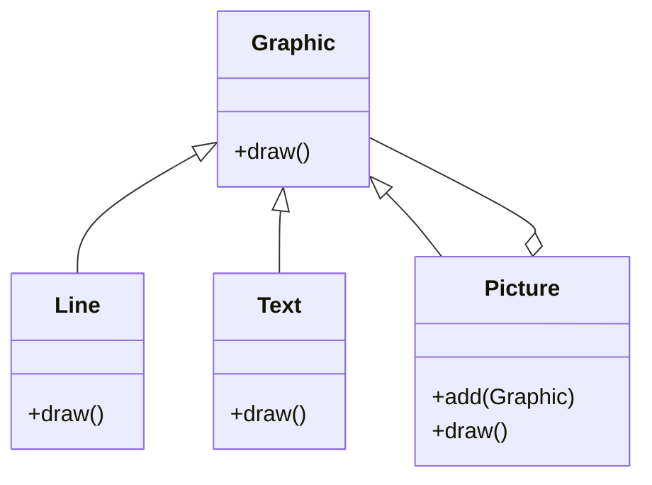
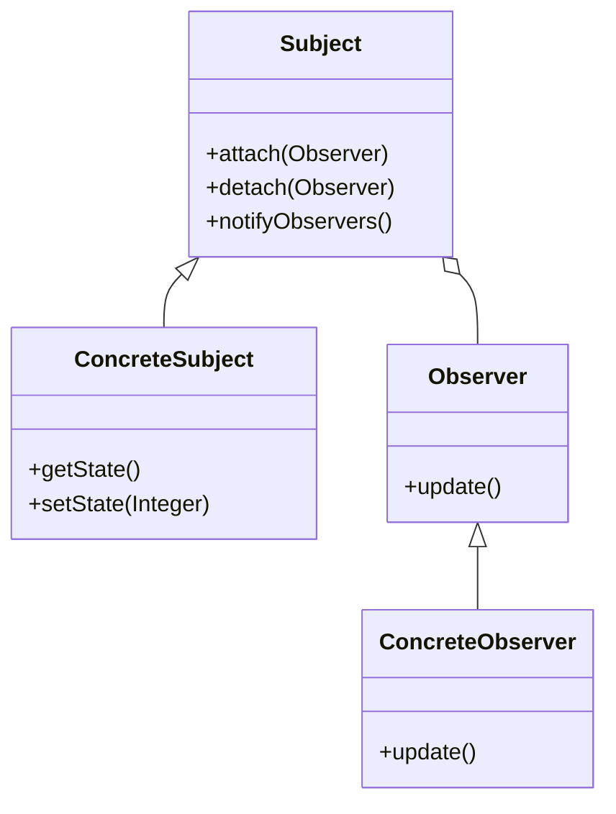
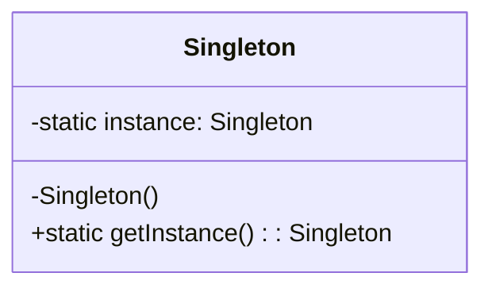

## 6.5. Case Studies

In this section, we will delve into three comprehensive case studies that demonstrate the practical application of object-oriented design patterns. These case studies will help solidify your understanding of how design patterns can be used to solve complex software design problems in real-world scenarios.

### Case Study 1: Developing a Text Editor

In this case study, we will explore the development of a text editor by applying the Composite, Command, and Memento patterns. Each pattern will address specific challenges in building a robust and flexible text editing application.

#### Applying the Composite Pattern

**Intent:** The Composite pattern allows you to compose objects into tree structures to represent part-whole hierarchies. It enables clients to treat individual objects and compositions of objects uniformly.

**Key Participants:**
- **Component:** Declares the interface for objects in the composition.
- **Leaf:** Represents leaf objects in the composition.
- **Composite:** Defines behavior for components having children and stores child components.

**Applicability:** Use the Composite pattern when you want to represent part-whole hierarchies of objects and allow clients to treat individual objects and compositions uniformly.

**Pseudocode Example:**

```pseudocode
class Graphic {
    method draw()
}

class Line extends Graphic {
    method draw() {
        // Draw a line
    }
}

class Text extends Graphic {
    method draw() {
        // Draw text
    }
}

class Picture extends Graphic {
    private children: List<Graphic>

    method add(graphic: Graphic) {
        children.add(graphic)
    }

    method draw() {
        for each child in children {
            child.draw()
        }
    }
}
```

**Design Considerations:** The Composite pattern is useful for building complex UI components in a text editor, such as paragraphs, images, and tables, which can be treated as individual elements or as part of a larger document.

#### Applying the Command Pattern

**Intent:** The Command pattern encapsulates a request as an object, thereby allowing for parameterization of clients with queues, requests, and operations.

**Key Participants:**
- **Command:** Declares an interface for executing an operation.
- **ConcreteCommand:** Implements the Command interface and defines a binding between a receiver and an action.
- **Invoker:** Asks the command to carry out the request.
- **Receiver:** Knows how to perform the operations associated with carrying out a request.

**Applicability:** Use the Command pattern when you want to parameterize objects with operations, queue operations, or support undoable operations.

**Pseudocode Example:**

```pseudocode
class Command {
    method execute()
}

class PasteCommand extends Command {
    private document: Document

    method execute() {
        document.paste()
    }
}

class Document {
    method paste() {
        // Paste text
    }
}

class MenuItem {
    private command: Command

    method click() {
        command.execute()
    }
}
```

**Design Considerations:** The Command pattern is ideal for implementing undo and redo functionality in a text editor, allowing users to revert changes or repeat actions.

#### Applying the Memento Pattern

**Intent:** The Memento pattern captures and externalizes an object's internal state so that the object can be restored to this state later, without violating encapsulation.

**Key Participants:**
- **Memento:** Stores the internal state of the Originator object.
- **Originator:** Creates a memento containing a snapshot of its current internal state.
- **Caretaker:** Responsible for the memento's safekeeping.

**Applicability:** Use the Memento pattern when you need to save and restore the state of an object.

**Pseudocode Example:**

```pseudocode
class Memento {
    private state: String

    constructor(state: String) {
        this.state = state
    }

    method getState() {
        return state
    }
}

class TextEditor {
    private state: String

    method setState(state: String) {
        this.state = state
    }

    method saveStateToMemento() {
        return new Memento(state)
    }

    method getStateFromMemento(memento: Memento) {
        state = memento.getState()
    }
}

class Caretaker {
    private mementoList: List<Memento>

    method add(memento: Memento) {
        mementoList.add(memento)
    }

    method get(index: Integer) {
        return mementoList.get(index)
    }
}
```

**Design Considerations:** The Memento pattern is essential for implementing features like undo and redo in a text editor, allowing users to navigate through different states of the document.

### Case Study 2: Building a GUI Framework

In this case study, we will explore the development of a GUI framework by utilizing the Observer, Strategy, and Template Method patterns. These patterns will help create a flexible and extensible framework for building user interfaces.

#### Utilizing the Observer Pattern

**Intent:** The Observer pattern defines a one-to-many dependency between objects so that when one object changes state, all its dependents are notified and updated automatically.

**Key Participants:**
- **Subject:** Maintains a list of observers and notifies them of any state changes.
- **Observer:** Defines an updating interface for objects that should be notified of changes in a subject.

**Applicability:** Use the Observer pattern when a change to one object requires changing others, and you don't know how many objects need to be changed.

**Pseudocode Example:**

```pseudocode
class Subject {
    private observers: List<Observer>

    method attach(observer: Observer) {
        observers.add(observer)
    }

    method detach(observer: Observer) {
        observers.remove(observer)
    }

    method notifyObservers() {
        for each observer in observers {
            observer.update()
        }
    }
}

class ConcreteSubject extends Subject {
    private state: Integer

    method getState() {
        return state
    }

    method setState(state: Integer) {
        this.state = state
        notifyObservers()
    }
}

class Observer {
    method update()
}

class ConcreteObserver implements Observer {
    private subject: ConcreteSubject

    method update() {
        // Update observer state
    }
}
```

**Design Considerations:** The Observer pattern is useful for implementing event-driven architectures in a GUI framework, allowing UI components to respond to changes in application state.

#### Utilizing the Strategy Pattern

**Intent:** The Strategy pattern defines a family of algorithms, encapsulates each one, and makes them interchangeable. It lets the algorithm vary independently from clients that use it.

**Key Participants:**
- **Strategy:** Declares an interface common to all supported algorithms.
- **ConcreteStrategy:** Implements the algorithm using the Strategy interface.
- **Context:** Maintains a reference to a Strategy object.

**Applicability:** Use the Strategy pattern when you need to use different variants of an algorithm.

**Pseudocode Example:**

```pseudocode
class Strategy {
    method execute()
}

class ConcreteStrategyA implements Strategy {
    method execute() {
        // Implement algorithm A
    }
}

class ConcreteStrategyB implements Strategy {
    method execute() {
        // Implement algorithm B
    }
}

class Context {
    private strategy: Strategy

    method setStrategy(strategy: Strategy) {
        this.strategy = strategy
    }

    method executeStrategy() {
        strategy.execute()
    }
}
```

**Design Considerations:** The Strategy pattern is ideal for implementing different layout strategies in a GUI framework, allowing developers to switch between various layout algorithms.

#### Utilizing the Template Method Pattern

**Intent:** The Template Method pattern defines the skeleton of an algorithm in an operation, deferring some steps to subclasses. It lets subclasses redefine certain steps of an algorithm without changing the algorithm's structure.

**Key Participants:**
- **AbstractClass:** Defines abstract primitive operations that concrete subclasses define to implement steps of an algorithm.
- **ConcreteClass:** Implements the primitive operations to carry out subclass-specific steps of the algorithm.

**Applicability:** Use the Template Method pattern to implement the invariant parts of an algorithm once and leave it up to subclasses to implement the behavior that can vary.

**Pseudocode Example:**

```pseudocode
class AbstractClass {
    method templateMethod() {
        primitiveOperation1()
        primitiveOperation2()
    }

    method primitiveOperation1()
    method primitiveOperation2()
}

class ConcreteClass extends AbstractClass {
    method primitiveOperation1() {
        // Implement step 1
    }

    method primitiveOperation2() {
        // Implement step 2
    }
}
```

**Design Considerations:** The Template Method pattern is useful for implementing the lifecycle of UI components in a GUI framework, allowing developers to customize specific steps without altering the overall structure.

### Case Study 3: Implementing a Networking Library

In this case study, we will explore the implementation of a networking library by using the Singleton, Adapter, and Proxy patterns. These patterns will help create a scalable and efficient networking solution.

#### Using the Singleton Pattern

**Intent:** The Singleton pattern ensures a class has only one instance and provides a global point of access to it.

**Key Participants:**
- **Singleton:** Declares a static instance and provides a static method for accessing it.

**Applicability:** Use the Singleton pattern when there must be exactly one instance of a class, and it must be accessible from a well-known access point.

**Pseudocode Example:**

```pseudocode
class Singleton {
    private static instance: Singleton

    private constructor() {}

    static method getInstance() {
        if (instance == null) {
            instance = new Singleton()
        }
        return instance
    }
}
```

**Design Considerations:** The Singleton pattern is ideal for managing shared resources in a networking library, such as a connection pool or configuration settings.

#### Using the Adapter Pattern

**Intent:** The Adapter pattern converts the interface of a class into another interface clients expect. It lets classes work together that couldn't otherwise because of incompatible interfaces.

**Key Participants:**
- **Target:** Defines the domain-specific interface that Client uses.
- **Adapter:** Adapts the interface of Adaptee to the Target interface.
- **Adaptee:** Defines an existing interface that needs adapting.

**Applicability:** Use the Adapter pattern when you want to use an existing class, and its interface does not match the one you need.

**Pseudocode Example:**

```pseudocode
class Target {
    method request()
}

class Adaptee {
    method specificRequest() {
        // Specific request implementation
    }
}

class Adapter extends Target {
    private adaptee: Adaptee

    method request() {
        adaptee.specificRequest()
    }
}
```

**Design Considerations:** The Adapter pattern is useful for integrating legacy code or third-party libraries into a networking library, allowing them to work with the library's interface.

#### Using the Proxy Pattern

**Intent:** The Proxy pattern provides a surrogate or placeholder for another object to control access to it.

**Key Participants:**
- **Proxy:** Maintains a reference to the real subject and controls access to it.
- **RealSubject:** Defines the real object that the proxy represents.

**Applicability:** Use the Proxy pattern when you need a more versatile or sophisticated reference to an object than a simple pointer.

**Pseudocode Example:**

```pseudocode
class Subject {
    method request()
}

class RealSubject implements Subject {
    method request() {
        // Real implementation
    }
}

class Proxy implements Subject {
    private realSubject: RealSubject

    method request() {
        if (realSubject == null) {
            realSubject = new RealSubject()
        }
        realSubject.request()
    }
}
```

**Design Considerations:** The Proxy pattern is ideal for implementing lazy initialization, access control, or logging in a networking library, providing a layer of control over the real subject.

### Interactive Exercises and Discussions

To reinforce your understanding of these patterns, try implementing the following exercises:

1. **Extend the Text Editor:** Add a feature to the text editor that allows users to format text (e.g., bold, italic) using the Decorator pattern.
2. **Enhance the GUI Framework:** Implement a new event handling system using the Chain of Responsibility pattern.
3. **Optimize the Networking Library:** Introduce caching to the networking library using the Flyweight pattern.

### Visualizing the Patterns

#### Composite Pattern in Text Editor



#### Observer Pattern in GUI Framework



#### Singleton Pattern in Networking Library



### Summary

In these case studies, we've explored how design patterns can be applied to solve real-world software design challenges. By understanding and implementing these patterns, you can create flexible, maintainable, and scalable software solutions.

## Quiz Time!



### Which pattern is used to treat individual objects and compositions uniformly?

- [x] Composite Pattern
- [ ] Command Pattern
- [ ] Memento Pattern
- [ ] Observer Pattern

> **Explanation:** The Composite pattern allows you to compose objects into tree structures to represent part-whole hierarchies, treating individual objects and compositions uniformly.


### What pattern encapsulates a request as an object?

- [ ] Composite Pattern
- [x] Command Pattern
- [ ] Memento Pattern
- [ ] Observer Pattern

> **Explanation:** The Command pattern encapsulates a request as an object, allowing for parameterization of clients with queues, requests, and operations.


### Which pattern is ideal for implementing undo and redo functionality?

- [ ] Composite Pattern
- [ ] Command Pattern
- [x] Memento Pattern
- [ ] Observer Pattern

> **Explanation:** The Memento pattern captures and externalizes an object's internal state, allowing it to be restored to this state later, which is ideal for undo and redo functionality.


### Which pattern defines a one-to-many dependency between objects?

- [ ] Composite Pattern
- [ ] Command Pattern
- [ ] Memento Pattern
- [x] Observer Pattern

> **Explanation:** The Observer pattern defines a one-to-many dependency between objects, so when one object changes state, all its dependents are notified and updated automatically.


### Which pattern allows for different variants of an algorithm?

- [ ] Composite Pattern
- [ ] Command Pattern
- [ ] Memento Pattern
- [x] Strategy Pattern

> **Explanation:** The Strategy pattern defines a family of algorithms, encapsulates each one, and makes them interchangeable, allowing for different variants of an algorithm.


### Which pattern ensures a class has only one instance?

- [x] Singleton Pattern
- [ ] Adapter Pattern
- [ ] Proxy Pattern
- [ ] Observer Pattern

> **Explanation:** The Singleton pattern ensures a class has only one instance and provides a global point of access to it.


### Which pattern converts the interface of a class into another interface clients expect?

- [ ] Singleton Pattern
- [x] Adapter Pattern
- [ ] Proxy Pattern
- [ ] Observer Pattern

> **Explanation:** The Adapter pattern converts the interface of a class into another interface clients expect, allowing classes to work together that couldn't otherwise because of incompatible interfaces.


### Which pattern provides a surrogate or placeholder for another object?

- [ ] Singleton Pattern
- [ ] Adapter Pattern
- [x] Proxy Pattern
- [ ] Observer Pattern

> **Explanation:** The Proxy pattern provides a surrogate or placeholder for another object to control access to it.


### Which pattern is useful for implementing event-driven architectures?

- [ ] Composite Pattern
- [ ] Command Pattern
- [ ] Memento Pattern
- [x] Observer Pattern

> **Explanation:** The Observer pattern is useful for implementing event-driven architectures, allowing UI components to respond to changes in application state.


### The Memento pattern is essential for implementing features like undo and redo in a text editor.

- [x] True
- [ ] False

> **Explanation:** The Memento pattern captures and externalizes an object's internal state, allowing it to be restored to this state later, which is essential for implementing undo and redo features.



Remember, this is just the beginning. As you progress, you'll build more complex and interactive applications. Keep experimenting, stay curious, and enjoy the journey!
