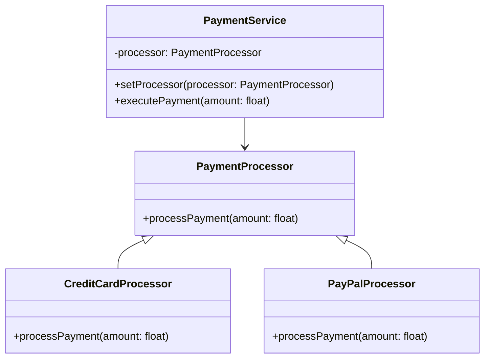

## 7.1. Principles of Good Object-Oriented Design

In the realm of software development, object-oriented design (OOD) stands as a cornerstone for creating robust, maintainable, and scalable systems. At the heart of OOD are principles that guide developers in crafting software that is both modular and reusable, while maintaining a delicate balance between flexibility and complexity. This section delves into these principles, providing a comprehensive understanding of how they contribute to effective software design.

### Introduction to Object-Oriented Design Principles

Object-oriented design principles are guidelines that help developers create systems that are easy to understand, modify, and extend. These principles are not rules set in stone but rather best practices that have emerged from years of experience in the software industry. They emphasize the importance of designing software that is modular, reusable, and adaptable to change.

#### Key Concepts

- **Modularity**: The degree to which a system's components can be separated and recombined. Modularity allows developers to isolate changes to a specific part of the system without affecting others.
- **Reusability**: The ability to use components of a system in different contexts. Reusability reduces redundancy and increases efficiency by allowing developers to leverage existing code.
- **Flexibility**: The ease with which a system can adapt to changes. Flexibility ensures that a system can evolve over time without requiring significant rewrites.
- **Complexity**: The level of intricacy in a system's design. While some complexity is inevitable, excessive complexity can make a system difficult to understand and maintain.

### Emphasizing Modularity

Modularity is a fundamental principle of good object-oriented design. It involves breaking down a system into smaller, manageable parts, known as modules, each responsible for a specific aspect of the system's functionality. This separation of concerns allows developers to focus on individual components without being overwhelmed by the entire system.

#### Benefits of Modularity

1. **Isolation of Changes**: Modularity enables developers to make changes to one part of the system without affecting others. This isolation reduces the risk of introducing bugs when modifying existing code.

2. **Improved Maintainability**: With modular design, each component can be developed, tested, and maintained independently. This independence simplifies the process of updating and enhancing the system over time.

3. **Enhanced Collaboration**: In a modular system, different teams can work on separate components simultaneously. This parallel development accelerates the overall development process and fosters collaboration.

4. **Facilitated Testing**: Modular systems allow for unit testing, where individual components are tested in isolation. This testing approach ensures that each module functions correctly before integrating it into the larger system.

#### Implementing Modularity

To implement modularity in object-oriented design, developers should focus on creating classes and interfaces that encapsulate specific responsibilities. Here is a pseudocode example illustrating modularity:

```pseudocode
// Define an interface for a payment processor
interface PaymentProcessor {
    method processPayment(amount: float)
}

// Implement a concrete class for credit card payments
class CreditCardProcessor implements PaymentProcessor {
    method processPayment(amount: float) {
        // Logic for processing credit card payment
    }
}

// Implement a concrete class for PayPal payments
class PayPalProcessor implements PaymentProcessor {
    method processPayment(amount: float) {
        // Logic for processing PayPal payment
    }
}

// Client code
class PaymentService {
    private processor: PaymentProcessor

    method setProcessor(processor: PaymentProcessor) {
        this.processor = processor
    }

    method executePayment(amount: float) {
        this.processor.processPayment(amount)
    }
}

// Usage
paymentService = new PaymentService()
paymentService.setProcessor(new CreditCardProcessor())
paymentService.executePayment(100.0)
```

In this example, the `PaymentProcessor` interface defines a contract for processing payments. The `CreditCardProcessor` and `PayPalProcessor` classes implement this interface, each providing its own logic for processing payments. The `PaymentService` class uses a `PaymentProcessor` to execute payments, allowing for flexibility in choosing the payment method.

### Achieving Reusability

Reusability is another cornerstone of good object-oriented design. It involves designing components that can be easily reused across different parts of a system or even in different projects. Reusability reduces duplication, saves development time, and ensures consistency across applications.

#### Strategies for Reusability

1. **Encapsulation**: Encapsulation involves bundling data and methods that operate on that data within a single unit, typically a class. By hiding the internal details and exposing only the necessary interfaces, encapsulation promotes reusability.

2. **Inheritance**: Inheritance allows a new class to inherit the properties and behaviors of an existing class. This mechanism enables code reuse by allowing developers to build upon existing classes without rewriting code.

3. **Composition**: Composition involves creating complex objects by combining simpler ones. It promotes reusability by allowing developers to assemble new functionality from existing components.

4. **Interfaces and Abstract Classes**: By defining interfaces and abstract classes, developers can create reusable contracts that can be implemented by different classes. This approach provides flexibility in how specific functionality is achieved.

#### Example of Reusability

Consider the following pseudocode example demonstrating reusability through inheritance and composition:

```pseudocode
// Base class for a vehicle
class Vehicle {
    method startEngine() {
        // Logic to start the engine
    }

    method stopEngine() {
        // Logic to stop the engine
    }
}

// Derived class for a car
class Car extends Vehicle {
    method openTrunk() {
        // Logic to open the trunk
    }
}

// Derived class for a motorcycle
class Motorcycle extends Vehicle {
    method popWheelie() {
        // Logic to pop a wheelie
    }
}

// Composition example
class Garage {
    private vehicles: List<Vehicle>

    method addVehicle(vehicle: Vehicle) {
        vehicles.add(vehicle)
    }

    method startAllEngines() {
        for vehicle in vehicles {
            vehicle.startEngine()
        }
    }
}

// Usage
garage = new Garage()
garage.addVehicle(new Car())
garage.addVehicle(new Motorcycle())
garage.startAllEngines()
```

In this example, the `Vehicle` class provides common functionality for starting and stopping an engine. The `Car` and `Motorcycle` classes inherit from `Vehicle`, reusing its methods while adding their own specific behaviors. The `Garage` class demonstrates composition by managing a collection of `Vehicle` objects and providing functionality to start all engines.

### Balancing Flexibility and Complexity

While modularity and reusability are essential, they must be balanced with flexibility and complexity. Flexibility allows a system to adapt to changing requirements, while complexity can hinder understanding and maintenance.

#### Strategies for Balancing Flexibility and Complexity

1. **Design Patterns**: Design patterns provide proven solutions to common design problems. By applying patterns, developers can achieve flexibility without introducing unnecessary complexity.

2. **SOLID Principles**: The SOLID principles (Single Responsibility, Open/Closed, Liskov Substitution, Interface Segregation, Dependency Inversion) provide guidelines for designing flexible and maintainable systems.

3. **Refactoring**: Refactoring involves improving the structure of existing code without changing its behavior. Regular refactoring helps manage complexity and improve flexibility.

4. **YAGNI Principle**: The "You Aren't Gonna Need It" principle advises developers to avoid adding functionality until it is necessary. This approach prevents unnecessary complexity and keeps the system focused on current requirements.

#### Example of Balancing Flexibility and Complexity

Consider the following pseudocode example illustrating the use of design patterns to balance flexibility and complexity:

```pseudocode
// Strategy pattern for sorting algorithms
interface SortStrategy {
    method sort(data: List<int>)
}

// Concrete strategy for bubble sort
class BubbleSort implements SortStrategy {
    method sort(data: List<int>) {
        // Bubble sort logic
    }
}

// Concrete strategy for quick sort
class QuickSort implements SortStrategy {
    method sort(data: List<int>) {
        // Quick sort logic
    }
}

// Context class
class Sorter {
    private strategy: SortStrategy

    method setStrategy(strategy: SortStrategy) {
        this.strategy = strategy
    }

    method executeSort(data: List<int>) {
        this.strategy.sort(data)
    }
}

// Usage
sorter = new Sorter()
sorter.setStrategy(new BubbleSort())
sorter.executeSort([5, 3, 8, 1])

sorter.setStrategy(new QuickSort())
sorter.executeSort([5, 3, 8, 1])
```

In this example, the Strategy pattern is used to provide flexibility in choosing sorting algorithms. The `Sorter` class can switch between different sorting strategies (`BubbleSort` and `QuickSort`) without modifying its code. This flexibility is achieved without introducing unnecessary complexity.

### Visualizing Object-Oriented Design Principles

To better understand the relationships between modularity, reusability, flexibility, and complexity, let's visualize these concepts using a class diagram:



This class diagram illustrates the modularity and reusability of the payment processing system. The `PaymentProcessor` interface defines a contract for processing payments, while the `CreditCardProcessor` and `PayPalProcessor` classes provide specific implementations. The `PaymentService` class uses a `PaymentProcessor` to execute payments, demonstrating flexibility in choosing the payment method.

### Try It Yourself

To deepen your understanding of these principles, try modifying the code examples provided. Experiment with adding new payment processors, vehicles, or sorting algorithms. Observe how the modular and reusable design allows for easy extension and adaptation.

### Knowledge Check

1. **What is modularity, and why is it important in object-oriented design?**

2. **How does encapsulation contribute to reusability?**

3. **What strategies can be used to balance flexibility and complexity in a system?**

4. **Explain the role of design patterns in achieving flexibility without introducing unnecessary complexity.**

5. **How can the YAGNI principle help prevent excessive complexity in a system?**

### Summary

In this section, we explored the principles of good object-oriented design, focusing on modularity, reusability, flexibility, and complexity. By emphasizing modularity and reusability, developers can create systems that are easy to understand, modify, and extend. Balancing flexibility and complexity ensures that a system can adapt to changing requirements without becoming overly intricate. By applying these principles, developers can craft software that is both robust and maintainable.

## Quiz Time!



### What is the primary benefit of modularity in object-oriented design?

- [x] Isolation of changes
- [ ] Increased complexity
- [ ] Reduced flexibility
- [ ] Enhanced coupling

> **Explanation:** Modularity allows changes to be isolated to specific parts of the system, reducing the risk of introducing bugs when modifying code.

### How does encapsulation promote reusability?

- [x] By hiding internal details and exposing only necessary interfaces
- [ ] By increasing the complexity of the system
- [ ] By making the system less flexible
- [ ] By coupling components tightly

> **Explanation:** Encapsulation hides the internal workings of a component, allowing it to be reused without exposing its implementation details.

### Which design pattern is used to provide flexibility in choosing algorithms?

- [x] Strategy pattern
- [ ] Singleton pattern
- [ ] Observer pattern
- [ ] Factory pattern

> **Explanation:** The Strategy pattern allows for selecting different algorithms at runtime, providing flexibility in how tasks are performed.

### What is the YAGNI principle?

- [x] "You Aren't Gonna Need It" - avoid adding unnecessary functionality
- [ ] "You Always Get New Ideas" - encourage constant feature addition
- [ ] "You Are Going Nowhere" - focus on current requirements
- [ ] "You Are Gonna Need It" - plan for future features

> **Explanation:** The YAGNI principle advises against adding features until they are necessary, preventing unnecessary complexity.

### Which principle advises designing systems with a single responsibility?

- [x] Single Responsibility Principle (SRP)
- [ ] Open/Closed Principle (OCP)
- [ ] Liskov Substitution Principle (LSP)
- [ ] Dependency Inversion Principle (DIP)

> **Explanation:** The Single Responsibility Principle (SRP) states that a class should have only one reason to change, promoting focused and maintainable design.

### How does inheritance contribute to reusability?

- [x] By allowing new classes to inherit properties and behaviors from existing classes
- [ ] By increasing the complexity of the system
- [ ] By making the system less flexible
- [ ] By coupling components tightly

> **Explanation:** Inheritance enables code reuse by allowing new classes to build upon existing ones without rewriting code.

### What is the primary goal of refactoring?

- [x] Improving the structure of existing code without changing its behavior
- [ ] Adding new features to the system
- [ ] Increasing the complexity of the system
- [ ] Reducing the flexibility of the system

> **Explanation:** Refactoring focuses on enhancing code structure and maintainability without altering its functionality.

### Which principle is NOT part of the SOLID principles?

- [x] Principle of Least Knowledge
- [ ] Single Responsibility Principle
- [ ] Open/Closed Principle
- [ ] Dependency Inversion Principle

> **Explanation:** The Principle of Least Knowledge, also known as the Law of Demeter, is not part of the SOLID principles.

### How can design patterns help manage complexity?

- [x] By providing proven solutions to common design problems
- [ ] By increasing the number of classes in a system
- [ ] By making the system less flexible
- [ ] By tightly coupling components

> **Explanation:** Design patterns offer established solutions to recurring design challenges, helping manage complexity and improve system design.

### True or False: Flexibility in a system should always be prioritized over simplicity.

- [ ] True
- [x] False

> **Explanation:** While flexibility is important, it should be balanced with simplicity to ensure the system remains understandable and maintainable.


