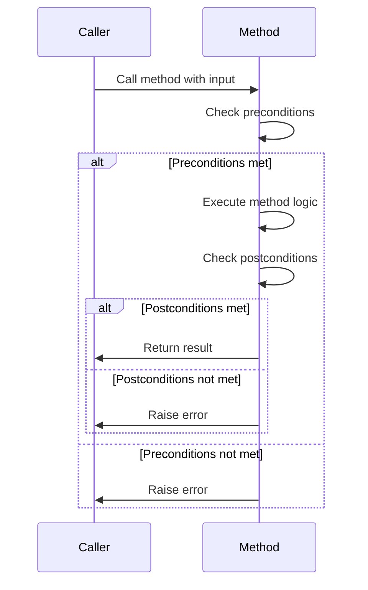
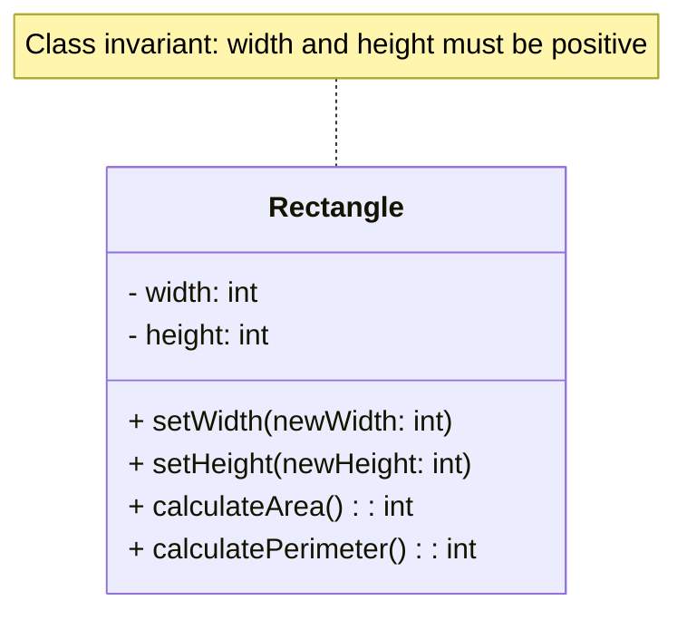

## 7.2. Design by Contract

In the realm of object-oriented programming (OOP), ensuring the correctness and reliability of software systems is paramount. One powerful methodology that aids in achieving this is **Design by Contract (DbC)**. This approach, pioneered by Bertrand Meyer, emphasizes the importance of defining clear and precise contracts for software components, akin to legal contracts in the real world. These contracts specify the obligations and benefits of software components, thereby enhancing software robustness and reducing bugs.

### Understanding Design by Contract

Design by Contract is a methodology for designing software. It defines formal, precise, and verifiable interface specifications for software components, which include:

- **Preconditions**: Conditions that must be true before a function or method is executed.
- **Postconditions**: Conditions that must be true after a function or method has executed.
- **Invariants**: Conditions that must always be true for a class, regardless of the state of its objects.

By adhering to these contracts, developers can ensure that software components interact correctly and predictably, leading to more reliable and maintainable systems.

#### The Essence of Contracts

In DbC, a contract is an agreement between a method and its callers. The caller agrees to meet the method's preconditions, and in return, the method guarantees that its postconditions will be met upon completion. This mutual agreement helps in:

- **Clarifying Expectations**: Clearly defining what a method expects and what it guarantees.
- **Reducing Bugs**: By ensuring that methods are only called when their preconditions are met, many common bugs can be avoided.
- **Improving Documentation**: Contracts serve as a form of documentation, making it easier for developers to understand and use software components correctly.

### Defining Preconditions and Postconditions

Let's delve deeper into the concepts of preconditions and postconditions, which form the backbone of Design by Contract.

#### Preconditions

Preconditions are conditions that must be true before a method can be executed. They define the valid states or inputs for a method and act as a gatekeeper, ensuring that the method is only called when it is safe to do so.

**Example of Preconditions:**

Consider a method that calculates the square root of a number. A precondition for this method would be that the input number must be non-negative.

```pseudocode
function calculateSquareRoot(number)
    // Precondition: number must be non-negative
    assert number >= 0

    // Calculate and return the square root
    return sqrt(number)
end function
```

In this example, the precondition ensures that the method is only called with valid input, preventing runtime errors and undefined behavior.

#### Postconditions

Postconditions are conditions that must be true after a method has executed. They define the expected state or output of a method, providing a guarantee to the caller about the method's behavior.

**Example of Postconditions:**

Continuing with the square root example, a postcondition could be that the result, when squared, should equal the input number (within a small margin of error due to floating-point precision).

```pseudocode
function calculateSquareRoot(number)
    // Precondition: number must be non-negative
    assert number >= 0

    // Calculate the square root
    result = sqrt(number)

    // Postcondition: result squared should equal the input number
    assert abs(result * result - number) < epsilon

    return result
end function
```

Here, the postcondition ensures that the method's output is as expected, providing confidence in the method's correctness.

### Ensuring Correctness Through Contracts

Design by Contract enhances software correctness by enforcing strict adherence to preconditions and postconditions. This approach leads to several benefits:

- **Early Error Detection**: By checking preconditions and postconditions, errors can be detected early in the development process, reducing the cost and effort of fixing them later.
- **Simplified Debugging**: Contracts provide clear criteria for when a method should be called and what it should achieve, making it easier to identify the source of errors.
- **Improved Code Quality**: By enforcing contracts, developers are encouraged to write cleaner, more modular code with well-defined interfaces.

#### Contracts in Object-Oriented Design

In OOP, contracts can be applied to classes and their methods, ensuring that objects interact correctly and consistently. Let's explore how contracts can be integrated into class design.

**Class Invariants**

In addition to preconditions and postconditions, Design by Contract also involves class invariants. A class invariant is a condition that must always be true for all instances of a class, regardless of the object's state.

**Example of Class Invariants:**

Consider a class representing a bank account. A class invariant could be that the account balance must never be negative.

```pseudocode
class BankAccount
    private balance

    function deposit(amount)
        // Precondition: amount must be positive
        assert amount > 0

        // Update balance
        balance = balance + amount

        // Postcondition: balance must be non-negative
        assert balance >= 0
    end function

    function withdraw(amount)
        // Precondition: amount must be positive and less than or equal to balance
        assert amount > 0 and amount <= balance

        // Update balance
        balance = balance - amount

        // Postcondition: balance must be non-negative
        assert balance >= 0
    end function

    // Class invariant: balance must be non-negative
end class
```

In this example, the class invariant ensures that the account balance is always valid, regardless of the operations performed on it.

### Visualizing Design by Contract

To better understand the flow of Design by Contract, let's visualize the interaction between preconditions, postconditions, and class invariants using a sequence diagram.



This diagram illustrates the sequence of events when a method is called with Design by Contract. The method first checks its preconditions, executes its logic if they are met, and then verifies its postconditions before returning the result.

### Implementing Design by Contract in Pseudocode

Now that we understand the theory behind Design by Contract, let's explore how to implement it in pseudocode. We'll create a simple class with methods that adhere to contracts.

**Example: Implementing Design by Contract**

```pseudocode
class Rectangle
    private width
    private height

    function setWidth(newWidth)
        // Precondition: newWidth must be positive
        assert newWidth > 0

        // Set the width
        width = newWidth

        // Postcondition: width must be positive
        assert width > 0
    end function

    function setHeight(newHeight)
        // Precondition: newHeight must be positive
        assert newHeight > 0

        // Set the height
        height = newHeight

        // Postcondition: height must be positive
        assert height > 0
    end function

    function calculateArea()
        // Postcondition: area must be positive
        area = width * height
        assert area > 0
        return area
    end function

    // Class invariant: width and height must be positive
end class
```

In this example, the `Rectangle` class uses preconditions to ensure that width and height are always positive. The postconditions verify that the area calculation is correct, and the class invariant maintains the integrity of the rectangle's dimensions.

### Try It Yourself

To deepen your understanding of Design by Contract, try modifying the `Rectangle` class to include a method for calculating the perimeter. Define appropriate preconditions and postconditions for this new method.

### Visualizing Class Invariants

Let's visualize how class invariants work using a class diagram.



This diagram shows the `Rectangle` class with its methods and the class invariant that ensures the integrity of its dimensions.

### Challenges and Considerations

While Design by Contract offers numerous benefits, it also presents challenges and considerations:

- **Performance Overhead**: Checking preconditions and postconditions can introduce performance overhead, especially in performance-critical applications. It's important to balance the benefits of contracts with their impact on performance.
- **Complexity**: Defining comprehensive contracts for complex systems can be challenging. Developers must carefully consider the conditions that need to be enforced.
- **Tool Support**: Not all programming languages and environments provide built-in support for Design by Contract. Developers may need to implement custom solutions or use third-party libraries.

### Differences and Similarities with Other Patterns

Design by Contract shares similarities with other design patterns and methodologies, such as:

- **Assertions**: Both DbC and assertions involve checking conditions at runtime. However, DbC is more formalized and focuses on defining contracts for software components.
- **Test-Driven Development (TDD)**: TDD involves writing tests before implementing code, similar to defining contracts. Both approaches aim to ensure software correctness, but DbC emphasizes runtime checks, while TDD focuses on testing.

### Conclusion

Design by Contract is a powerful methodology for enhancing software correctness and reliability. By defining clear preconditions, postconditions, and class invariants, developers can create robust and maintainable software systems. While there are challenges and considerations, the benefits of DbC make it a valuable tool in the software development toolkit.

As you continue your journey in object-oriented programming, remember that Design by Contract is just one of many techniques available to you. Keep exploring, experimenting, and applying these concepts to build better software.

## Quiz Time!



### What is the primary purpose of Design by Contract?

- [x] To define formal, precise, and verifiable interface specifications for software components
- [ ] To improve the performance of software applications
- [ ] To replace unit testing in software development
- [ ] To eliminate the need for documentation

> **Explanation:** Design by Contract is primarily used to define formal, precise, and verifiable interface specifications for software components, ensuring correctness and reliability.

### Which of the following is a precondition?

- [x] A condition that must be true before a method is executed
- [ ] A condition that must be true after a method is executed
- [ ] A condition that must always be true for a class
- [ ] A condition that is optional for method execution

> **Explanation:** A precondition is a condition that must be true before a method is executed, ensuring that the method is called with valid inputs.

### What is a postcondition?

- [ ] A condition that must be true before a method is executed
- [x] A condition that must be true after a method is executed
- [ ] A condition that must always be true for a class
- [ ] A condition that is optional for method execution

> **Explanation:** A postcondition is a condition that must be true after a method has executed, guaranteeing the expected outcome.

### What is a class invariant?

- [ ] A condition that must be true before a method is executed
- [ ] A condition that must be true after a method is executed
- [x] A condition that must always be true for a class
- [ ] A condition that is optional for method execution

> **Explanation:** A class invariant is a condition that must always be true for a class, regardless of the state of its objects.

### Which of the following is a benefit of Design by Contract?

- [x] Early error detection
- [ ] Increased code complexity
- [x] Improved code quality
- [ ] Reduced need for testing

> **Explanation:** Design by Contract provides benefits such as early error detection and improved code quality by enforcing strict adherence to preconditions and postconditions.

### What is a potential challenge of using Design by Contract?

- [x] Performance overhead
- [ ] Reduced code readability
- [ ] Lack of documentation
- [ ] Increased testing requirements

> **Explanation:** A potential challenge of using Design by Contract is the performance overhead introduced by checking preconditions and postconditions.

### How does Design by Contract relate to Test-Driven Development (TDD)?

- [x] Both aim to ensure software correctness
- [ ] Both eliminate the need for runtime checks
- [x] Both involve defining conditions before implementation
- [ ] Both focus on improving software performance

> **Explanation:** Both Design by Contract and Test-Driven Development aim to ensure software correctness and involve defining conditions before implementation.

### What is the role of assertions in Design by Contract?

- [x] To check conditions at runtime
- [ ] To replace preconditions and postconditions
- [ ] To improve software performance
- [ ] To eliminate the need for documentation

> **Explanation:** Assertions are used in Design by Contract to check conditions at runtime, ensuring that preconditions and postconditions are met.

### Which of the following is NOT a component of Design by Contract?

- [ ] Preconditions
- [ ] Postconditions
- [x] Unit tests
- [ ] Class invariants

> **Explanation:** Unit tests are not a component of Design by Contract. DbC focuses on preconditions, postconditions, and class invariants.

### True or False: Design by Contract can completely replace the need for testing in software development.

- [ ] True
- [x] False

> **Explanation:** False. While Design by Contract enhances software correctness, it does not replace the need for testing. Testing remains an essential part of software development.


