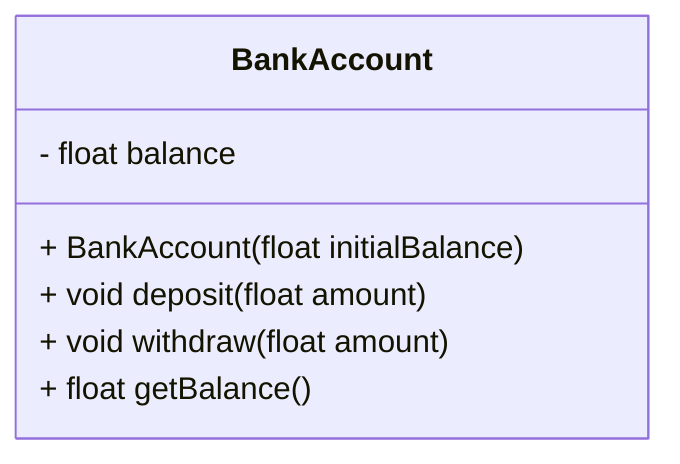

## 7.3. Encapsulation and Information Hiding

Encapsulation and information hiding are fundamental principles in object-oriented programming (OOP) that play a crucial role in protecting the integrity of objects and ensuring that only necessary interfaces are exposed to the outside world. These principles are essential for creating robust, maintainable, and scalable software systems. In this section, we will delve into the concepts of encapsulation and information hiding, explore their benefits, and provide detailed pseudocode examples to illustrate their application.

### Understanding Encapsulation

Encapsulation is the process of bundling data (attributes) and methods (functions or procedures) that operate on the data into a single unit, known as a class. This concept is central to OOP and serves several purposes:

1. **Data Protection**: Encapsulation helps protect the internal state of an object from unauthorized access and modification. By restricting direct access to the object's data, encapsulation ensures that the data can only be modified through well-defined interfaces.

2. **Modularity**: Encapsulation promotes modularity by allowing developers to create self-contained units of code. Each class can be developed, tested, and maintained independently, leading to more organized and manageable codebases.

3. **Abstraction**: Encapsulation supports abstraction by hiding the implementation details of a class from its users. This allows developers to focus on the "what" rather than the "how," making it easier to understand and use the class.

4. **Flexibility and Maintainability**: By encapsulating data and behavior, changes to the internal implementation of a class can be made without affecting the code that uses the class. This flexibility simplifies maintenance and reduces the risk of introducing bugs.

#### Key Concepts of Encapsulation

- **Access Modifiers**: Access modifiers are keywords used to specify the visibility of class members. Common access modifiers include `public`, `private`, and `protected`. These modifiers control which parts of the code can access the members of a class.

- **Getters and Setters**: Getters and setters are methods used to access and modify the private attributes of a class. They provide a controlled way to interact with the data, allowing for validation and other logic to be applied when data is accessed or modified.

- **Encapsulation in Practice**: Encapsulation is achieved by defining class members as private and providing public methods to access and modify them. This ensures that the internal state of the object is only accessible through controlled interfaces.

#### Pseudocode Example: Encapsulation

Let's consider a simple example of encapsulation using pseudocode. We will define a `BankAccount` class that encapsulates the account balance and provides methods to deposit and withdraw funds.

```pseudocode
class BankAccount
    private balance: float

    method initialize(initialBalance: float)
        if initialBalance >= 0
            balance = initialBalance
        else
            balance = 0
            print("Initial balance cannot be negative. Setting balance to 0.")

    method deposit(amount: float)
        if amount > 0
            balance = balance + amount
        else
            print("Deposit amount must be positive.")

    method withdraw(amount: float)
        if amount > 0 and amount <= balance
            balance = balance - amount
        else
            print("Invalid withdrawal amount.")

    method getBalance(): float
        return balance
```

In this example, the `balance` attribute is private, meaning it cannot be accessed directly from outside the class. Instead, the `deposit`, `withdraw`, and `getBalance` methods provide controlled access to the balance, ensuring that the account's integrity is maintained.

### Information Hiding

Information hiding is a design principle that complements encapsulation by concealing the internal workings of a class or module from its users. The goal of information hiding is to reduce complexity and increase robustness by exposing only the necessary interfaces and hiding the implementation details.

#### Benefits of Information Hiding

1. **Reduced Complexity**: By hiding unnecessary details, information hiding simplifies the interface of a class or module, making it easier for developers to understand and use.

2. **Improved Security**: Information hiding prevents unauthorized access to sensitive data and implementation details, reducing the risk of accidental or malicious interference.

3. **Enhanced Flexibility**: By decoupling the interface from the implementation, information hiding allows for changes to the internal workings of a class or module without affecting its users.

4. **Increased Maintainability**: With information hiding, developers can focus on maintaining and improving the internal implementation without worrying about breaking existing code that relies on the class or module.

#### Implementing Information Hiding

Information hiding is typically implemented through the use of access modifiers and well-defined interfaces. By restricting access to internal members and providing a clear and concise interface, developers can ensure that only the necessary information is exposed.

#### Pseudocode Example: Information Hiding

Consider a `Car` class that hides the details of its engine and provides a simple interface for starting and stopping the car.

```pseudocode
class Car
    private engine: Engine

    method initialize()
        engine = new Engine()

    method start()
        engine.start()

    method stop()
        engine.stop()

class Engine
    private isRunning: boolean

    method start()
        if not isRunning
            isRunning = true
            print("Engine started.")
        else
            print("Engine is already running.")

    method stop()
        if isRunning
            isRunning = false
            print("Engine stopped.")
        else
            print("Engine is already stopped.")
```

In this example, the `Car` class hides the details of the `Engine` class and provides a simple interface for starting and stopping the car. The internal state of the engine is not exposed to the users of the `Car` class, ensuring that the engine's behavior is controlled through the `start` and `stop` methods.

### Visualizing Encapsulation and Information Hiding

To better understand the concepts of encapsulation and information hiding, let's visualize the relationship between a class, its internal members, and its public interface using a class diagram.



In this class diagram, the `BankAccount` class is represented with its private `balance` attribute and public methods. The `-` symbol indicates a private member, while the `+` symbol indicates a public member. This visualization highlights the encapsulation of the `balance` attribute and the controlled access provided by the public methods.

### Best Practices for Encapsulation and Information Hiding

To effectively implement encapsulation and information hiding in your software projects, consider the following best practices:

1. **Use Access Modifiers Wisely**: Choose the appropriate access modifiers for your class members to control their visibility. Use `private` for members that should not be accessed directly from outside the class, and `public` for members that need to be accessible.

2. **Provide Clear Interfaces**: Define clear and concise interfaces for your classes and modules. Ensure that the interfaces provide all the necessary functionality while hiding the implementation details.

3. **Avoid Exposing Internal State**: Do not expose the internal state of your objects directly. Instead, provide methods that allow controlled access and modification of the state.

4. **Validate Input and Output**: Use getters and setters to validate input and output, ensuring that the internal state of the object remains consistent and valid.

5. **Document Interfaces and Behavior**: Clearly document the interfaces and expected behavior of your classes and modules. This documentation will help other developers understand how to use your code effectively.

6. **Refactor for Encapsulation**: Regularly review and refactor your code to improve encapsulation and information hiding. Look for opportunities to encapsulate data and behavior, and reduce the exposure of implementation details.

### Try It Yourself

To reinforce your understanding of encapsulation and information hiding, try modifying the `BankAccount` and `Car` classes in the following ways:

- Add a method to the `BankAccount` class that transfers funds between two accounts. Ensure that the method maintains the integrity of both accounts.
- Enhance the `Car` class by adding a `FuelTank` class that manages the car's fuel level. Ensure that the `FuelTank` details are hidden from the `Car` users, and provide methods to refuel the car.

### Knowledge Check

- Explain the difference between encapsulation and information hiding.
- Why is it important to use access modifiers in your classes?
- How do getters and setters contribute to encapsulation?
- What are the benefits of hiding implementation details from users?

### Summary

Encapsulation and information hiding are essential principles in object-oriented programming that help protect the integrity of objects and ensure that only necessary interfaces are exposed. By encapsulating data and behavior, developers can create modular, flexible, and maintainable software systems. Information hiding complements encapsulation by reducing complexity and improving security. By following best practices and regularly refactoring code, developers can effectively implement these principles in their projects.

### Further Reading

For more information on encapsulation and information hiding, consider exploring the following resources:

- [Encapsulation in Object-Oriented Programming](https://en.wikipedia.org/wiki/Encapsulation_(computer_programming))
- [Information Hiding and Abstraction](https://en.wikipedia.org/wiki/Information_hiding)
- [Design Patterns: Elements of Reusable Object-Oriented Software](https://en.wikipedia.org/wiki/Design_Patterns)

## Quiz Time!



### What is encapsulation in object-oriented programming?

- [x] The bundling of data and methods into a single unit
- [ ] The separation of data and methods into different units
- [ ] The exposure of all class members to the outside world
- [ ] The hiding of all class members from the outside world

> **Explanation:** Encapsulation involves bundling data and methods that operate on that data into a single unit, typically a class.

### What is the primary purpose of information hiding?

- [x] To conceal implementation details and reduce complexity
- [ ] To expose all internal workings of a class
- [ ] To make all class members public
- [ ] To increase the number of methods in a class

> **Explanation:** Information hiding aims to conceal implementation details, simplifying the interface and reducing complexity.

### Which access modifier is used to restrict access to class members?

- [x] private
- [ ] public
- [ ] protected
- [ ] internal

> **Explanation:** The `private` access modifier restricts access to class members, making them accessible only within the class.

### How do getters and setters contribute to encapsulation?

- [x] By providing controlled access to private attributes
- [ ] By exposing private attributes directly
- [ ] By making all attributes public
- [ ] By hiding all attributes from the outside world

> **Explanation:** Getters and setters provide controlled access to private attributes, allowing for validation and other logic.

### What is a benefit of using encapsulation?

- [x] Improved modularity and maintainability
- [ ] Increased complexity and coupling
- [ ] Reduced security and flexibility
- [ ] Exposing all class members

> **Explanation:** Encapsulation improves modularity and maintainability by bundling data and methods into a single unit.

### Why is it important to avoid exposing internal state directly?

- [x] To maintain object integrity and prevent unauthorized access
- [ ] To increase the number of public methods
- [ ] To simplify the class interface
- [ ] To make all attributes accessible

> **Explanation:** Avoiding direct exposure of internal state helps maintain object integrity and prevent unauthorized access.

### What is the role of access modifiers in information hiding?

- [x] To control the visibility of class members
- [ ] To increase the number of class members
- [ ] To make all members public
- [ ] To simplify class interfaces

> **Explanation:** Access modifiers control the visibility of class members, supporting information hiding by restricting access.

### How does information hiding improve security?

- [x] By preventing unauthorized access to sensitive data
- [ ] By exposing all internal workings of a class
- [ ] By making all class members public
- [ ] By increasing the number of methods in a class

> **Explanation:** Information hiding improves security by preventing unauthorized access to sensitive data and implementation details.

### What is a key benefit of information hiding?

- [x] Enhanced flexibility and maintainability
- [ ] Increased complexity and coupling
- [ ] Reduced security and flexibility
- [ ] Exposing all class members

> **Explanation:** Information hiding enhances flexibility and maintainability by decoupling the interface from the implementation.

### True or False: Encapsulation and information hiding are the same concept.

- [ ] True
- [x] False

> **Explanation:** Encapsulation and information hiding are related but distinct concepts. Encapsulation involves bundling data and methods, while information hiding focuses on concealing implementation details.


