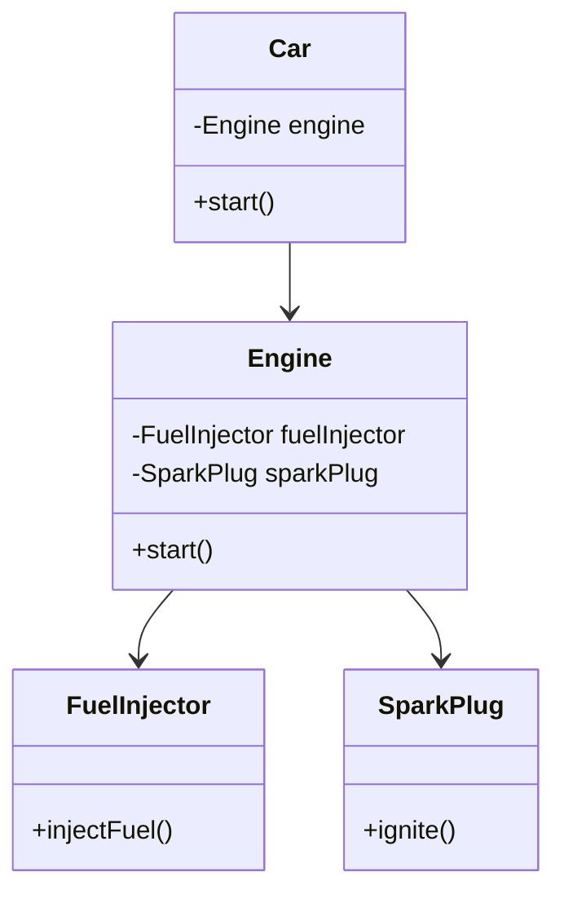

## 7.4. The Law of Demeter (Principle of Least Knowledge)

In the realm of object-oriented programming (OOP), the Law of Demeter, also known as the Principle of Least Knowledge, serves as a guiding principle to minimize coupling between components. This principle encourages developers to write loosely coupled code, which enhances the maintainability, flexibility, and robustness of software systems. In this section, we will delve into the intricacies of the Law of Demeter, exploring its origins, principles, benefits, and practical applications in software design.

### Understanding the Law of Demeter

#### Origins and Definition

The Law of Demeter was introduced in 1987 by Ian Holland at Northeastern University. It is named after the Greek goddess Demeter, symbolizing the idea of limiting knowledge and interaction to promote independence. The principle can be succinctly stated as "only talk to your immediate friends." In other words, an object should only interact with its direct collaborators and not with the collaborators of its collaborators.

#### Core Principle

The Law of Demeter can be summarized as follows: a method `M` of an object `O` should only call methods belonging to:
- `O` itself
- Objects passed as arguments to `M`
- Objects created within `M`
- Directly held instance variables of `O`

By adhering to these guidelines, we ensure that objects maintain a limited knowledge of their surroundings, reducing dependencies and promoting encapsulation.

### Benefits of the Law of Demeter

#### Minimizing Coupling

The primary benefit of the Law of Demeter is the minimization of coupling between components. By restricting the interactions between objects, we reduce the dependencies that can lead to complex and brittle code. This makes the system easier to understand, test, and modify.

#### Enhancing Maintainability

Loosely coupled code is inherently more maintainable. Changes to one component are less likely to ripple through the system, reducing the risk of introducing bugs. This makes it easier to evolve the software over time.

#### Promoting Encapsulation

The Law of Demeter encourages encapsulation by limiting the exposure of an object's internal structure. This aligns with the principles of information hiding and abstraction, which are fundamental to object-oriented design.

### Implementing the Law of Demeter

#### Practical Guidelines

To implement the Law of Demeter in your code, consider the following practical guidelines:

1. **Limit Method Calls**: Ensure that methods only call other methods on objects they directly interact with.
2. **Avoid Method Chaining**: Refrain from chaining method calls that traverse multiple objects.
3. **Use Accessor Methods**: Instead of accessing an object's fields directly, use accessor methods to retrieve necessary information.
4. **Delegate Responsibilities**: Delegate tasks to the appropriate objects, allowing them to handle their own responsibilities.

#### Code Example

Let's explore a pseudocode example to illustrate the application of the Law of Demeter:

```pseudocode
class Car {
    engine: Engine
    constructor(engine: Engine) {
        this.engine = engine
    }

    function start() {
        // Violates the Law of Demeter
        this.engine.getFuelInjector().injectFuel()
        this.engine.getSparkPlug().ignite()
    }
}

class Engine {
    fuelInjector: FuelInjector
    sparkPlug: SparkPlug

    constructor(fuelInjector: FuelInjector, sparkPlug: SparkPlug) {
        this.fuelInjector = fuelInjector
        this.sparkPlug = sparkPlug
    }

    function start() {
        this.fuelInjector.injectFuel()
        this.sparkPlug.ignite()
    }
}

class FuelInjector {
    function injectFuel() {
        // Fuel injection logic
    }
}

class SparkPlug {
    function ignite() {
        // Ignition logic
    }
}
```

In the above example, the `Car` class violates the Law of Demeter by directly interacting with the `FuelInjector` and `SparkPlug` through the `Engine` object. To adhere to the principle, we can refactor the code as follows:

```pseudocode
class Car {
    engine: Engine
    constructor(engine: Engine) {
        this.engine = engine
    }

    function start() {
        // Adheres to the Law of Demeter
        this.engine.start()
    }
}

class Engine {
    fuelInjector: FuelInjector
    sparkPlug: SparkPlug

    constructor(fuelInjector: FuelInjector, sparkPlug: SparkPlug) {
        this.fuelInjector = fuelInjector
        this.sparkPlug = sparkPlug
    }

    function start() {
        this.fuelInjector.injectFuel()
        this.sparkPlug.ignite()
    }
}
```

By delegating the responsibility of starting the engine to the `Engine` class, we ensure that the `Car` class only interacts with its direct collaborator, the `Engine`.

### Visualizing the Law of Demeter

To better understand the interactions between objects and how the Law of Demeter minimizes coupling, let's visualize the relationships using a class diagram.



**Diagram Description**: This class diagram illustrates the relationships between the `Car`, `Engine`, `FuelInjector`, and `SparkPlug` classes. The `Car` class interacts directly with the `Engine`, which in turn interacts with the `FuelInjector` and `SparkPlug`. This demonstrates adherence to the Law of Demeter by limiting interactions to direct collaborators.

### Common Pitfalls and Misconceptions

#### Misinterpreting the Principle

A common misconception is that the Law of Demeter prohibits all interactions between objects. In reality, it encourages thoughtful interactions that minimize unnecessary dependencies. It is not about eliminating interactions but about ensuring they are meaningful and necessary.

#### Over-Encapsulation

While the Law of Demeter promotes encapsulation, excessive encapsulation can lead to overly complex code. Striking a balance between encapsulation and simplicity is crucial to avoid unnecessary complexity.

#### Ignoring Context

The Law of Demeter should be applied with consideration of the specific context and requirements of the software system. Blindly adhering to the principle without understanding the context can lead to suboptimal design decisions.

### Try It Yourself

To gain a deeper understanding of the Law of Demeter, try modifying the pseudocode example provided earlier. Experiment with different ways to refactor the code to adhere to the principle. Consider the following challenges:

1. **Refactor the `Car` class to include additional components, such as `Transmission` and `Brakes`, while adhering to the Law of Demeter.**

2. **Implement a new feature in the `Engine` class that requires interaction with a `CoolingSystem`. Ensure that the `Car` class remains compliant with the principle.**

### Knowledge Check

To reinforce your understanding of the Law of Demeter, consider the following questions:

- How does the Law of Demeter promote encapsulation in object-oriented design?
- What are the potential drawbacks of over-encapsulation when applying the Law of Demeter?
- How can the Law of Demeter be applied in the context of a large-scale software system?

### Conclusion

The Law of Demeter, or the Principle of Least Knowledge, is a powerful guideline for minimizing coupling and promoting encapsulation in object-oriented design. By limiting the interactions between objects to their direct collaborators, we create software systems that are more maintainable, flexible, and robust. As you continue your journey in software development, remember to apply the Law of Demeter thoughtfully and contextually, balancing encapsulation with simplicity.

## Quiz Time!



### What is the main goal of the Law of Demeter?

- [x] Minimize coupling between components
- [ ] Maximize performance
- [ ] Increase code complexity
- [ ] Reduce code readability

> **Explanation:** The Law of Demeter aims to minimize coupling between components to enhance maintainability and flexibility.

### Which of the following is a direct collaborator according to the Law of Demeter?

- [x] An object created within a method
- [ ] An object accessed through a chain of method calls
- [ ] An object that is a global variable
- [ ] An object accessed through a static method

> **Explanation:** A direct collaborator is an object created within a method or passed as an argument.

### What is a common misconception about the Law of Demeter?

- [x] It prohibits all interactions between objects
- [ ] It encourages method chaining
- [ ] It maximizes encapsulation
- [ ] It eliminates the need for interfaces

> **Explanation:** A common misconception is that the Law of Demeter prohibits all interactions, whereas it encourages meaningful interactions.

### How does the Law of Demeter enhance maintainability?

- [x] By reducing dependencies between components
- [ ] By increasing the number of classes
- [ ] By promoting method chaining
- [ ] By enforcing global variables

> **Explanation:** The Law of Demeter enhances maintainability by reducing dependencies, making the system easier to modify and understand.

### What is a potential drawback of over-encapsulation?

- [x] Increased code complexity
- [ ] Reduced code readability
- [ ] Improved performance
- [ ] Enhanced flexibility

> **Explanation:** Over-encapsulation can lead to increased code complexity, making it harder to understand and maintain.

### Which of the following is NOT a benefit of the Law of Demeter?

- [ ] Minimizing coupling
- [ ] Enhancing maintainability
- [ ] Promoting encapsulation
- [x] Increasing code verbosity

> **Explanation:** The Law of Demeter does not aim to increase code verbosity; it focuses on minimizing coupling and enhancing maintainability.

### How can the Law of Demeter be applied in a large-scale system?

- [x] By ensuring that each component interacts only with its direct collaborators
- [ ] By using global variables for communication
- [ ] By maximizing method chaining
- [ ] By reducing the number of classes

> **Explanation:** In a large-scale system, the Law of Demeter can be applied by ensuring that each component interacts only with its direct collaborators.

### What is the relationship between the Law of Demeter and encapsulation?

- [x] The Law of Demeter promotes encapsulation by limiting knowledge of an object's internal structure
- [ ] The Law of Demeter discourages encapsulation
- [ ] The Law of Demeter eliminates the need for encapsulation
- [ ] The Law of Demeter maximizes method visibility

> **Explanation:** The Law of Demeter promotes encapsulation by limiting knowledge of an object's internal structure.

### What is the primary focus of the Law of Demeter?

- [x] Limiting interactions to direct collaborators
- [ ] Maximizing method visibility
- [ ] Reducing the number of classes
- [ ] Increasing code complexity

> **Explanation:** The primary focus of the Law of Demeter is to limit interactions to direct collaborators, minimizing dependencies.

### True or False: The Law of Demeter eliminates the need for interfaces.

- [ ] True
- [x] False

> **Explanation:** The Law of Demeter does not eliminate the need for interfaces; it encourages thoughtful interactions between objects.


