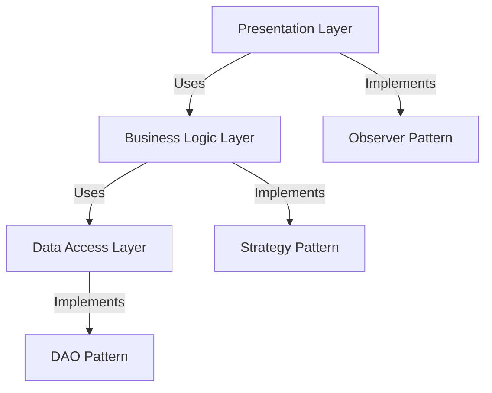

## 7.5. Architectural Patterns and Design Patterns

In the realm of software engineering, understanding the distinction and interplay between architectural patterns and design patterns is crucial for creating robust, scalable, and maintainable systems. While both types of patterns aim to solve recurring problems, they operate at different levels of abstraction and serve different purposes. This section will delve into these two categories, exploring their differences, how they complement each other, and their applications in object-oriented programming.

### Differentiating Between Architectural Patterns and Design Patterns

#### Architectural Patterns

Architectural patterns are high-level strategies that define the overall structure and organization of a software system. They address the fundamental layout of software components and their interactions, focusing on system-wide concerns such as scalability, performance, and maintainability. Architectural patterns provide a blueprint for system design, guiding the arrangement of modules and components.

**Key Characteristics of Architectural Patterns:**

- **High-Level Structure:** Architectural patterns define the overarching framework of a system, dictating how components are organized and interact with each other.
- **System-Wide Concerns:** They address broad issues such as scalability, performance, and fault tolerance, impacting the entire system's behavior.
- **Long-Term Impact:** Decisions made at the architectural level have lasting effects on the system's evolution and adaptability.

**Common Architectural Patterns:**

1. **Layered Architecture:** Organizes the system into layers, each with specific responsibilities, promoting separation of concerns and modularity.
2. **Microservices Architecture:** Breaks down applications into small, independent services that communicate over a network, enhancing scalability and flexibility.
3. **Event-Driven Architecture:** Uses events to trigger and communicate between decoupled services, supporting asynchronous processing and real-time updates.
4. **Client-Server Architecture:** Divides the system into clients and servers, where clients request services and servers provide them, enabling distributed computing.

#### Design Patterns

Design patterns, on the other hand, are more granular solutions to specific problems within the context of object-oriented design. They provide reusable solutions to common challenges encountered during software development, focusing on the relationships and interactions between classes and objects.

**Key Characteristics of Design Patterns:**

- **Mid-Level Solutions:** Design patterns operate at a lower level than architectural patterns, addressing specific design issues within a particular context.
- **Object-Oriented Focus:** They emphasize class and object interactions, promoting principles like encapsulation, inheritance, and polymorphism.
- **Reusability and Flexibility:** Design patterns enhance code reusability and flexibility, making it easier to adapt and extend software components.

**Common Design Patterns:**

1. **Singleton Pattern:** Ensures a class has only one instance and provides a global access point to it.
2. **Factory Method Pattern:** Defines an interface for creating objects but allows subclasses to alter the type of objects that will be created.
3. **Observer Pattern:** Establishes a one-to-many dependency between objects, so that when one object changes state, all its dependents are notified.
4. **Strategy Pattern:** Defines a family of algorithms, encapsulates each one, and makes them interchangeable, allowing the algorithm to vary independently from clients that use it.

### How They Complement Each Other

Architectural patterns and design patterns are not mutually exclusive; rather, they complement each other in the software development process. While architectural patterns provide the structural foundation of a system, design patterns offer solutions to specific design challenges within that structure. Together, they form a cohesive strategy for building complex software systems.

#### Integration of Architectural and Design Patterns

1. **Layered Architecture with Design Patterns:**
   - In a layered architecture, design patterns can be employed within each layer to address specific design issues. For example, the DAO (Data Access Object) pattern can be used in the persistence layer to abstract and encapsulate all access to the data source.

2. **Microservices Architecture with Design Patterns:**
   - In a microservices architecture, design patterns like the Circuit Breaker pattern can be used to handle failures gracefully, preventing cascading failures across services.

3. **Event-Driven Architecture with Design Patterns:**
   - Event-driven systems can benefit from the Observer pattern to manage event notifications and the Command pattern to encapsulate requests as objects, facilitating logging and undo operations.

4. **Client-Server Architecture with Design Patterns:**
   - In a client-server model, the Proxy pattern can be used to control access to a server, providing additional security and abstraction.

#### Benefits of Combining Patterns

- **Enhanced Modularity:** Combining architectural and design patterns promotes modularity, making it easier to manage and evolve the system.
- **Improved Scalability:** Architectural patterns provide the framework for scalability, while design patterns offer solutions for efficient resource management and performance optimization.
- **Increased Flexibility:** The use of design patterns within an architectural framework allows for greater flexibility in adapting to changing requirements and technologies.
- **Simplified Maintenance:** A well-structured system using both types of patterns is easier to maintain, as changes can be localized and managed effectively.

### Sample Code Snippets

Let's explore some pseudocode examples to illustrate how architectural and design patterns can be integrated within a software system.

#### Example 1: Layered Architecture with DAO Pattern

In a layered architecture, the DAO pattern can be used in the data access layer to separate data persistence logic from business logic.

```pseudocode
// Data Access Object Interface
interface DataAccessObject {
    function getData(id)
    function saveData(data)
}

// Concrete DAO Implementation
class ConcreteDAO implements DataAccessObject {
    function getData(id) {
        // Retrieve data from the database
    }
    
    function saveData(data) {
        // Save data to the database
    }
}

// Business Logic Layer
class BusinessService {
    private dao: DataAccessObject
    
    function BusinessService(dao: DataAccessObject) {
        this.dao = dao
    }
    
    function processData(id) {
        data = dao.getData(id)
        // Process data
    }
}
```

In this example, the `ConcreteDAO` class implements the `DataAccessObject` interface, encapsulating data access logic. The `BusinessService` class uses the DAO to retrieve and process data, maintaining separation of concerns.

#### Example 2: Microservices Architecture with Circuit Breaker Pattern

In a microservices architecture, the Circuit Breaker pattern can be used to handle service failures gracefully.

```pseudocode
// Circuit Breaker Interface
interface CircuitBreaker {
    function callService(request)
    function isServiceAvailable()
}

// Concrete Circuit Breaker Implementation
class ConcreteCircuitBreaker implements CircuitBreaker {
    private failureCount: int
    private threshold: int
    private timeout: int
    private lastFailureTime: int
    
    function callService(request) {
        if isServiceAvailable() {
            try {
                // Call the external service
            } catch (Exception e) {
                failureCount++
                lastFailureTime = currentTime()
                // Handle failure
            }
        } else {
            // Return fallback response
        }
    }
    
    function isServiceAvailable() {
        if failureCount >= threshold && (currentTime() - lastFailureTime) < timeout {
            return false
        }
        return true
    }
}
```

The `ConcreteCircuitBreaker` class implements the `CircuitBreaker` interface, monitoring service failures and controlling access to the service based on failure thresholds and timeouts.

### Visualizing the Integration of Patterns

To better understand the integration of architectural and design patterns, let's visualize a system using a layered architecture with various design patterns employed within each layer.



**Diagram Description:** This diagram illustrates a system using a layered architecture. The presentation layer interacts with the business logic layer, which in turn interacts with the data access layer. The DAO pattern is implemented in the data access layer, while the strategy pattern is used in the business logic layer. The observer pattern is employed in the presentation layer to manage UI updates.

### Design Considerations

When integrating architectural and design patterns, consider the following:

- **Compatibility:** Ensure that the chosen design patterns align with the architectural pattern and do not introduce unnecessary complexity.
- **Scalability:** Evaluate how the combination of patterns impacts the system's scalability and performance.
- **Maintainability:** Aim for a balance between flexibility and maintainability, avoiding over-engineering.
- **Documentation:** Document the rationale behind pattern choices and their integration to facilitate future maintenance and evolution.

### Differences and Similarities

While architectural and design patterns serve different purposes, they share some similarities:

- **Problem-Solving:** Both types of patterns aim to solve recurring problems in software design.
- **Reusability:** They promote reusability and consistency in software development.
- **Abstraction:** Patterns provide a level of abstraction, simplifying complex design challenges.

However, they differ in their scope and focus:

- **Scope:** Architectural patterns address system-wide concerns, while design patterns focus on specific design issues.
- **Abstraction Level:** Architectural patterns operate at a higher level of abstraction compared to design patterns.
- **Impact:** Architectural patterns have a long-term impact on the system's structure, while design patterns influence specific components and interactions.

### Try It Yourself

To deepen your understanding, try modifying the pseudocode examples provided:

- **Experiment with Different Patterns:** Replace the DAO pattern with another design pattern in the layered architecture example and observe the impact on the system's design.
- **Adjust Circuit Breaker Parameters:** Modify the failure threshold and timeout values in the Circuit Breaker example to see how they affect service availability.

### References and Links

For further reading on architectural and design patterns, consider these resources:

- [Design Patterns: Elements of Reusable Object-Oriented Software](https://en.wikipedia.org/wiki/Design_Patterns) by Erich Gamma, Richard Helm, Ralph Johnson, and John Vlissides.
- [Patterns of Enterprise Application Architecture](https://martinfowler.com/books/eaa.html) by Martin Fowler.
- [Microservices Patterns: With examples in Java](https://www.oreilly.com/library/view/microservices-patterns/9781617294549/) by Chris Richardson.

### Knowledge Check

To reinforce your learning, consider these questions:

- What are the key differences between architectural and design patterns?
- How do architectural patterns influence system scalability and performance?
- In what scenarios would you choose a design pattern over an architectural pattern?

### Embrace the Journey

Remember, mastering architectural and design patterns is a journey. As you continue to explore and apply these patterns, you'll gain deeper insights into building effective software systems. Keep experimenting, stay curious, and enjoy the process of learning and growing as a software engineer.

## Quiz Time!



### What is the primary focus of architectural patterns?

- [x] High-level system structure and organization
- [ ] Specific class and object interactions
- [ ] Low-level implementation details
- [ ] User interface design

> **Explanation:** Architectural patterns focus on the high-level structure and organization of a software system, addressing system-wide concerns such as scalability and performance.

### How do design patterns complement architectural patterns?

- [x] By providing solutions to specific design challenges within the architectural framework
- [ ] By defining the overall structure of the system
- [ ] By focusing solely on user interface design
- [ ] By replacing architectural patterns

> **Explanation:** Design patterns complement architectural patterns by offering solutions to specific design challenges within the framework established by the architectural pattern.

### Which pattern is commonly used in a microservices architecture to handle service failures gracefully?

- [x] Circuit Breaker Pattern
- [ ] Singleton Pattern
- [ ] Observer Pattern
- [ ] Factory Method Pattern

> **Explanation:** The Circuit Breaker Pattern is used in microservices architectures to handle service failures gracefully, preventing cascading failures across services.

### What is the main benefit of using the DAO pattern in a layered architecture?

- [x] Separation of data persistence logic from business logic
- [ ] Enhancing user interface design
- [ ] Improving network communication
- [ ] Simplifying algorithm implementation

> **Explanation:** The DAO pattern separates data persistence logic from business logic, promoting modularity and separation of concerns in a layered architecture.

### Which architectural pattern divides the system into clients and servers?

- [x] Client-Server Architecture
- [ ] Microservices Architecture
- [ ] Layered Architecture
- [ ] Event-Driven Architecture

> **Explanation:** The Client-Server Architecture divides the system into clients and servers, where clients request services and servers provide them.

### What is a key characteristic of design patterns?

- [x] Reusability and flexibility in solving specific design issues
- [ ] Defining the overall system structure
- [ ] Addressing system-wide concerns
- [ ] Focusing on user interface design

> **Explanation:** Design patterns focus on reusability and flexibility, providing solutions to specific design issues within a particular context.

### How do architectural patterns impact system scalability?

- [x] By providing a framework for scalability and performance optimization
- [ ] By focusing solely on user interface design
- [ ] By defining specific class interactions
- [ ] By simplifying algorithm implementation

> **Explanation:** Architectural patterns provide a framework for scalability and performance optimization, addressing system-wide concerns.

### What is the primary focus of design patterns?

- [x] Specific class and object interactions
- [ ] High-level system structure and organization
- [ ] User interface design
- [ ] Network communication

> **Explanation:** Design patterns focus on specific class and object interactions, providing solutions to common design challenges in object-oriented programming.

### Which pattern is used to establish a one-to-many dependency between objects?

- [x] Observer Pattern
- [ ] Singleton Pattern
- [ ] Factory Method Pattern
- [ ] Strategy Pattern

> **Explanation:** The Observer Pattern establishes a one-to-many dependency between objects, so that when one object changes state, all its dependents are notified.

### True or False: Architectural patterns operate at a lower level of abstraction compared to design patterns.

- [ ] True
- [x] False

> **Explanation:** False. Architectural patterns operate at a higher level of abstraction compared to design patterns, addressing system-wide concerns.


