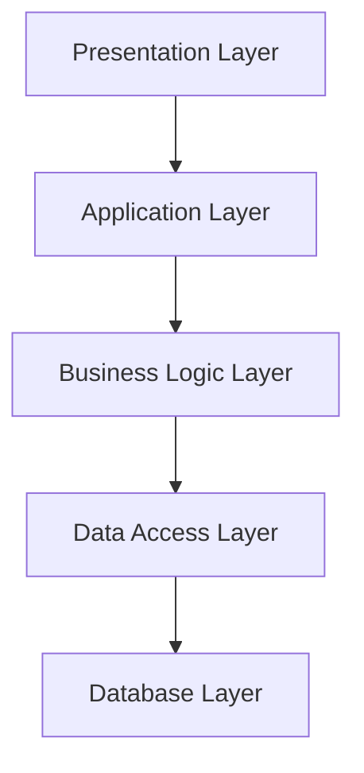

## 7.6. Pattern-Oriented Software Architecture

In the realm of software development, design patterns serve as a foundational tool that allows developers to solve recurring problems with proven solutions. When these patterns are integrated into the broader context of software architecture, they form a cohesive framework that enhances the scalability, maintainability, and flexibility of software systems. This section delves into the concept of Pattern-Oriented Software Architecture (POSA), focusing on how design patterns can be systematically integrated into software architectures, with special emphasis on layered architectures and frameworks.

### Integrating Patterns into Software Architectures

Software architecture is the high-level structure of a software system, defining its components and their interactions. Integrating design patterns into software architecture involves using these patterns to address specific architectural concerns, such as modularity, separation of concerns, and communication between components. This integration enhances the robustness and adaptability of the architecture.

#### The Role of Design Patterns in Architecture

Design patterns provide a vocabulary for developers to communicate complex design concepts succinctly. By using patterns, architects can:

- **Standardize Solutions**: Patterns offer standardized solutions to common problems, ensuring consistency across the architecture.
- **Enhance Communication**: Patterns serve as a common language among developers, facilitating clear communication and understanding.
- **Promote Reusability**: Patterns encourage the reuse of design solutions, reducing redundancy and improving efficiency.
- **Support Flexibility**: Patterns allow for flexible design choices that can adapt to changing requirements.

#### Key Considerations for Pattern Integration

When integrating patterns into software architecture, consider the following:

- **Context and Requirements**: Understand the specific context and requirements of the system to select appropriate patterns.
- **Compatibility**: Ensure that chosen patterns are compatible with each other and the overall architectural style.
- **Scalability**: Assess how patterns will affect the scalability of the system.
- **Performance**: Consider the performance implications of using certain patterns, especially in resource-constrained environments.

### Layered Architectures

Layered architecture is a common architectural style that organizes a system into layers, each with a specific responsibility. This style promotes separation of concerns and enhances maintainability.

#### Understanding Layered Architecture

In a layered architecture, each layer provides services to the layer above it and consumes services from the layer below. This structure creates a clear separation of concerns, making it easier to manage and evolve the system.

**Key Characteristics of Layered Architecture:**

- **Modularity**: Each layer is a module with a specific responsibility.
- **Encapsulation**: Layers encapsulate their functionality, exposing only necessary interfaces.
- **Inter-layer Communication**: Communication occurs through well-defined interfaces, reducing coupling.

#### Common Layers in Software Architecture

1. **Presentation Layer**: Handles user interface and interaction.
2. **Application Layer**: Manages application-specific logic.
3. **Business Logic Layer**: Contains core business rules and logic.
4. **Data Access Layer**: Manages data retrieval and storage.
5. **Database Layer**: Interacts with the database system.

#### Benefits of Layered Architecture

- **Separation of Concerns**: Each layer focuses on a specific aspect of the system.
- **Ease of Maintenance**: Changes in one layer have minimal impact on others.
- **Scalability**: Layers can be scaled independently based on demand.

#### Challenges of Layered Architecture

- **Performance Overhead**: Multiple layers can introduce latency.
- **Complexity**: Managing dependencies between layers can be complex.

### Frameworks in Software Architecture

Frameworks provide a reusable, semi-complete application structure that can be customized to create specific applications. They embody a particular architectural style and often incorporate multiple design patterns.

#### The Role of Frameworks

Frameworks offer a foundation upon which developers can build applications. They provide:

- **Predefined Structure**: A consistent structure that guides application development.
- **Reusable Components**: Components that can be reused across different applications.
- **Best Practices**: Encapsulation of best practices and design patterns.

#### Types of Frameworks

1. **Web Frameworks**: Facilitate web application development (e.g., Django, Ruby on Rails).
2. **Mobile Frameworks**: Support mobile app development (e.g., React Native, Flutter).
3. **Enterprise Frameworks**: Cater to enterprise-level applications (e.g., Spring, .NET).

#### Integrating Patterns into Frameworks

Frameworks often integrate multiple design patterns to address various concerns:

- **Model-View-Controller (MVC)**: Separates application logic, user interface, and control logic.
- **Observer Pattern**: Used for event handling and notification.
- **Singleton Pattern**: Manages shared resources or configurations.

### Case Study: Integrating Patterns in a Layered Architecture

Let's explore a case study to illustrate how design patterns can be integrated into a layered architecture.

#### Scenario: E-Commerce Application

Consider an e-commerce application with the following requirements:

- **User Interface**: A web-based interface for customers.
- **Business Logic**: Handling orders, payments, and inventory.
- **Data Management**: Storing customer and product data.

#### Layered Architecture Design

1. **Presentation Layer**: Uses the **MVC pattern** to separate the user interface from business logic.
2. **Business Logic Layer**: Implements the **Facade pattern** to simplify interactions with complex subsystems.
3. **Data Access Layer**: Utilizes the **DAO pattern** (Data Access Object) to abstract data access operations.
4. **Database Layer**: Employs the **Singleton pattern** for database connection management.

#### Pseudocode Example

Below is a pseudocode example demonstrating the integration of patterns in the business logic layer using the Facade pattern:

```pseudocode
class OrderFacade
    method placeOrder(customerId, productId, quantity)
        inventory = InventorySystem.getInstance()
        payment = PaymentSystem.getInstance()
        
        if inventory.checkStock(productId, quantity)
            payment.processPayment(customerId, productId, quantity)
            inventory.updateStock(productId, quantity)
            print("Order placed successfully")
        else
            print("Insufficient stock")

class InventorySystem
    method getInstance()
        // Singleton implementation
        return instance

    method checkStock(productId, quantity)
        // Check stock availability
        return true or false

    method updateStock(productId, quantity)
        // Update stock levels

class PaymentSystem
    method getInstance()
        // Singleton implementation
        return instance

    method processPayment(customerId, productId, quantity)
        // Process payment transaction
```

### Visualizing Layered Architecture

To better understand the layered architecture, let's visualize it using a Mermaid.js diagram:



**Diagram Description:** This diagram illustrates the flow of data and control through the layers of an application, highlighting the separation of concerns and the interaction between layers.

### Try It Yourself

Experiment with the pseudocode example by:

- Modifying the `placeOrder` method to include additional checks or logging.
- Implementing a new pattern, such as the Observer pattern, to handle order notifications.
- Adding error handling to improve the robustness of the system.

### Knowledge Check

Let's reinforce our understanding of Pattern-Oriented Software Architecture with a few questions:

1. What are the key benefits of integrating design patterns into software architecture?
2. How does the layered architecture promote separation of concerns?
3. What role do frameworks play in software development?
4. How can the Facade pattern simplify interactions with complex subsystems?

### Conclusion

Pattern-Oriented Software Architecture is a powerful approach to designing robust, scalable, and maintainable software systems. By integrating design patterns into the architectural framework, developers can leverage proven solutions to address common challenges, enhance communication, and promote reusability. Whether through layered architectures or frameworks, the thoughtful application of patterns can significantly improve the quality and adaptability of software systems.

Remember, this is just the beginning. As you continue your journey in software development, keep exploring and experimenting with design patterns and architectural styles to build better, more efficient systems.

## Quiz Time!



### What is a primary benefit of integrating design patterns into software architecture?

- [x] Standardizing solutions to common problems
- [ ] Increasing the complexity of the system
- [ ] Limiting flexibility in design choices
- [ ] Reducing communication among developers

> **Explanation:** Integrating design patterns standardizes solutions to common problems, ensuring consistency and improving communication among developers.

### Which layer in a layered architecture handles user interaction?

- [x] Presentation Layer
- [ ] Business Logic Layer
- [ ] Data Access Layer
- [ ] Database Layer

> **Explanation:** The Presentation Layer is responsible for handling user interaction and the user interface.

### What is a key characteristic of frameworks in software development?

- [x] Providing a reusable, semi-complete application structure
- [ ] Limiting the use of design patterns
- [ ] Increasing redundancy in code
- [ ] Discouraging best practices

> **Explanation:** Frameworks provide a reusable, semi-complete application structure that can be customized for specific applications, often incorporating best practices and design patterns.

### How does the Facade pattern benefit a software system?

- [x] Simplifies interactions with complex subsystems
- [ ] Increases coupling between components
- [ ] Reduces modularity
- [ ] Complicates the user interface

> **Explanation:** The Facade pattern simplifies interactions with complex subsystems by providing a unified interface, reducing complexity for the client.

### Which design pattern is commonly used for managing shared resources?

- [x] Singleton Pattern
- [ ] Observer Pattern
- [ ] Strategy Pattern
- [ ] Decorator Pattern

> **Explanation:** The Singleton Pattern is commonly used to manage shared resources, ensuring that only one instance of a class is created.

### What is a potential challenge of using layered architecture?

- [x] Performance overhead due to multiple layers
- [ ] Lack of modularity
- [ ] Difficulty in scaling individual layers
- [ ] Increased coupling between layers

> **Explanation:** Layered architecture can introduce performance overhead due to the interaction between multiple layers, which may affect latency.

### Which pattern is often used in the Presentation Layer of a web application?

- [x] Model-View-Controller (MVC)
- [ ] Singleton Pattern
- [ ] Proxy Pattern
- [ ] Flyweight Pattern

> **Explanation:** The Model-View-Controller (MVC) pattern is often used in the Presentation Layer to separate application logic, user interface, and control logic.

### What is the primary focus of the Business Logic Layer in a layered architecture?

- [x] Handling core business rules and logic
- [ ] Managing user interface elements
- [ ] Accessing and storing data
- [ ] Interacting with the database system

> **Explanation:** The Business Logic Layer focuses on handling core business rules and logic, separating it from other concerns like data access or user interface.

### How can the Observer pattern be integrated into a framework?

- [x] For event handling and notification
- [ ] To manage shared resources
- [ ] To encapsulate a family of algorithms
- [ ] To provide a unified interface to a subsystem

> **Explanation:** The Observer pattern is integrated into frameworks for event handling and notification, allowing objects to be notified of changes in other objects.

### True or False: Frameworks discourage the use of design patterns.

- [ ] True
- [x] False

> **Explanation:** False. Frameworks often incorporate multiple design patterns to address various concerns and promote best practices.


