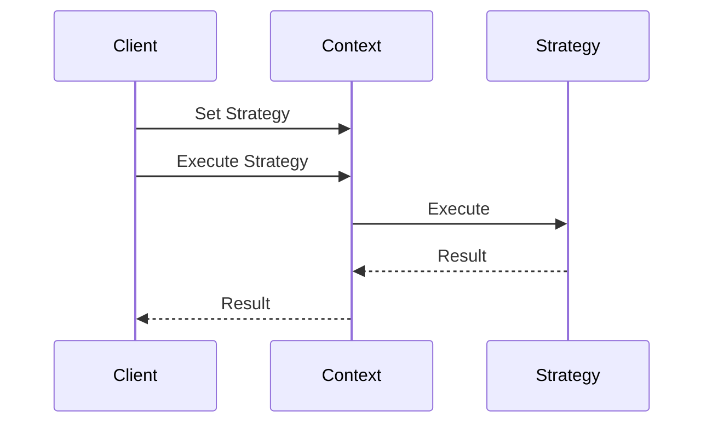

## 7.7. Using Patterns in Test-Driven Development (TDD)

Test-Driven Development (TDD) is a software development approach where tests are written before the actual code. This methodology emphasizes writing a test, seeing it fail, writing the minimum code to pass the test, and then refactoring the code. By incorporating design patterns into TDD, developers can enhance the testability of their code, making it more robust and maintainable. In this section, we will explore how design patterns can be effectively used in TDD to write clean, efficient, and testable code.

### Introduction to Test-Driven Development

Test-Driven Development is a powerful methodology that ensures code quality and reliability. It follows a simple cycle:

1. **Red**: Write a test that fails.
2. **Green**: Write the minimum code necessary to pass the test.
3. **Refactor**: Clean up the code while ensuring all tests still pass.

This cycle encourages developers to think about the requirements and design of their code before implementation.

### Enhancing Testability with Design Patterns

Design patterns provide proven solutions to common design problems and can significantly enhance the testability of code. Let's explore some key design patterns and how they can be integrated into TDD.

#### 1. Singleton Pattern in TDD

**Intent**: Ensure a class has only one instance and provide a global access point to it.

**Testability Challenge**: Singleton can make testing difficult due to its global state.

**Solution**: Use dependency injection to inject the singleton instance, allowing for easier testing.

**Pseudocode Example**:

```pseudocode
class Singleton:
    _instance = None

    @staticmethod
    def get_instance():
        if Singleton._instance is None:
            Singleton._instance = Singleton()
        return Singleton._instance

def test_singleton():
    instance1 = Singleton.get_instance()
    instance2 = Singleton.get_instance()
    assert instance1 is instance2  # Ensure both instances are the same
```

**Try It Yourself**: Modify the Singleton pattern to allow for resetting the instance, making it easier to test in isolation.

#### 2. Factory Method Pattern in TDD

**Intent**: Define an interface for creating an object, but let subclasses alter the type of objects that will be created.

**Testability Benefit**: By decoupling object creation, the Factory Method pattern allows for easier testing of object creation logic.

**Pseudocode Example**:

```pseudocode
class Product:
    def operation(self):
        pass

class ConcreteProductA(Product):
    def operation(self):
        return "Result of ConcreteProductA"

class Creator:
    def factory_method(self):
        return ConcreteProductA()

def test_factory_method():
    creator = Creator()
    product = creator.factory_method()
    assert product.operation() == "Result of ConcreteProductA"
```

**Try It Yourself**: Implement a new product type and update the factory method to create this new product.

#### 3. Strategy Pattern in TDD

**Intent**: Define a family of algorithms, encapsulate each one, and make them interchangeable.

**Testability Benefit**: The Strategy pattern allows for easy testing of different algorithms independently.

**Pseudocode Example**:

```pseudocode
class Strategy:
    def execute(self):
        pass

class ConcreteStrategyA(Strategy):
    def execute(self):
        return "Strategy A"

class Context:
    def __init__(self, strategy: Strategy):
        self._strategy = strategy

    def execute_strategy(self):
        return self._strategy.execute()

def test_strategy_pattern():
    strategy = ConcreteStrategyA()
    context = Context(strategy)
    assert context.execute_strategy() == "Strategy A"
```

**Try It Yourself**: Create a new strategy and test it within the context.

#### 4. Observer Pattern in TDD

**Intent**: Define a one-to-many dependency between objects so that when one object changes state, all its dependents are notified and updated automatically.

**Testability Benefit**: The Observer pattern allows for testing the notification mechanism independently.

**Pseudocode Example**:

```pseudocode
class Observer:
    def update(self, message):
        pass

class ConcreteObserver(Observer):
    def update(self, message):
        self.message = message

class Subject:
    def __init__(self):
        self._observers = []

    def attach(self, observer: Observer):
        self._observers.append(observer)

    def notify(self, message):
        for observer in self._observers:
            observer.update(message)

def test_observer_pattern():
    subject = Subject()
    observer = ConcreteObserver()
    subject.attach(observer)
    subject.notify("New Message")
    assert observer.message == "New Message"
```

**Try It Yourself**: Add multiple observers and test the notification mechanism.

### Writing Tests for Pattern-Based Code

When writing tests for pattern-based code, it's important to focus on the behavior and interactions defined by the pattern. Here are some general guidelines:

1. **Isolate Components**: Use mock objects to isolate the component being tested.
2. **Test Interfaces**: Focus on testing the interfaces and interactions rather than the implementation details.
3. **Use Dependency Injection**: This allows for easier substitution of dependencies with mock objects during testing.

### Visualizing Design Patterns in TDD

To better understand how design patterns integrate with TDD, let's visualize the process using a sequence diagram for the Strategy pattern:



**Description**: This diagram illustrates how the client sets a strategy in the context and executes it, demonstrating the interaction between the client, context, and strategy.

### Knowledge Check

- **Question**: Why is it important to write tests before the implementation in TDD?
- **Answer**: Writing tests first helps clarify requirements and design, ensuring that the code meets the specified behavior.

### Exercises

1. **Exercise 1**: Implement a new design pattern and write tests for it using TDD.
2. **Exercise 2**: Refactor an existing codebase to use a design pattern and add tests to ensure functionality.

### Conclusion

Incorporating design patterns into TDD not only enhances the testability of your code but also ensures that your code is well-structured and maintainable. By following the principles outlined in this section, you can write effective tests for pattern-based code and improve the overall quality of your software.

### Embrace the Journey

Remember, this is just the beginning. As you progress, you'll build more complex and interactive applications. Keep experimenting, stay curious, and enjoy the journey!

### References and Links

- [Test-Driven Development by Example](https://www.amazon.com/Test-Driven-Development-Kent-Beck/dp/0321146530)
- [Design Patterns: Elements of Reusable Object-Oriented Software](https://www.amazon.com/Design-Patterns-Elements-Reusable-Object-Oriented/dp/0201633612)
- [Martin Fowler's Refactoring](https://martinfowler.com/books/refactoring.html)

## Quiz Time!



### What is the primary cycle of Test-Driven Development (TDD)?

- [x] Red, Green, Refactor
- [ ] Write, Test, Debug
- [ ] Plan, Code, Test
- [ ] Design, Implement, Test

> **Explanation:** The TDD cycle consists of writing a failing test (Red), making it pass (Green), and then refactoring the code.

### Which design pattern ensures a class has only one instance?

- [x] Singleton
- [ ] Factory Method
- [ ] Observer
- [ ] Strategy

> **Explanation:** The Singleton pattern ensures that a class has only one instance and provides a global access point to it.

### How does the Factory Method pattern enhance testability?

- [x] By decoupling object creation
- [ ] By enforcing a single instance
- [ ] By notifying observers
- [ ] By encapsulating algorithms

> **Explanation:** The Factory Method pattern enhances testability by decoupling object creation, allowing for easier testing of object creation logic.

### What is the benefit of the Strategy pattern in TDD?

- [x] Allows for easy testing of different algorithms independently
- [ ] Ensures a single instance
- [ ] Notifies observers automatically
- [ ] Provides a global access point

> **Explanation:** The Strategy pattern allows for easy testing of different algorithms independently by encapsulating each one.

### In the Observer pattern, what is the role of the Subject?

- [x] To notify all attached observers of changes
- [ ] To encapsulate algorithms
- [ ] To create objects
- [ ] To ensure a single instance

> **Explanation:** In the Observer pattern, the Subject is responsible for notifying all attached observers of changes.

### What is the purpose of dependency injection in testing?

- [x] To allow for easier substitution of dependencies with mock objects
- [ ] To enforce a single instance
- [ ] To encapsulate algorithms
- [ ] To notify observers

> **Explanation:** Dependency injection allows for easier substitution of dependencies with mock objects during testing, enhancing testability.

### Which pattern defines a one-to-many dependency between objects?

- [x] Observer
- [ ] Singleton
- [ ] Factory Method
- [ ] Strategy

> **Explanation:** The Observer pattern defines a one-to-many dependency between objects, allowing for automatic updates.

### What is the first step in the TDD cycle?

- [x] Write a test that fails
- [ ] Write the implementation
- [ ] Refactor the code
- [ ] Debug the code

> **Explanation:** The first step in the TDD cycle is to write a test that fails, which helps clarify requirements.

### How can design patterns improve code maintainability?

- [x] By providing proven solutions to common design problems
- [ ] By enforcing a single instance
- [ ] By encapsulating algorithms
- [ ] By notifying observers

> **Explanation:** Design patterns improve code maintainability by providing proven solutions to common design problems, leading to well-structured code.

### True or False: TDD requires writing tests after the implementation.

- [ ] True
- [x] False

> **Explanation:** False. TDD requires writing tests before the implementation to ensure the code meets the specified behavior.


