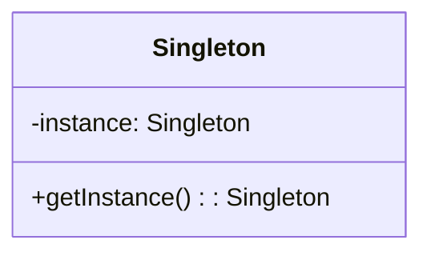
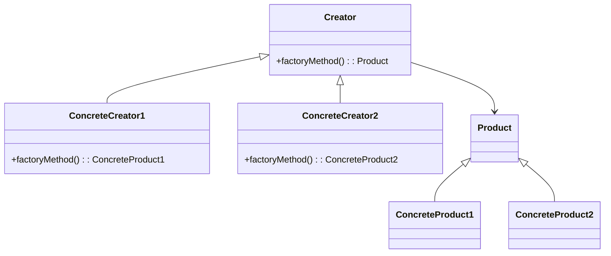
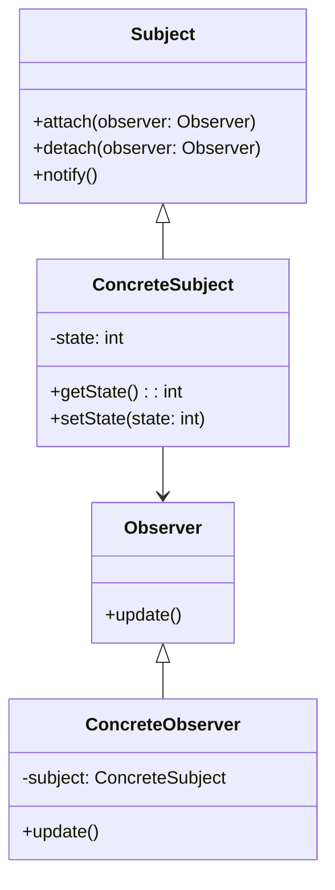
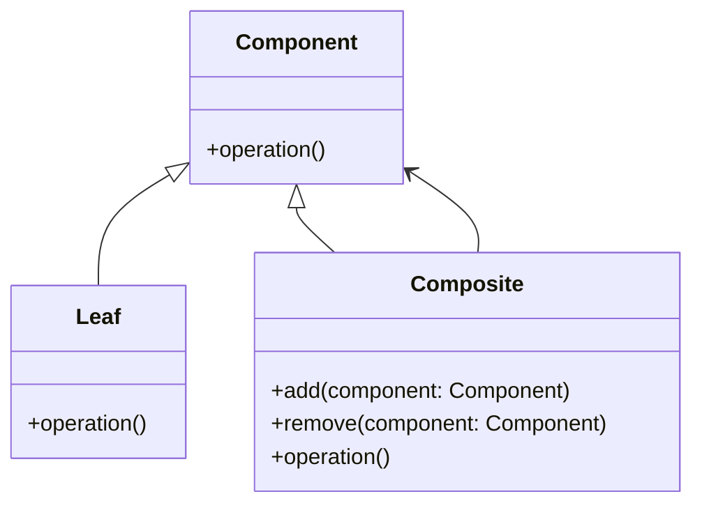
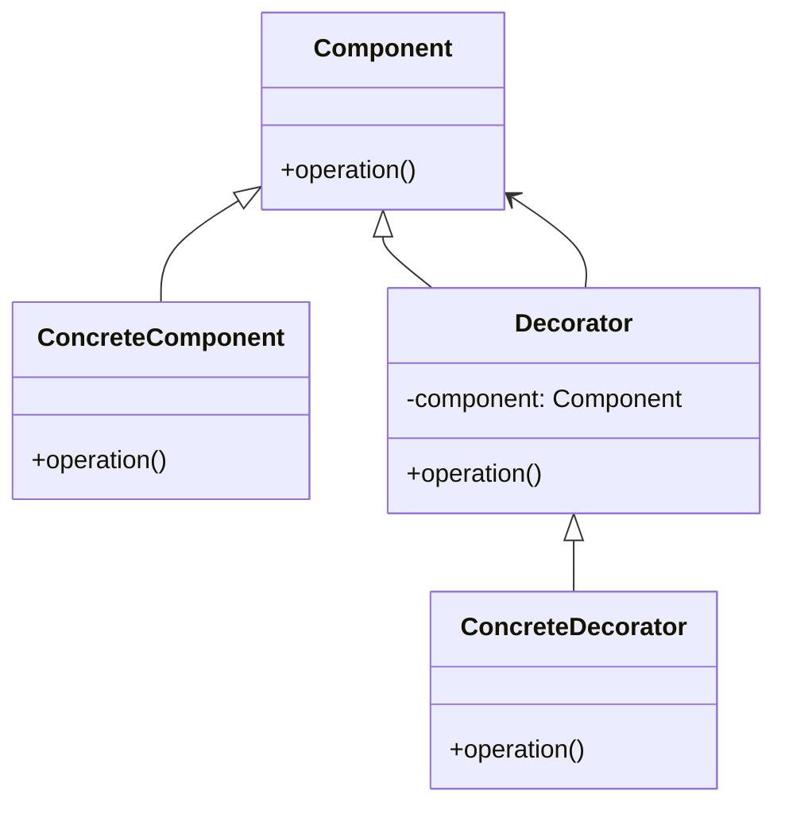

## 8.1. Using UML with Design Patterns

Unified Modeling Language (UML) is a powerful tool for visualizing, specifying, constructing, and documenting the artifacts of a software system. In the realm of object-oriented design patterns, UML serves as a bridge between abstract concepts and tangible implementations. By representing design patterns visually, UML diagrams help developers understand the structure and behavior of patterns, facilitating communication and collaboration among team members.

### Representing Patterns Visually

UML diagrams provide a standardized way to depict the components and interactions within a software system. When applied to design patterns, these diagrams illustrate the relationships and responsibilities of pattern participants, making it easier to grasp complex architectures.

#### Types of UML Diagrams

1. **Class Diagrams**: Depict the static structure of a system, showing classes, their attributes, methods, and relationships. Class diagrams are essential for understanding the structural aspects of design patterns.

2. **Sequence Diagrams**: Focus on the dynamic behavior of a system, illustrating how objects interact over time. Sequence diagrams are particularly useful for visualizing the flow of control in behavioral patterns.

3. **Collaboration Diagrams**: Similar to sequence diagrams, but emphasize the structural organization of objects that interact. They are useful for understanding the roles of objects in a pattern.

4. **Activity Diagrams**: Represent workflows and the sequence of activities in a process. They can be used to model the logic of complex algorithms within patterns.

5. **State Diagrams**: Show the states of an object and transitions between those states. State diagrams are valuable for patterns that involve state-dependent behavior.

6. **Component Diagrams**: Illustrate the organization and dependencies among components. They are useful for visualizing the modular structure of patterns.

7. **Deployment Diagrams**: Depict the physical deployment of artifacts on nodes. They are less commonly used for design patterns but can be helpful in understanding distributed systems.

### Standard Notations and Extensions

UML provides a rich set of notations to represent various elements of a software system. When modeling design patterns, it's crucial to use these notations consistently to convey the intended meaning.

#### Key UML Notations

- **Classes and Interfaces**: Represented as rectangles with compartments for the class name, attributes, and methods. Interfaces are depicted with a small circle or a rectangle with the «interface» stereotype.

- **Associations**: Lines connecting classes, representing relationships. Multiplicity indicators (e.g., 1..*, 0..1) specify the number of instances involved in the relationship.

- **Generalization**: A solid line with a hollow arrowhead pointing to the superclass, indicating inheritance.

- **Dependency**: A dashed line with an open arrowhead, showing that a class depends on another.

- **Aggregation and Composition**: Represented by a line with a diamond at the aggregate end. Composition is a stronger form of aggregation, depicted with a filled diamond.

- **Messages**: In sequence diagrams, arrows indicate messages passed between objects. Solid arrows represent synchronous calls, while dashed arrows indicate return messages.

#### Extending UML for Design Patterns

While standard UML notations cover most needs, certain extensions can enhance the representation of design patterns:

- **Stereotypes**: Custom labels enclosed in guillemets (e.g., «singleton», «factory») to indicate specific roles or characteristics of classes in a pattern.

- **Tagged Values**: Annotations that provide additional information about a model element, such as constraints or metadata.

- **Constraints**: Conditions or rules depicted in curly braces (e.g., {abstract}) that must hold true for the system.

### Visualizing Design Patterns with UML

Let's explore how UML diagrams can be used to represent some common design patterns. We'll provide examples and pseudocode to illustrate each pattern's structure and behavior.

#### Singleton Pattern

**Intent**: Ensure a class has only one instance and provide a global access point to it.

**Class Diagram**:



**Pseudocode**:

```pseudocode
class Singleton {
    private static instance: Singleton

    private Singleton() {
        // Private constructor to prevent instantiation
    }

    public static getInstance(): Singleton {
        if (instance == null) {
            instance = new Singleton()
        }
        return instance
    }
}
```

**Explanation**: The Singleton class diagram shows a single class with a private static instance and a public method to access it. The pseudocode demonstrates lazy initialization, ensuring the instance is created only when needed.

#### Factory Method Pattern

**Intent**: Define an interface for creating an object, but let subclasses decide which class to instantiate.

**Class Diagram**:



**Pseudocode**:

```pseudocode
interface Product {
    // Product interface
}

class ConcreteProduct1 implements Product {
    // Implementation of Product
}

class ConcreteProduct2 implements Product {
    // Implementation of Product
}

abstract class Creator {
    abstract factoryMethod(): Product
}

class ConcreteCreator1 extends Creator {
    factoryMethod(): Product {
        return new ConcreteProduct1()
    }
}

class ConcreteCreator2 extends Creator {
    factoryMethod(): Product {
        return new ConcreteProduct2()
    }
}
```

**Explanation**: The Factory Method pattern uses an abstract Creator class with a factory method. Subclasses override this method to create specific products. The UML diagram shows the inheritance hierarchy and the association between creators and products.

#### Observer Pattern

**Intent**: Define a one-to-many dependency between objects so that when one object changes state, all its dependents are notified and updated automatically.

**Class Diagram**:



**Pseudocode**:

```pseudocode
interface Observer {
    update()
}

class ConcreteObserver implements Observer {
    private subject: ConcreteSubject

    update() {
        // Update logic based on subject's state
    }
}

class Subject {
    private observers: List<Observer>

    attach(observer: Observer) {
        observers.add(observer)
    }

    detach(observer: Observer) {
        observers.remove(observer)
    }

    notify() {
        for each observer in observers {
            observer.update()
        }
    }
}

class ConcreteSubject extends Subject {
    private state: int

    getState(): int {
        return state
    }

    setState(state: int) {
        this.state = state
        notify()
    }
}
```

**Explanation**: The Observer pattern involves a Subject that maintains a list of Observers. When the Subject's state changes, it notifies all Observers. The UML diagram illustrates the relationship between the Subject and its Observers.

### Try It Yourself

To deepen your understanding, try modifying the pseudocode examples. For instance, implement thread safety in the Singleton pattern or add a new product type in the Factory Method pattern. Experiment with different UML diagrams to visualize your changes.

### Visualizing Complex Patterns

Some design patterns, such as the Composite and Decorator patterns, involve more intricate structures. Let's explore how UML can help clarify these complexities.

#### Composite Pattern

**Intent**: Compose objects into tree structures to represent part-whole hierarchies. Composite lets clients treat individual objects and compositions of objects uniformly.

**Class Diagram**:



**Pseudocode**:

```pseudocode
interface Component {
    operation()
}

class Leaf implements Component {
    operation() {
        // Perform operation specific to leaf
    }
}

class Composite implements Component {
    private children: List<Component>

    add(component: Component) {
        children.add(component)
    }

    remove(component: Component) {
        children.remove(component)
    }

    operation() {
        for each child in children {
            child.operation()
        }
    }
}
```

**Explanation**: The Composite pattern uses a Component interface, implemented by both Leaf and Composite classes. The Composite class maintains a collection of child components, allowing for recursive operations. The UML diagram illustrates the hierarchical structure.

#### Decorator Pattern

**Intent**: Attach additional responsibilities to an object dynamically. Decorators provide a flexible alternative to subclassing for extending functionality.

**Class Diagram**:



**Pseudocode**:

```pseudocode
interface Component {
    operation()
}

class ConcreteComponent implements Component {
    operation() {
        // Perform base operation
    }
}

class Decorator implements Component {
    protected component: Component

    Decorator(component: Component) {
        this.component = component
    }

    operation() {
        component.operation()
    }
}

class ConcreteDecorator extends Decorator {
    operation() {
        super.operation()
        // Additional behavior
    }
}
```

**Explanation**: The Decorator pattern involves a Component interface, with ConcreteComponent and Decorator classes implementing it. Decorators wrap components, adding behavior. The UML diagram shows the relationship between components and decorators.

### Knowledge Check

Before we conclude, let's review some key concepts. Consider the following questions:

1. How do UML diagrams facilitate understanding of design patterns?
2. What are the differences between class and sequence diagrams?
3. How can stereotypes enhance UML diagrams for design patterns?

### Summary

In this section, we've explored how UML diagrams can be used to represent design patterns visually. By understanding the standard notations and extensions, you can effectively communicate complex architectures and behaviors. Remember, UML is a tool to aid understanding and collaboration, so use it to clarify and document your designs.

### Embrace the Journey

As you continue your journey in mastering design patterns, remember that practice and experimentation are key. Use UML diagrams to explore new patterns and refine your understanding. Keep pushing the boundaries of your knowledge, and enjoy the process of becoming a more skilled and insightful developer.

## Quiz Time!



### What is the primary purpose of using UML diagrams with design patterns?

- [x] To visually represent the structure and behavior of patterns
- [ ] To replace code implementation
- [ ] To enforce coding standards
- [ ] To generate executable software

> **Explanation:** UML diagrams are used to visually represent the structure and behavior of design patterns, aiding in understanding and communication.

### Which UML diagram is most useful for illustrating the dynamic behavior of a system?

- [ ] Class Diagram
- [x] Sequence Diagram
- [ ] Component Diagram
- [ ] Deployment Diagram

> **Explanation:** Sequence diagrams focus on the dynamic behavior of a system, showing how objects interact over time.

### In a class diagram, how is an interface typically represented?

- [x] As a rectangle with the «interface» stereotype
- [ ] As a dashed line
- [ ] As a filled diamond
- [ ] As a circle

> **Explanation:** Interfaces in class diagrams are represented as rectangles with the «interface» stereotype.

### What does a solid line with a hollow arrowhead represent in a UML class diagram?

- [x] Generalization (inheritance)
- [ ] Association
- [ ] Dependency
- [ ] Composition

> **Explanation:** A solid line with a hollow arrowhead represents generalization, indicating inheritance in UML class diagrams.

### Which pattern involves composing objects into tree structures to represent part-whole hierarchies?

- [x] Composite Pattern
- [ ] Decorator Pattern
- [ ] Singleton Pattern
- [ ] Factory Method Pattern

> **Explanation:** The Composite pattern composes objects into tree structures to represent part-whole hierarchies.

### How can stereotypes be used in UML diagrams?

- [x] To indicate specific roles or characteristics of classes
- [ ] To define new programming languages
- [ ] To replace standard UML notations
- [ ] To enforce security protocols

> **Explanation:** Stereotypes are used to indicate specific roles or characteristics of classes in UML diagrams.

### What is the benefit of using the Decorator pattern?

- [x] It allows for dynamic addition of responsibilities to objects
- [ ] It ensures only one instance of a class exists
- [ ] It provides a global access point to an object
- [ ] It defines a family of algorithms

> **Explanation:** The Decorator pattern allows for dynamic addition of responsibilities to objects, providing flexibility.

### Which UML diagram is less commonly used for design patterns but can help in understanding distributed systems?

- [ ] Class Diagram
- [ ] Sequence Diagram
- [ ] Activity Diagram
- [x] Deployment Diagram

> **Explanation:** Deployment diagrams are less commonly used for design patterns but can help in understanding distributed systems.

### What is the role of a Subject in the Observer pattern?

- [x] To maintain a list of observers and notify them of state changes
- [ ] To encapsulate how a set of objects interact
- [ ] To define a family of algorithms
- [ ] To compose objects into tree structures

> **Explanation:** In the Observer pattern, the Subject maintains a list of observers and notifies them of state changes.

### True or False: UML diagrams can replace the need for code implementation.

- [ ] True
- [x] False

> **Explanation:** UML diagrams are tools for visualization and documentation, not replacements for code implementation.


