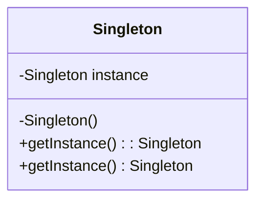
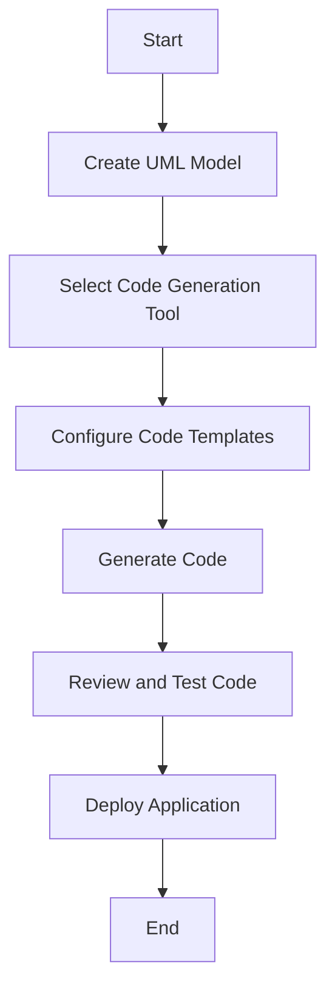

## 8.2. Software Tools for Designing Patterns

In the realm of object-oriented design, software tools play a pivotal role in modeling and implementing design patterns. These tools not only facilitate the visualization of complex systems but also streamline the development process through features like code generation. In this section, we will delve into two primary categories of tools: UML modeling tools and code generation tools. We will explore their functionalities, advantages, and how they can be effectively utilized in designing patterns.

### UML Modeling Tools

Unified Modeling Language (UML) is a standardized modeling language that provides a set of graphical notation techniques to create visual models of object-oriented software systems. UML modeling tools are essential for designing patterns as they help in visualizing the architecture and interactions within a system.

#### Key Features of UML Modeling Tools

1. **Class Diagrams**: Represent the static structure of a system, showing classes, attributes, methods, and relationships.
2. **Sequence Diagrams**: Illustrate how objects interact in a particular sequence, focusing on the order of message exchanges.
3. **Use Case Diagrams**: Capture the functional requirements of a system, showing actors and their interactions with the system.
4. **Activity Diagrams**: Model the dynamic aspects of a system, representing workflows and the sequence of activities.
5. **State Diagrams**: Depict the states of an object and transitions between those states.
6. **Collaboration Diagrams**: Focus on the structural organization of objects that interact in a particular context.

#### Popular UML Modeling Tools

1. **Lucidchart**: A web-based diagramming tool that supports UML diagrams, offering real-time collaboration and integration with other platforms.
2. **Microsoft Visio**: A versatile diagramming tool that provides templates for UML diagrams and integrates well with Microsoft Office.
3. **StarUML**: An open-source UML tool that supports multiple UML diagrams and allows for extensions through plugins.
4. **Enterprise Architect**: A comprehensive UML modeling tool that supports a wide range of diagrams and offers features like code generation and reverse engineering.
5. **ArgoUML**: A free, open-source UML modeling tool that supports all standard UML diagrams.

#### Benefits of Using UML Modeling Tools

- **Visualization**: UML tools provide a visual representation of the system architecture, making it easier to understand complex interactions.
- **Standardization**: UML is a standardized language, ensuring consistency in modeling across different projects and teams.
- **Collaboration**: Many UML tools offer collaboration features, allowing multiple team members to work on the same model simultaneously.
- **Documentation**: UML diagrams serve as documentation for the system, aiding in maintenance and future development.

#### Implementing Design Patterns with UML

UML modeling tools are instrumental in implementing design patterns. Let's explore how UML can be used to model a common design pattern, the Singleton pattern.

**Singleton Pattern UML Diagram**



**Description**: The Singleton pattern ensures that a class has only one instance and provides a global point of access to it. The UML diagram above represents the Singleton class with a private static instance and a public method to access it.

**Try It Yourself**: Modify the diagram to include a method that performs a specific action, such as `logMessage()`, and visualize how it fits into the Singleton class structure.

### Code Generation from Models

Code generation tools automate the process of converting UML models into executable code. This not only accelerates development but also reduces the likelihood of errors that can occur during manual coding.

#### Key Features of Code Generation Tools

1. **Model-to-Code Transformation**: Automatically generate code from UML models, ensuring consistency between design and implementation.
2. **Reverse Engineering**: Convert existing code into UML models, facilitating analysis and understanding of legacy systems.
3. **Round-Trip Engineering**: Synchronize changes between models and code, allowing for iterative development.
4. **Customization**: Customize code templates to adhere to specific coding standards and practices.

#### Popular Code Generation Tools

1. **GenMyModel**: A cloud-based modeling tool that supports UML and offers code generation for several programming languages.
2. **IBM Rational Rhapsody**: Provides model-driven development for embedded and real-time systems, supporting UML and SysML.
3. **Visual Paradigm**: Offers UML modeling and code generation, with support for multiple programming languages and integration with IDEs.
4. **Altova UModel**: A UML modeling tool that supports code generation and reverse engineering for Java, C#, and Visual Basic.
5. **MagicDraw**: A comprehensive modeling tool that supports UML, SysML, and BPMN, with features for code generation and reverse engineering.

#### Benefits of Code Generation

- **Efficiency**: Automates repetitive coding tasks, allowing developers to focus on more complex aspects of the system.
- **Consistency**: Ensures that the code adheres to the design model, reducing discrepancies between design and implementation.
- **Maintainability**: Facilitates updates and changes by synchronizing models and code, making maintenance more manageable.

#### Implementing Design Patterns with Code Generation

Let's explore how code generation tools can be used to implement a design pattern, such as the Factory Method pattern.

**Factory Method Pattern Pseudocode**

```pseudocode
class Product {
    method operation()
}

class ConcreteProductA extends Product {
    method operation() {
        // Implementation for ConcreteProductA
    }
}

class ConcreteProductB extends Product {
    method operation() {
        // Implementation for ConcreteProductB
    }
}

class Creator {
    method factoryMethod(): Product {
        // Default implementation
        return new ConcreteProductA()
    }
    
    method someOperation() {
        product = factoryMethod()
        product.operation()
    }
}

class ConcreteCreatorA extends Creator {
    method factoryMethod(): Product {
        return new ConcreteProductA()
    }
}

class ConcreteCreatorB extends Creator {
    method factoryMethod(): Product {
        return new ConcreteProductB()
    }
}
```

**Description**: The Factory Method pattern defines an interface for creating an object but lets subclasses alter the type of objects that will be created. The pseudocode above demonstrates the pattern with a base `Creator` class and two concrete creators.

**Try It Yourself**: Use a code generation tool to transform the UML model of the Factory Method pattern into code. Experiment with adding new product types and creators to see how the tool handles these changes.

### Visualizing the Code Generation Process

To better understand the code generation process, let's visualize it with a flowchart.



**Description**: This flowchart outlines the steps involved in generating code from a UML model. Starting with creating the UML model, selecting a suitable code generation tool, configuring templates, generating code, reviewing and testing the code, and finally deploying the application.

### References and Links

- [UML Diagrams](https://www.uml-diagrams.org/): Comprehensive resource for learning about different UML diagrams.
- [Lucidchart UML Tool](https://www.lucidchart.com/pages/uml-diagram): Explore Lucidchart's features for UML diagramming.
- [Visual Paradigm](https://www.visual-paradigm.com/): Discover Visual Paradigm's modeling and code generation capabilities.

### Knowledge Check

To reinforce your understanding, consider the following questions:

1. What are the primary benefits of using UML modeling tools in design pattern implementation?
2. How does code generation enhance the software development process?
3. What are the differences between model-to-code transformation and reverse engineering?

### Embrace the Journey

Remember, mastering the use of software tools for designing patterns is a journey. As you explore different tools and techniques, you'll gain insights into how they can streamline your development process and enhance your designs. Keep experimenting, stay curious, and enjoy the journey!

## Quiz Time!



### What is the primary purpose of UML modeling tools?

- [x] To visualize the architecture and interactions within a system
- [ ] To generate code automatically
- [ ] To compile and execute code
- [ ] To manage databases

> **Explanation:** UML modeling tools are primarily used to visualize the architecture and interactions within a system, helping developers understand and design complex systems.

### Which UML diagram is used to represent the static structure of a system?

- [x] Class Diagram
- [ ] Sequence Diagram
- [ ] Use Case Diagram
- [ ] Activity Diagram

> **Explanation:** Class diagrams represent the static structure of a system, showing classes, attributes, methods, and relationships.

### What is a key feature of code generation tools?

- [x] Model-to-Code Transformation
- [ ] Real-time Collaboration
- [ ] Database Management
- [ ] Network Security

> **Explanation:** Code generation tools offer model-to-code transformation, automatically generating code from UML models.

### Which tool is known for being a cloud-based modeling tool supporting UML?

- [x] GenMyModel
- [ ] Microsoft Visio
- [ ] StarUML
- [ ] Enterprise Architect

> **Explanation:** GenMyModel is a cloud-based modeling tool that supports UML and offers code generation for several programming languages.

### What is the main advantage of using code generation tools?

- [x] Automates repetitive coding tasks
- [ ] Increases manual coding effort
- [ ] Complicates the development process
- [ ] Reduces code consistency

> **Explanation:** Code generation tools automate repetitive coding tasks, allowing developers to focus on more complex aspects of the system.

### What does reverse engineering in code generation tools involve?

- [x] Converting existing code into UML models
- [ ] Generating code from UML models
- [ ] Compiling code into executable files
- [ ] Designing user interfaces

> **Explanation:** Reverse engineering involves converting existing code into UML models, facilitating analysis and understanding of legacy systems.

### Which UML diagram captures the functional requirements of a system?

- [x] Use Case Diagram
- [ ] Class Diagram
- [ ] Sequence Diagram
- [ ] State Diagram

> **Explanation:** Use case diagrams capture the functional requirements of a system, showing actors and their interactions with the system.

### What is the benefit of round-trip engineering in code generation tools?

- [x] Synchronizes changes between models and code
- [ ] Generates code without models
- [ ] Compiles code into machine language
- [ ] Manages network security

> **Explanation:** Round-trip engineering synchronizes changes between models and code, allowing for iterative development.

### Which UML diagram focuses on the order of message exchanges between objects?

- [x] Sequence Diagram
- [ ] Class Diagram
- [ ] Use Case Diagram
- [ ] Activity Diagram

> **Explanation:** Sequence diagrams illustrate how objects interact in a particular sequence, focusing on the order of message exchanges.

### True or False: UML modeling tools can only be used for designing new systems.

- [ ] True
- [x] False

> **Explanation:** UML modeling tools can be used for both designing new systems and analyzing existing systems through reverse engineering.


