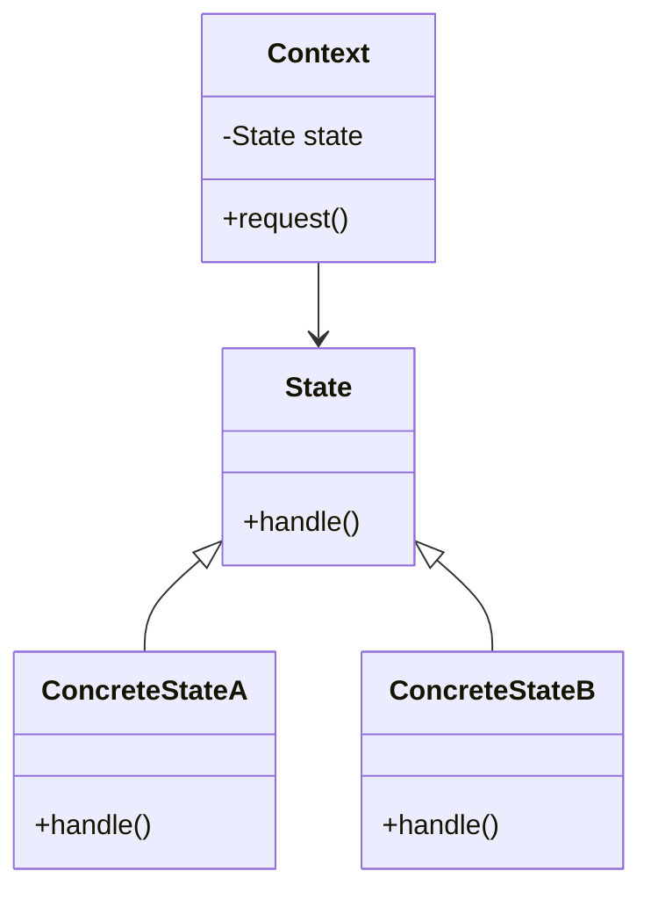
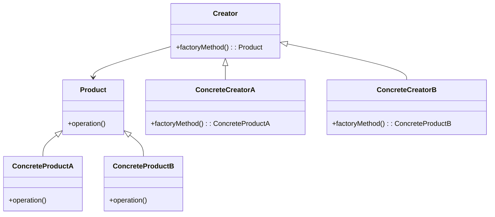
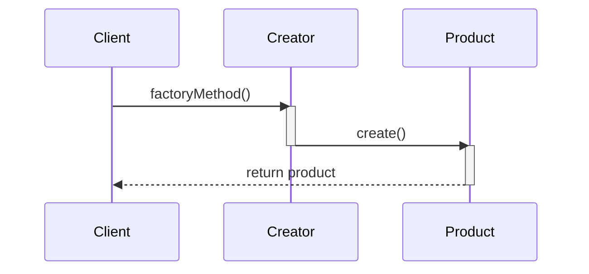

## 8.3. Documenting Patterns Effectively

In the realm of software development, design patterns serve as a crucial tool for solving recurring design problems. However, the mere existence of these patterns is not enough; they must be effectively documented to be useful. Proper documentation ensures that patterns are easily understood, correctly implemented, and consistently applied across projects. In this section, we will explore the art of documenting design patterns effectively, focusing on creating pattern templates and recording pattern usage and decisions.

### The Importance of Documenting Design Patterns

Before diving into the specifics of documentation, let's understand why documenting design patterns is essential:

1. **Facilitates Understanding**: Clear documentation helps developers understand the intent, structure, and applicability of a pattern, making it easier to implement correctly.
2. **Promotes Consistency**: Consistent documentation across projects ensures that patterns are applied uniformly, reducing the risk of errors and inconsistencies.
3. **Enhances Communication**: Well-documented patterns serve as a common language among developers, facilitating better communication and collaboration.
4. **Supports Maintenance**: Documentation provides a reference for future maintenance, helping developers understand the rationale behind design decisions.

### Creating Pattern Templates

A pattern template is a structured format for documenting design patterns. It provides a consistent way to capture the essential elements of a pattern, making it easier to understand and apply. Let's explore the key components of an effective pattern template.

#### 1. Pattern Name

The pattern name is the first and most crucial element of the template. It should be descriptive and convey the essence of the pattern. A well-chosen name makes it easier for developers to remember and refer to the pattern.

#### 2. Category

Categorize the pattern according to its type (Creational, Structural, or Behavioral). This helps developers quickly identify the pattern's purpose and applicability.

#### 3. Intent

Explain the intent of the pattern in a concise manner. What problem does it solve? What is its primary purpose? This section should provide a clear understanding of why the pattern exists.

#### 4. Motivation

Provide a scenario or example that illustrates the problem the pattern addresses. This helps developers relate to the pattern and understand its practical application.

#### 5. Applicability

Describe the situations where the pattern is applicable. Include specific conditions or criteria that make the pattern a suitable choice.

#### 6. Structure

Use diagrams to visually represent the pattern's structure. Class diagrams, sequence diagrams, or other visual aids can help clarify the relationships between components.



*Figure 1: Example of a State Pattern Structure*

#### 7. Participants

List and describe the key participants in the pattern. Include their roles and responsibilities within the pattern.

#### 8. Collaborations

Explain how the participants interact with each other. Describe the flow of control and data among the components.

#### 9. Consequences

Discuss the consequences of using the pattern. What are its benefits and trade-offs? This section should help developers weigh the pros and cons of applying the pattern.

#### 10. Implementation

Provide pseudocode examples to illustrate how the pattern can be implemented. Ensure the code is clear, well-commented, and adheres to pseudocode conventions.

```pseudocode
class Singleton
    private static instance: Singleton

    private Singleton()
        // Private constructor to prevent instantiation

    public static getInstance(): Singleton
        if instance is null then
            instance = new Singleton()
        return instance
```

*Listing 1: Pseudocode for Singleton Pattern Implementation*

#### 11. Sample Code Snippets

Include additional code snippets that demonstrate the pattern in action. Highlight key lines or sections to emphasize important points.

#### 12. Design Considerations

Provide notes on when to use the pattern and any important considerations or pitfalls. This section should guide developers in making informed decisions.

#### 13. Differences and Similarities

Note any patterns that are commonly confused with one another. Clarify distinctions and highlight similarities to prevent misunderstandings.

### Recording Pattern Usage and Decisions

Documenting the usage and decisions related to design patterns is equally important as documenting the patterns themselves. This practice ensures that the rationale behind design choices is preserved for future reference.

#### 1. Context and Problem Statement

Begin by documenting the context in which the pattern is being applied. Describe the specific problem or challenge that led to the decision to use the pattern.

#### 2. Pattern Selection Rationale

Explain why the chosen pattern was selected. What criteria were considered? Were there any alternative patterns that were considered but ultimately rejected?

#### 3. Implementation Details

Record the specific implementation details of the pattern. Include any modifications or adaptations made to suit the project's needs.

#### 4. Challenges and Solutions

Document any challenges encountered during the implementation of the pattern. How were these challenges addressed? What solutions were applied?

#### 5. Impact and Benefits

Describe the impact of the pattern on the project. What benefits were realized? How did the pattern contribute to the overall success of the project?

#### 6. Lessons Learned

Reflect on the experience of applying the pattern. What lessons were learned? What could be improved in future implementations?

### Visualizing Pattern Documentation

Visual aids play a crucial role in documenting design patterns. They enhance understanding by providing a clear, visual representation of complex concepts. Let's explore some common types of diagrams used in pattern documentation.

#### Class Diagrams

Class diagrams are used to represent the static structure of a pattern. They show the classes involved in the pattern and the relationships between them.



*Figure 2: Factory Method Pattern Class Diagram*

#### Sequence Diagrams

Sequence diagrams illustrate the dynamic behavior of a pattern. They show how objects interact over time, highlighting the sequence of messages exchanged.



*Figure 3: Factory Method Pattern Sequence Diagram*

#### Collaboration Diagrams

Collaboration diagrams, also known as communication diagrams, focus on the interactions between objects. They emphasize the roles of objects and the messages exchanged.

```mermaid
graph TD
    Client -->|factoryMethod()| Creator
    Creator -->|create()| Product
    Product -->|return product| Client
```

*Figure 4: Factory Method Pattern Collaboration Diagram*

### Best Practices for Documenting Patterns

To ensure effective documentation of design patterns, consider the following best practices:

1. **Be Consistent**: Use a consistent format and style for documenting patterns. This makes it easier for developers to navigate and understand the documentation.

2. **Use Clear Language**: Avoid jargon and technical terms that may not be familiar to all developers. Use simple, clear language to convey information.

3. **Provide Examples**: Include examples and scenarios to illustrate the pattern's application. This helps developers relate to the pattern and understand its practical use.

4. **Encourage Feedback**: Encourage developers to provide feedback on the documentation. This helps identify areas for improvement and ensures the documentation remains relevant and useful.

5. **Keep It Up-to-Date**: Regularly review and update the documentation to reflect any changes or improvements in the pattern's implementation.

### Try It Yourself

To reinforce your understanding of pattern documentation, try the following exercises:

1. **Create a Pattern Template**: Develop a template for documenting a design pattern of your choice. Include all the key components discussed in this section.

2. **Document a Pattern**: Choose a design pattern and document it using the template you created. Include diagrams and code examples to illustrate the pattern.

3. **Record Pattern Usage**: Apply a design pattern in a small project and document the usage and decisions. Reflect on the challenges encountered and the lessons learned.

### References and Further Reading

For more information on documenting design patterns, consider the following resources:

- [Design Patterns: Elements of Reusable Object-Oriented Software](https://en.wikipedia.org/wiki/Design_Patterns) by Erich Gamma, Richard Helm, Ralph Johnson, and John Vlissides
- [UML Distilled: A Brief Guide to the Standard Object Modeling Language](https://www.amazon.com/UML-Distilled-Standard-Modeling-Technology/dp/0321193687) by Martin Fowler
- [Head First Design Patterns](https://www.oreilly.com/library/view/head-first-design/0596007124/) by Eric Freeman and Elisabeth Robson

### Knowledge Check

Before we conclude, let's summarize the key takeaways from this section:

- Documenting design patterns is essential for understanding, consistency, communication, and maintenance.
- A pattern template provides a structured format for documenting the essential elements of a pattern.
- Recording pattern usage and decisions ensures that the rationale behind design choices is preserved.
- Visual aids, such as class diagrams and sequence diagrams, enhance understanding by providing a clear, visual representation of complex concepts.
- Consistency, clear language, examples, feedback, and regular updates are best practices for effective pattern documentation.

## Quiz Time!



### What is the primary purpose of documenting design patterns?

- [x] To facilitate understanding and ensure correct implementation
- [ ] To increase the complexity of the code
- [ ] To replace the need for code comments
- [ ] To make the code run faster

> **Explanation:** Documenting design patterns helps developers understand the intent, structure, and applicability of a pattern, making it easier to implement correctly.

### Which component of a pattern template provides a scenario illustrating the problem the pattern addresses?

- [ ] Intent
- [x] Motivation
- [ ] Applicability
- [ ] Participants

> **Explanation:** The Motivation section provides a scenario or example that illustrates the problem the pattern addresses.

### What is the role of class diagrams in pattern documentation?

- [x] To represent the static structure of a pattern
- [ ] To show the dynamic behavior of a pattern
- [ ] To illustrate the sequence of messages exchanged
- [ ] To replace code examples

> **Explanation:** Class diagrams are used to represent the static structure of a pattern, showing the classes involved and their relationships.

### Why is it important to record pattern usage and decisions?

- [x] To preserve the rationale behind design choices for future reference
- [ ] To increase the complexity of the documentation
- [ ] To replace the need for code comments
- [ ] To make the code run faster

> **Explanation:** Recording pattern usage and decisions ensures that the rationale behind design choices is preserved for future reference.

### Which best practice involves using simple, clear language to convey information?

- [ ] Be Consistent
- [x] Use Clear Language
- [ ] Provide Examples
- [ ] Encourage Feedback

> **Explanation:** Using clear language involves avoiding jargon and technical terms that may not be familiar to all developers, ensuring the information is easily understood.

### What is the purpose of the Consequences section in a pattern template?

- [x] To discuss the benefits and trade-offs of using the pattern
- [ ] To list and describe the key participants in the pattern
- [ ] To explain how the participants interact with each other
- [ ] To provide pseudocode examples

> **Explanation:** The Consequences section discusses the benefits and trade-offs of using the pattern, helping developers weigh the pros and cons.

### Which type of diagram focuses on the interactions between objects and the messages exchanged?

- [ ] Class Diagram
- [ ] Sequence Diagram
- [x] Collaboration Diagram
- [ ] Flowchart

> **Explanation:** Collaboration diagrams, also known as communication diagrams, focus on the interactions between objects and the messages exchanged.

### What should be included in the Implementation section of a pattern template?

- [ ] A list of the key participants
- [ ] A scenario illustrating the problem
- [x] Pseudocode examples
- [ ] A description of the pattern's intent

> **Explanation:** The Implementation section should include pseudocode examples to illustrate how the pattern can be implemented.

### Which best practice involves regularly reviewing and updating the documentation?

- [ ] Be Consistent
- [ ] Use Clear Language
- [ ] Provide Examples
- [x] Keep It Up-to-Date

> **Explanation:** Keeping the documentation up-to-date involves regularly reviewing and updating it to reflect any changes or improvements in the pattern's implementation.

### True or False: Visual aids, such as class diagrams and sequence diagrams, are optional in pattern documentation.

- [ ] True
- [x] False

> **Explanation:** Visual aids play a crucial role in documenting design patterns, enhancing understanding by providing a clear, visual representation of complex concepts.



Remember, effective documentation of design patterns is a skill that can greatly enhance your ability to communicate and collaborate with other developers. Keep practicing and refining your documentation techniques, and you'll find that your projects become more organized, consistent, and maintainable. Happy documenting!
