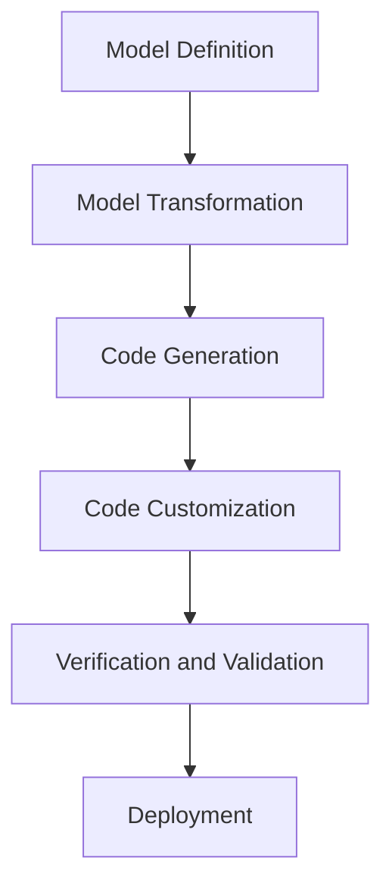

## 8.4. Model-Driven Development (MDD)

Model-Driven Development (MDD) is an advanced software development methodology that emphasizes the use of high-level models to drive the development process. It aims to increase productivity, improve communication among stakeholders, and ensure consistency across software projects. In this section, we will delve into the principles of MDD, explore how design patterns fit into MDD environments, and demonstrate how to generate code from models.

### Introduction to Model-Driven Development

Model-Driven Development is a paradigm shift from traditional coding practices. Instead of writing code directly, developers create models that represent the desired functionality and architecture of the software system. These models are then transformed into executable code through automated tools. Let's explore the core concepts of MDD.

#### Key Concepts of MDD

1. **Models as Primary Artifacts**: In MDD, models are the primary artifacts of the development process. They serve as the blueprint for the software system, capturing its structure, behavior, and interactions.

2. **Abstraction and Automation**: MDD abstracts the complexity of software development by allowing developers to focus on high-level models. Automated tools then generate the underlying code, reducing manual coding efforts.

3. **Platform Independence**: Models in MDD are often platform-independent, allowing them to be transformed into code for different platforms and technologies.

4. **Consistency and Reusability**: By using models, MDD ensures consistency across different parts of the software system. It also promotes reusability of models and patterns across projects.

5. **Separation of Concerns**: MDD separates the specification of the system from its implementation, enabling developers to focus on the "what" rather than the "how."

### Generating Code from Models

One of the most powerful aspects of MDD is the ability to generate code from models. This process involves several steps, from defining models to transforming them into executable code. Let's explore this process in detail.

#### Steps in Code Generation

1. **Model Definition**: The first step in code generation is defining the models that represent the software system. These models can be created using Unified Modeling Language (UML) or domain-specific languages (DSLs).

2. **Model Transformation**: Once the models are defined, they are transformed into intermediate representations that can be used for code generation. This transformation is often guided by transformation rules and patterns.

3. **Code Generation**: The transformed models are then used to generate code. This step involves mapping model elements to code constructs, such as classes, methods, and interfaces.

4. **Code Customization**: After code generation, developers may need to customize the generated code to meet specific requirements or integrate with existing systems.

5. **Verification and Validation**: The final step is verifying and validating the generated code to ensure it meets the desired functionality and quality standards.

#### Example of Code Generation

Let's consider an example where we generate code for a simple banking application using MDD principles.

```pseudocode
// Define a UML class model for a Bank Account
class BankAccount {
    attributes:
        - accountNumber: String
        - balance: Float
    operations:
        - deposit(amount: Float)
        - withdraw(amount: Float)
        - getBalance(): Float
}

// Transformation rules to generate code
rule BankAccountToCode {
    input: BankAccount
    output: JavaClass
    transformation:
        - map attributes to fields
        - map operations to methods
}

// Generated Java code
class BankAccount {
    private String accountNumber;
    private float balance;

    public void deposit(float amount) {
        balance += amount;
    }

    public void withdraw(float amount) {
        if (balance >= amount) {
            balance -= amount;
        }
    }

    public float getBalance() {
        return balance;
    }
}
```

In this example, we define a UML class model for a `BankAccount` and use transformation rules to generate Java code. The transformation rules map model attributes to fields and operations to methods.

### Patterns in MDD Environments

Design patterns play a crucial role in MDD environments by providing reusable solutions to common design problems. They enhance the expressiveness and flexibility of models, making it easier to generate high-quality code. Let's explore how patterns are utilized in MDD.

#### Incorporating Patterns into Models

1. **Pattern Templates**: Patterns can be represented as templates in models, capturing their structure and behavior. These templates can be instantiated and customized for specific use cases.

2. **Pattern Libraries**: MDD tools often include libraries of predefined patterns that developers can use to enhance their models. These libraries provide a rich set of patterns for different domains and technologies.

3. **Pattern Composition**: Patterns can be composed to create complex models that address multiple design concerns. This composition allows developers to build sophisticated systems by combining simple patterns.

4. **Pattern Transformation**: Patterns can guide the transformation process by providing transformation rules and mappings. This ensures that the generated code adheres to best practices and design principles.

#### Example of Using Patterns in MDD

Consider a scenario where we use the Singleton pattern in an MDD environment to manage a database connection.

```pseudocode
// Define a UML class model for a Database Connection
class DatabaseConnection {
    attributes:
        - instance: DatabaseConnection
    operations:
        - getInstance(): DatabaseConnection
}

// Singleton pattern template
pattern Singleton {
    context: DatabaseConnection
    structure:
        - private static instance
        - private constructor
        - public static getInstance method
}

// Transformation rules to generate code
rule SingletonToCode {
    input: DatabaseConnection
    output: JavaClass
    transformation:
        - apply Singleton pattern
}

// Generated Java code
class DatabaseConnection {
    private static DatabaseConnection instance;

    private DatabaseConnection() {
        // private constructor
    }

    public static DatabaseConnection getInstance() {
        if (instance == null) {
            instance = new DatabaseConnection();
        }
        return instance;
    }
}
```

In this example, we define a UML class model for a `DatabaseConnection` and apply the Singleton pattern template. The transformation rules generate Java code that adheres to the Singleton pattern.

### Benefits of MDD

Model-Driven Development offers several benefits that make it an attractive approach for modern software development.

1. **Increased Productivity**: By automating code generation, MDD reduces manual coding efforts and accelerates the development process.

2. **Improved Quality**: MDD ensures consistency and adherence to design principles, resulting in high-quality code.

3. **Enhanced Collaboration**: Models serve as a common language for stakeholders, improving communication and collaboration.

4. **Flexibility and Adaptability**: MDD allows developers to adapt models to changing requirements and generate code for different platforms.

5. **Reduced Complexity**: By abstracting the complexity of software development, MDD simplifies the development process and reduces the risk of errors.

### Challenges and Considerations

While MDD offers numerous benefits, it also presents challenges that developers must consider.

1. **Tooling and Integration**: Selecting the right tools and integrating them into existing workflows can be challenging.

2. **Model Complexity**: As models grow in complexity, managing and maintaining them can become difficult.

3. **Learning Curve**: MDD requires a shift in mindset and skills, which can be a barrier for some developers.

4. **Customization and Flexibility**: While MDD automates code generation, developers may still need to customize the generated code to meet specific requirements.

5. **Scalability**: Ensuring that MDD processes scale effectively for large and complex projects is a key consideration.

### Visualizing MDD Processes

To enhance understanding, let's visualize the MDD process using a flowchart.



This flowchart illustrates the key steps in the MDD process, from model definition to deployment.

### Tools for Model-Driven Development

Several tools support MDD by providing modeling, transformation, and code generation capabilities. Let's explore some popular tools.

1. **Eclipse Modeling Framework (EMF)**: EMF is a powerful framework for building model-driven applications. It provides tools for defining models, generating code, and managing model transformations.

2. **IBM Rational Software Architect**: This tool offers comprehensive support for MDD, including model creation, transformation, and code generation.

3. **Enterprise Architect**: A popular modeling tool that supports UML and MDD, providing features for model-driven development and code generation.

4. **Visual Paradigm**: A versatile modeling tool that supports MDD and offers features for model transformation and code generation.

5. **MagicDraw**: A modeling tool that supports UML and MDD, providing capabilities for model-driven development and code generation.

### Best Practices for MDD

To maximize the benefits of MDD, developers should follow best practices that ensure successful implementation.

1. **Define Clear Models**: Ensure that models are well-defined, accurate, and capture the desired functionality and architecture.

2. **Use Patterns Wisely**: Leverage design patterns to enhance models and ensure consistency and quality in generated code.

3. **Automate Transformation**: Use automated tools to transform models into code, reducing manual efforts and minimizing errors.

4. **Validate Models**: Regularly validate models to ensure they meet requirements and are free of errors.

5. **Iterate and Refine**: Continuously iterate and refine models and transformation processes to adapt to changing requirements and improve quality.

### Conclusion

Model-Driven Development is a powerful approach that leverages high-level models to drive the software development process. By generating code from models and incorporating design patterns, MDD enhances productivity, quality, and collaboration. While it presents challenges, following best practices and leveraging the right tools can ensure successful implementation. As we continue to explore the world of object-oriented design patterns, MDD offers a promising path for building robust and scalable software systems.

### Embrace the Journey

Remember, this is just the beginning. As you progress in your journey with MDD, you'll discover new ways to leverage models and patterns to create innovative and high-quality software solutions. Keep experimenting, stay curious, and enjoy the journey!

## Quiz Time!



### What is the primary artifact in Model-Driven Development (MDD)?

- [x] Models
- [ ] Code
- [ ] Documentation
- [ ] Test Cases

> **Explanation:** In MDD, models are the primary artifacts that drive the development process.

### Which of the following is a benefit of MDD?

- [x] Increased Productivity
- [ ] Increased Complexity
- [ ] Decreased Flexibility
- [ ] Decreased Collaboration

> **Explanation:** MDD increases productivity by automating code generation and reducing manual coding efforts.

### What is the first step in the code generation process in MDD?

- [x] Model Definition
- [ ] Code Customization
- [ ] Model Transformation
- [ ] Verification and Validation

> **Explanation:** The first step in the code generation process is defining the models that represent the software system.

### Which tool is known for supporting Model-Driven Development?

- [x] Eclipse Modeling Framework (EMF)
- [ ] Microsoft Word
- [ ] Adobe Photoshop
- [ ] Google Sheets

> **Explanation:** EMF is a powerful framework for building model-driven applications, providing tools for defining models and generating code.

### In MDD, what does the transformation process involve?

- [x] Converting models into intermediate representations for code generation
- [ ] Writing code manually
- [ ] Creating documentation
- [ ] Testing the software

> **Explanation:** The transformation process involves converting models into intermediate representations that can be used for code generation.

### What is one challenge of MDD?

- [x] Tooling and Integration
- [ ] Increased Manual Coding
- [ ] Decreased Productivity
- [ ] Lack of Automation

> **Explanation:** Selecting the right tools and integrating them into existing workflows can be challenging in MDD.

### Which design pattern is used in the example for managing a database connection?

- [x] Singleton Pattern
- [ ] Factory Pattern
- [ ] Observer Pattern
- [ ] Strategy Pattern

> **Explanation:** The Singleton pattern is used in the example to manage a database connection.

### What is a key consideration when using MDD for large projects?

- [x] Scalability
- [ ] Decreased Complexity
- [ ] Increased Manual Coding
- [ ] Lack of Patterns

> **Explanation:** Ensuring that MDD processes scale effectively for large and complex projects is a key consideration.

### Which of the following is a best practice for MDD?

- [x] Define Clear Models
- [ ] Avoid Using Patterns
- [ ] Increase Manual Coding
- [ ] Decrease Automation

> **Explanation:** Defining clear models ensures they are well-defined, accurate, and capture the desired functionality and architecture.

### True or False: MDD allows developers to focus on the "how" rather than the "what."

- [ ] True
- [x] False

> **Explanation:** MDD allows developers to focus on the "what" rather than the "how," by separating the specification of the system from its implementation.


