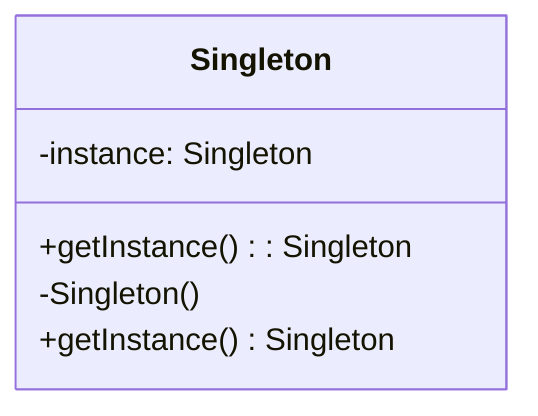
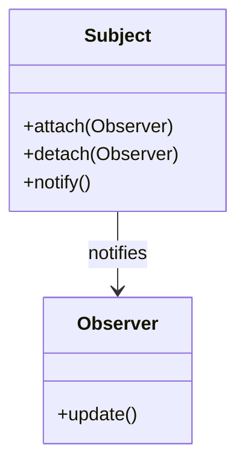

## 9.1. Recap of Key Concepts

As we conclude our journey through the world of object-oriented design patterns, it's essential to reflect on the key concepts and learning outcomes that have been covered. This recap will serve as a comprehensive summary, reinforcing the foundational principles and practical applications of design patterns in object-oriented programming (OOP). 

### Summarizing the Main Points

#### Introduction to Object-Oriented Design Patterns

We began by exploring the essence of design patterns, which are reusable solutions to common software design problems. These patterns provide a shared language for developers, facilitating communication and collaboration. The history of design patterns was highlighted, emphasizing the impact of the Gang of Four (GoF) and their seminal work, "Design Patterns: Elements of Reusable Object-Oriented Software."

#### Importance of Design Patterns in OOP

Design patterns play a crucial role in enhancing code reusability, maintainability, and scalability. They offer a structured approach to solving design challenges, promoting best practices and reducing the likelihood of errors. By using design patterns, developers can create software that is easier to understand, modify, and extend.

#### Fundamentals of Object-Oriented Design

We delved into the SOLID principles, which form the backbone of good object-oriented design. These principles—Single Responsibility, Open/Closed, Liskov Substitution, Interface Segregation, and Dependency Inversion—guide developers in creating robust and flexible systems. Additionally, we discussed best practices such as DRY (Don't Repeat Yourself), KISS (Keep It Simple, Stupid), and YAGNI (You Aren't Gonna Need It), which help maintain clean and efficient codebases.

#### Creational Design Patterns

Creational patterns focus on object creation mechanisms, ensuring that objects are created in a manner suitable for the situation. Key patterns include:

- **Singleton Pattern**: Ensures a class has only one instance and provides a global access point to it. This pattern is useful in scenarios where a single instance is required to coordinate actions across a system.

- **Factory Method Pattern**: Defines an interface for creating objects but allows subclasses to alter the type of objects that will be created. This pattern is beneficial for promoting flexibility and extensibility in object creation.

- **Abstract Factory Pattern**: Provides an interface for creating families of related or dependent objects without specifying their concrete classes. It is ideal for ensuring consistency among products.

- **Builder Pattern**: Separates the construction of a complex object from its representation, allowing the same construction process to create different representations. This pattern improves code readability and manages complex object creation.

- **Prototype Pattern**: Creates new objects by copying an existing object, known as the prototype. This pattern is efficient for cloning objects and managing object state.

#### Structural Design Patterns

Structural patterns deal with object composition, ensuring that if one part of a system changes, the entire system doesn't need to change. Key patterns include:

- **Adapter Pattern**: Converts the interface of a class into another interface that clients expect. This pattern is useful for integrating legacy systems with new components.

- **Bridge Pattern**: Decouples an abstraction from its implementation, allowing them to vary independently. This pattern enhances extensibility and simplifies complex systems.

- **Composite Pattern**: Composes objects into tree structures to represent part-whole hierarchies, enabling clients to treat individual objects and compositions uniformly.

- **Decorator Pattern**: Attaches additional responsibilities to an object dynamically, providing a flexible alternative to subclassing for extending functionality.

- **Facade Pattern**: Provides a unified interface to a set of interfaces in a subsystem, simplifying client interactions and reducing dependencies.

- **Flyweight Pattern**: Uses sharing to support large numbers of fine-grained objects efficiently, optimizing memory usage and performance.

- **Proxy Pattern**: Provides a placeholder for another object to control access to it, useful for implementing lazy loading, access control, and logging.

#### Behavioral Design Patterns

Behavioral patterns focus on communication between objects, ensuring that they can interact in a flexible and dynamic manner. Key patterns include:

- **Chain of Responsibility Pattern**: Avoids coupling the sender of a request to its receiver by giving more than one object a chance to handle the request.

- **Command Pattern**: Encapsulates a request as an object, allowing parameterization of clients with queues, requests, and operations.

- **Interpreter Pattern**: Defines a representation for a language and an interpreter to process its sentences, useful for designing grammars for simple languages.

- **Iterator Pattern**: Provides a way to access elements of an aggregate object sequentially without exposing its underlying representation.

- **Mediator Pattern**: Defines an object that encapsulates how a set of objects interact, reducing coupling among components.

- **Memento Pattern**: Captures and externalizes an object's internal state without violating encapsulation, allowing the state to be restored later.

- **Observer Pattern**: Defines a one-to-many dependency between objects, promoting loose coupling and allowing changes in one object to be automatically reflected in others.

- **State Pattern**: Allows an object to alter its behavior when its internal state changes, simplifying complex conditionals and state transitions.

- **Strategy Pattern**: Defines a family of algorithms, encapsulating each one and making them interchangeable, enhancing flexibility and reusability.

- **Template Method Pattern**: Defines the skeleton of an algorithm in an operation, deferring some steps to subclasses, promoting code reuse and consistency.

- **Visitor Pattern**: Represents an operation to be performed on elements of an object structure, allowing new operations to be added without modifying the elements.

### Reflecting on Learning Outcomes

Reflecting on the journey through object-oriented design patterns, we have gained a comprehensive understanding of how these patterns solve common design problems and enhance software development. By mastering these patterns, developers can create robust, scalable, and maintainable software systems.

#### Key Takeaways

- **Understanding Design Patterns**: We have learned the importance of design patterns in providing reusable solutions to common problems, promoting best practices, and facilitating communication among developers.

- **Applying SOLID Principles**: The SOLID principles have been emphasized as foundational guidelines for creating flexible and maintainable object-oriented systems.

- **Implementing Creational Patterns**: We have explored various creational patterns that focus on object creation mechanisms, ensuring that objects are created in a manner suitable for the situation.

- **Utilizing Structural Patterns**: Structural patterns have been highlighted for their role in object composition, ensuring that changes in one part of a system do not necessitate changes in the entire system.

- **Leveraging Behavioral Patterns**: Behavioral patterns have been discussed for their focus on communication between objects, ensuring flexible and dynamic interactions.

- **Enhancing Software Development**: By applying design patterns, developers can create software that is easier to understand, modify, and extend, ultimately leading to more efficient and effective software development processes.

#### Encouragement for Continuous Practice

As we conclude this guide, it's important to remember that mastering design patterns is an ongoing journey. Continuous practice, experimentation, and learning are key to becoming proficient in applying these patterns to real-world scenarios. Embrace the challenges, stay curious, and enjoy the journey of software development.

### Try It Yourself

To reinforce your understanding of design patterns, try modifying the pseudocode examples provided throughout this guide. Experiment with different patterns, combine them, and explore their interactions. This hands-on approach will deepen your understanding and enhance your ability to apply design patterns effectively.

### Visualizing Design Patterns

To aid in understanding the relationships and interactions between different design patterns, let's visualize some of the key concepts using Mermaid.js diagrams.

#### Visualizing the Singleton Pattern

*Diagram 1: The Singleton Pattern ensures a class has only one instance and provides a global access point to it.*

#### Visualizing the Observer Pattern

*Diagram 2: The Observer Pattern defines a one-to-many dependency between objects, allowing changes in one object to be automatically reflected in others.*

### References and Links

For further reading and deeper dives into the topics covered in this guide, consider exploring the following resources:

- [Design Patterns: Elements of Reusable Object-Oriented Software](https://en.wikipedia.org/wiki/Design_Patterns) by the Gang of Four
- [SOLID Principles](https://en.wikipedia.org/wiki/SOLID) on Wikipedia
- [UML Diagrams](https://www.uml-diagrams.org/) for visualizing design patterns

### Knowledge Check

To test your understanding of the key concepts covered in this guide, try answering the following questions:

## Quiz Time!



### What is the primary purpose of design patterns in software development?

- [x] To provide reusable solutions to common design problems
- [ ] To replace the need for software testing
- [ ] To eliminate the need for documentation
- [ ] To automate code generation

> **Explanation:** Design patterns offer reusable solutions to common design problems, promoting best practices and facilitating communication among developers.

### Which principle is NOT part of the SOLID principles?

- [ ] Single Responsibility Principle
- [ ] Open/Closed Principle
- [x] Principle of Least Astonishment
- [ ] Dependency Inversion Principle

> **Explanation:** The Principle of Least Astonishment is not part of the SOLID principles. The SOLID principles include Single Responsibility, Open/Closed, Liskov Substitution, Interface Segregation, and Dependency Inversion.

### What is the main advantage of using the Factory Method Pattern?

- [x] It promotes flexibility and extensibility in object creation
- [ ] It ensures a class has only one instance
- [ ] It provides a unified interface to a set of interfaces
- [ ] It allows an object to alter its behavior when its state changes

> **Explanation:** The Factory Method Pattern defines an interface for creating objects but allows subclasses to alter the type of objects that will be created, promoting flexibility and extensibility.

### In which pattern is the concept of "decoupling an abstraction from its implementation" central?

- [ ] Singleton Pattern
- [ ] Observer Pattern
- [x] Bridge Pattern
- [ ] Memento Pattern

> **Explanation:** The Bridge Pattern is centered around decoupling an abstraction from its implementation, allowing them to vary independently.

### Which pattern is used to define a one-to-many dependency between objects?

- [ ] Singleton Pattern
- [x] Observer Pattern
- [ ] Factory Method Pattern
- [ ] Strategy Pattern

> **Explanation:** The Observer Pattern defines a one-to-many dependency between objects, allowing changes in one object to be automatically reflected in others.

### What is the main purpose of the Memento Pattern?

- [ ] To encapsulate a request as an object
- [ ] To provide a way to access elements of an aggregate object sequentially
- [x] To capture and externalize an object's internal state
- [ ] To define an object that encapsulates how a set of objects interact

> **Explanation:** The Memento Pattern captures and externalizes an object's internal state without violating encapsulation, allowing the state to be restored later.

### Which pattern provides a flexible alternative to subclassing for extending functionality?

- [ ] Singleton Pattern
- [ ] Factory Method Pattern
- [x] Decorator Pattern
- [ ] State Pattern

> **Explanation:** The Decorator Pattern attaches additional responsibilities to an object dynamically, providing a flexible alternative to subclassing for extending functionality.

### What is the primary focus of behavioral design patterns?

- [ ] Object creation mechanisms
- [ ] Object composition
- [x] Communication between objects
- [ ] Memory optimization

> **Explanation:** Behavioral design patterns focus on communication between objects, ensuring flexible and dynamic interactions.

### Which pattern is used to represent an operation to be performed on elements of an object structure?

- [ ] Singleton Pattern
- [ ] Observer Pattern
- [ ] Factory Method Pattern
- [x] Visitor Pattern

> **Explanation:** The Visitor Pattern represents an operation to be performed on elements of an object structure, allowing new operations to be added without modifying the elements.

### True or False: The Flyweight Pattern is used to provide a placeholder for another object to control access to it.

- [ ] True
- [x] False

> **Explanation:** False. The Flyweight Pattern uses sharing to support large numbers of fine-grained objects efficiently. The Proxy Pattern provides a placeholder for another object to control access to it.



By reflecting on these key concepts and engaging with the quiz, you can reinforce your understanding of object-oriented design patterns and their practical applications. Remember, this is just the beginning of your journey in mastering design patterns. Keep exploring, experimenting, and applying these concepts to real-world scenarios to become a proficient software developer.
