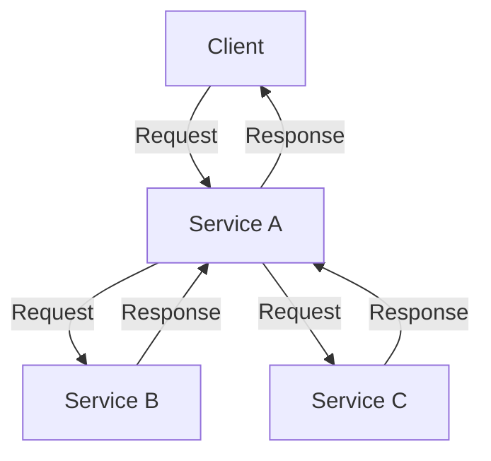
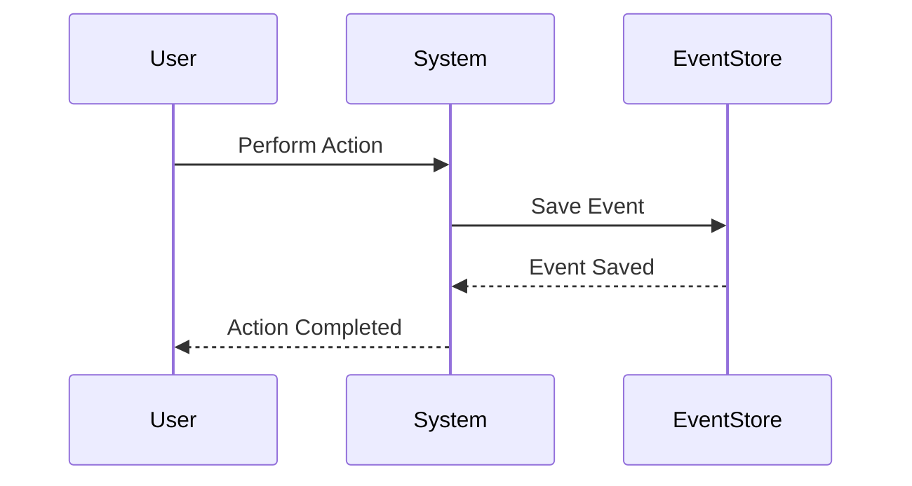

## 9.2. The Future of Design Patterns in OOP

As we delve into the future of design patterns in object-oriented programming (OOP), it's crucial to recognize how these patterns are evolving to meet the demands of modern software development. Design patterns, once formalized by the Gang of Four, have become foundational tools for developers. However, with the rapid pace of technological advancement, these patterns are not static; they are adapting and expanding to address new challenges and opportunities.

### Emerging Trends and New Patterns

#### 1. Microservices and Cloud-Native Patterns

The shift towards microservices architecture and cloud-native applications has introduced new design patterns that emphasize scalability, resilience, and flexibility. Traditional OOP patterns are being reimagined to fit into these distributed systems.

- **Service Mesh Patterns**: As microservices proliferate, managing communication between them becomes complex. Service mesh patterns, such as sidecar and ambassador, are emerging to handle cross-cutting concerns like service discovery, load balancing, and security.

- **Circuit Breaker Pattern**: This pattern is gaining traction in cloud-native environments to prevent cascading failures by detecting failures and preventing requests from being sent to failing services.

- **Saga Pattern**: In distributed systems, managing transactions across multiple services is challenging. The Saga pattern provides a way to manage long-running transactions by breaking them into smaller, manageable steps.

#### 2. Reactive Programming and Event-Driven Architectures

The rise of reactive programming and event-driven architectures is influencing the development of new patterns that focus on responsiveness, resilience, and elasticity.

- **Event Sourcing**: This pattern involves storing the state of a system as a sequence of events. It allows for more flexible data retrieval and can be particularly useful in systems where audit trails are essential.

- **CQRS (Command Query Responsibility Segregation)**: This pattern separates read and write operations to optimize performance and scalability. It is often used in conjunction with event sourcing.

- **Backpressure Handling**: In reactive systems, managing the flow of data is critical. Patterns for handling backpressure ensure that systems remain responsive under varying loads.

#### 3. Artificial Intelligence and Machine Learning

AI and machine learning are transforming software development, and design patterns are evolving to support these technologies.

- **Model-View-Controller (MVC) for Machine Learning**: Adapting the MVC pattern for machine learning involves separating the model training, data preprocessing, and prediction logic to improve maintainability and scalability.

- **Pipeline Patterns**: These patterns are used to manage the flow of data through various stages of a machine learning workflow, from data ingestion to model deployment.

- **Feature Store Patterns**: As feature engineering becomes more complex, patterns for managing and reusing features across different models are emerging.

#### 4. Internet of Things (IoT)

The proliferation of IoT devices is driving the need for patterns that address connectivity, data processing, and device management.

- **Gateway Pattern**: This pattern is used to manage communication between IoT devices and cloud services, providing a centralized point for data aggregation and processing.

- **Edge Computing Patterns**: With the need to process data closer to the source, patterns for edge computing are emerging to handle data processing and decision-making at the edge of the network.

- **Digital Twin Patterns**: These patterns involve creating a digital replica of a physical device or system, allowing for simulation, monitoring, and optimization.

### Adapting to Technological Advances

#### 1. Integration with Modern Development Practices

As development practices evolve, design patterns are being integrated into methodologies like DevOps, Agile, and Continuous Integration/Continuous Deployment (CI/CD).

- **Infrastructure as Code (IaC) Patterns**: These patterns are emerging to manage infrastructure configuration and deployment using code, enabling version control and automation.

- **DevOps Patterns**: Patterns for integrating development and operations processes are becoming essential for achieving faster delivery and improved collaboration.

- **Agile Patterns**: Agile methodologies are influencing the development of patterns that emphasize iterative development, collaboration, and adaptability.

#### 2. Embracing New Programming Paradigms

While OOP remains a dominant paradigm, new programming paradigms are influencing the evolution of design patterns.

- **Functional Programming Patterns**: As functional programming gains popularity, patterns that emphasize immutability, higher-order functions, and pure functions are being integrated into OOP.

- **Aspect-Oriented Programming (AOP) Patterns**: AOP patterns are being used to separate cross-cutting concerns, such as logging and security, from business logic.

- **Metaprogramming Patterns**: These patterns involve writing code that generates or manipulates other code, allowing for more dynamic and flexible software design.

#### 3. Enhancing Security and Privacy

With increasing concerns about security and privacy, design patterns are evolving to address these issues.

- **Zero Trust Patterns**: These patterns emphasize verifying every request, regardless of its origin, to enhance security in distributed systems.

- **Privacy by Design Patterns**: Patterns that incorporate privacy considerations into the design process are becoming essential for compliance with regulations like GDPR.

- **Secure Coding Patterns**: These patterns focus on preventing common vulnerabilities, such as SQL injection and cross-site scripting, by promoting secure coding practices.

### Code Examples and Visualizations

To illustrate these emerging trends and adaptations, let's explore some pseudocode examples and visualizations.

#### Example 1: Circuit Breaker Pattern

The Circuit Breaker pattern is crucial for maintaining system stability in microservices architectures.

```pseudocode
class CircuitBreaker:
    state = "CLOSED"
    failure_count = 0
    failure_threshold = 3
    timeout = 60

    def call_service(self, service):
        if self.state == "OPEN":
            if self.timeout_expired():
                self.state = "HALF-OPEN"
            else:
                raise Exception("Circuit is open")

        try:
            response = service.call()
            self.reset()
            return response
        except Exception as e:
            self.record_failure()
            if self.failure_count >= self.failure_threshold:
                self.state = "OPEN"
            raise e

    def reset(self):
        self.state = "CLOSED"
        self.failure_count = 0

    def record_failure(self):
        self.failure_count += 1

    def timeout_expired(self):
        # Check if timeout has expired
        return True
```

In this pseudocode, the Circuit Breaker pattern is implemented to prevent calls to a failing service, enhancing system resilience.

#### Example 2: Event Sourcing Pattern

Event Sourcing is a pattern used in event-driven architectures to store the state of a system as a sequence of events.

```pseudocode
class EventStore:
    events = []

    def save_event(self, event):
        self.events.append(event)

    def get_events(self):
        return self.events

class Account:
    balance = 0

    def apply_event(self, event):
        if event.type == "DEPOSIT":
            self.balance += event.amount
        elif event.type == "WITHDRAW":
            self.balance -= event.amount

    def deposit(self, amount):
        event = {"type": "DEPOSIT", "amount": amount}
        EventStore().save_event(event)
        self.apply_event(event)

    def withdraw(self, amount):
        event = {"type": "WITHDRAW", "amount": amount}
        EventStore().save_event(event)
        self.apply_event(event)
```

This pseudocode demonstrates how Event Sourcing can be used to manage the state of an account by storing and applying events.

### Visualizing Emerging Patterns

#### Diagram 1: Microservices Communication with Service Mesh



This diagram illustrates how a service mesh manages communication between microservices, providing a unified interface for requests and responses.

#### Diagram 2: Event Sourcing Workflow



This sequence diagram shows the workflow of Event Sourcing, where user actions are stored as events in an Event Store.

### References and Further Reading

For those interested in exploring these emerging trends and patterns further, consider the following resources:

- [Microservices Patterns](https://microservices.io/patterns/index.html) by Chris Richardson
- [Reactive Programming](https://www.reactivemanifesto.org/) - The Reactive Manifesto
- [Event Sourcing](https://martinfowler.com/eaaDev/EventSourcing.html) by Martin Fowler
- [AI and Machine Learning Patterns](https://mlpatterns.com/) - Machine Learning Patterns

### Knowledge Check

To reinforce your understanding of the future of design patterns in OOP, consider the following questions and exercises:

- How do microservices and cloud-native patterns differ from traditional OOP patterns?
- What are the benefits of using the Circuit Breaker pattern in a distributed system?
- How can Event Sourcing improve data retrieval and auditability in a system?
- Experiment with the provided pseudocode examples by modifying the Circuit Breaker pattern to include a fallback mechanism.

### Embrace the Journey

As we explore the future of design patterns in OOP, remember that this is just the beginning. The landscape of software development is constantly evolving, and design patterns will continue to adapt to new challenges and opportunities. Keep experimenting, stay curious, and enjoy the journey!

## Quiz Time!



### Which pattern is commonly used in microservices to manage communication between services?

- [ ] Singleton Pattern
- [x] Service Mesh Pattern
- [ ] Observer Pattern
- [ ] Factory Method Pattern

> **Explanation:** The Service Mesh pattern is used in microservices to manage communication between services, handling concerns like service discovery and load balancing.


### What is the primary goal of the Circuit Breaker pattern?

- [x] Prevent cascading failures in a system
- [ ] Enhance user interface design
- [ ] Manage database transactions
- [ ] Optimize memory usage

> **Explanation:** The Circuit Breaker pattern is designed to prevent cascading failures by detecting failures and stopping requests to failing services.


### How does Event Sourcing store the state of a system?

- [ ] As a single snapshot
- [ ] In a relational database
- [x] As a sequence of events
- [ ] In a cache

> **Explanation:** Event Sourcing stores the state of a system as a sequence of events, allowing for flexible data retrieval and auditability.


### Which pattern is often used in conjunction with Event Sourcing to optimize performance?

- [ ] Singleton Pattern
- [ ] Factory Method Pattern
- [x] CQRS Pattern
- [ ] Observer Pattern

> **Explanation:** The CQRS (Command Query Responsibility Segregation) pattern is often used with Event Sourcing to separate read and write operations, optimizing performance.


### What is a key benefit of using the Saga pattern in distributed systems?

- [x] Managing long-running transactions
- [ ] Enhancing user interface design
- [ ] Optimizing memory usage
- [ ] Improving code readability

> **Explanation:** The Saga pattern is used in distributed systems to manage long-running transactions by breaking them into smaller, manageable steps.


### How do microservices and cloud-native patterns differ from traditional OOP patterns?

- [x] They emphasize scalability and resilience
- [ ] They focus on single-threaded execution
- [ ] They prioritize memory usage
- [ ] They are only applicable to desktop applications

> **Explanation:** Microservices and cloud-native patterns emphasize scalability, resilience, and flexibility, adapting traditional OOP patterns to distributed systems.


### What is a common use case for the Gateway pattern in IoT?

- [ ] Enhancing user interface design
- [ ] Managing database transactions
- [x] Managing communication between IoT devices and cloud services
- [ ] Optimizing memory usage

> **Explanation:** The Gateway pattern is used in IoT to manage communication between devices and cloud services, providing a centralized point for data processing.


### Which pattern is used to handle data processing at the edge of a network in IoT?

- [ ] Singleton Pattern
- [ ] Factory Method Pattern
- [ ] Observer Pattern
- [x] Edge Computing Pattern

> **Explanation:** Edge Computing patterns are used to handle data processing and decision-making at the edge of the network in IoT systems.


### What is the primary focus of Privacy by Design patterns?

- [ ] Enhancing user interface design
- [x] Incorporating privacy considerations into the design process
- [ ] Optimizing memory usage
- [ ] Managing database transactions

> **Explanation:** Privacy by Design patterns focus on incorporating privacy considerations into the design process, ensuring compliance with regulations like GDPR.


### True or False: Functional programming patterns are being integrated into OOP to emphasize immutability and higher-order functions.

- [x] True
- [ ] False

> **Explanation:** Functional programming patterns, which emphasize immutability and higher-order functions, are being integrated into OOP as new paradigms influence design patterns.


