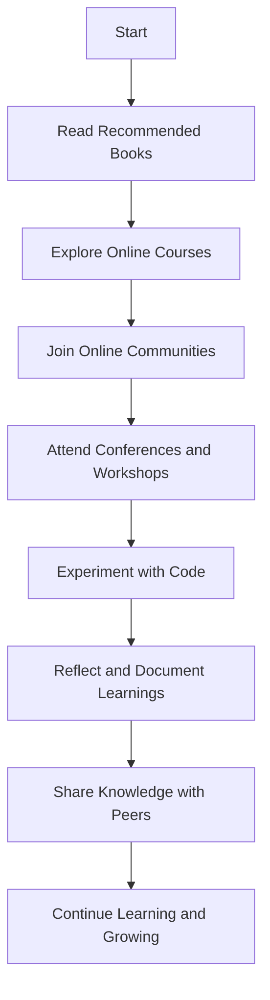

## 9.3. Continuing Education and Resources

As we reach the conclusion of our journey through object-oriented design patterns, it's essential to recognize that learning is an ongoing process. The world of software development is ever-evolving, and staying updated with the latest trends, tools, and best practices is crucial for maintaining a competitive edge. In this section, we will explore various avenues for continuing education and resources that can help you deepen your understanding of design patterns and enhance your skills as a software developer.

### Recommended Books and Articles

Books and articles are foundational resources for gaining in-depth knowledge and insights into design patterns. Here, we recommend some of the most influential and insightful publications that can serve as valuable references throughout your career.

#### Books

1. **"Design Patterns: Elements of Reusable Object-Oriented Software" by Erich Gamma, Richard Helm, Ralph Johnson, and John Vlissides (Gang of Four)**
   - This seminal book is a must-read for anyone interested in design patterns. It provides a comprehensive catalog of 23 classic design patterns, complete with detailed explanations, examples, and UML diagrams.

2. **"Head First Design Patterns" by Eric Freeman and Elisabeth Robson**
   - Known for its engaging and visually rich format, this book offers a fun and interactive approach to learning design patterns. It includes practical examples and exercises to reinforce understanding.

3. **"Patterns of Enterprise Application Architecture" by Martin Fowler**
   - This book focuses on design patterns specifically for enterprise applications. It covers architectural patterns and provides insights into building scalable and maintainable software systems.

4. **"Refactoring: Improving the Design of Existing Code" by Martin Fowler**
   - While not exclusively about design patterns, this book emphasizes the importance of refactoring and how design patterns can be applied to improve code quality and maintainability.

5. **"Domain-Driven Design: Tackling Complexity in the Heart of Software" by Eric Evans**
   - This book introduces the concept of domain-driven design (DDD) and explores how design patterns can be used to model complex domains effectively.

#### Articles

1. **"Design Patterns: A Summary" by James W. Cooper**
   - This article provides a concise overview of the key design patterns, making it an excellent quick reference for developers.

2. **"The Factory Pattern: A Comprehensive Guide" by Mark Seemann**
   - A detailed exploration of the Factory pattern, including its variations and practical applications.

3. **"Understanding the Observer Pattern" by Misko Hevery**
   - This article delves into the Observer pattern, explaining its use cases and benefits in building responsive and decoupled systems.

4. **"The Strategy Pattern: A Deep Dive" by Robert C. Martin**
   - An in-depth analysis of the Strategy pattern, with examples and discussions on when and how to apply it effectively.

5. **"Design Patterns in Modern Programming Languages" by Kevlin Henney**
   - This article examines how design patterns are implemented and adapted in contemporary programming languages, highlighting language-specific nuances.

### Online Courses and Communities

Online courses and communities provide interactive and collaborative learning experiences. They offer opportunities to engage with experts, participate in discussions, and gain practical skills through hands-on projects.

#### Online Courses

1. **Coursera: "Design Patterns" by University of Alberta**
   - This course covers the fundamentals of design patterns, including creational, structural, and behavioral patterns. It includes video lectures, quizzes, and programming assignments.

2. **Udemy: "Java Design Patterns and Architecture"**
   - Focused on Java, this course explores design patterns and architectural principles. It includes real-world examples and coding exercises to reinforce learning.

3. **Pluralsight: "Design Patterns Library"**
   - A comprehensive library of courses on design patterns, covering various languages and frameworks. It offers in-depth tutorials and practical examples.

4. **edX: "Software Design and Architecture" by University of British Columbia**
   - This course provides an overview of software design principles and patterns, with a focus on architectural styles and best practices.

5. **LinkedIn Learning: "Design Patterns in C#"**
   - A course tailored for C# developers, exploring design patterns and their implementation in the .NET framework.

#### Online Communities

1. **Stack Overflow**
   - A popular platform for developers to ask questions, share knowledge, and collaborate on coding challenges. It's an excellent resource for getting help with design pattern-related queries.

2. **Reddit: r/SoftwareEngineering**
   - A community of software engineers discussing various topics, including design patterns, best practices, and industry trends.

3. **GitHub**
   - A platform for hosting and collaborating on open-source projects. Explore repositories related to design patterns and contribute to community-driven initiatives.

4. **Design Patterns Community on LinkedIn**
   - A professional network for connecting with other developers interested in design patterns. Participate in discussions, share insights, and stay updated with industry news.

5. **Discord: Programming and Design Patterns Servers**
   - Join Discord servers dedicated to programming and design patterns to engage in real-time discussions, share resources, and collaborate on projects.

### Attending Conferences and Workshops

Conferences and workshops offer unique opportunities to learn from industry leaders, network with peers, and gain insights into the latest trends and innovations in software development.

#### Conferences

1. **O'Reilly Software Architecture Conference**
   - A premier event for software architects and developers, featuring talks and workshops on design patterns, architecture, and emerging technologies.

2. **QCon**
   - A conference focused on software development and architecture, with sessions on design patterns, microservices, and cloud computing.

3. **GOTO Conference**
   - An international software development conference covering a wide range of topics, including design patterns, agile methodologies, and DevOps.

4. **JavaOne**
   - A conference dedicated to Java developers, offering sessions on design patterns, frameworks, and best practices in Java development.

5. **Microsoft Build**
   - An annual conference for developers working with Microsoft technologies, featuring talks on design patterns, Azure, and .NET.

#### Workshops

1. **Design Patterns Workshop by Refactoring.Guru**
   - A hands-on workshop focused on understanding and applying design patterns in real-world scenarios. It includes interactive exercises and group discussions.

2. **Domain-Driven Design Workshop by Eric Evans**
   - A workshop led by Eric Evans, the author of "Domain-Driven Design," exploring the application of design patterns in modeling complex domains.

3. **Agile Architecture Workshop by ThoughtWorks**
   - A workshop on agile architecture and design patterns, emphasizing flexibility and adaptability in software design.

4. **Software Craftsmanship Workshop by Codurance**
   - A workshop focused on software craftsmanship principles, including design patterns, clean code, and test-driven development.

5. **Microservices Architecture Workshop by O'Reilly**
   - A workshop on microservices architecture, covering design patterns, best practices, and tools for building scalable and resilient systems.

### Embrace Lifelong Learning

Remember, the journey of mastering design patterns and software development is ongoing. Embrace lifelong learning by continuously seeking new knowledge, experimenting with different approaches, and staying curious about emerging technologies. As you progress, you'll build more complex and interactive systems, contributing to the advancement of the software industry.

### Try It Yourself

To reinforce your understanding of design patterns, try modifying existing code examples or implementing new patterns in your projects. Experiment with different approaches and observe how design patterns can enhance code quality and maintainability. Here are a few suggestions:

- Implement a new design pattern in a small project and document your experience.
- Refactor an existing codebase using design patterns to improve its structure and readability.
- Collaborate with peers on open-source projects to gain practical experience with design patterns.

### Visualizing Learning Paths

To help you visualize your learning journey, here's a flowchart illustrating the recommended steps for continuing education in design patterns:

### Knowledge Check

Before we conclude, let's test your understanding of the material covered in this section. Answer the following questions to reinforce your learning:

1. What are some recommended books for learning design patterns?
2. How can online courses enhance your understanding of design patterns?
3. Why is it beneficial to join online communities related to design patterns?
4. What are the advantages of attending conferences and workshops?
5. How can experimenting with code help reinforce your understanding of design patterns?

### Summary of Key Takeaways

- Continuing education is crucial for staying updated with the latest trends and best practices in software development.
- Recommended books and articles provide in-depth knowledge and insights into design patterns.
- Online courses and communities offer interactive and collaborative learning experiences.
- Attending conferences and workshops provides opportunities to learn from industry leaders and network with peers.
- Embrace lifelong learning by continuously seeking new knowledge and experimenting with different approaches.

## Quiz Time!



### What is the primary benefit of reading recommended books on design patterns?

- [x] Gaining in-depth knowledge and insights
- [ ] Networking with peers
- [ ] Learning new programming languages
- [ ] Earning certifications

> **Explanation:** Reading recommended books provides in-depth knowledge and insights into design patterns, which are crucial for understanding their application and benefits.

### How can online courses enhance your understanding of design patterns?

- [x] By providing interactive and practical learning experiences
- [ ] By offering free certifications
- [ ] By focusing solely on theoretical concepts
- [ ] By limiting access to course materials

> **Explanation:** Online courses enhance understanding by offering interactive and practical learning experiences, allowing learners to apply concepts in real-world scenarios.

### What is a key advantage of joining online communities related to design patterns?

- [x] Engaging in discussions and sharing knowledge
- [ ] Receiving free books and articles
- [ ] Access to exclusive job opportunities
- [ ] Guaranteed project collaborations

> **Explanation:** Joining online communities allows developers to engage in discussions, share knowledge, and collaborate on projects, enhancing their understanding of design patterns.

### Why is attending conferences and workshops beneficial for software developers?

- [x] Learning from industry leaders and networking with peers
- [ ] Receiving free software tools
- [ ] Gaining access to exclusive online courses
- [ ] Earning academic degrees

> **Explanation:** Conferences and workshops provide opportunities to learn from industry leaders and network with peers, offering insights into the latest trends and best practices.

### How can experimenting with code help reinforce your understanding of design patterns?

- [x] By allowing practical application and observation of patterns
- [ ] By providing theoretical explanations
- [ ] By limiting creativity and innovation
- [ ] By focusing on syntax errors

> **Explanation:** Experimenting with code allows developers to apply design patterns practically, reinforcing their understanding through observation and practice.

### What is the purpose of visualizing learning paths in design patterns?

- [x] To illustrate recommended steps for continuing education
- [ ] To create complex diagrams for presentations
- [ ] To replace traditional learning methods
- [ ] To simplify programming languages

> **Explanation:** Visualizing learning paths helps illustrate recommended steps for continuing education, guiding learners through their journey in mastering design patterns.

### Why is lifelong learning important in software development?

- [x] To stay updated with the latest trends and technologies
- [ ] To earn multiple certifications
- [ ] To specialize in a single programming language
- [ ] To avoid learning new concepts

> **Explanation:** Lifelong learning is crucial for staying updated with the latest trends and technologies, ensuring developers remain competitive and knowledgeable.

### What is a benefit of sharing knowledge with peers in the context of design patterns?

- [x] Enhancing understanding through collaboration
- [ ] Receiving monetary rewards
- [ ] Gaining exclusive access to resources
- [ ] Limiting personal growth

> **Explanation:** Sharing knowledge with peers enhances understanding through collaboration, allowing developers to learn from each other's experiences and insights.

### How does reflecting and documenting learnings contribute to mastering design patterns?

- [x] By reinforcing concepts and identifying areas for improvement
- [ ] By creating complex documentation for projects
- [ ] By focusing solely on theoretical knowledge
- [ ] By avoiding practical applications

> **Explanation:** Reflecting and documenting learnings reinforces concepts and helps identify areas for improvement, contributing to a deeper understanding of design patterns.

### True or False: Attending workshops guarantees immediate mastery of design patterns.

- [ ] True
- [x] False

> **Explanation:** While attending workshops provides valuable learning opportunities, mastery of design patterns requires continuous practice, experimentation, and reflection.


