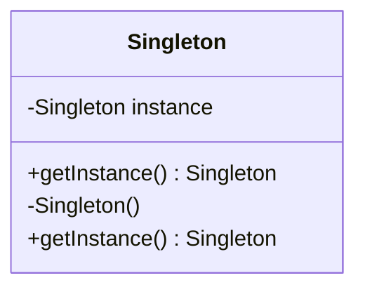
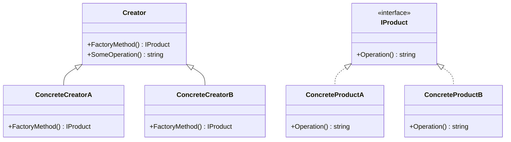

## 1.1 What are Design Patterns in C#?

In the realm of software engineering, design patterns are a crucial concept that provides reusable solutions to common problems encountered during software design. This section delves into the essence of design patterns within the context of C#, a powerful and versatile language in the .NET ecosystem. As expert developers and enterprise architects, understanding and implementing these patterns can significantly enhance the scalability, maintainability, and efficiency of your applications.

### Defining Design Patterns

Design patterns are not finished designs that can be directly transformed into code. Instead, they are templates or blueprints that guide you in solving recurring design problems. They encapsulate best practices and provide a shared language for developers to communicate complex ideas succinctly.

#### Key Characteristics of Design Patterns

1. **Reusability**: Patterns provide solutions that can be reused across different projects and contexts, reducing redundancy and effort.
2. **Scalability**: They help in designing systems that can grow and adapt to changing requirements.
3. **Maintainability**: By promoting clean and organized code, patterns make it easier to maintain and extend applications.
4. **Communication**: Patterns offer a common vocabulary for developers, facilitating better communication and understanding.

### The Role of Design Patterns in C#

C# is a modern, object-oriented language that supports a wide range of programming paradigms, including imperative, declarative, functional, and object-oriented programming. This versatility makes C# an ideal candidate for implementing design patterns. Let's explore how design patterns fit into the C# landscape.

#### Object-Oriented Principles

C# is inherently object-oriented, and design patterns leverage this by promoting principles such as encapsulation, inheritance, and polymorphism. Patterns like Singleton, Factory, and Observer are deeply rooted in these principles, providing structured ways to manage object creation, behavior, and interaction.

#### .NET Framework and Libraries

The .NET ecosystem offers a rich set of libraries and frameworks that complement design patterns. For instance, the use of Dependency Injection is facilitated by frameworks like ASP.NET Core, which provides built-in support for this pattern, enhancing modularity and testability.

### Categories of Design Patterns

Design patterns are broadly categorized into three types: Creational, Structural, and Behavioral. Each category addresses different aspects of software design.

#### Creational Patterns

These patterns focus on object creation mechanisms, aiming to create objects in a manner suitable to the situation. They help in abstracting the instantiation process, making the system independent of how its objects are created, composed, and represented.

- **Singleton**: Ensures a class has only one instance and provides a global point of access to it.
- **Factory Method**: Defines an interface for creating an object but lets subclasses alter the type of objects that will be created.
- **Abstract Factory**: Provides an interface for creating families of related or dependent objects without specifying their concrete classes.

#### Structural Patterns

Structural patterns deal with object composition, ensuring that if one part of a system changes, the entire system doesn't need to change. They help in forming large object structures between many disparate objects.

- **Adapter**: Allows incompatible interfaces to work together.
- **Bridge**: Separates an object’s abstraction from its implementation so that the two can vary independently.
- **Composite**: Composes objects into tree structures to represent part-whole hierarchies.

#### Behavioral Patterns

These patterns are concerned with algorithms and the assignment of responsibilities between objects. They help in defining how objects interact in a system.

- **Observer**: Defines a one-to-many dependency between objects so that when one object changes state, all its dependents are notified.
- **Strategy**: Enables selecting an algorithm’s behavior at runtime.
- **Command**: Encapsulates a request as an object, thereby allowing for parameterization of clients with queues, requests, and operations.

### Implementing Design Patterns in C#

Let's explore how some of these patterns are implemented in C# with practical examples.

#### Singleton Pattern in C#

The Singleton pattern ensures that a class has only one instance and provides a global point of access to it. This is particularly useful for managing shared resources like configuration settings or logging.

```csharp
public sealed class Singleton
{
    private static readonly Lazy<Singleton> lazy = new Lazy<Singleton>(() => new Singleton());

    public static Singleton Instance { get { return lazy.Value; } }

    private Singleton()
    {
        // Private constructor to prevent instantiation
    }
}

// Usage
var singletonInstance = Singleton.Instance;
```

**Key Points:**
- The `Lazy<T>` type ensures that the instance is created only when it is needed, providing lazy initialization.
- The constructor is private, preventing external instantiation.

#### Factory Method Pattern in C#

The Factory Method pattern defines an interface for creating an object but lets subclasses decide which class to instantiate. This pattern is useful for creating objects without specifying the exact class of object that will be created.

```csharp
public abstract class Creator
{
    public abstract IProduct FactoryMethod();

    public string SomeOperation()
    {
        var product = FactoryMethod();
        return "Creator: The same creator's code has just worked with " + product.Operation();
    }
}

public interface IProduct
{
    string Operation();
}

public class ConcreteProductA : IProduct
{
    public string Operation()
    {
        return "{Result of ConcreteProductA}";
    }
}

public class ConcreteProductB : IProduct
{
    public string Operation()
    {
        return "{Result of ConcreteProductB}";
    }
}

public class ConcreteCreatorA : Creator
{
    public override IProduct FactoryMethod()
    {
        return new ConcreteProductA();
    }
}

public class ConcreteCreatorB : Creator
{
    public override IProduct FactoryMethod()
    {
        return new ConcreteProductB();
    }
}

// Usage
void Main()
{
    Creator creator = new ConcreteCreatorA();
    Console.WriteLine(creator.SomeOperation());

    creator = new ConcreteCreatorB();
    Console.WriteLine(creator.SomeOperation());
}
```

**Key Points:**
- The `Creator` class declares the factory method that returns new product objects.
- Subclasses override the factory method to change the resulting product's type.

### Visualizing Design Patterns

To better understand how design patterns work, let's visualize the structure of the Singleton and Factory Method patterns using Mermaid.js diagrams.

#### Singleton Pattern Diagram



**Description:** This diagram illustrates the Singleton pattern, showing the private instance and the public method to access it.

#### Factory Method Pattern Diagram



**Description:** This diagram represents the Factory Method pattern, highlighting the relationship between the creator and product classes.

### Try It Yourself

To deepen your understanding, try modifying the code examples above. For instance, add a new product type to the Factory Method pattern and see how the system adapts. Experiment with the Singleton pattern by implementing thread-safe initialization without using `Lazy<T>`.

### References and Further Reading

For more in-depth exploration of design patterns, consider the following resources:

- [Design Patterns: Elements of Reusable Object-Oriented Software](https://en.wikipedia.org/wiki/Design_Patterns) by Erich Gamma, Richard Helm, Ralph Johnson, and John Vlissides.
- [Microsoft's Official C# Documentation](https://docs.microsoft.com/en-us/dotnet/csharp/)
- [Refactoring Guru's Design Patterns](https://refactoring.guru/design-patterns)

### Knowledge Check

To reinforce your learning, consider the following questions:

1. What are the main benefits of using design patterns in C#?
2. How does the Singleton pattern ensure only one instance of a class is created?
3. What is the primary purpose of the Factory Method pattern?
4. How do structural patterns differ from creational patterns?
5. Why is it important to understand the underlying principles of design patterns?

### Embrace the Journey

Remember, mastering design patterns is a journey that enhances your ability to build robust and scalable software. As you progress, you'll find these patterns becoming an integral part of your development toolkit. Keep experimenting, stay curious, and enjoy the journey!

## Quiz Time!



### What is the primary purpose of design patterns in software development?

- [x] To provide reusable solutions to common design problems
- [ ] To replace the need for coding standards
- [ ] To eliminate the need for documentation
- [ ] To ensure code is always error-free

> **Explanation:** Design patterns offer reusable solutions to common design problems, enhancing code reusability and maintainability.

### Which pattern ensures a class has only one instance?

- [x] Singleton
- [ ] Factory Method
- [ ] Observer
- [ ] Strategy

> **Explanation:** The Singleton pattern ensures that a class has only one instance and provides a global point of access to it.

### What is the main advantage of the Factory Method pattern?

- [x] It allows subclasses to decide which class to instantiate
- [ ] It ensures only one instance of a class is created
- [ ] It provides a way to compose objects into tree structures
- [ ] It defines a one-to-many dependency between objects

> **Explanation:** The Factory Method pattern allows subclasses to decide which class to instantiate, promoting flexibility in object creation.

### How do structural patterns differ from creational patterns?

- [x] Structural patterns deal with object composition, while creational patterns focus on object creation
- [ ] Structural patterns focus on object creation, while creational patterns deal with object composition
- [ ] Both deal with object composition
- [ ] Both focus on object creation

> **Explanation:** Structural patterns deal with object composition, ensuring that if one part of a system changes, the entire system doesn't need to change, while creational patterns focus on object creation mechanisms.

### Which pattern is used to define a one-to-many dependency between objects?

- [ ] Singleton
- [ ] Factory Method
- [x] Observer
- [ ] Strategy

> **Explanation:** The Observer pattern defines a one-to-many dependency between objects so that when one object changes state, all its dependents are notified.

### What is a key characteristic of design patterns?

- [x] Reusability
- [ ] Complexity
- [ ] Obfuscation
- [ ] Redundancy

> **Explanation:** Reusability is a key characteristic of design patterns, as they provide solutions that can be reused across different projects and contexts.

### Which pattern encapsulates a request as an object?

- [ ] Singleton
- [ ] Factory Method
- [ ] Observer
- [x] Command

> **Explanation:** The Command pattern encapsulates a request as an object, allowing for parameterization of clients with queues, requests, and operations.

### What is the benefit of using the `Lazy<T>` type in the Singleton pattern?

- [x] It provides lazy initialization, creating the instance only when needed
- [ ] It ensures the instance is created at application startup
- [ ] It makes the instance immutable
- [ ] It provides a global point of access to the instance

> **Explanation:** The `Lazy<T>` type provides lazy initialization, ensuring that the instance is created only when it is needed, optimizing resource usage.

### Which pattern allows incompatible interfaces to work together?

- [x] Adapter
- [ ] Bridge
- [ ] Composite
- [ ] Decorator

> **Explanation:** The Adapter pattern allows incompatible interfaces to work together by acting as a bridge between them.

### True or False: Design patterns eliminate the need for documentation.

- [ ] True
- [x] False

> **Explanation:** False. While design patterns provide a common vocabulary and reusable solutions, they do not eliminate the need for documentation, which is essential for understanding and maintaining code.


