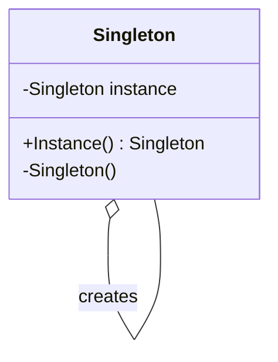
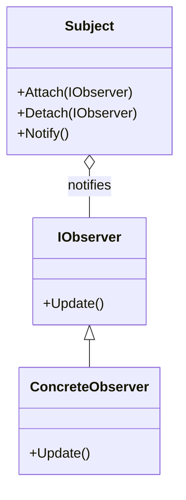

## 1.2 Types of Design Patterns in C#

Design patterns are essential tools in the software engineer's toolkit, providing proven solutions to common design problems. In C#, these patterns help developers create robust, scalable, and maintainable applications. This section delves into the various types of design patterns, categorized primarily by the Gang of Four (GoF) classification and extending into modern architectural strategies, concurrency solutions, and idiomatic C# techniques.

### Overview of Design Pattern Categories

Design patterns in C# can be broadly categorized into several types:

1. **Creational Patterns**: Focus on object creation mechanisms, trying to create objects in a manner suitable to the situation.
2. **Structural Patterns**: Deal with object composition, ensuring that if one part changes, the entire structure does not need to.
3. **Behavioral Patterns**: Concerned with communication between objects, focusing on how objects interact and fulfill tasks.
4. **Concurrency Patterns**: Address multi-threading and parallel processing challenges.
5. **Architectural Patterns**: Provide solutions for high-level architectural problems.
6. **Microservices Patterns**: Tailored for distributed systems and microservices architecture.
7. **Functional Patterns**: Leverage functional programming concepts within C#.
8. **Enterprise Patterns**: Focus on enterprise-level application challenges.
9. **Idiomatic C# Patterns**: Utilize C#-specific language features to solve problems.

Let's explore each category in detail, providing insights into their intent, applicability, and examples.

### Creational Design Patterns

Creational patterns abstract the instantiation process, making a system independent of how its objects are created, composed, and represented. They provide flexibility in deciding which objects need to be created for a given use case.

#### 1. Singleton Pattern

**Intent**: Ensure a class has only one instance and provide a global point of access to it.

**Key Participants**:
- Singleton: The class that is responsible for creating its own unique instance.

**Applicability**: Use when exactly one instance of a class is needed to coordinate actions across the system.

**Sample Code Snippet**:

```csharp
public sealed class Singleton
{
    private static readonly Lazy<Singleton> instance = new Lazy<Singleton>(() => new Singleton());

    private Singleton() { }

    public static Singleton Instance => instance.Value;
}
```

**Design Considerations**: Be cautious of thread safety and lazy initialization. The `Lazy<T>` type in C# ensures that the instance is created in a thread-safe manner.

#### 2. Factory Method Pattern

**Intent**: Define an interface for creating an object, but let subclasses alter the type of objects that will be created.

**Key Participants**:
- Creator: Declares the factory method.
- ConcreteCreator: Overrides the factory method to return an instance of a ConcreteProduct.

**Applicability**: Use when a class cannot anticipate the class of objects it must create.

**Sample Code Snippet**:

```csharp
public abstract class Creator
{
    public abstract IProduct FactoryMethod();
}

public class ConcreteCreator : Creator
{
    public override IProduct FactoryMethod()
    {
        return new ConcreteProduct();
    }
}
```

**Design Considerations**: This pattern promotes loose coupling by eliminating the need to bind application-specific classes into the code.

#### 3. Abstract Factory Pattern

**Intent**: Provide an interface for creating families of related or dependent objects without specifying their concrete classes.

**Key Participants**:
- AbstractFactory: Declares an interface for operations that create abstract product objects.
- ConcreteFactory: Implements the operations to create concrete product objects.

**Applicability**: Use when a system should be independent of how its products are created, composed, and represented.

**Sample Code Snippet**:

```csharp
public interface IAbstractFactory
{
    IProductA CreateProductA();
    IProductB CreateProductB();
}

public class ConcreteFactory1 : IAbstractFactory
{
    public IProductA CreateProductA() => new ProductA1();
    public IProductB CreateProductB() => new ProductB1();
}
```

**Design Considerations**: This pattern is particularly useful when the system needs to be configured with one of multiple families of products.

### Structural Design Patterns

Structural patterns ease the design by identifying a simple way to realize relationships between entities.

#### 1. Adapter Pattern

**Intent**: Convert the interface of a class into another interface clients expect. Adapter lets classes work together that couldn't otherwise because of incompatible interfaces.

**Key Participants**:
- Target: Defines the domain-specific interface that Client uses.
- Adapter: Adapts the interface of Adaptee to the Target interface.

**Applicability**: Use when you want to use an existing class, and its interface does not match the one you need.

**Sample Code Snippet**:

```csharp
public interface ITarget
{
    void Request();
}

public class Adapter : ITarget
{
    private readonly Adaptee _adaptee;

    public Adapter(Adaptee adaptee)
    {
        _adaptee = adaptee;
    }

    public void Request()
    {
        _adaptee.SpecificRequest();
    }
}
```

**Design Considerations**: The Adapter pattern can be implemented using inheritance or composition.

#### 2. Bridge Pattern

**Intent**: Decouple an abstraction from its implementation so that the two can vary independently.

**Key Participants**:
- Abstraction: Defines the abstraction's interface.
- Implementor: Defines the interface for implementation classes.

**Applicability**: Use when you want to avoid a permanent binding between an abstraction and its implementation.

**Sample Code Snippet**:

```csharp
public abstract class Abstraction
{
    protected IImplementor implementor;

    protected Abstraction(IImplementor implementor)
    {
        this.implementor = implementor;
    }

    public abstract void Operation();
}

public class RefinedAbstraction : Abstraction
{
    public RefinedAbstraction(IImplementor implementor) : base(implementor) { }

    public override void Operation()
    {
        implementor.OperationImpl();
    }
}
```

**Design Considerations**: The Bridge pattern is useful when both the abstractions and their implementations should be extensible by subclassing.

### Behavioral Design Patterns

Behavioral patterns are concerned with algorithms and the assignment of responsibilities between objects.

#### 1. Strategy Pattern

**Intent**: Define a family of algorithms, encapsulate each one, and make them interchangeable. Strategy lets the algorithm vary independently from clients that use it.

**Key Participants**:
- Strategy: Declares an interface common to all supported algorithms.
- Context: Maintains a reference to a Strategy object.

**Applicability**: Use when you need different variants of an algorithm.

**Sample Code Snippet**:

```csharp
public interface IStrategy
{
    void AlgorithmInterface();
}

public class ConcreteStrategyA : IStrategy
{
    public void AlgorithmInterface()
    {
        // Implementation of algorithm A
    }
}

public class Context
{
    private IStrategy _strategy;

    public Context(IStrategy strategy)
    {
        _strategy = strategy;
    }

    public void ContextInterface()
    {
        _strategy.AlgorithmInterface();
    }
}
```

**Design Considerations**: The Strategy pattern is useful when you have a lot of similar classes that only differ in the way they execute some behavior.

#### 2. Observer Pattern

**Intent**: Define a one-to-many dependency between objects so that when one object changes state, all its dependents are notified and updated automatically.

**Key Participants**:
- Subject: Knows its observers and provides an interface for attaching and detaching Observer objects.
- Observer: Defines an updating interface for objects that should be notified of changes in a Subject.

**Applicability**: Use when a change to one object requires changing others, and you don't know how many objects need to be changed.

**Sample Code Snippet**:

```csharp
public interface IObserver
{
    void Update();
}

public class ConcreteObserver : IObserver
{
    public void Update()
    {
        // React to update
    }
}

public class Subject
{
    private List<IObserver> _observers = new List<IObserver>();

    public void Attach(IObserver observer)
    {
        _observers.Add(observer);
    }

    public void Detach(IObserver observer)
    {
        _observers.Remove(observer);
    }

    public void Notify()
    {
        foreach (var observer in _observers)
        {
            observer.Update();
        }
    }
}
```

**Design Considerations**: The Observer pattern is useful for implementing distributed event-handling systems.

### Concurrency Patterns

Concurrency patterns address issues related to multi-threading and parallel processing.

#### 1. Producer-Consumer Pattern

**Intent**: Separate the processes that produce data from the processes that consume data.

**Key Participants**:
- Producer: Generates data and places it in a buffer.
- Consumer: Retrieves data from the buffer.

**Applicability**: Use when you need to decouple the production of data from its consumption.

**Sample Code Snippet**:

```csharp
public class ProducerConsumer
{
    private Queue<int> _buffer = new Queue<int>();
    private readonly object _lock = new object();

    public void Produce(int item)
    {
        lock (_lock)
        {
            _buffer.Enqueue(item);
            Monitor.Pulse(_lock);
        }
    }

    public int Consume()
    {
        lock (_lock)
        {
            while (_buffer.Count == 0)
            {
                Monitor.Wait(_lock);
            }
            return _buffer.Dequeue();
        }
    }
}
```

**Design Considerations**: Ensure thread safety when accessing shared resources.

### Architectural Patterns

Architectural patterns provide solutions to high-level design problems.

#### 1. Microservices Architecture

**Intent**: Decompose a large application into smaller, independent services that communicate over a network.

**Key Participants**:
- Service: A small, independent, and self-contained unit of functionality.
- API Gateway: Manages requests and routes them to the appropriate service.

**Applicability**: Use when you need to build scalable and flexible applications.

**Sample Code Snippet**:

```csharp
// Example of a simple microservice using ASP.NET Core
public class Startup
{
    public void ConfigureServices(IServiceCollection services)
    {
        services.AddControllers();
    }

    public void Configure(IApplicationBuilder app, IWebHostEnvironment env)
    {
        if (env.IsDevelopment())
        {
            app.UseDeveloperExceptionPage();
        }

        app.UseRouting();
        app.UseEndpoints(endpoints =>
        {
            endpoints.MapControllers();
        });
    }
}
```

**Design Considerations**: Consider the complexity of managing distributed systems and the need for robust communication between services.

### Microservices Patterns

Microservices patterns are tailored for distributed systems and microservices architecture.

#### 1. Circuit Breaker Pattern

**Intent**: Prevent an application from trying to execute an operation that's likely to fail.

**Key Participants**:
- Circuit Breaker: Monitors for failures and short-circuits the operation if failures reach a threshold.

**Applicability**: Use when you need to handle failures gracefully in a distributed system.

**Sample Code Snippet**:

```csharp
public class CircuitBreaker
{
    private int _failureCount = 0;
    private readonly int _threshold = 3;
    private bool _isOpen = false;

    public void Execute(Action action)
    {
        if (_isOpen)
        {
            throw new Exception("Circuit is open");
        }

        try
        {
            action();
            _failureCount = 0; // Reset on success
        }
        catch
        {
            _failureCount++;
            if (_failureCount >= _threshold)
            {
                _isOpen = true;
            }
            throw;
        }
    }
}
```

**Design Considerations**: Implement a mechanism to reset the circuit breaker after a certain period.

### Functional Patterns

Functional patterns leverage functional programming concepts within C#.

#### 1. Monad Pattern

**Intent**: Encapsulate computations in a context, such as a computation that might fail or a computation that might produce multiple results.

**Key Participants**:
- Monad: Provides a way to chain operations together.

**Applicability**: Use when you need to handle computations in a context, such as error handling or asynchronous operations.

**Sample Code Snippet**:

```csharp
public class Maybe<T>
{
    private readonly T _value;

    public Maybe(T value)
    {
        _value = value;
    }

    public Maybe<U> Bind<U>(Func<T, Maybe<U>> func)
    {
        return _value == null ? new Maybe<U>(default) : func(_value);
    }
}
```

**Design Considerations**: Monads can simplify error handling and asynchronous programming.

### Enterprise Patterns

Enterprise patterns focus on challenges faced in enterprise-level applications.

#### 1. Repository Pattern

**Intent**: Encapsulate the logic needed to access data sources.

**Key Participants**:
- Repository: Provides an interface for accessing domain objects.

**Applicability**: Use when you need to separate the logic that retrieves data from the business logic.

**Sample Code Snippet**:

```csharp
public interface IRepository<T>
{
    IEnumerable<T> GetAll();
    T GetById(int id);
    void Add(T entity);
    void Remove(T entity);
}

public class Repository<T> : IRepository<T>
{
    private readonly List<T> _context = new List<T>();

    public IEnumerable<T> GetAll() => _context;
    public T GetById(int id) => _context[id];
    public void Add(T entity) => _context.Add(entity);
    public void Remove(T entity) => _context.Remove(entity);
}
```

**Design Considerations**: The Repository pattern can help achieve a clean separation of concerns.

### Idiomatic C# Patterns

Idiomatic C# patterns utilize C#-specific language features to solve problems.

#### 1. Async/Await Pattern

**Intent**: Simplify asynchronous programming by using async and await keywords.

**Key Participants**:
- Async Method: A method that performs an asynchronous operation.
- Await: A keyword that pauses the execution of an async method until the awaited task completes.

**Applicability**: Use when you need to perform asynchronous operations.

**Sample Code Snippet**:

```csharp
public async Task<string> GetDataAsync()
{
    using (var client = new HttpClient())
    {
        var response = await client.GetStringAsync("https://example.com");
        return response;
    }
}
```

**Design Considerations**: Be mindful of deadlocks and exception handling in asynchronous code.

### Visualizing Design Patterns

To better understand the relationships and interactions within design patterns, let's visualize some of these concepts using diagrams.

#### Visualizing the Singleton Pattern



**Description**: This diagram illustrates the Singleton pattern, showing how a single instance is maintained and accessed globally.

#### Visualizing the Observer Pattern



**Description**: This diagram represents the Observer pattern, highlighting the relationship between the Subject and its Observers.

### Knowledge Check

Let's reinforce your understanding with a few questions:

1. What is the primary intent of the Singleton pattern?
2. How does the Factory Method pattern promote loose coupling?
3. In what scenarios would you use the Adapter pattern?
4. Describe a situation where the Strategy pattern would be beneficial.
5. What are the key benefits of using the Repository pattern in enterprise applications?

### Try It Yourself

Experiment with the code examples provided. Try modifying the Singleton pattern to include a counter that tracks how many times the instance is accessed. For the Observer pattern, add a new type of observer that logs updates to a file.

### Embrace the Journey

Remember, mastering design patterns is a journey. As you continue to explore and apply these patterns, you'll gain deeper insights into building scalable and maintainable applications. Keep experimenting, stay curious, and enjoy the journey!

## Quiz Time!



### What is the primary intent of the Singleton pattern?

- [x] Ensure a class has only one instance and provide a global point of access to it.
- [ ] Create multiple instances of a class.
- [ ] Provide a way to create objects without specifying the exact class.
- [ ] Define a family of algorithms and make them interchangeable.

> **Explanation:** The Singleton pattern ensures that a class has only one instance and provides a global point of access to it.

### How does the Factory Method pattern promote loose coupling?

- [x] By allowing subclasses to decide which class to instantiate.
- [ ] By creating a single instance of a class.
- [ ] By defining a family of algorithms.
- [ ] By converting the interface of a class into another interface.

> **Explanation:** The Factory Method pattern promotes loose coupling by allowing subclasses to decide which class to instantiate.

### In what scenarios would you use the Adapter pattern?

- [x] When you want to use an existing class, and its interface does not match the one you need.
- [ ] When you need to create a single instance of a class.
- [ ] When you need to define a family of algorithms.
- [ ] When you need to encapsulate the logic needed to access data sources.

> **Explanation:** The Adapter pattern is used when you want to use an existing class, and its interface does not match the one you need.

### Describe a situation where the Strategy pattern would be beneficial.

- [x] When you need different variants of an algorithm.
- [ ] When you need to create a single instance of a class.
- [ ] When you need to encapsulate the logic needed to access data sources.
- [ ] When you need to convert the interface of a class into another interface.

> **Explanation:** The Strategy pattern is beneficial when you need different variants of an algorithm.

### What are the key benefits of using the Repository pattern in enterprise applications?

- [x] It separates the logic that retrieves data from the business logic.
- [ ] It ensures a class has only one instance.
- [ ] It defines a family of algorithms.
- [ ] It converts the interface of a class into another interface.

> **Explanation:** The Repository pattern separates the logic that retrieves data from the business logic, which is beneficial in enterprise applications.

### What is the primary intent of the Bridge pattern?

- [x] Decouple an abstraction from its implementation so that the two can vary independently.
- [ ] Ensure a class has only one instance.
- [ ] Define a family of algorithms and make them interchangeable.
- [ ] Convert the interface of a class into another interface.

> **Explanation:** The Bridge pattern's primary intent is to decouple an abstraction from its implementation so that the two can vary independently.

### What is the main advantage of using the Circuit Breaker pattern in microservices?

- [x] It prevents an application from trying to execute an operation that's likely to fail.
- [ ] It ensures a class has only one instance.
- [ ] It defines a family of algorithms and makes them interchangeable.
- [ ] It converts the interface of a class into another interface.

> **Explanation:** The Circuit Breaker pattern prevents an application from trying to execute an operation that's likely to fail, which is crucial in microservices.

### How does the Async/Await pattern simplify asynchronous programming?

- [x] By using async and await keywords to manage asynchronous operations.
- [ ] By creating a single instance of a class.
- [ ] By defining a family of algorithms.
- [ ] By converting the interface of a class into another interface.

> **Explanation:** The Async/Await pattern simplifies asynchronous programming by using async and await keywords to manage asynchronous operations.

### What is the primary benefit of using the Monad pattern?

- [x] It encapsulates computations in a context, such as error handling or asynchronous operations.
- [ ] It ensures a class has only one instance.
- [ ] It defines a family of algorithms and makes them interchangeable.
- [ ] It converts the interface of a class into another interface.

> **Explanation:** The Monad pattern encapsulates computations in a context, such as error handling or asynchronous operations.

### True or False: The Observer pattern is useful for implementing distributed event-handling systems.

- [x] True
- [ ] False

> **Explanation:** The Observer pattern is indeed useful for implementing distributed event-handling systems, as it defines a one-to-many dependency between objects.


