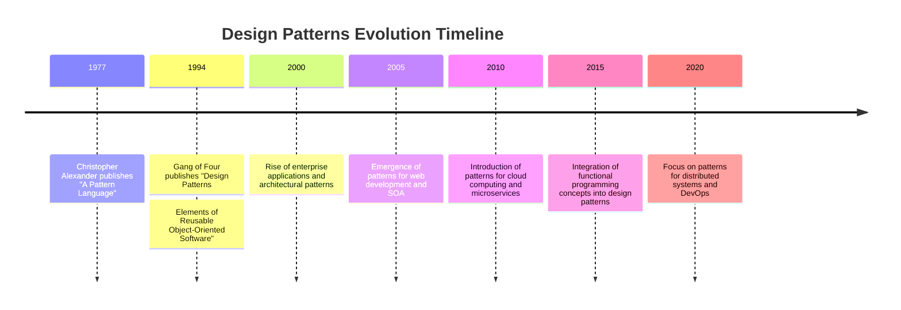

## 1.3 History and Evolution of Design Patterns

Design patterns have become an integral part of software engineering, providing reusable solutions to common problems. Understanding their history and evolution is crucial for expert software engineers and enterprise architects who wish to leverage these patterns effectively in C#. In this section, we will explore the origins of design patterns, their development over time, and their impact on modern software design.

### Origins of Design Patterns

The concept of design patterns originated in the field of architecture, with Christopher Alexander's seminal work, "A Pattern Language: Towns, Buildings, Construction," published in 1977. Alexander introduced the idea of patterns as a way to describe solutions to recurring problems in architecture. His work laid the foundation for the application of patterns in software engineering.

In the late 1980s and early 1990s, a group of computer scientists, known as the "Gang of Four" (GoF), adapted Alexander's concepts to software design. The GoF, consisting of Erich Gamma, Richard Helm, Ralph Johnson, and John Vlissides, published "Design Patterns: Elements of Reusable Object-Oriented Software" in 1994. This book introduced 23 classic design patterns, categorized into creational, structural, and behavioral patterns, which have since become the cornerstone of design pattern literature.

### Evolution of Design Patterns

#### Early Adoption and Impact

The publication of the GoF book marked a turning point in software engineering. It provided a common vocabulary for discussing design solutions and encouraged the use of object-oriented principles. The patterns described by the GoF were quickly adopted by developers and became a standard part of software design education.

The early adoption of design patterns was driven by the need for more efficient and maintainable code. Developers recognized that patterns could help reduce complexity, improve code readability, and facilitate communication among team members. As a result, design patterns became a key component of software development methodologies, such as Agile and Extreme Programming.

#### Expansion and Diversification

As the software industry evolved, so did the application of design patterns. New patterns emerged to address specific challenges in areas such as concurrency, distributed systems, and web development. Patterns like the Model-View-Controller (MVC) and Model-View-ViewModel (MVVM) became popular in the context of graphical user interfaces and web applications.

The rise of enterprise applications and service-oriented architectures (SOA) in the early 2000s led to the development of architectural patterns. These patterns, such as the Microservices Architecture and Event-Driven Architecture, provided guidelines for designing scalable and resilient systems. The focus shifted from individual components to the overall structure and behavior of applications.

#### Influence of Programming Languages

The evolution of programming languages has also influenced the development of design patterns. Languages like C# have introduced features that facilitate the implementation of patterns, such as generics, delegates, and lambda expressions. These features allow developers to create more flexible and expressive solutions.

C#'s support for asynchronous programming has led to the adaptation of patterns for handling concurrency and parallelism. Patterns like the Task Parallel Library (TPL) and Reactive Extensions (Rx.NET) have become essential tools for building responsive and efficient applications.

#### Modern Trends and Innovations

In recent years, the focus of design patterns has shifted towards addressing the challenges of modern software development, such as cloud computing, microservices, and DevOps. Patterns like the Circuit Breaker, API Gateway, and Service Mesh have emerged to address issues related to reliability, scalability, and security in distributed systems.

The integration of functional programming concepts into mainstream languages like C# has also influenced the evolution of design patterns. Patterns such as Monads, Currying, and Function Composition have gained popularity for their ability to simplify complex logic and improve code maintainability.

### Notable Publications and Contributions

The literature on design patterns has expanded significantly since the publication of the GoF book. Several notable publications and contributions have shaped the field and provided valuable insights into the application of patterns in software engineering.

#### "Pattern-Oriented Software Architecture" Series

The "Pattern-Oriented Software Architecture" (POSA) series, authored by Frank Buschmann, Regine Meunier, Hans Rohnert, Peter Sommerlad, and Michael Stal, is a comprehensive collection of books that explore architectural patterns and their application in software design. The series covers a wide range of topics, including distributed systems, concurrency, and real-time systems.

#### "Enterprise Integration Patterns"

"Enterprise Integration Patterns: Designing, Building, and Deploying Messaging Solutions," authored by Gregor Hohpe and Bobby Woolf, is a seminal work that focuses on patterns for integrating enterprise applications. The book provides a catalog of patterns for designing robust and scalable messaging systems, which are essential for modern enterprise architectures.

#### Contributions from the Software Community

The software community has played a significant role in the evolution of design patterns. Online resources, such as the Portland Pattern Repository and the Hillside Group, have provided platforms for sharing and discussing patterns. Conferences like the Pattern Languages of Programs (PLoP) have facilitated collaboration and innovation in the field.

### Visualizing the Evolution of Design Patterns

To better understand the evolution of design patterns, let's visualize the timeline and key milestones in their development.

### Key Takeaways

- **Origins in Architecture**: Design patterns originated in architecture and were adapted to software engineering by the Gang of Four.
- **Standardization and Adoption**: The GoF book standardized design patterns and facilitated their adoption in software development.
- **Expansion and Diversification**: New patterns emerged to address challenges in concurrency, distributed systems, and web development.
- **Influence of Programming Languages**: Features in languages like C# have influenced the implementation and evolution of design patterns.
- **Modern Trends**: The focus has shifted towards patterns for cloud computing, microservices, and functional programming.

### Embrace the Journey

As we continue to explore design patterns in C#, remember that this is just the beginning. The field of software engineering is constantly evolving, and new patterns will emerge to address future challenges. Stay curious, keep experimenting, and enjoy the journey of mastering design patterns in C#.

## Quiz Time!



### Who introduced the concept of design patterns in architecture?

- [x] Christopher Alexander
- [ ] Erich Gamma
- [ ] Ralph Johnson
- [ ] Gregor Hohpe

> **Explanation:** Christopher Alexander introduced the concept of design patterns in architecture with his work "A Pattern Language."

### What is the significance of the Gang of Four book?

- [x] It standardized design patterns in software engineering.
- [ ] It introduced functional programming concepts.
- [ ] It focused on web development patterns.
- [ ] It was the first book on software architecture.

> **Explanation:** The Gang of Four book standardized design patterns and provided a common vocabulary for software engineers.

### Which pattern is commonly used in web development?

- [x] Model-View-Controller (MVC)
- [ ] Singleton
- [ ] Factory Method
- [ ] Observer

> **Explanation:** The Model-View-Controller (MVC) pattern is commonly used in web development for structuring applications.

### How have programming languages influenced design patterns?

- [x] By introducing features that facilitate pattern implementation
- [ ] By eliminating the need for design patterns
- [ ] By making patterns obsolete
- [ ] By standardizing all patterns

> **Explanation:** Programming languages like C# have introduced features that facilitate the implementation of design patterns.

### What is a modern trend in design patterns?

- [x] Patterns for cloud computing and microservices
- [ ] Patterns for desktop applications
- [ ] Patterns for assembly language
- [ ] Patterns for batch processing

> **Explanation:** Modern trends in design patterns focus on addressing challenges in cloud computing and microservices.

### Which book focuses on patterns for enterprise integration?

- [x] "Enterprise Integration Patterns" by Gregor Hohpe and Bobby Woolf
- [ ] "Design Patterns: Elements of Reusable Object-Oriented Software"
- [ ] "A Pattern Language" by Christopher Alexander
- [ ] "Pattern-Oriented Software Architecture" series

> **Explanation:** "Enterprise Integration Patterns" by Gregor Hohpe and Bobby Woolf focuses on patterns for integrating enterprise applications.

### What is the focus of the "Pattern-Oriented Software Architecture" series?

- [x] Architectural patterns and their application
- [ ] Functional programming patterns
- [ ] Web development patterns
- [ ] Security patterns

> **Explanation:** The "Pattern-Oriented Software Architecture" series explores architectural patterns and their application in software design.

### Which pattern is associated with functional programming?

- [x] Monad
- [ ] Singleton
- [ ] Factory Method
- [ ] Observer

> **Explanation:** The Monad pattern is associated with functional programming and simplifies complex logic.

### What is the role of the software community in design patterns?

- [x] Sharing and discussing patterns
- [ ] Eliminating the need for patterns
- [ ] Standardizing all patterns
- [ ] Making patterns obsolete

> **Explanation:** The software community plays a significant role in sharing and discussing design patterns, facilitating collaboration and innovation.

### True or False: The focus of design patterns has shifted towards addressing challenges in distributed systems and DevOps.

- [x] True
- [ ] False

> **Explanation:** The focus of design patterns has indeed shifted towards addressing challenges in distributed systems and DevOps.


