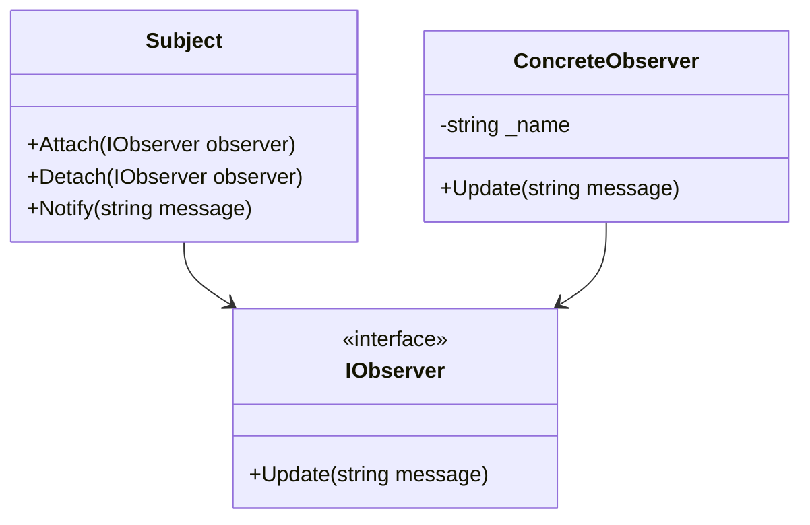

## 1.4 Importance of Design Patterns in Software Development

Design patterns are a cornerstone in the field of software engineering, offering a proven solution to recurring design problems. They are essential for writing maintainable, scalable, and robust C# applications. In this section, we will delve into the significance of design patterns, their role in solving complex design issues, and how they contribute to the overall quality of software development.

### Understanding Design Patterns

Design patterns are reusable solutions to common problems in software design. They are not finished designs that can be directly transformed into code but are templates that guide developers in crafting solutions that are both efficient and effective. The concept of design patterns was popularized by the "Gang of Four" (GoF) in their seminal book, "Design Patterns: Elements of Reusable Object-Oriented Software," which introduced 23 classic patterns.

### Why Design Patterns Matter

#### 1. **Enhancing Code Maintainability**

Design patterns promote code maintainability by providing a clear structure and organization. They help developers understand the architecture of a system quickly, making it easier to modify and extend the codebase. For example, the Observer pattern allows for a clean separation of concerns, making it easier to update or replace components without affecting others.

#### 2. **Facilitating Communication**

Design patterns serve as a common language among developers. When a team agrees to use a specific pattern, it reduces misunderstandings and enhances collaboration. For instance, saying "Let's use the Singleton pattern here" immediately conveys a wealth of information about the intended design.

#### 3. **Promoting Reusability**

By encapsulating best practices, design patterns encourage code reuse. This not only saves time but also reduces the likelihood of errors. Patterns like the Factory Method allow for the creation of objects without specifying the exact class of object that will be created, promoting flexibility and reuse.

#### 4. **Improving Code Quality**

Design patterns help in writing cleaner, more efficient code. They provide a tested and proven approach to solving design problems, which can lead to fewer bugs and a more robust application. The Strategy pattern, for example, allows for the definition of a family of algorithms, encapsulating each one and making them interchangeable.

#### 5. **Solving Complex Design Issues**

Patterns are particularly useful in addressing complex design issues. They provide a framework for solving problems that might otherwise be difficult to manage. The Composite pattern, for instance, allows developers to treat individual objects and compositions of objects uniformly, simplifying the handling of complex hierarchical structures.

### Evaluating the Role of Patterns in Solving Complex Design Issues

Design patterns are instrumental in tackling complex design challenges. Let's explore some scenarios where patterns play a crucial role:

#### **Scenario 1: Managing Object Creation**

In large systems, managing the creation and lifecycle of objects can become cumbersome. Creational patterns like Singleton, Factory Method, and Abstract Factory provide solutions for controlling object creation, ensuring that the system remains efficient and manageable.

#### **Scenario 2: Structuring Complex Systems**

Structural patterns such as Adapter, Bridge, and Composite help in organizing complex systems. They provide a way to compose objects into larger structures, facilitating the management of complex relationships and interactions.

#### **Scenario 3: Coordinating Object Behavior**

Behavioral patterns like Observer, Strategy, and Command are essential for coordinating interactions between objects. They define how objects communicate and collaborate, ensuring that the system behaves as expected.

### Code Examples

To illustrate the importance of design patterns, let's look at a few code examples in C#.

#### Singleton Pattern

The Singleton pattern ensures that a class has only one instance and provides a global point of access to it.

```csharp
public class Singleton
{
    private static Singleton _instance;

    // Private constructor to prevent instantiation
    private Singleton() { }

    public static Singleton Instance
    {
        get
        {
            if (_instance == null)
            {
                _instance = new Singleton();
            }
            return _instance;
        }
    }

    public void DoSomething()
    {
        Console.WriteLine("Singleton instance is doing something.");
    }
}
```

**Key Points:**
- The Singleton pattern is useful when exactly one object is needed to coordinate actions across the system.
- It provides a controlled access point to the instance.

#### Observer Pattern

The Observer pattern defines a one-to-many dependency between objects so that when one object changes state, all its dependents are notified and updated automatically.

```csharp
using System;
using System.Collections.Generic;

public interface IObserver
{
    void Update(string message);
}

public class ConcreteObserver : IObserver
{
    private string _name;

    public ConcreteObserver(string name)
    {
        _name = name;
    }

    public void Update(string message)
    {
        Console.WriteLine($"{_name} received message: {message}");
    }
}

public class Subject
{
    private List<IObserver> _observers = new List<IObserver>();

    public void Attach(IObserver observer)
    {
        _observers.Add(observer);
    }

    public void Detach(IObserver observer)
    {
        _observers.Remove(observer);
    }

    public void Notify(string message)
    {
        foreach (var observer in _observers)
        {
            observer.Update(message);
        }
    }
}
```

**Key Points:**
- The Observer pattern is ideal for implementing distributed event-handling systems.
- It promotes loose coupling between the subject and its observers.

### Visualizing Design Patterns

To better understand the role of design patterns, let's visualize the Observer pattern using a class diagram.



**Diagram Explanation:**
- The `Subject` class maintains a list of `IObserver` objects and notifies them of any state changes.
- `ConcreteObserver` implements the `IObserver` interface and defines the `Update` method to receive notifications.

### Try It Yourself

Experiment with the Singleton and Observer patterns by modifying the code examples. Try creating multiple instances of the Singleton class and observe how the pattern ensures only one instance exists. For the Observer pattern, add more observers and see how they react to notifications.

### References and Links

For further reading on design patterns, consider exploring the following resources:
- [Design Patterns: Elements of Reusable Object-Oriented Software](https://en.wikipedia.org/wiki/Design_Patterns)
- [Microsoft Docs on Design Patterns](https://docs.microsoft.com/en-us/dotnet/standard/design-patterns)
- [Refactoring Guru: Design Patterns](https://refactoring.guru/design-patterns)

### Knowledge Check

- What are design patterns, and why are they important in software development?
- How do design patterns improve code maintainability and quality?
- Explain the role of the Singleton pattern in managing object creation.
- Describe how the Observer pattern facilitates communication between objects.

### Embrace the Journey

Remember, mastering design patterns is a journey. As you progress, you'll gain a deeper understanding of how these patterns can transform your software development process. Keep experimenting, stay curious, and enjoy the journey!

### Formatting and Structure

Organize your learning with clear headings and subheadings. Use bullet points to break down complex information and highlight important terms or concepts.

### Writing Style

Use first-person plural (we, let's) to create a collaborative feel. Avoid gender-specific pronouns and define acronyms and abbreviations upon first use.

## Quiz Time!



### What is the primary purpose of design patterns in software development?

- [x] To provide reusable solutions to common design problems
- [ ] To replace the need for coding standards
- [ ] To eliminate the need for documentation
- [ ] To ensure all code is written in the same style

> **Explanation:** Design patterns offer reusable solutions to common design problems, enhancing maintainability and scalability.

### How do design patterns facilitate communication among developers?

- [x] By providing a common language and understanding
- [ ] By enforcing strict coding guidelines
- [ ] By eliminating the need for comments
- [ ] By standardizing variable names

> **Explanation:** Design patterns serve as a common language, reducing misunderstandings and enhancing collaboration.

### Which pattern is used to ensure a class has only one instance?

- [x] Singleton
- [ ] Observer
- [ ] Factory Method
- [ ] Strategy

> **Explanation:** The Singleton pattern ensures a class has only one instance and provides a global point of access.

### What is a key benefit of the Observer pattern?

- [x] It promotes loose coupling between objects
- [ ] It ensures a single point of failure
- [ ] It eliminates the need for interfaces
- [ ] It simplifies object creation

> **Explanation:** The Observer pattern promotes loose coupling by allowing objects to communicate without being tightly bound.

### In which scenario is the Factory Method pattern most useful?

- [x] When creating objects without specifying the exact class
- [ ] When ensuring a class has only one instance
- [ ] When coordinating object behavior
- [ ] When structuring complex systems

> **Explanation:** The Factory Method pattern is useful for creating objects without specifying the exact class, promoting flexibility.

### How do design patterns improve code quality?

- [x] By providing tested and proven solutions
- [ ] By enforcing strict coding standards
- [ ] By eliminating the need for testing
- [ ] By standardizing code formatting

> **Explanation:** Design patterns improve code quality by offering tested and proven solutions to design problems.

### What is the role of structural patterns in software design?

- [x] To organize complex systems
- [ ] To manage object creation
- [ ] To coordinate object behavior
- [ ] To enforce coding standards

> **Explanation:** Structural patterns help organize complex systems by composing objects into larger structures.

### Why are design patterns considered a cornerstone in software engineering?

- [x] They provide a framework for solving complex design issues
- [ ] They eliminate the need for documentation
- [ ] They ensure all code is written in the same style
- [ ] They replace the need for coding standards

> **Explanation:** Design patterns are a cornerstone because they provide a framework for solving complex design issues.

### What is a common use case for the Strategy pattern?

- [x] Defining a family of algorithms and making them interchangeable
- [ ] Ensuring a class has only one instance
- [ ] Structuring complex systems
- [ ] Managing object creation

> **Explanation:** The Strategy pattern is used to define a family of algorithms, encapsulating each one and making them interchangeable.

### True or False: Design patterns eliminate the need for testing.

- [ ] True
- [x] False

> **Explanation:** Design patterns do not eliminate the need for testing; they provide a framework for solving design problems, but testing is still essential.


