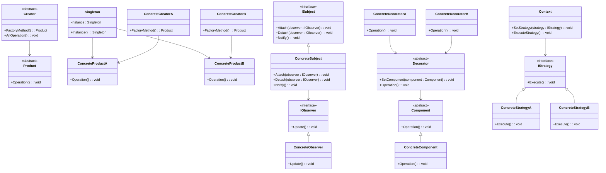

## 1.5 Benefits of Using Design Patterns in C#

Design patterns are a crucial aspect of software engineering, providing a proven solution to common problems in software design. In the context of C# programming, design patterns offer numerous benefits that enhance the quality and maintainability of code. This section delves into the advantages of applying design patterns in C#, focusing on enhancing code reuse, scalability, and robustness.

### Enhancing Code Reuse

One of the primary benefits of using design patterns in C# is the enhancement of code reuse. Design patterns provide a template for solving recurring design problems, allowing developers to leverage existing solutions rather than reinventing the wheel. This not only saves time but also ensures that the solutions are tried and tested.

#### Example: Singleton Pattern

The Singleton pattern is a classic example of a design pattern that promotes code reuse. It ensures that a class has only one instance and provides a global point of access to it. This pattern is particularly useful in scenarios where a single instance of a class is required, such as in logging, configuration settings, or database connections.

```csharp
public sealed class Singleton
{
    private static Singleton instance = null;
    private static readonly object padlock = new object();

    Singleton() { }

    public static Singleton Instance
    {
        get
        {
            lock (padlock)
            {
                if (instance == null)
                {
                    instance = new Singleton();
                }
                return instance;
            }
        }
    }
}
```

In this example, the Singleton pattern ensures that the `Singleton` class has only one instance, which can be reused throughout the application. This reduces the need to create multiple instances, thereby enhancing code reuse.

### Improving Scalability

Design patterns also play a significant role in improving the scalability of applications. By providing a structured approach to software design, patterns help developers create systems that can easily adapt to changing requirements and increased loads.

#### Example: Factory Method Pattern

The Factory Method pattern is a creational pattern that provides an interface for creating objects in a superclass but allows subclasses to alter the type of objects that will be created. This pattern is particularly useful in scenarios where the system needs to be scalable and flexible.

```csharp
public abstract class Product
{
    public abstract void Operation();
}

public class ConcreteProductA : Product
{
    public override void Operation()
    {
        Console.WriteLine("Operation of ConcreteProductA");
    }
}

public class ConcreteProductB : Product
{
    public override void Operation()
    {
        Console.WriteLine("Operation of ConcreteProductB");
    }
}

public abstract class Creator
{
    public abstract Product FactoryMethod();

    public void AnOperation()
    {
        var product = FactoryMethod();
        product.Operation();
    }
}

public class ConcreteCreatorA : Creator
{
    public override Product FactoryMethod()
    {
        return new ConcreteProductA();
    }
}

public class ConcreteCreatorB : Creator
{
    public override Product FactoryMethod()
    {
        return new ConcreteProductB();
    }
}
```

In this example, the Factory Method pattern allows the creation of different types of products without specifying their concrete classes. This makes the system scalable, as new product types can be added without modifying existing code.

### Enhancing Robustness

Robustness refers to the ability of a system to handle errors and unexpected situations gracefully. Design patterns contribute to the robustness of a system by promoting best practices and providing a clear structure for handling common problems.

#### Example: Observer Pattern

The Observer pattern is a behavioral pattern that defines a one-to-many dependency between objects so that when one object changes state, all its dependents are notified and updated automatically. This pattern is useful in scenarios where multiple objects need to be informed about changes in another object.

```csharp
public interface IObserver
{
    void Update();
}

public class ConcreteObserver : IObserver
{
    public void Update()
    {
        Console.WriteLine("Observer updated");
    }
}

public interface ISubject
{
    void Attach(IObserver observer);
    void Detach(IObserver observer);
    void Notify();
}

public class ConcreteSubject : ISubject
{
    private List<IObserver> observers = new List<IObserver>();

    public void Attach(IObserver observer)
    {
        observers.Add(observer);
    }

    public void Detach(IObserver observer)
    {
        observers.Remove(observer);
    }

    public void Notify()
    {
        foreach (var observer in observers)
        {
            observer.Update();
        }
    }
}
```

In this example, the Observer pattern ensures that all observers are notified of changes in the subject. This enhances the robustness of the system by providing a structured way to manage dependencies and updates.

### Promoting Maintainability

Design patterns promote maintainability by providing a clear and consistent structure for software design. This makes it easier for developers to understand, modify, and extend the codebase.

#### Example: Decorator Pattern

The Decorator pattern is a structural pattern that allows behavior to be added to individual objects, either statically or dynamically, without affecting the behavior of other objects from the same class. This pattern is useful in scenarios where the system needs to be easily extendable.

```csharp
public abstract class Component
{
    public abstract void Operation();
}

public class ConcreteComponent : Component
{
    public override void Operation()
    {
        Console.WriteLine("ConcreteComponent Operation");
    }
}

public abstract class Decorator : Component
{
    protected Component component;

    public void SetComponent(Component component)
    {
        this.component = component;
    }

    public override void Operation()
    {
        if (component != null)
        {
            component.Operation();
        }
    }
}

public class ConcreteDecoratorA : Decorator
{
    public override void Operation()
    {
        base.Operation();
        Console.WriteLine("ConcreteDecoratorA Operation");
    }
}

public class ConcreteDecoratorB : Decorator
{
    public override void Operation()
    {
        base.Operation();
        Console.WriteLine("ConcreteDecoratorB Operation");
    }
}
```

In this example, the Decorator pattern allows additional behavior to be added to `ConcreteComponent` objects without modifying their structure. This promotes maintainability by making it easy to add new functionality without altering existing code.

### Facilitating Communication

Design patterns facilitate communication among developers by providing a common vocabulary for discussing design solutions. This improves collaboration and reduces misunderstandings, leading to more efficient development processes.

#### Example: Strategy Pattern

The Strategy pattern is a behavioral pattern that defines a family of algorithms, encapsulates each one, and makes them interchangeable. This pattern is useful in scenarios where multiple algorithms are available for a specific task, and the best one needs to be selected at runtime.

```csharp
public interface IStrategy
{
    void Execute();
}

public class ConcreteStrategyA : IStrategy
{
    public void Execute()
    {
        Console.WriteLine("Executing Strategy A");
    }
}

public class ConcreteStrategyB : IStrategy
{
    public void Execute()
    {
        Console.WriteLine("Executing Strategy B");
    }
}

public class Context
{
    private IStrategy strategy;

    public void SetStrategy(IStrategy strategy)
    {
        this.strategy = strategy;
    }

    public void ExecuteStrategy()
    {
        strategy.Execute();
    }
}
```

In this example, the Strategy pattern allows different algorithms to be selected and executed at runtime. This facilitates communication by providing a clear structure for implementing and discussing different strategies.

### Visualizing the Benefits of Design Patterns

To better understand the benefits of design patterns, let's visualize the relationships and interactions between different patterns using a class diagram.



This diagram illustrates how different design patterns interact and contribute to the overall architecture of a system. By visualizing these relationships, we can better understand the benefits of using design patterns in C#.

### Try It Yourself

To fully grasp the benefits of design patterns, it's essential to experiment with the examples provided. Try modifying the code to suit different scenarios or requirements. For instance, you can:

- Add new product types to the Factory Method pattern.
- Implement additional observers in the Observer pattern.
- Create new decorators in the Decorator pattern.
- Develop additional strategies in the Strategy pattern.

By experimenting with these patterns, you'll gain a deeper understanding of their benefits and how they can be applied in real-world scenarios.

### Knowledge Check

Let's reinforce what we've learned with some questions and exercises:

1. **What is the primary benefit of using the Singleton pattern?**
   - [ ] It allows multiple instances of a class.
   - [x] It ensures a class has only one instance.
   - [ ] It provides an interface for creating objects.
   - [ ] It defines a family of algorithms.

2. **How does the Factory Method pattern improve scalability?**
   - [ ] By allowing multiple instances of a class.
   - [x] By providing an interface for creating objects without specifying their concrete classes.
   - [ ] By defining a one-to-many dependency between objects.
   - [ ] By adding behavior to individual objects.

3. **What is the role of the Observer pattern in enhancing robustness?**
   - [ ] It allows multiple instances of a class.
   - [ ] It provides an interface for creating objects.
   - [x] It defines a one-to-many dependency between objects.
   - [ ] It adds behavior to individual objects.

4. **How does the Decorator pattern promote maintainability?**
   - [ ] By ensuring a class has only one instance.
   - [ ] By providing an interface for creating objects.
   - [ ] By defining a one-to-many dependency between objects.
   - [x] By allowing behavior to be added to individual objects without affecting others.

5. **What is the primary benefit of the Strategy pattern in facilitating communication?**
   - [ ] It ensures a class has only one instance.
   - [ ] It provides an interface for creating objects.
   - [x] It defines a family of algorithms and makes them interchangeable.
   - [ ] It adds behavior to individual objects.

### Conclusion

Design patterns are an invaluable tool for C# developers, offering numerous benefits that enhance code reuse, scalability, robustness, maintainability, and communication. By understanding and applying these patterns, developers can create high-quality, maintainable, and scalable software solutions. Remember, this is just the beginning. As you progress, you'll discover even more ways to leverage design patterns in your projects. Keep experimenting, stay curious, and enjoy the journey!

## Quiz Time!



### What is the primary benefit of using the Singleton pattern?

- [x] It ensures a class has only one instance.
- [ ] It allows multiple instances of a class.
- [ ] It provides an interface for creating objects.
- [ ] It defines a family of algorithms.

> **Explanation:** The Singleton pattern ensures that a class has only one instance and provides a global point of access to it.

### How does the Factory Method pattern improve scalability?

- [x] By providing an interface for creating objects without specifying their concrete classes.
- [ ] By allowing multiple instances of a class.
- [ ] By defining a one-to-many dependency between objects.
- [ ] By adding behavior to individual objects.

> **Explanation:** The Factory Method pattern improves scalability by allowing new product types to be added without modifying existing code.

### What is the role of the Observer pattern in enhancing robustness?

- [x] It defines a one-to-many dependency between objects.
- [ ] It allows multiple instances of a class.
- [ ] It provides an interface for creating objects.
- [ ] It adds behavior to individual objects.

> **Explanation:** The Observer pattern enhances robustness by providing a structured way to manage dependencies and updates.

### How does the Decorator pattern promote maintainability?

- [x] By allowing behavior to be added to individual objects without affecting others.
- [ ] By ensuring a class has only one instance.
- [ ] By providing an interface for creating objects.
- [ ] By defining a one-to-many dependency between objects.

> **Explanation:** The Decorator pattern promotes maintainability by making it easy to add new functionality without altering existing code.

### What is the primary benefit of the Strategy pattern in facilitating communication?

- [x] It defines a family of algorithms and makes them interchangeable.
- [ ] It ensures a class has only one instance.
- [ ] It provides an interface for creating objects.
- [ ] It adds behavior to individual objects.

> **Explanation:** The Strategy pattern facilitates communication by providing a clear structure for implementing and discussing different strategies.

### Which pattern is useful for ensuring a single instance of a class?

- [x] Singleton Pattern
- [ ] Factory Method Pattern
- [ ] Observer Pattern
- [ ] Decorator Pattern

> **Explanation:** The Singleton pattern is specifically designed to ensure that a class has only one instance.

### Which pattern allows behavior to be added to individual objects?

- [x] Decorator Pattern
- [ ] Singleton Pattern
- [ ] Factory Method Pattern
- [ ] Observer Pattern

> **Explanation:** The Decorator pattern allows behavior to be added to individual objects without affecting the behavior of other objects from the same class.

### Which pattern defines a one-to-many dependency between objects?

- [x] Observer Pattern
- [ ] Singleton Pattern
- [ ] Factory Method Pattern
- [ ] Decorator Pattern

> **Explanation:** The Observer pattern defines a one-to-many dependency between objects so that when one object changes state, all its dependents are notified and updated automatically.

### Which pattern provides an interface for creating objects?

- [x] Factory Method Pattern
- [ ] Singleton Pattern
- [ ] Observer Pattern
- [ ] Decorator Pattern

> **Explanation:** The Factory Method pattern provides an interface for creating objects in a superclass but allows subclasses to alter the type of objects that will be created.

### True or False: Design patterns facilitate communication among developers by providing a common vocabulary for discussing design solutions.

- [x] True
- [ ] False

> **Explanation:** Design patterns facilitate communication among developers by providing a common vocabulary for discussing design solutions, improving collaboration and reducing misunderstandings.


