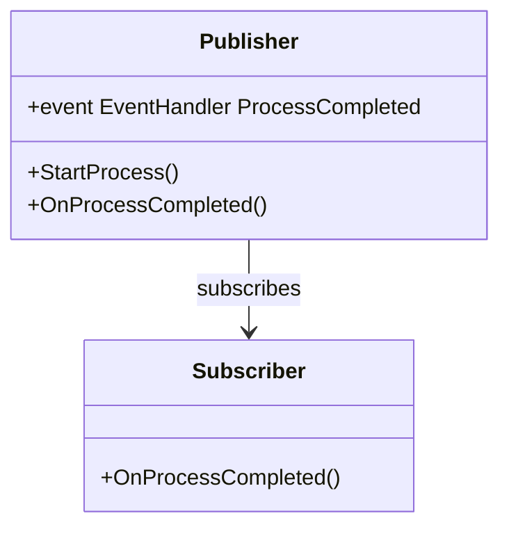
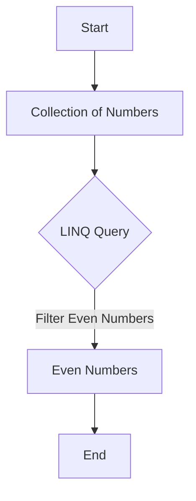

## 1.6 Overview of C# Features Relevant to Design Patterns

In the realm of software development, design patterns serve as blueprints for solving common problems. C#, a versatile and powerful language, provides a rich set of features that make implementing these patterns both intuitive and efficient. In this section, we will delve into the C#-specific features that facilitate the implementation of design patterns, including delegates, events, LINQ, async/await, and reflection. By understanding these features, you will be better equipped to leverage design patterns in your C# applications, creating robust, scalable, and maintainable solutions.

### Delegates and Events

Delegates and events are fundamental to C#'s approach to handling method references and event-driven programming. They are particularly useful in implementing behavioral design patterns such as Observer and Command.

#### Delegates

A delegate in C# is a type that represents references to methods with a specific parameter list and return type. Delegates are similar to function pointers in C++ but are type-safe and secure.

**Key Characteristics of Delegates:**

- **Type Safety:** Delegates ensure that the method signature matches the delegate signature, providing compile-time checking.
- **Multicast Capability:** Delegates can hold references to more than one method, allowing multiple methods to be called on a single event.
- **Anonymous Methods and Lambda Expressions:** Delegates can be used with anonymous methods and lambda expressions, providing flexibility and reducing boilerplate code.

**Example: Using Delegates**

```csharp
// Define a delegate
public delegate void Notify(string message);

public class Process
{
    // Declare a delegate instance
    public Notify ProcessCompleted;

    public void StartProcess()
    {
        Console.WriteLine("Process Started.");
        // Simulate some work
        Thread.Sleep(2000);
        // Notify subscribers
        ProcessCompleted?.Invoke("Process Completed Successfully.");
    }
}

public class Program
{
    public static void Main()
    {
        Process process = new Process();
        // Subscribe to the delegate
        process.ProcessCompleted += DisplayMessage;
        process.StartProcess();
    }

    public static void DisplayMessage(string message)
    {
        Console.WriteLine(message);
    }
}
```

In this example, the `Notify` delegate is used to notify subscribers when a process is completed. The `ProcessCompleted` delegate is invoked to call the `DisplayMessage` method.

#### Events

Events in C# are built on top of delegates and provide a way to notify multiple subscribers about changes or actions. They are essential in implementing the Observer pattern, where an object (subject) notifies other objects (observers) about changes in its state.

**Example: Using Events**

```csharp
public class Publisher
{
    // Declare an event using EventHandler delegate
    public event EventHandler ProcessCompleted;

    public void StartProcess()
    {
        Console.WriteLine("Process Started.");
        Thread.Sleep(2000);
        // Raise the event
        OnProcessCompleted(EventArgs.Empty);
    }

    protected virtual void OnProcessCompleted(EventArgs e)
    {
        ProcessCompleted?.Invoke(this, e);
    }
}

public class Subscriber
{
    public void OnProcessCompleted(object sender, EventArgs e)
    {
        Console.WriteLine("Subscriber received notification: Process Completed.");
    }
}

public class Program
{
    public static void Main()
    {
        Publisher publisher = new Publisher();
        Subscriber subscriber = new Subscriber();

        // Subscribe to the event
        publisher.ProcessCompleted += subscriber.OnProcessCompleted;
        publisher.StartProcess();
    }
}
```

Here, the `Publisher` class raises an event `ProcessCompleted`, which the `Subscriber` class listens to. This pattern is commonly used in GUI applications and event-driven systems.

### LINQ (Language Integrated Query)

LINQ is a powerful feature in C# that allows querying of collections in a declarative manner. It is particularly useful in implementing patterns that involve data manipulation, such as the Repository pattern.

**Key Features of LINQ:**

- **Declarative Syntax:** LINQ provides a SQL-like syntax for querying collections, making the code more readable and maintainable.
- **Strongly Typed:** LINQ queries are checked at compile-time, reducing runtime errors.
- **Integration with C# Collections:** LINQ can be used with arrays, lists, and other collections, as well as with databases and XML.

**Example: Using LINQ**

```csharp
using System;
using System.Collections.Generic;
using System.Linq;

public class Program
{
    public static void Main()
    {
        List<int> numbers = new List<int> { 1, 2, 3, 4, 5, 6, 7, 8, 9, 10 };

        // LINQ query to select even numbers
        var evenNumbers = from num in numbers
                          where num % 2 == 0
                          select num;

        Console.WriteLine("Even Numbers:");
        foreach (var num in evenNumbers)
        {
            Console.WriteLine(num);
        }
    }
}
```

In this example, LINQ is used to filter even numbers from a list. The declarative syntax makes the query concise and easy to understand.

### Async/Await

Asynchronous programming is crucial for building responsive applications. The async/await pattern in C# simplifies asynchronous code, making it easier to read and maintain. This feature is particularly useful in implementing patterns that involve concurrency, such as the Reactor pattern.

**Key Features of Async/Await:**

- **Simplified Asynchronous Code:** Async/await allows writing asynchronous code that looks like synchronous code, improving readability.
- **Non-blocking Operations:** Async/await enables non-blocking operations, allowing applications to remain responsive.
- **Error Handling:** Async/await integrates with try/catch blocks, providing a straightforward way to handle exceptions in asynchronous code.

**Example: Using Async/Await**

```csharp
using System;
using System.Net.Http;
using System.Threading.Tasks;

public class Program
{
    public static async Task Main()
    {
        string url = "https://api.github.com";
        string result = await FetchDataAsync(url);
        Console.WriteLine(result);
    }

    public static async Task<string> FetchDataAsync(string url)
    {
        using HttpClient client = new HttpClient();
        client.DefaultRequestHeaders.UserAgent.TryParseAdd("request");
        HttpResponseMessage response = await client.GetAsync(url);
        response.EnsureSuccessStatusCode();
        return await response.Content.ReadAsStringAsync();
    }
}
```

In this example, the `FetchDataAsync` method fetches data from a URL asynchronously. The `await` keyword is used to wait for the completion of the `GetAsync` and `ReadAsStringAsync` methods without blocking the main thread.

### Reflection

Reflection in C# provides the ability to inspect and interact with object types and members at runtime. It is a powerful feature used in implementing patterns that require dynamic behavior, such as the Factory pattern and Dependency Injection.

**Key Features of Reflection:**

- **Runtime Type Information:** Reflection allows retrieving metadata about types, methods, properties, and fields at runtime.
- **Dynamic Invocation:** Reflection can be used to dynamically invoke methods and access properties, enabling flexible and adaptable code.
- **Assembly Inspection:** Reflection can inspect assemblies, allowing for dynamic loading and execution of code.

**Example: Using Reflection**

```csharp
using System;
using System.Reflection;

public class SampleClass
{
    public void DisplayMessage()
    {
        Console.WriteLine("Hello from SampleClass!");
    }
}

public class Program
{
    public static void Main()
    {
        // Load the assembly containing the SampleClass
        Assembly assembly = Assembly.GetExecutingAssembly();
        // Get the type of SampleClass
        Type sampleType = assembly.GetType("SampleClass");
        // Create an instance of SampleClass
        object sampleInstance = Activator.CreateInstance(sampleType);
        // Get the method info for DisplayMessage
        MethodInfo methodInfo = sampleType.GetMethod("DisplayMessage");
        // Invoke the method
        methodInfo.Invoke(sampleInstance, null);
    }
}
```

In this example, reflection is used to dynamically create an instance of `SampleClass` and invoke its `DisplayMessage` method. This approach is useful in scenarios where types and methods are not known at compile time.

### Try It Yourself

To deepen your understanding of these C# features, try modifying the code examples provided. For instance, experiment with different LINQ queries, create your own events and delegates, or explore additional methods available through reflection. By actively engaging with the code, you'll gain a more intuitive grasp of how these features integrate with design patterns.

### Visualizing C# Features

To better understand how these features interact with design patterns, let's visualize some of the concepts using Mermaid.js diagrams.

#### Visualizing Delegates and Events



**Diagram Description:** This class diagram illustrates the relationship between the `Publisher` and `Subscriber` classes, showing how the `Subscriber` subscribes to the `Publisher`'s `ProcessCompleted` event.

#### Visualizing LINQ Query Flow



**Diagram Description:** This flowchart represents the flow of a LINQ query, starting with a collection of numbers, applying a filter to select even numbers, and ending with the filtered result.

### References and Links

For further reading on C# features and design patterns, consider exploring the following resources:

- [Microsoft Docs: C# Programming Guide](https://docs.microsoft.com/en-us/dotnet/csharp/)
- [C# in Depth by Jon Skeet](https://www.manning.com/books/c-sharp-in-depth)
- [Design Patterns: Elements of Reusable Object-Oriented Software](https://www.amazon.com/Design-Patterns-Elements-Reusable-Object-Oriented/dp/0201633612)

### Knowledge Check

To reinforce your understanding of C# features relevant to design patterns, consider the following questions:

1. How do delegates and events facilitate the implementation of the Observer pattern?
2. What are the benefits of using LINQ for data manipulation in C#?
3. How does async/await improve the readability and maintainability of asynchronous code?
4. In what scenarios is reflection particularly useful in C#?
5. How can you modify the provided code examples to explore additional features of C#?

### Embrace the Journey

Remember, mastering C# features and design patterns is a journey. As you continue to explore and experiment with these concepts, you'll gain deeper insights and develop more sophisticated solutions. Keep pushing the boundaries of what's possible with C#, and enjoy the process of learning and growing as a developer.

## Quiz Time!



### What is a delegate in C#?

- [x] A type that represents references to methods with a specific parameter list and return type
- [ ] A class that handles exceptions
- [ ] A method that performs asynchronous operations
- [ ] A collection of data

> **Explanation:** A delegate is a type that represents references to methods with a specific parameter list and return type, providing type safety and multicast capabilities.

### How do events in C# relate to delegates?

- [x] Events are built on top of delegates and provide a way to notify multiple subscribers
- [ ] Events are a type of delegate that only allows one subscriber
- [ ] Events are unrelated to delegates
- [ ] Events are used to handle exceptions

> **Explanation:** Events in C# are built on top of delegates and provide a mechanism for notifying multiple subscribers about changes or actions.

### What is the primary benefit of using LINQ in C#?

- [x] It provides a declarative syntax for querying collections
- [ ] It allows for dynamic method invocation
- [ ] It simplifies asynchronous programming
- [ ] It handles exceptions more efficiently

> **Explanation:** LINQ provides a declarative syntax for querying collections, making the code more readable and maintainable.

### What does the async/await pattern in C# enable?

- [x] Writing asynchronous code that looks like synchronous code
- [ ] Dynamic method invocation
- [ ] Declarative data querying
- [ ] Exception handling

> **Explanation:** The async/await pattern in C# enables writing asynchronous code that looks like synchronous code, improving readability and maintainability.

### In what scenarios is reflection particularly useful?

- [x] When types and methods are not known at compile time
- [ ] When handling exceptions
- [ ] When querying collections
- [ ] When performing asynchronous operations

> **Explanation:** Reflection is particularly useful when types and methods are not known at compile time, allowing for dynamic behavior.

### What is a key characteristic of delegates in C#?

- [x] Type safety
- [ ] Exception handling
- [ ] Asynchronous execution
- [ ] Data querying

> **Explanation:** Delegates in C# provide type safety, ensuring that the method signature matches the delegate signature.

### How can LINQ improve code readability?

- [x] By providing a SQL-like syntax for querying collections
- [ ] By allowing dynamic method invocation
- [ ] By simplifying exception handling
- [ ] By enabling asynchronous operations

> **Explanation:** LINQ improves code readability by providing a SQL-like syntax for querying collections, making the code more concise and understandable.

### What is the role of the `await` keyword in C#?

- [x] It waits for the completion of an asynchronous operation without blocking the main thread
- [ ] It handles exceptions in asynchronous code
- [ ] It queries collections
- [ ] It dynamically invokes methods

> **Explanation:** The `await` keyword in C# waits for the completion of an asynchronous operation without blocking the main thread, allowing for non-blocking operations.

### How does reflection enable flexible code?

- [x] By allowing dynamic invocation of methods and access to properties
- [ ] By providing a declarative syntax for data querying
- [ ] By simplifying asynchronous programming
- [ ] By handling exceptions

> **Explanation:** Reflection enables flexible code by allowing dynamic invocation of methods and access to properties, adapting to runtime conditions.

### True or False: Delegates can hold references to multiple methods.

- [x] True
- [ ] False

> **Explanation:** True. Delegates in C# can hold references to multiple methods, allowing for multicast capabilities.




