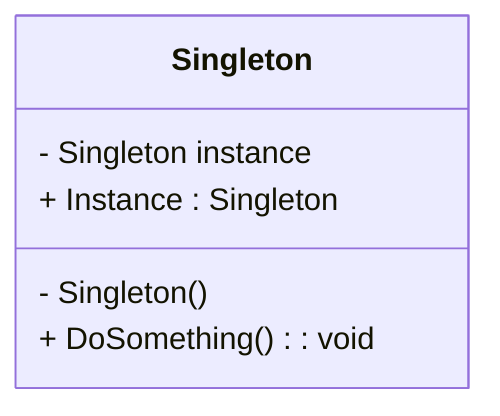
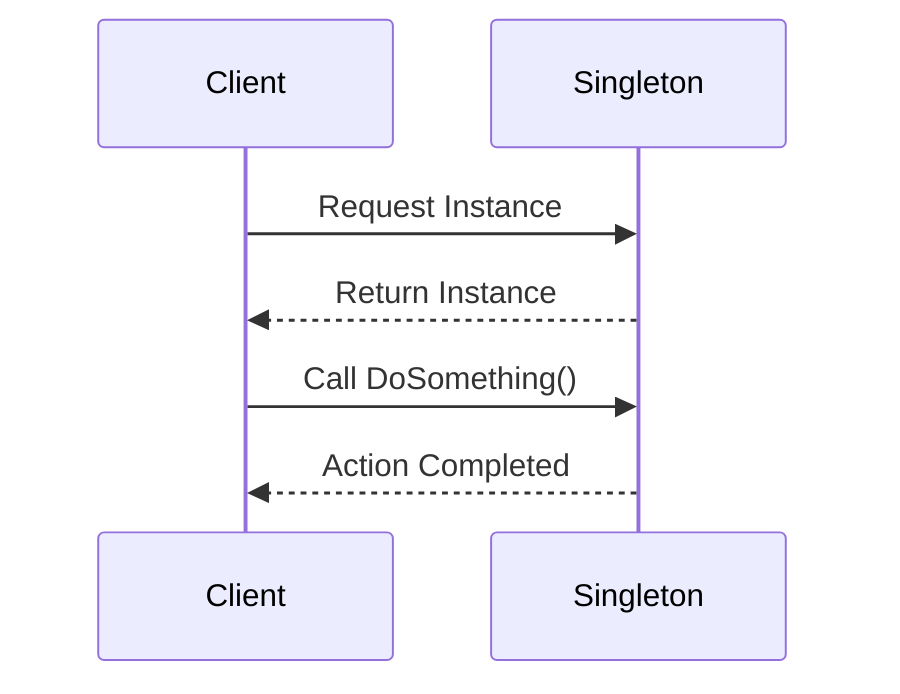

## 1.7 How to Use This Guide

Welcome to the "Mastering C# Design Patterns: Comprehensive Guide for Expert Software Engineers & Enterprise Architects." This guide is meticulously crafted to enhance your understanding of C# design patterns, helping you build scalable, maintainable, and efficient software solutions. Whether you're an expert software engineer or an enterprise architect, this guide is your companion in mastering design patterns in the .NET ecosystem.

### Understanding the Structure of the Guide

This guide is organized into distinct sections, each focusing on different aspects of design patterns and their application in C#. Here's a brief overview of what you can expect:

1. **Introduction to Design Patterns in C#:** This section lays the foundation by explaining what design patterns are, their types, history, and importance in software development. It also highlights the benefits of using design patterns in C# and provides an overview of relevant C# features.

2. **Principles of Object-Oriented Design in C#:** Dive into the core principles of object-oriented programming (OOP) and how they relate to design patterns. This section covers essential concepts like SOLID principles, DRY, KISS, and more.

3. **C# Language Features and Best Practices:** Explore the language features of C# that are crucial for implementing design patterns effectively. This section includes discussions on value types, reference types, interfaces, generics, and more.

4. **Creational, Structural, and Behavioral Design Patterns in C#:** These sections delve into specific design patterns, categorized into creational, structural, and behavioral patterns. Each pattern is explained with its intent, applicability, and sample code snippets.

5. **Idiomatic C# Patterns and Advanced Topics:** Learn about idiomatic patterns specific to C#, microservices design patterns, concurrency patterns, and functional programming patterns.

6. **Enterprise Integration, Security, and Performance Optimization Patterns:** Understand how to integrate design patterns into enterprise solutions, secure your applications, and optimize performance.

7. **Testing, Anti-Patterns, and Best Practices:** Discover how to test design patterns, avoid common anti-patterns, and adhere to best practices in software development.

8. **Case Studies and Conclusion:** Gain insights from real-world case studies and conclude your learning journey with a recap of key concepts and future trends in C# and .NET.

### Tips for Approaching the Study of Design Patterns

To maximize the value of this guide, consider the following tips:

#### 1. Start with the Basics

Begin by familiarizing yourself with the fundamental concepts of design patterns and object-oriented design principles. Understanding these basics will provide a solid foundation for exploring more complex patterns and architectures.

#### 2. Follow a Logical Progression

The guide is structured to build upon previously introduced material. Follow the sections in order to ensure a logical progression in your learning. This approach will help you connect concepts and see how they fit into the broader context of software design.

#### 3. Engage with Code Examples

Each design pattern is accompanied by clear, well-commented code examples. Engage with these examples by running them in your development environment. Experiment with modifications to deepen your understanding and see how changes affect the behavior of the pattern.

```csharp
// Example of a Singleton Design Pattern in C#
public sealed class Singleton
{
    private static readonly Singleton instance = new Singleton();

    // Private constructor ensures that the class cannot be instantiated from outside
    private Singleton() { }

    public static Singleton Instance
    {
        get
        {
            return instance;
        }
    }

    public void DoSomething()
    {
        Console.WriteLine("Singleton instance is doing something.");
    }
}

// Usage
Singleton.Instance.DoSomething();
```

#### 4. Visualize Concepts with Diagrams

Utilize the diagrams provided to visualize complex concepts and relationships between objects. Diagrams can help you grasp the structure and flow of design patterns, making them easier to understand and apply.



#### 5. Explore External Resources

Throughout the guide, you'll find hyperlinks to reputable external resources for further reading. Use these links to supplement your understanding and explore topics in greater depth.

- [C# Programming Guide - Microsoft Docs](https://docs.microsoft.com/en-us/dotnet/csharp/)
- [Design Patterns - Refactoring Guru](https://refactoring.guru/design-patterns)

#### 6. Test Your Knowledge

At the end of each section, you'll find knowledge checks and exercises. Use these to test your understanding and reinforce key concepts. Engaging with these challenges will help solidify your learning and identify areas where you may need further study.

#### 7. Embrace the Journey

Remember, mastering design patterns is a journey. Stay curious, keep experimenting, and don't hesitate to revisit sections as needed. The more you practice and apply these patterns, the more proficient you'll become in designing robust software solutions.

### Try It Yourself

To truly master design patterns, it's essential to experiment and apply what you've learned. Here are some suggestions for trying it yourself:

- **Modify Code Examples:** Take the provided code examples and modify them. Change parameters, add new methods, or integrate additional patterns to see how they interact.

- **Create Your Own Patterns:** Challenge yourself to create your own design patterns based on the principles you've learned. Consider how you can solve common problems in your projects using these patterns.

- **Collaborate with Peers:** Discuss design patterns with your peers or colleagues. Share insights, ask questions, and collaborate on projects to gain different perspectives and deepen your understanding.

### Visualizing Design Patterns

Visual aids can significantly enhance your understanding of design patterns. Here's a sample diagram illustrating the interaction between different components in a design pattern:



### References and Links

To further enrich your learning experience, explore these additional resources:

- [Gang of Four Design Patterns - Wikipedia](https://en.wikipedia.org/wiki/Design_Patterns)
- [C# Design Patterns - Pluralsight](https://www.pluralsight.com/courses/csharp-design-patterns)

### Knowledge Check

Let's reinforce your understanding with a few questions:

- What are the key benefits of using design patterns in C#?
- How do object-oriented design principles relate to design patterns?
- Why is it important to engage with code examples when learning design patterns?

### Embrace the Journey

As you embark on this journey of mastering C# design patterns, remember that learning is a continuous process. Stay curious, keep experimenting, and enjoy the journey. With dedication and practice, you'll become proficient in designing scalable and maintainable software solutions.

### Formatting and Structure

This guide is organized with clear headings and subheadings to facilitate easy navigation. Bullet points are used to break down complex information, and important terms are highlighted for emphasis.

### Writing Style

The guide is written in a collaborative tone, using first-person plural (we, let's) to create a sense of partnership in learning. Gender-neutral language is used throughout, and acronyms are defined upon first use.

### Conclusion

By following the tips and strategies outlined in this section, you'll be well-equipped to navigate and maximize the value of this guide. As you progress through the chapters, you'll gain a deeper understanding of C# design patterns and their application in enterprise-level architecture. Remember, this is just the beginning. Keep experimenting, stay curious, and enjoy the journey!

## Quiz Time!



### What is the primary purpose of this guide?

- [x] To enhance understanding of C# design patterns for expert software engineers and enterprise architects.
- [ ] To provide a basic introduction to programming in C#.
- [ ] To focus solely on the syntax of the C# language.
- [ ] To teach game development using C#.

> **Explanation:** The guide is designed to enhance understanding of C# design patterns for expert software engineers and enterprise architects.

### Which section should you start with to build a solid foundation?

- [x] Introduction to Design Patterns in C#
- [ ] Microservices Design Patterns
- [ ] Concurrency Patterns in C#
- [ ] Testing and Design Patterns

> **Explanation:** Starting with the "Introduction to Design Patterns in C#" provides a solid foundation for understanding the basics.

### How can you engage with code examples effectively?

- [x] By running them in your development environment and experimenting with modifications.
- [ ] By memorizing the code without running it.
- [ ] By ignoring the comments and focusing only on the output.
- [ ] By rewriting the code in a different language.

> **Explanation:** Engaging with code examples by running them and experimenting with modifications helps deepen understanding.

### What is the benefit of visualizing concepts with diagrams?

- [x] It helps grasp the structure and flow of design patterns.
- [ ] It makes the guide look more colorful.
- [ ] It replaces the need for code examples.
- [ ] It simplifies the text by removing explanations.

> **Explanation:** Visualizing concepts with diagrams helps grasp the structure and flow of design patterns.

### Why should you explore external resources?

- [x] To supplement understanding and explore topics in greater depth.
- [ ] To find shortcuts to complete the guide faster.
- [ ] To avoid engaging with the guide's content.
- [ ] To replace the guide with other materials.

> **Explanation:** Exploring external resources supplements understanding and allows for deeper exploration of topics.

### What is the importance of testing your knowledge?

- [x] It helps reinforce key concepts and identify areas for further study.
- [ ] It allows you to skip sections of the guide.
- [ ] It is only necessary for beginners.
- [ ] It is optional and not recommended.

> **Explanation:** Testing your knowledge helps reinforce key concepts and identify areas for further study.

### How can you try it yourself effectively?

- [x] By modifying code examples and creating your own patterns.
- [ ] By reading the guide without practicing.
- [ ] By focusing only on theoretical concepts.
- [ ] By avoiding collaboration with peers.

> **Explanation:** Trying it yourself by modifying code examples and creating your own patterns enhances learning.

### What is the tone of the guide?

- [x] Collaborative and supportive.
- [ ] Formal and rigid.
- [ ] Casual and unstructured.
- [ ] Critical and judgmental.

> **Explanation:** The guide is written in a collaborative and supportive tone to encourage learning.

### What should you do if you encounter complex information?

- [x] Break it down using bullet points and diagrams.
- [ ] Skip it and move to the next section.
- [ ] Memorize it without understanding.
- [ ] Ignore it and focus on easier topics.

> **Explanation:** Breaking down complex information using bullet points and diagrams aids understanding.

### True or False: The guide uses gender-specific pronouns.

- [ ] True
- [x] False

> **Explanation:** The guide uses gender-neutral language throughout.




