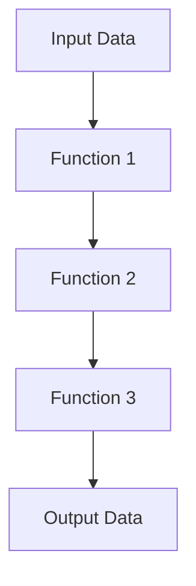

## 10.1 Introduction to Functional Programming in C#

Functional programming (FP) is a programming paradigm that treats computation as the evaluation of mathematical functions and avoids changing-state and mutable data. In this section, we will delve into the fundamentals of functional programming in C#, contrast it with object-oriented programming (OOP), and explore its benefits in modern C# applications.

### Understanding Functional Programming

Functional programming is centered around the idea of building software by composing pure functions, avoiding shared state, mutable data, and side-effects. Let's break down these concepts:

- **Pure Functions**: Functions that, given the same input, will always return the same output and have no side-effects (e.g., modifying a global variable or outputting to the console).
- **Immutability**: Data is immutable, meaning once a data structure is created, it cannot be changed. This leads to safer code that is easier to reason about.
- **First-Class and Higher-Order Functions**: Functions are first-class citizens in FP, meaning they can be passed as arguments, returned from other functions, and assigned to variables. Higher-order functions are functions that take other functions as arguments or return them as results.
- **Function Composition**: The process of combining two or more functions to produce a new function or perform some computation.

### Contrast with Object-Oriented Programming

Object-oriented programming (OOP) and functional programming (FP) are two of the most prominent programming paradigms. While OOP is centered around objects and encapsulation, FP focuses on functions and immutability. Here are some key contrasts:

- **State Management**: OOP manages state through objects and their lifecycle, whereas FP emphasizes statelessness and immutability.
- **Data and Behavior**: In OOP, data and behavior are encapsulated within objects. In FP, data and behavior are separate, with functions operating on data.
- **Side-Effects**: OOP often involves side-effects due to mutable state, while FP strives to minimize side-effects through pure functions.
- **Concurrency**: FP naturally supports concurrent programming due to its stateless nature, making it easier to write parallel and concurrent code.

### Benefits of Functional Programming in C#

Functional programming offers several benefits that can enhance your C# applications:

- **Improved Readability and Maintainability**: Pure functions and immutability lead to code that is easier to read, understand, and maintain.
- **Easier Debugging and Testing**: With pure functions, you can test functions in isolation without worrying about the state of the system.
- **Concurrency and Parallelism**: FP's stateless nature makes it easier to write concurrent and parallel code, which is crucial for modern applications.
- **Modular and Composable Code**: FP encourages writing small, reusable functions that can be composed to build complex functionality.

### Key Functional Programming Concepts in C#

C# has evolved to support functional programming concepts, making it a versatile language for both OOP and FP. Let's explore some key FP concepts in C#:

#### Lambda Expressions

Lambda expressions are a concise way to represent anonymous functions. They are used extensively in C# for functional programming.

```csharp
// A simple lambda expression that adds two numbers
Func<int, int, int> add = (x, y) => x + y;
Console.WriteLine(add(3, 4)); // Output: 7
```

#### Delegates and Events

Delegates are type-safe function pointers that allow methods to be passed as parameters. They are fundamental to functional programming in C#.

```csharp
// Define a delegate
public delegate int Operation(int x, int y);

// Use the delegate
Operation multiply = (x, y) => x * y;
Console.WriteLine(multiply(3, 4)); // Output: 12
```

#### LINQ (Language Integrated Query)

LINQ is a powerful feature in C# that allows querying of collections using a functional syntax. It is a prime example of FP in C#.

```csharp
// Using LINQ to filter and project a list
var numbers = new List<int> { 1, 2, 3, 4, 5 };
var evenNumbers = numbers.Where(n => n % 2 == 0).Select(n => n);
foreach (var num in evenNumbers)
{
    Console.WriteLine(num); // Output: 2, 4
}
```

#### Immutable Data Structures

C# supports immutable data structures, which are crucial for functional programming. The `System.Collections.Immutable` namespace provides immutable collections.

```csharp
using System.Collections.Immutable;

// Create an immutable list
var immutableList = ImmutableList.Create(1, 2, 3);
var newList = immutableList.Add(4);
Console.WriteLine(string.Join(", ", newList)); // Output: 1, 2, 3, 4
```

### Visualizing Functional Programming Concepts

To better understand the flow of functional programming, let's visualize a simple function composition using a flowchart.



**Figure 1**: This flowchart represents the composition of three functions, where the output of one function becomes the input of the next.

### Try It Yourself

To solidify your understanding of functional programming in C#, try modifying the code examples above. For instance, create a new lambda expression that performs subtraction, or use LINQ to find odd numbers in a list. Experiment with immutable collections by adding and removing elements.

### Knowledge Check

- Explain the difference between pure functions and impure functions.
- Describe how immutability can lead to safer code.
- Provide an example of a higher-order function in C#.
- Discuss the benefits of using LINQ in C# applications.

### Embrace the Journey

Remember, mastering functional programming in C# is a journey. As you explore these concepts, you'll discover new ways to write cleaner, more efficient code. Keep experimenting, stay curious, and enjoy the process of learning and applying functional programming in your C# projects.

### References and Further Reading

- [Microsoft Docs: Functional Programming in C#](https://docs.microsoft.com/en-us/dotnet/csharp/functional-programming)
- [LINQ (Language Integrated Query) Overview](https://docs.microsoft.com/en-us/dotnet/csharp/programming-guide/concepts/linq/)
- [System.Collections.Immutable Namespace](https://docs.microsoft.com/en-us/dotnet/api/system.collections.immutable)

## Quiz Time!



### What is a pure function?

- [x] A function that always produces the same output for the same input and has no side-effects.
- [ ] A function that modifies global variables.
- [ ] A function that can return different outputs for the same input.
- [ ] A function that relies on external state.

> **Explanation:** A pure function is one that, given the same input, will always return the same output and does not cause any side-effects.

### Which of the following is a key characteristic of functional programming?

- [x] Immutability
- [ ] Encapsulation
- [ ] Inheritance
- [ ] Polymorphism

> **Explanation:** Immutability is a core principle of functional programming, emphasizing that data should not be changed after it is created.

### What is a higher-order function?

- [x] A function that takes other functions as arguments or returns them as results.
- [ ] A function that is defined inside another function.
- [ ] A function that modifies its arguments.
- [ ] A function that is called multiple times.

> **Explanation:** Higher-order functions are those that can take other functions as parameters or return them as results, enabling function composition and reuse.

### How does functional programming handle state?

- [x] By avoiding shared state and using immutable data.
- [ ] By encapsulating state within objects.
- [ ] By using global variables.
- [ ] By frequently modifying state.

> **Explanation:** Functional programming avoids shared state and prefers immutable data to ensure safer and more predictable code.

### What is the benefit of using LINQ in C#?

- [x] It provides a functional syntax for querying collections.
- [ ] It allows for direct manipulation of database tables.
- [ ] It replaces the need for loops entirely.
- [ ] It is only used for XML data manipulation.

> **Explanation:** LINQ provides a functional and declarative syntax for querying collections, making code more readable and expressive.

### Which of the following is NOT a feature of functional programming?

- [ ] Pure functions
- [ ] Immutability
- [x] Mutable state
- [ ] First-class functions

> **Explanation:** Mutable state is not a feature of functional programming; instead, FP emphasizes immutability.

### What is function composition?

- [x] Combining two or more functions to produce a new function.
- [ ] Writing functions inside other functions.
- [ ] Using functions to modify global state.
- [ ] Creating functions that return void.

> **Explanation:** Function composition involves combining multiple functions to create a new function, allowing for modular and reusable code.

### What is the role of delegates in C# functional programming?

- [x] They act as type-safe function pointers, allowing methods to be passed as parameters.
- [ ] They are used to define classes.
- [ ] They encapsulate data and behavior.
- [ ] They are used for exception handling.

> **Explanation:** Delegates in C# are type-safe function pointers that enable methods to be passed as parameters, crucial for functional programming.

### Which C# feature allows for concise representation of anonymous functions?

- [x] Lambda expressions
- [ ] Abstract classes
- [ ] Interfaces
- [ ] Constructors

> **Explanation:** Lambda expressions provide a concise way to represent anonymous functions in C#.

### True or False: Functional programming in C# can improve code concurrency.

- [x] True
- [ ] False

> **Explanation:** Functional programming's stateless nature and emphasis on immutability make it easier to write concurrent and parallel code.


