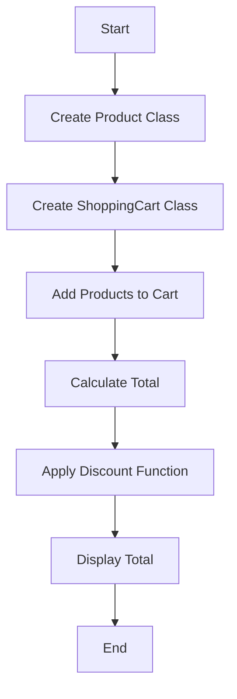

## 10.10 Functional Programming in Practice

In the ever-evolving landscape of software development, the ability to adapt and integrate various programming paradigms is crucial. C#, traditionally known for its object-oriented capabilities, has embraced functional programming (FP) concepts, allowing developers to harness the power of both paradigms. In this section, we will delve into the practical application of functional programming in C#, exploring how to combine it with object-oriented programming (OOP) to create robust, scalable, and maintainable applications.

### Combining Object-Oriented and Functional Paradigms

#### Finding the Balance Between Paradigms

Functional programming and object-oriented programming each have their strengths and weaknesses. OOP excels in modeling real-world entities and managing state, while FP shines in immutability, statelessness, and function composition. The key to mastering C# design patterns lies in finding a balance between these paradigms.

- **Immutability and State Management**: In OOP, objects often encapsulate state, which can lead to complex state management. FP encourages immutability, reducing side effects and making code easier to reason about. In C#, you can use `readonly` fields and immutable data structures to achieve this balance.

- **Encapsulation and Function Composition**: OOP's encapsulation allows for modular code, while FP's function composition promotes reusability. By combining these, you can create highly cohesive modules with reusable functions.

- **Polymorphism and Higher-Order Functions**: OOP uses polymorphism to achieve flexibility, whereas FP uses higher-order functions. C# supports both through interfaces and delegates, allowing you to choose the best tool for the job.

#### Utilizing the Best of Both Worlds

To effectively utilize both paradigms, consider the following strategies:

- **Use Classes for State and Functions for Behavior**: Encapsulate state within classes and define behavior using pure functions. This approach leverages OOP's strengths in state management and FP's strengths in behavior definition.

- **Leverage LINQ for Functional Operations**: LINQ (Language Integrated Query) is a powerful tool in C# that embodies functional programming principles. Use LINQ for data transformations, filtering, and aggregation.

- **Adopt Functional Patterns in OOP**: Implement functional patterns such as map, filter, and reduce within your OOP codebase. This can be achieved using extension methods and lambda expressions.

### Functional Libraries and Tools

#### Exploring Language Features and Extensions

C# has evolved to include numerous features that support functional programming. Let's explore some of these features:

- **Lambda Expressions**: These are anonymous functions that provide a concise way to represent small function expressions. They are essential for functional programming in C#.

  ```csharp
  Func<int, int> square = x => x * x;
  Console.WriteLine(square(5)); // Output: 25
  ```

- **Delegates and Events**: Delegates are type-safe function pointers, and events are built on top of delegates. They allow for functional-style callbacks and event handling.

  ```csharp
  public delegate void Notify(string message);
  public event Notify OnNotify;

  public void TriggerEvent()
  {
      OnNotify?.Invoke("Event triggered!");
  }
  ```

- **Pattern Matching**: Introduced in C# 7.0, pattern matching allows for more expressive and concise code, especially when dealing with complex data structures.

  ```csharp
  object obj = 42;
  if (obj is int number)
  {
      Console.WriteLine($"The number is {number}");
  }
  ```

- **Tuples and Records**: Tuples provide a lightweight way to group multiple values, while records (introduced in C# 9.0) offer a concise syntax for immutable data types.

  ```csharp
  var point = (X: 10, Y: 20);
  Console.WriteLine($"Point: {point.X}, {point.Y}");

  public record Person(string Name, int Age);
  var person = new Person("Alice", 30);
  ```

#### Using Third-Party Libraries like LanguageExt

LanguageExt is a popular library that brings functional programming constructs to C#. It provides features such as monads, functional data structures, and more.

- **Option and Either Types**: These types help handle nullability and errors without exceptions, promoting safer code.

  ```csharp
  Option<int> maybeNumber = Some(5);
  maybeNumber.Match(
      Some: x => Console.WriteLine($"Number: {x}"),
      None: () => Console.WriteLine("No number")
  );
  ```

- **Functional Collections**: LanguageExt offers immutable collections that support functional operations.

  ```csharp
  var numbers = List(1, 2, 3, 4);
  var doubled = numbers.Map(x => x * 2);
  Console.WriteLine(string.Join(", ", doubled)); // Output: 2, 4, 6, 8
  ```

- **Monad Transformers**: These allow for the composition of monadic operations, simplifying complex workflows.

  ```csharp
  var result = from x in Some(5)
               from y in Some(10)
               select x + y;
  Console.WriteLine(result); // Output: Some(15)
  ```

### Practical Examples and Code Snippets

#### Example 1: Combining OOP and FP for a Shopping Cart

Let's create a simple shopping cart application that combines OOP and FP principles.

```csharp
public class Product
{
    public string Name { get; }
    public decimal Price { get; }

    public Product(string name, decimal price)
    {
        Name = name;
        Price = price;
    }
}

public class ShoppingCart
{
    private readonly List<Product> _products = new();

    public void AddProduct(Product product) => _products.Add(product);

    public decimal CalculateTotal() => _products.Sum(p => p.Price);
}

public static class ShoppingCartExtensions
{
    public static decimal ApplyDiscount(this ShoppingCart cart, Func<decimal, decimal> discountFunc)
    {
        var total = cart.CalculateTotal();
        return discountFunc(total);
    }
}

// Usage
var cart = new ShoppingCart();
cart.AddProduct(new Product("Book", 29.99m));
cart.AddProduct(new Product("Pen", 1.99m));

var totalWithDiscount = cart.ApplyDiscount(total => total * 0.9m);
Console.WriteLine($"Total with discount: {totalWithDiscount}");
```

In this example, we use OOP to model the `Product` and `ShoppingCart` classes, while leveraging FP through the `ApplyDiscount` extension method.

#### Example 2: Using LanguageExt for Safe Data Handling

Let's explore how LanguageExt can be used to handle data safely and functionally.

```csharp
using LanguageExt;
using static LanguageExt.Prelude;

public class UserService
{
    private readonly Dictionary<int, string> _users = new()
    {
        { 1, "Alice" },
        { 2, "Bob" }
    };

    public Option<string> GetUserById(int id) =>
        _users.ContainsKey(id) ? Some(_users[id]) : None;
}

// Usage
var userService = new UserService();
var user = userService.GetUserById(1);

user.Match(
    Some: name => Console.WriteLine($"User found: {name}"),
    None: () => Console.WriteLine("User not found")
);
```

In this example, we use the `Option` type from LanguageExt to safely handle the possibility of a missing user, avoiding null reference exceptions.

### Visualizing the Integration of OOP and FP

To better understand how OOP and FP can be integrated, let's visualize the flow of a simple application that uses both paradigms.



**Figure 1**: This flowchart illustrates the process of combining OOP and FP in a shopping cart application. We start by creating classes for products and the shopping cart, add products to the cart, calculate the total, apply a discount function, and finally display the total.

### Try It Yourself

To deepen your understanding, try modifying the examples provided:

- **Experiment with Different Discount Functions**: Modify the `ApplyDiscount` method to use different discount strategies, such as fixed discounts or tiered discounts based on the total amount.

- **Extend the UserService**: Add more methods to the `UserService` class, such as updating or deleting users, and handle these operations functionally using LanguageExt.

- **Visualize Your Own Application Flow**: Use Mermaid.js to create flowcharts for your own applications, illustrating how OOP and FP are integrated.

### Knowledge Check

Before we conclude, let's reinforce what we've learned:

- **What are the benefits of combining OOP and FP in C#?**
- **How can LanguageExt enhance functional programming in C#?**
- **What are some practical applications of functional programming in C#?**

### Embrace the Journey

Remember, mastering the integration of functional programming in C# is a journey. As you continue to explore and experiment, you'll discover new ways to leverage the strengths of both paradigms. Keep pushing the boundaries, stay curious, and enjoy the process of becoming a more versatile and skilled developer.

## Quiz Time!



### What is a key benefit of combining OOP and FP in C#?

- [x] It allows for more modular and reusable code.
- [ ] It eliminates the need for classes.
- [ ] It makes code execution faster.
- [ ] It simplifies error handling.

> **Explanation:** Combining OOP and FP allows for more modular and reusable code by leveraging the strengths of both paradigms.

### Which C# feature is essential for functional programming?

- [ ] Abstract classes
- [x] Lambda expressions
- [ ] Static methods
- [ ] Interfaces

> **Explanation:** Lambda expressions are essential for functional programming as they provide a concise way to represent small function expressions.

### What does the LanguageExt library provide?

- [ ] Object-oriented design patterns
- [x] Functional programming constructs
- [ ] Database access tools
- [ ] UI components

> **Explanation:** LanguageExt provides functional programming constructs such as monads and functional data structures.

### How does the `Option` type in LanguageExt help in C#?

- [x] It handles nullability and errors without exceptions.
- [ ] It improves performance by caching results.
- [ ] It simplifies UI design.
- [ ] It enhances security by encrypting data.

> **Explanation:** The `Option` type helps handle nullability and errors without exceptions, promoting safer code.

### What is the purpose of the `ApplyDiscount` method in the shopping cart example?

- [ ] To add a new product to the cart
- [x] To apply a discount function to the total
- [ ] To remove a product from the cart
- [ ] To calculate the tax on the total

> **Explanation:** The `ApplyDiscount` method applies a discount function to the total amount in the shopping cart.

### Which of the following is a functional programming principle?

- [ ] Mutable state
- [ ] Inheritance
- [x] Immutability
- [ ] Encapsulation

> **Explanation:** Immutability is a core principle of functional programming, reducing side effects and making code easier to reason about.

### What does LINQ stand for in C#?

- [ ] Language Integrated Quality
- [x] Language Integrated Query
- [ ] Language Independent Query
- [ ] Language Integrated Queue

> **Explanation:** LINQ stands for Language Integrated Query, a powerful tool in C# that embodies functional programming principles.

### What is a higher-order function?

- [ ] A function that returns a class
- [x] A function that takes other functions as parameters or returns a function
- [ ] A function that only uses primitive types
- [ ] A function that is defined inside a class

> **Explanation:** A higher-order function is one that takes other functions as parameters or returns a function, a common concept in functional programming.

### What is the main advantage of using immutable data structures?

- [ ] They are faster to modify.
- [x] They reduce side effects and make code easier to reason about.
- [ ] They use less memory.
- [ ] They simplify inheritance hierarchies.

> **Explanation:** Immutable data structures reduce side effects and make code easier to reason about, which is a key advantage in functional programming.

### True or False: Pattern matching was introduced in C# 7.0.

- [x] True
- [ ] False

> **Explanation:** Pattern matching was indeed introduced in C# 7.0, allowing for more expressive and concise code.


