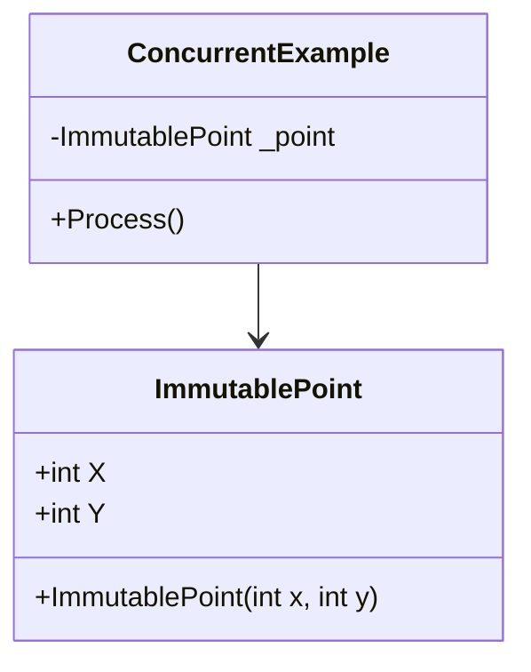

## 10.2 Immutable Data Structures

In the realm of software engineering, immutability is a concept that has gained significant traction, especially with the rise of functional programming paradigms. Immutable data structures are those that, once created, cannot be altered. This characteristic can lead to more predictable and reliable software, particularly in concurrent and parallel programming environments. In this section, we will delve into the intricacies of immutable data structures in C#, exploring how they can be implemented, their benefits, and practical use cases.

### Understanding Immutability

Immutability refers to the state of an object that cannot be modified after its creation. This concept is central to functional programming, where functions are expected to produce the same output given the same input, without side effects. Immutable data structures ensure that data remains consistent and unchanged, which simplifies reasoning about code behavior and enhances reliability.

#### Why Immutability Matters

1. **Predictability**: Immutable objects provide a guarantee that their state will not change, making it easier to predict program behavior.
2. **Thread Safety**: In concurrent applications, immutability eliminates the need for locks or other synchronization mechanisms, as immutable objects can be safely shared across threads.
3. **Simplified Debugging**: With immutable objects, developers can trace the flow of data without worrying about unexpected modifications, leading to easier debugging and maintenance.
4. **Functional Programming**: Immutability aligns with the principles of functional programming, where functions are pure and side-effect-free.

### Implementing Immutable Objects in C#

C# offers several features that facilitate the creation of immutable objects. Let's explore these features and how they can be leveraged to implement immutability.

#### Using `readonly` Fields and Properties

The `readonly` keyword in C# is used to declare fields that can only be assigned during initialization or in a constructor. This ensures that the field's value remains constant throughout the object's lifetime.

```csharp
public class ImmutablePoint
{
    public readonly int X;
    public readonly int Y;

    public ImmutablePoint(int x, int y)
    {
        X = x;
        Y = y;
    }
}
```

In this example, `ImmutablePoint` is a class with two `readonly` fields, `X` and `Y`. Once set in the constructor, these fields cannot be changed, making the `ImmutablePoint` object immutable.

#### Defining Records and Init-Only Setters in C# 9.0+

C# 9.0 introduced records, a feature designed to simplify the creation of immutable data structures. Records provide a concise syntax for defining immutable types with value-based equality semantics.

```csharp
public record ImmutablePoint(int X, int Y);
```

Records automatically generate `readonly` properties and provide built-in support for immutability. Additionally, C# 9.0 introduced init-only setters, allowing properties to be set during object initialization but not modified thereafter.

```csharp
public class ImmutableRectangle
{
    public int Width { get; init; }
    public int Height { get; init; }

    public ImmutableRectangle(int width, int height)
    {
        Width = width;
        Height = height;
    }
}
```

In this example, `ImmutableRectangle` uses init-only setters to ensure that `Width` and `Height` can only be assigned during initialization, reinforcing immutability.

### Benefits of Immutability

Immutability offers several advantages that contribute to more robust and maintainable software.

#### Avoiding Side Effects

Side effects occur when a function modifies some state outside its scope, leading to unpredictable behavior. Immutable objects prevent such modifications, ensuring that functions remain pure and side-effect-free.

#### Easier Debugging and Reasoning

With immutable objects, developers can trace the flow of data without worrying about unexpected changes. This simplifies debugging and reasoning about code, as the state of an object remains consistent throughout its lifecycle.

### Use Cases and Examples

Immutability is particularly beneficial in certain scenarios. Let's explore some common use cases where immutable data structures shine.

#### Concurrent Applications

In concurrent programming, multiple threads may attempt to access and modify shared data simultaneously. Immutability eliminates the need for locks or other synchronization mechanisms, as immutable objects can be safely shared across threads without risk of data corruption.

```csharp
public class ConcurrentExample
{
    private readonly ImmutablePoint _point = new ImmutablePoint(1, 2);

    public void Process()
    {
        // Safe to access _point from multiple threads
        Console.WriteLine($"Point: {_point.X}, {_point.Y}");
    }
}
```

In this example, `_point` is an immutable object that can be safely accessed by multiple threads without synchronization.

#### Value Objects in Domain-Driven Design

In domain-driven design (DDD), value objects are entities that represent a descriptive aspect of the domain with no conceptual identity. Immutability is a natural fit for value objects, as their state should remain constant once created.

```csharp
public record Money(decimal Amount, string Currency);
```

The `Money` record is a value object representing an amount of money in a specific currency. Its immutability ensures that once a `Money` object is created, its value cannot be altered, preserving its integrity.

### Visualizing Immutability

To better understand the concept of immutability, let's visualize how immutable objects interact within a program.



This class diagram illustrates the relationship between `ConcurrentExample` and `ImmutablePoint`. The `ConcurrentExample` class holds a reference to an `ImmutablePoint` object, which remains unchanged throughout its lifecycle.

### Try It Yourself

To deepen your understanding of immutable data structures, try modifying the code examples provided. Experiment with creating your own immutable classes using `readonly` fields, records, and init-only setters. Consider the following challenges:

1. Create an immutable class representing a 3D point with `X`, `Y`, and `Z` coordinates.
2. Implement a record type for a `Person` with immutable properties for `Name` and `Age`.
3. Explore how immutability affects performance in a multi-threaded application by comparing immutable and mutable data structures.

### Knowledge Check

Before we conclude, let's reinforce our understanding of immutable data structures with a few questions:

- What are the key benefits of using immutable data structures in concurrent applications?
- How do records in C# 9.0+ facilitate the creation of immutable objects?
- Why is immutability important in functional programming?

### Embrace the Journey

Remember, mastering immutable data structures is just one step in your journey towards becoming an expert in C# design patterns. As you continue to explore and experiment, you'll discover new ways to leverage immutability to build more reliable and maintainable software. Keep pushing the boundaries, stay curious, and enjoy the journey!

## Quiz Time!



### What is a key benefit of immutable data structures in concurrent applications?

- [x] They eliminate the need for locks or synchronization mechanisms.
- [ ] They allow for dynamic state changes.
- [ ] They reduce memory usage.
- [ ] They simplify user interface design.

> **Explanation:** Immutable data structures can be safely shared across threads without the need for locks or synchronization, as their state cannot be changed.

### How do records in C# 9.0+ facilitate immutability?

- [x] They provide a concise syntax for defining immutable types with value-based equality.
- [ ] They allow for dynamic property changes.
- [ ] They automatically implement interfaces.
- [ ] They support mutable fields by default.

> **Explanation:** Records in C# 9.0+ offer a concise way to define immutable types, automatically generating readonly properties and supporting value-based equality.

### Why is immutability important in functional programming?

- [x] It ensures functions remain pure and side-effect-free.
- [ ] It allows for dynamic state changes.
- [ ] It simplifies user interface design.
- [ ] It reduces memory usage.

> **Explanation:** Immutability aligns with functional programming principles, ensuring that functions are pure and do not produce side effects by modifying external state.

### Which C# feature allows properties to be set during initialization but not modified thereafter?

- [x] Init-only setters
- [ ] Readonly fields
- [ ] Static constructors
- [ ] Abstract properties

> **Explanation:** Init-only setters, introduced in C# 9.0, allow properties to be set during object initialization but prevent further modification, supporting immutability.

### What is a common use case for immutable data structures?

- [x] Value objects in domain-driven design
- [ ] Dynamic user interfaces
- [ ] Real-time data processing
- [ ] Memory optimization

> **Explanation:** Immutable data structures are well-suited for value objects in domain-driven design, as their state should remain constant once created.

### How do immutable objects simplify debugging?

- [x] They ensure consistent state throughout the object's lifecycle.
- [ ] They allow for dynamic state changes.
- [ ] They reduce memory usage.
- [ ] They simplify user interface design.

> **Explanation:** Immutable objects maintain a consistent state, making it easier to trace data flow and debug code without worrying about unexpected modifications.

### What keyword is used in C# to declare fields that can only be assigned during initialization or in a constructor?

- [x] readonly
- [ ] static
- [ ] const
- [ ] volatile

> **Explanation:** The `readonly` keyword is used to declare fields that can only be assigned during initialization or in a constructor, ensuring immutability.

### Which of the following is NOT a benefit of immutability?

- [ ] Predictability
- [ ] Thread safety
- [ ] Simplified debugging
- [x] Increased memory usage

> **Explanation:** While immutability offers benefits like predictability, thread safety, and simplified debugging, it can sometimes lead to increased memory usage due to the creation of new objects.

### What is a key characteristic of immutable data structures?

- [x] They cannot be altered after creation.
- [ ] They allow for dynamic state changes.
- [ ] They reduce memory usage.
- [ ] They simplify user interface design.

> **Explanation:** Immutable data structures are characterized by their inability to be altered after creation, ensuring consistent state.

### True or False: Immutability eliminates the need for locks in concurrent applications.

- [x] True
- [ ] False

> **Explanation:** True. Immutability ensures that objects cannot be changed, allowing them to be safely shared across threads without the need for locks or synchronization mechanisms.


