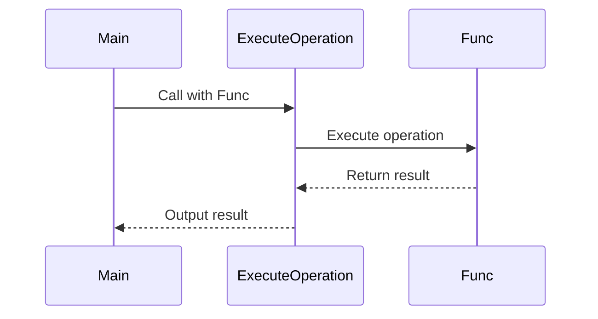

## 10.3 Higher-Order Functions and Delegates

In the realm of C# programming, understanding and leveraging higher-order functions and delegates is crucial for creating flexible, reusable, and efficient code. This section delves into the concept of treating functions as first-class citizens, implementing higher-order functions, and utilizing delegates to build robust applications. We will explore practical use cases, such as event handling and middleware pipelines, to illustrate these concepts in action.

### Functions as First-Class Citizens

In C#, functions are first-class citizens, meaning they can be passed as arguments, returned from other functions, and assigned to variables. This capability is foundational to functional programming and allows developers to write more abstract and reusable code.

#### Passing Functions as Arguments

One of the most powerful features of treating functions as first-class citizens is the ability to pass them as arguments to other functions. This allows for the creation of flexible APIs and the implementation of strategies or behaviors that can be modified at runtime.

```csharp
using System;

public class Program
{
    // A method that takes a function as a parameter
    public static void ExecuteOperation(int a, int b, Func<int, int, int> operation)
    {
        int result = operation(a, b);
        Console.WriteLine($"Result: {result}");
    }

    public static void Main()
    {
        // Passing a lambda expression as a function
        ExecuteOperation(5, 3, (x, y) => x + y); // Output: Result: 8
        ExecuteOperation(5, 3, (x, y) => x * y); // Output: Result: 15
    }
}
```

In this example, the `ExecuteOperation` method takes a `Func<int, int, int>` delegate as a parameter, allowing different operations to be passed and executed.

#### Returning Functions from Methods

Another aspect of first-class functions is the ability to return them from methods. This can be used to create factory methods or to encapsulate complex logic that can be reused.

```csharp
using System;

public class Program
{
    // A method that returns a function
    public static Func<int, int> CreateMultiplier(int factor)
    {
        return (x) => x * factor;
    }

    public static void Main()
    {
        var doubleMultiplier = CreateMultiplier(2);
        var tripleMultiplier = CreateMultiplier(3);

        Console.WriteLine(doubleMultiplier(5)); // Output: 10
        Console.WriteLine(tripleMultiplier(5)); // Output: 15
    }
}
```

Here, `CreateMultiplier` returns a function that multiplies its input by a specified factor, demonstrating how functions can be dynamically created and returned.

### Implementing Higher-Order Functions

Higher-order functions are functions that take other functions as parameters or return them as results. They are a cornerstone of functional programming and enable powerful abstractions and code reuse.

#### Utilizing `Func<>` and `Action<>` Delegates

C# provides built-in delegates such as `Func<>` and `Action<>` to facilitate the use of higher-order functions. `Func<>` is used for functions that return a value, while `Action<>` is used for functions that do not return a value.

```csharp
using System;

public class Program
{
    // A higher-order function using Func<>
    public static void ProcessNumbers(int[] numbers, Func<int, int> processor)
    {
        foreach (var number in numbers)
        {
            Console.WriteLine(processor(number));
        }
    }

    // A higher-order function using Action<>
    public static void LogNumbers(int[] numbers, Action<int> logger)
    {
        foreach (var number in numbers)
        {
            logger(number);
        }
    }

    public static void Main()
    {
        int[] numbers = { 1, 2, 3, 4, 5 };

        // Using Func<> to double each number
        ProcessNumbers(numbers, x => x * 2);

        // Using Action<> to log each number
        LogNumbers(numbers, x => Console.WriteLine($"Number: {x}"));
    }
}
```

In this example, `ProcessNumbers` uses a `Func<int, int>` to process each number, while `LogNumbers` uses an `Action<int>` to log each number.

#### Creating Flexible APIs

Higher-order functions can be used to create flexible and extensible APIs. By allowing functions to be passed as parameters, APIs can be customized and extended without modifying existing code.

```csharp
using System;
using System.Collections.Generic;

public class Program
{
    // A flexible API for filtering a list
    public static List<T> Filter<T>(List<T> items, Func<T, bool> predicate)
    {
        List<T> result = new List<T>();
        foreach (var item in items)
        {
            if (predicate(item))
            {
                result.Add(item);
            }
        }
        return result;
    }

    public static void Main()
    {
        List<int> numbers = new List<int> { 1, 2, 3, 4, 5, 6 };

        // Filtering even numbers
        var evenNumbers = Filter(numbers, x => x % 2 == 0);
        Console.WriteLine(string.Join(", ", evenNumbers)); // Output: 2, 4, 6

        // Filtering numbers greater than 3
        var greaterThanThree = Filter(numbers, x => x > 3);
        Console.WriteLine(string.Join(", ", greaterThanThree)); // Output: 4, 5, 6
    }
}
```

The `Filter` method demonstrates how higher-order functions can be used to create a flexible API for filtering lists based on different criteria.

### Use Cases and Examples

Higher-order functions and delegates are widely used in various programming scenarios. Let's explore some practical use cases.

#### Event Handling

Delegates are commonly used in C# for event handling. They allow methods to be assigned to events, enabling dynamic and flexible event-driven programming.

```csharp
using System;

public class Button
{
    // Declare a delegate for the event
    public delegate void ClickHandler();

    // Declare the event using the delegate
    public event ClickHandler Click;

    // Method to simulate a button click
    public void OnClick()
    {
        if (Click != null)
        {
            Click();
        }
    }
}

public class Program
{
    public static void Main()
    {
        Button button = new Button();

        // Subscribe to the Click event
        button.Click += () => Console.WriteLine("Button clicked!");

        // Simulate a button click
        button.OnClick(); // Output: Button clicked!
    }
}
```

In this example, a `Button` class is created with a `Click` event. The event is triggered when the `OnClick` method is called, and any subscribed methods are executed.

#### Middleware Pipelines

Higher-order functions are also used to create middleware pipelines, such as those found in web frameworks. Middleware functions can be composed to process requests and responses in a flexible and modular way.

```csharp
using System;
using System.Collections.Generic;

public class MiddlewarePipeline
{
    private readonly List<Func<Request, Response>> _middlewares = new List<Func<Request, Response>>();

    public void Use(Func<Request, Response> middleware)
    {
        _middlewares.Add(middleware);
    }

    public Response Execute(Request request)
    {
        Response response = null;
        foreach (var middleware in _middlewares)
        {
            response = middleware(request);
            if (response != null)
            {
                break;
            }
        }
        return response;
    }
}

public class Request
{
    public string Url { get; set; }
}

public class Response
{
    public string Content { get; set; }
}

public class Program
{
    public static void Main()
    {
        var pipeline = new MiddlewarePipeline();

        // Add middleware to the pipeline
        pipeline.Use(request =>
        {
            if (request.Url == "/home")
            {
                return new Response { Content = "Welcome to the home page!" };
            }
            return null;
        });

        pipeline.Use(request =>
        {
            if (request.Url == "/about")
            {
                return new Response { Content = "About us page" };
            }
            return null;
        });

        // Execute the pipeline
        var response = pipeline.Execute(new Request { Url = "/home" });
        Console.WriteLine(response.Content); // Output: Welcome to the home page!
    }
}
```

In this example, a `MiddlewarePipeline` class is created to manage a series of middleware functions. Each middleware function processes a request and can return a response, allowing for flexible request handling.

### Visualizing Higher-Order Functions and Delegates

To better understand the flow of higher-order functions and delegates, let's visualize the process using a sequence diagram.



**Figure 1: Sequence Diagram of Higher-Order Function Execution**

This diagram illustrates the flow of a higher-order function, where the `Main` method calls `ExecuteOperation` with a `Func` delegate. The `Func` is executed, and the result is returned to `ExecuteOperation`, which then outputs the result.

### Try It Yourself

Experiment with the code examples provided by making the following modifications:

1. **Create a new operation**: Modify the `ExecuteOperation` example to include a subtraction operation.
2. **Add a new middleware**: Extend the `MiddlewarePipeline` example by adding a new middleware function that handles a different URL.
3. **Event handling**: Add another event handler to the `Button` example that logs a message to a file.

### Knowledge Check

- Explain how higher-order functions enhance code flexibility and reusability.
- Describe the difference between `Func<>` and `Action<>` delegates.
- Provide an example of how higher-order functions can be used in event handling.

### Embrace the Journey

Remember, mastering higher-order functions and delegates is a journey. As you continue to explore these concepts, you'll discover new ways to write cleaner, more efficient code. Keep experimenting, stay curious, and enjoy the journey!

## Quiz Time!



### What is a higher-order function?

- [x] A function that takes other functions as parameters or returns them as results.
- [ ] A function that only performs mathematical operations.
- [ ] A function that is executed at a higher priority than other functions.
- [ ] A function that is used exclusively for event handling.

> **Explanation:** Higher-order functions are functions that take other functions as parameters or return them as results, enabling powerful abstractions and code reuse.

### What is the purpose of the `Func<>` delegate in C#?

- [x] To represent a function that returns a value.
- [ ] To represent a function that does not return a value.
- [ ] To handle events in C#.
- [ ] To create classes dynamically.

> **Explanation:** The `Func<>` delegate is used to represent functions that return a value, allowing for flexible function passing and returning.

### How can higher-order functions be used in event handling?

- [x] By allowing methods to be assigned to events dynamically.
- [ ] By creating static event handlers.
- [ ] By using them exclusively for logging events.
- [ ] By preventing events from being triggered.

> **Explanation:** Higher-order functions enable dynamic assignment of methods to events, allowing for flexible and reusable event handling.

### What is the difference between `Func<>` and `Action<>` delegates?

- [x] `Func<>` returns a value, while `Action<>` does not.
- [ ] `Func<>` is used for event handling, while `Action<>` is not.
- [ ] `Func<>` is a class, while `Action<>` is a method.
- [ ] `Func<>` is used for logging, while `Action<>` is used for calculations.

> **Explanation:** `Func<>` delegates return a value, whereas `Action<>` delegates do not return a value, making them suitable for different use cases.

### Which of the following is a use case for higher-order functions?

- [x] Middleware pipelines.
- [ ] Static variable initialization.
- [ ] File I/O operations.
- [ ] Database schema design.

> **Explanation:** Higher-order functions are commonly used in middleware pipelines to process requests and responses in a modular and flexible manner.

### What is a key benefit of using higher-order functions in C#?

- [x] They enhance code flexibility and reusability.
- [ ] They increase the execution speed of applications.
- [ ] They simplify database interactions.
- [ ] They eliminate the need for error handling.

> **Explanation:** Higher-order functions enhance code flexibility and reusability by allowing functions to be passed and returned, enabling dynamic behavior.

### How can you create a flexible API using higher-order functions?

- [x] By allowing functions to be passed as parameters to customize behavior.
- [ ] By using only static methods.
- [ ] By avoiding the use of delegates.
- [ ] By hardcoding all possible behaviors.

> **Explanation:** Higher-order functions allow for the creation of flexible APIs by enabling functions to be passed as parameters, customizing behavior dynamically.

### What is the role of delegates in C#?

- [x] To define a type that represents a method signature.
- [ ] To store data in memory.
- [ ] To manage database connections.
- [ ] To handle file input and output.

> **Explanation:** Delegates in C# define a type that represents a method signature, allowing methods to be passed as parameters and assigned to events.

### Which delegate would you use for a method that does not return a value?

- [x] Action<>
- [ ] Func<>
- [ ] Predicate<>
- [ ] EventHandler<>

> **Explanation:** The `Action<>` delegate is used for methods that do not return a value, making it suitable for operations that perform actions without returning results.

### True or False: Higher-order functions can only be used with built-in C# delegates.

- [ ] True
- [x] False

> **Explanation:** Higher-order functions can be used with both built-in C# delegates and custom delegates, providing flexibility in function handling.


