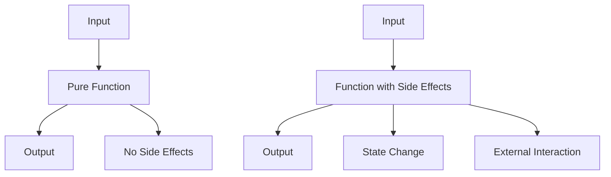

## 10.4 Pure Functions and Side Effects

In the realm of functional programming, pure functions and side effects are fundamental concepts that significantly influence how we design and implement software. Understanding these concepts is crucial for expert software engineers and enterprise architects who aim to build robust, maintainable, and scalable applications in C#. This section delves deep into the principles of pure functions and side effects, providing insights into their benefits, implementation strategies, and practical applications in C#.

### Introduction to Pure Functions

Pure functions are a cornerstone of functional programming. They are defined by two main characteristics:

1. **Deterministic Output**: A pure function always produces the same output given the same input. This predictability is a hallmark of pure functions and is crucial for ensuring consistent behavior across different parts of an application.

2. **No Side Effects**: Pure functions do not alter any state or interact with the outside world. They do not modify global variables, perform I/O operations, or change the state of objects. This isolation from external factors makes them easier to test and reason about.

#### Writing Pure Functions

To write pure functions in C#, follow these guidelines:

- **Avoid Mutable State**: Ensure that your functions do not modify any external state. Use local variables and return new values instead of altering existing ones.

- **Use Immutable Data Structures**: Leverage C#'s support for immutable types, such as `readonly` fields and immutable collections, to prevent unintended state changes.

- **Limit Dependencies**: Minimize the dependencies of your functions on external systems or services. This reduces the risk of side effects and enhances the function's predictability.

- **Return Values**: Ensure that your functions return values instead of modifying input parameters or relying on global state.

#### Example of a Pure Function

```csharp
public int Add(int a, int b)
{
    return a + b;
}
```

In this example, the `Add` function is pure because it consistently returns the sum of its two input parameters without modifying any external state or causing side effects.

### Understanding Side Effects

Side effects occur when a function interacts with the outside world or alters the state of the application. Common examples of side effects include:

- Modifying global variables or static fields.
- Performing I/O operations, such as reading from or writing to a file or database.
- Changing the state of input parameters or objects.
- Logging or printing to the console.

While side effects are sometimes necessary, especially in real-world applications that require interaction with external systems, they should be managed carefully to maintain the integrity and predictability of the software.

#### Managing Side Effects

To manage side effects effectively in C#, consider the following strategies:

- **Encapsulation**: Encapsulate side effects within specific functions or classes to isolate them from the rest of the application. This makes it easier to identify and manage side effects.

- **Dependency Injection**: Use dependency injection to manage dependencies and control side effects. This allows you to inject mock or stub implementations during testing, reducing the impact of side effects.

- **Functional Composition**: Compose functions in a way that minimizes side effects. Use higher-order functions and function chaining to build complex functionality from simple, pure functions.

### Benefits of Pure Functions

Pure functions offer several advantages that make them an attractive choice for software development:

- **Predictable Behavior**: Pure functions are deterministic, meaning they always produce the same output for the same input. This predictability simplifies debugging and testing.

- **Easier Testing**: Because pure functions do not rely on external state or cause side effects, they are easier to test in isolation. Unit tests can focus solely on the function's logic without worrying about external dependencies.

- **Enhanced Maintainability**: Pure functions are self-contained and do not depend on external state, making them easier to understand and maintain. Changes to the function's implementation do not affect other parts of the application.

- **Improved Reusability**: Pure functions are modular and can be reused across different parts of an application or even in different projects. Their lack of side effects ensures that they do not interfere with other components.

### Practical Applications of Pure Functions in C#

In C#, pure functions can be applied in various scenarios to improve software design and implementation:

#### Functional Programming with LINQ

C#'s Language Integrated Query (LINQ) is a powerful tool that encourages the use of pure functions. LINQ methods, such as `Select`, `Where`, and `Aggregate`, operate on collections in a functional style, promoting immutability and reducing side effects.

```csharp
var numbers = new List<int> { 1, 2, 3, 4, 5 };
var squaredNumbers = numbers.Select(x => x * x).ToList();
```

In this example, the `Select` method applies a pure function to each element of the `numbers` list, producing a new list of squared numbers without modifying the original list.

#### Immutable Data Structures

C# supports immutable data structures, such as `ImmutableList<T>` and `ImmutableDictionary<TKey, TValue>`, which can be used to implement pure functions. These structures prevent accidental state changes and ensure that functions remain pure.

```csharp
using System.Collections.Immutable;

var immutableList = ImmutableList.Create(1, 2, 3);
var newList = immutableList.Add(4);
```

Here, the `Add` method returns a new list with the added element, leaving the original list unchanged.

#### Functional Composition

Functional composition involves combining simple functions to build more complex functionality. In C#, this can be achieved using delegates, lambda expressions, and higher-order functions.

```csharp
Func<int, int> square = x => x * x;
Func<int, int> increment = x => x + 1;

Func<int, int> squareThenIncrement = x => increment(square(x));
```

In this example, the `squareThenIncrement` function is composed of two pure functions, `square` and `increment`, demonstrating how complex behavior can be built from simple, reusable components.

### Visualizing Pure Functions and Side Effects

To better understand the relationship between pure functions and side effects, let's visualize these concepts using a flowchart.



**Figure 1: Visualizing Pure Functions and Side Effects**

In this diagram, we see that a pure function takes an input and produces an output without causing side effects. In contrast, a function with side effects may alter state or interact with external systems.

### Try It Yourself

To solidify your understanding of pure functions and side effects, try modifying the following code examples:

1. **Convert a Function with Side Effects to a Pure Function**: Take a function that modifies a global variable and refactor it to return a new value instead.

2. **Compose Functions**: Create a series of simple functions and compose them to perform a complex operation. Ensure that each function is pure and does not cause side effects.

3. **Use Immutable Data Structures**: Replace mutable collections in your code with immutable alternatives and observe how this affects the purity of your functions.

### Knowledge Check

Before we conclude, let's reinforce your understanding with a few questions:

- What are the key characteristics of a pure function?
- How do side effects impact the predictability of a function?
- What are the benefits of using pure functions in software development?
- How can you manage side effects in C# applications?

### Conclusion

Mastering pure functions and side effects is essential for building reliable and maintainable software in C#. By embracing these principles, you can create applications that are easier to test, debug, and extend. Remember, this is just the beginning. As you continue to explore functional programming patterns in C#, you'll discover new ways to enhance your software design and implementation. Keep experimenting, stay curious, and enjoy the journey!

## Quiz Time!



### What is a key characteristic of a pure function?

- [x] It always produces the same output for the same input.
- [ ] It modifies global variables.
- [ ] It performs I/O operations.
- [ ] It changes the state of objects.

> **Explanation:** A pure function is deterministic, meaning it always produces the same output for the same input, without causing side effects.

### How do side effects impact a function?

- [x] They make the function less predictable.
- [ ] They enhance the function's performance.
- [ ] They simplify the function's logic.
- [ ] They improve the function's reusability.

> **Explanation:** Side effects make a function less predictable because they involve interactions with external systems or state changes.

### What is an advantage of using pure functions?

- [x] Easier testing and debugging.
- [ ] Increased complexity.
- [ ] More dependencies.
- [ ] Greater reliance on global state.

> **Explanation:** Pure functions are easier to test and debug because they do not depend on external state or cause side effects.

### How can you manage side effects in C#?

- [x] Use encapsulation and dependency injection.
- [ ] Increase global variable usage.
- [ ] Avoid using functions altogether.
- [ ] Rely on mutable state.

> **Explanation:** Encapsulation and dependency injection help manage side effects by isolating them and controlling dependencies.

### What is functional composition?

- [x] Combining simple functions to build complex functionality.
- [ ] Modifying global variables within functions.
- [ ] Performing I/O operations in functions.
- [ ] Changing the state of objects.

> **Explanation:** Functional composition involves combining simple functions to create more complex behavior, while maintaining purity.

### Which C# feature supports immutability?

- [x] ImmutableList<T>
- [ ] Mutable collections
- [ ] Global variables
- [ ] Static fields

> **Explanation:** `ImmutableList<T>` is a C# feature that supports immutability, preventing accidental state changes.

### What is a common side effect in functions?

- [x] Modifying global variables.
- [ ] Returning a value.
- [ ] Using local variables.
- [ ] Performing calculations.

> **Explanation:** Modifying global variables is a common side effect that can impact a function's predictability.

### How does LINQ promote pure functions?

- [x] By encouraging immutability and functional style.
- [ ] By increasing side effects.
- [ ] By relying on global state.
- [ ] By modifying input parameters.

> **Explanation:** LINQ promotes pure functions by encouraging immutability and a functional programming style.

### What is a benefit of using immutable data structures?

- [x] Prevents unintended state changes.
- [ ] Increases complexity.
- [ ] Enhances side effects.
- [ ] Relies on mutable state.

> **Explanation:** Immutable data structures prevent unintended state changes, supporting the creation of pure functions.

### True or False: Pure functions can modify input parameters.

- [ ] True
- [x] False

> **Explanation:** Pure functions cannot modify input parameters; they return new values instead.


