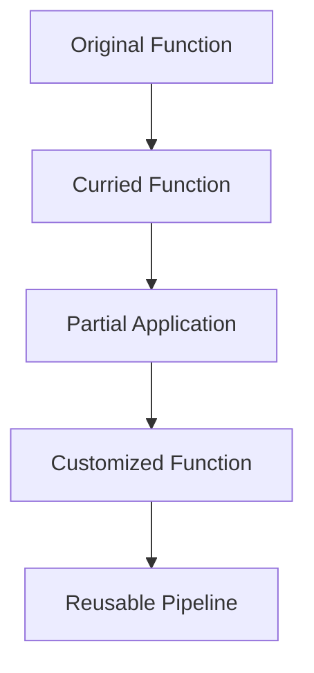

## 10.5 Currying and Partial Application

In the realm of functional programming, currying and partial application are powerful techniques that enable developers to create flexible and reusable function pipelines. These concepts, while rooted in functional programming, can be effectively applied in C# to enhance code modularity and reusability. In this section, we will delve into the intricacies of currying and partial application, explore their implementation in C#, and examine practical use cases.

### Introduction to Currying and Partial Application

Before we dive into the implementation details, let's first understand what currying and partial application are.

**Currying** is the process of transforming a function that takes multiple arguments into a sequence of functions, each taking a single argument. This transformation allows for more granular control over function execution and facilitates function composition.

**Partial Application**, on the other hand, involves fixing a few arguments of a function, producing another function of smaller arity. This technique is particularly useful for creating specialized functions from more general ones.

Both currying and partial application contribute to creating flexible and reusable code by allowing functions to be tailored to specific needs without altering their core logic.

### Implementing Currying in C#

#### Breaking Down Functions into Smaller Units

Currying in C# can be achieved by breaking down a function into smaller units, each accepting a single argument. This can be done using lambda expressions and closures. Let's consider a simple example:

```csharp
// Original function that adds three numbers
Func<int, int, int, int> addThreeNumbers = (x, y, z) => x + y + z;

// Curried version of the function
Func<int, Func<int, Func<int, int>>> curriedAdd = x => y => z => x + y + z;

// Using the curried function
var addFive = curriedAdd(5);
var addFiveAndThree = addFive(3);
int result = addFiveAndThree(2); // Result is 10
```

In this example, we start with a function `addThreeNumbers` that takes three integers and returns their sum. We then create a curried version `curriedAdd`, which is a series of nested functions, each taking one argument. This allows us to partially apply the function by providing arguments one at a time.

#### Using Closures for Partial Application

Closures in C# provide a mechanism to capture the environment in which a function is created, allowing for partial application. Let's see how closures can be used for partial application:

```csharp
// Function that multiplies two numbers
Func<int, int, int> multiply = (x, y) => x * y;

// Partial application using closures
Func<int, Func<int, int>> partialMultiply = x => y => multiply(x, y);

// Creating a function that doubles a number
var doubleNumber = partialMultiply(2);
int doubled = doubleNumber(5); // Result is 10
```

Here, we define a `multiply` function and use closures to create a partially applied version `partialMultiply`. By fixing the first argument, we create a new function `doubleNumber` that multiplies any given number by 2.

### Use Cases and Examples

#### Customizing Functions for Specific Scenarios

Currying and partial application are particularly useful when you need to customize functions for specific scenarios. For instance, consider a logging function that logs messages with different severity levels:

```csharp
// General logging function
Action<string, string> logMessage = (level, message) => Console.WriteLine($"[{level}] {message}");

// Curried logging function
Func<string, Action<string>> curriedLog = level => message => logMessage(level, message);

// Creating specific loggers
var infoLogger = curriedLog("INFO");
var errorLogger = curriedLog("ERROR");

// Using the specific loggers
infoLogger("This is an informational message.");
errorLogger("This is an error message.");
```

In this example, we create a general `logMessage` function and then use currying to create specific loggers for different severity levels. This approach allows us to reuse the core logging logic while tailoring the function to different contexts.

#### Creating Reusable Function Pipelines

Currying and partial application also facilitate the creation of reusable function pipelines. Consider a scenario where you need to process a list of numbers by applying a series of transformations:

```csharp
// Function to add a number
Func<int, int, int> add = (x, y) => x + y;

// Function to multiply a number
Func<int, int, int> multiply = (x, y) => x * y;

// Curried versions
Func<int, Func<int, int>> curriedAdd = x => y => add(x, y);
Func<int, Func<int, int>> curriedMultiply = x => y => multiply(x, y);

// Creating a pipeline
var addTwo = curriedAdd(2);
var multiplyByThree = curriedMultiply(3);

// Processing a list of numbers
var numbers = new List<int> { 1, 2, 3, 4, 5 };
var processedNumbers = numbers.Select(addTwo).Select(multiplyByThree).ToList();

// Output the processed numbers
processedNumbers.ForEach(Console.WriteLine); // Outputs: 9, 12, 15, 18, 21
```

In this example, we define `add` and `multiply` functions and create curried versions. We then use these curried functions to build a pipeline that first adds 2 to each number and then multiplies the result by 3. This approach allows us to easily compose and reuse transformations.

### Visualizing Currying and Partial Application

To better understand the flow of currying and partial application, let's visualize the process using a diagram.



**Diagram Description:** This diagram illustrates the transformation of an original function into a curried function, followed by partial application to create customized functions, which can then be used to build reusable pipelines.

### Design Considerations

When implementing currying and partial application in C#, consider the following:

- **Performance:** Currying can introduce additional function calls, which may impact performance. Use it judiciously in performance-critical code.
- **Readability:** While currying and partial application can enhance code modularity, they may also reduce readability if overused. Ensure that the intent of the code remains clear.
- **Compatibility:** Ensure that the use of currying and partial application aligns with the overall design and architecture of your application.

### Differences and Similarities

Currying and partial application are often confused due to their similar nature. Here are some key differences and similarities:

- **Currying** transforms a function into a series of unary functions, while **partial application** fixes a few arguments of a function, producing another function of smaller arity.
- Both techniques enhance code reusability and modularity by allowing functions to be tailored to specific needs.
- Currying is more common in purely functional languages, while partial application is widely used in both functional and imperative languages.

### Try It Yourself

To solidify your understanding of currying and partial application, try modifying the code examples provided. Experiment with different functions and transformations to see how currying and partial application can be applied in various contexts.

### References and Links

For further reading on currying and partial application, consider the following resources:

- [Functional Programming in C#](https://docs.microsoft.com/en-us/dotnet/csharp/functional-programming)
- [Currying and Partial Application in Functional Programming](https://www.manning.com/books/functional-programming-in-c-sharp)
- [C# Programming Guide](https://docs.microsoft.com/en-us/dotnet/csharp/programming-guide/)

### Knowledge Check

To reinforce your understanding, consider the following questions:

1. What is the primary difference between currying and partial application?
2. How can closures be used to achieve partial application in C#?
3. What are some potential performance considerations when using currying?
4. How can currying and partial application enhance code reusability?

### Embrace the Journey

Remember, mastering currying and partial application is just one step in your journey to becoming a proficient C# developer. As you continue to explore functional programming patterns, you'll discover new ways to write clean, efficient, and reusable code. Keep experimenting, stay curious, and enjoy the journey!

## Quiz Time!



### What is currying in functional programming?

- [x] Transforming a function that takes multiple arguments into a sequence of functions, each taking a single argument.
- [ ] Combining multiple functions into a single function.
- [ ] Creating a function that can take any number of arguments.
- [ ] Transforming a function into a lambda expression.

> **Explanation:** Currying involves transforming a function that takes multiple arguments into a sequence of functions, each taking a single argument.

### How does partial application differ from currying?

- [x] Partial application fixes a few arguments of a function, producing another function of smaller arity.
- [ ] Partial application transforms a function into a sequence of unary functions.
- [ ] Partial application is only applicable in functional programming languages.
- [ ] Partial application always results in a single-argument function.

> **Explanation:** Partial application involves fixing a few arguments of a function, producing another function of smaller arity, whereas currying transforms a function into a sequence of unary functions.

### Which C# feature is commonly used to achieve partial application?

- [x] Closures
- [ ] Delegates
- [ ] Interfaces
- [ ] Abstract classes

> **Explanation:** Closures are commonly used in C# to achieve partial application by capturing the environment in which a function is created.

### What is a potential drawback of using currying in performance-critical code?

- [x] Additional function calls may impact performance.
- [ ] It makes the code less modular.
- [ ] It reduces code reusability.
- [ ] It is incompatible with object-oriented programming.

> **Explanation:** Currying can introduce additional function calls, which may impact performance in performance-critical code.

### How can currying enhance code reusability?

- [x] By allowing functions to be tailored to specific needs without altering their core logic.
- [ ] By making functions less specific and more general.
- [ ] By reducing the number of functions needed in a codebase.
- [ ] By eliminating the need for closures.

> **Explanation:** Currying enhances code reusability by allowing functions to be tailored to specific needs without altering their core logic.

### What is the result of the following curried function call: `curriedAdd(5)(3)(2)`?

- [x] 10
- [ ] 8
- [ ] 15
- [ ] 5

> **Explanation:** The curried function `curriedAdd` adds three numbers, so `curriedAdd(5)(3)(2)` results in 10.

### In the context of currying, what does "arity" refer to?

- [x] The number of arguments a function takes.
- [ ] The number of functions in a sequence.
- [ ] The number of return values a function has.
- [ ] The number of closures used in a function.

> **Explanation:** In the context of currying, "arity" refers to the number of arguments a function takes.

### What is the purpose of using lambda expressions in currying?

- [x] To create a series of nested functions, each taking one argument.
- [ ] To reduce the number of lines of code.
- [ ] To eliminate the need for closures.
- [ ] To improve code readability.

> **Explanation:** Lambda expressions are used in currying to create a series of nested functions, each taking one argument.

### Which of the following is a benefit of partial application?

- [x] Creating specialized functions from more general ones.
- [ ] Reducing the number of arguments a function takes.
- [ ] Eliminating the need for function composition.
- [ ] Making functions less specific.

> **Explanation:** Partial application allows for creating specialized functions from more general ones by fixing a few arguments.

### True or False: Currying is more common in purely functional languages than in imperative languages.

- [x] True
- [ ] False

> **Explanation:** Currying is more common in purely functional languages, although it can be applied in imperative languages like C#.


