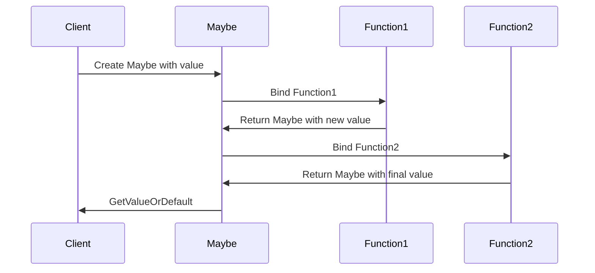

## 10.6 Monad Pattern

Welcome to the Monad Pattern section of our guide on mastering C# design patterns. In this section, we will delve into the world of functional programming within C#, focusing on the Monad Pattern. This pattern is a powerful tool for abstracting computation patterns, allowing developers to write cleaner, more maintainable code. Let's embark on this journey to understand monads, implement the Maybe monad, and explore functional composition techniques.

### Understanding Monads

Monads are a fundamental concept in functional programming, providing a way to structure programs generically. They encapsulate behavior associated with a value, allowing for the chaining of operations while managing side effects.

#### Concept of Monads in Functional Programming

A monad is a design pattern used to handle program-wide concerns in a functional way. It is essentially a type that implements three primary operations:

1. **Unit (or Return)**: Wraps a value into a monad.
2. **Bind (or FlatMap)**: Chains operations on monads.
3. **Map**: Applies a function to the wrapped value.

Monads are often described as "programmable semicolons" because they allow you to sequence operations in a functional style. They are used to handle side effects, manage state, and perform computations in a controlled manner.

#### Implementing the Maybe (Option) Monad

The Maybe monad is a common example used to handle optional values, providing a way to deal with nullability without resorting to exceptions. Let's implement the Maybe monad in C#.

```csharp
public class Maybe<T>
{
    private readonly T _value;
    public bool HasValue { get; }
    
    private Maybe(T value, bool hasValue)
    {
        _value = value;
        HasValue = hasValue;
    }

    public static Maybe<T> Some(T value) => new Maybe<T>(value, true);
    public static Maybe<T> None() => new Maybe<T>(default(T), false);

    public Maybe<TResult> Bind<TResult>(Func<T, Maybe<TResult>> func)
    {
        return HasValue ? func(_value) : Maybe<TResult>.None();
    }

    public Maybe<TResult> Map<TResult>(Func<T, TResult> func)
    {
        return HasValue ? Maybe<TResult>.Some(func(_value)) : Maybe<TResult>.None();
    }

    public T GetValueOrDefault(T defaultValue = default(T))
    {
        return HasValue ? _value : defaultValue;
    }
}
```

In this implementation, the `Maybe` class encapsulates a value that may or may not be present. The `Some` and `None` methods create instances of `Maybe` with or without a value, respectively. The `Bind` method allows chaining operations, while `Map` applies a function to the contained value.

### Functional Composition Techniques

Functional composition is a technique where you combine simple functions to build more complex ones. This is a core principle in functional programming, enabling code reuse and modularity.

#### Chaining Functions Together

Monads facilitate function chaining, allowing you to compose operations in a linear, readable manner. Consider the following example using the `Maybe` monad:

```csharp
Maybe<int> ParseInt(string input)
{
    return int.TryParse(input, out var result) ? Maybe<int>.Some(result) : Maybe<int>.None();
}

Maybe<int> Increment(Maybe<int> maybe)
{
    return maybe.Map(x => x + 1);
}

var result = ParseInt("123")
    .Bind(Increment)
    .GetValueOrDefault();

Console.WriteLine(result); // Outputs: 124
```

In this example, `ParseInt` attempts to parse a string into an integer, returning a `Maybe<int>`. The `Increment` function adds one to the value if it exists. Using `Bind`, we chain these operations seamlessly.

#### Using LINQ for Sequence Operations

C#'s Language Integrated Query (LINQ) provides a powerful way to perform sequence operations, and it can be used in conjunction with monads for elegant data manipulation.

```csharp
var numbers = new List<string> { "1", "2", "three", "4" };

var results = numbers
    .Select(ParseInt)
    .SelectMany(maybe => maybe.Map(x => x * 2))
    .Where(maybe => maybe.HasValue)
    .Select(maybe => maybe.GetValueOrDefault());

foreach (var number in results)
{
    Console.WriteLine(number); // Outputs: 2, 4, 8
}
```

Here, we use LINQ to parse a list of strings into integers, double them, and filter out any non-parsable entries. The `SelectMany` method is used to flatten the sequence of `Maybe<int>` into a sequence of integers.

### Use Cases and Examples

Monads are versatile and can be applied to various scenarios in software development. Let's explore some common use cases.

#### Error Handling Without Exceptions

Monads provide a way to handle errors without using exceptions, which can be costly in terms of performance and complexity. The `Maybe` monad is particularly useful for this purpose.

```csharp
Maybe<int> SafeDivide(int numerator, int denominator)
{
    return denominator == 0 ? Maybe<int>.None() : Maybe<int>.Some(numerator / denominator);
}

var result = SafeDivide(10, 0)
    .Map(x => x * 2)
    .GetValueOrDefault(-1);

Console.WriteLine(result); // Outputs: -1
```

In this example, `SafeDivide` returns a `Maybe<int>` that is `None` if division by zero occurs. This allows us to handle the error gracefully without exceptions.

#### Managing Nullability Elegantly

Nullability is a common concern in C#. The `Maybe` monad offers a way to manage nullable values elegantly, reducing the risk of `NullReferenceException`.

```csharp
Maybe<string> GetUserName(int userId)
{
    var user = GetUserFromDatabase(userId);
    return user != null ? Maybe<string>.Some(user.Name) : Maybe<string>.None();
}

var userName = GetUserName(1)
    .Map(name => name.ToUpper())
    .GetValueOrDefault("Unknown User");

Console.WriteLine(userName);
```

Here, `GetUserName` retrieves a user's name from a database, returning a `Maybe<string>`. This approach ensures that null values are handled safely.

### Visualizing Monad Operations

Let's visualize the flow of operations in a monad using a sequence diagram. This will help us understand how monads manage computation sequences.



This diagram illustrates how a value is wrapped in a `Maybe` monad, passed through a series of functions, and finally retrieved with a default value if necessary.

### Design Considerations

When using monads in C#, consider the following:

- **Readability**: Ensure that the use of monads enhances code readability. Overuse can lead to complex, hard-to-understand code.
- **Performance**: Monads can introduce overhead. Use them judiciously in performance-critical sections.
- **Compatibility**: Ensure that monads integrate well with existing codebases and libraries.

### Differences and Similarities

Monads are often compared to other patterns like the Strategy or State patterns. While they share similarities in managing behavior, monads are more focused on chaining operations and managing side effects.

### Try It Yourself

Experiment with the `Maybe` monad by modifying the code examples. Try adding new operations, such as logging or validation, to see how monads can simplify complex workflows.

### Knowledge Check

- What is a monad, and how does it differ from other design patterns?
- How can the `Maybe` monad be used to handle nullability in C#?
- What are the benefits of using monads for error handling?

### Embrace the Journey

Remember, mastering monads is just the beginning of your functional programming journey. As you explore more patterns, you'll discover new ways to write clean, efficient code. Keep experimenting, stay curious, and enjoy the journey!

## Quiz Time!



### What is a monad in functional programming?

- [x] A design pattern that encapsulates behavior associated with a value
- [ ] A type of loop used in functional programming
- [ ] A method for handling exceptions
- [ ] A class that implements interfaces

> **Explanation:** A monad is a design pattern used to handle program-wide concerns in a functional way, encapsulating behavior associated with a value.

### Which method in the Maybe monad is used to chain operations?

- [x] Bind
- [ ] Map
- [ ] Unit
- [ ] Return

> **Explanation:** The `Bind` method is used to chain operations on monads, allowing for function composition.

### How does the Maybe monad handle nullability?

- [x] By encapsulating a value that may or may not be present
- [ ] By throwing exceptions when a null value is encountered
- [ ] By using default values for null checks
- [ ] By ignoring null values

> **Explanation:** The Maybe monad encapsulates a value that may or may not be present, providing a safe way to handle nullability.

### What is the purpose of the Unit method in a monad?

- [x] To wrap a value into a monad
- [ ] To chain operations on monads
- [ ] To apply a function to the wrapped value
- [ ] To handle exceptions

> **Explanation:** The Unit method, also known as Return, is used to wrap a value into a monad.

### How can monads improve error handling in C#?

- [x] By providing a way to handle errors without using exceptions
- [ ] By automatically retrying failed operations
- [ ] By logging errors to a file
- [ ] By ignoring errors

> **Explanation:** Monads provide a way to handle errors without using exceptions, which can be costly in terms of performance and complexity.

### What is the role of the Map method in a monad?

- [x] To apply a function to the wrapped value
- [ ] To chain operations on monads
- [ ] To wrap a value into a monad
- [ ] To handle exceptions

> **Explanation:** The Map method is used to apply a function to the wrapped value within a monad.

### Which of the following is a common use case for the Maybe monad?

- [x] Managing nullability
- [ ] Implementing loops
- [ ] Handling concurrency
- [ ] Creating user interfaces

> **Explanation:** The Maybe monad is commonly used to manage nullability, providing a safe way to handle optional values.

### What is a key benefit of using monads in functional programming?

- [x] They allow for function composition and chaining
- [ ] They simplify the implementation of loops
- [ ] They improve the performance of algorithms
- [ ] They eliminate the need for classes

> **Explanation:** Monads allow for function composition and chaining, enabling cleaner, more maintainable code.

### How does the Maybe monad differ from exceptions in error handling?

- [x] It provides a way to handle errors without using exceptions
- [ ] It automatically retries failed operations
- [ ] It logs errors to a file
- [ ] It ignores errors

> **Explanation:** The Maybe monad provides a way to handle errors without using exceptions, offering a more functional approach.

### True or False: Monads are only used in functional programming languages.

- [ ] True
- [x] False

> **Explanation:** While monads are a concept from functional programming, they can be used in any language that supports functional programming paradigms, including C#.


