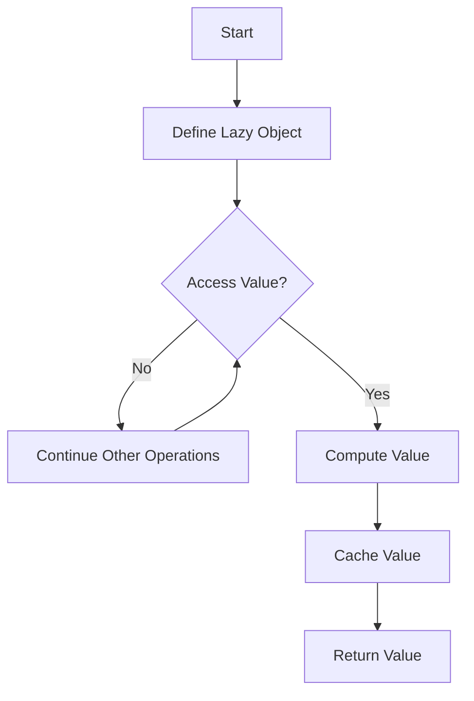

## 10.7 Lazy Evaluation

Lazy evaluation is a powerful concept in programming that defers the computation of values until they are actually needed. This approach can lead to significant performance improvements, especially in scenarios involving expensive computations or large data sets. In this section, we will delve into the intricacies of lazy evaluation in C#, exploring its implementation, benefits, trade-offs, and practical use cases.

### Understanding Lazy Evaluation

Lazy evaluation is a strategy that delays the evaluation of an expression until its value is required. This can be particularly useful in optimizing performance by avoiding unnecessary calculations. In C#, lazy evaluation is commonly implemented using the `Lazy<T>` class and deferred execution in LINQ queries.

#### Key Concepts

- **Deferred Computation**: The core idea of lazy evaluation is to postpone the computation of a value until it is explicitly needed. This can help in reducing the overhead of unnecessary calculations.
- **Memoization**: Once a lazy value is computed, it is typically cached for subsequent accesses, ensuring that the computation is performed only once.

### Implementing Lazy Evaluation in C#

C# provides several mechanisms to implement lazy evaluation, with `Lazy<T>` and LINQ being the most prominent.

#### Deferring Computation with `Lazy<T>`

The `Lazy<T>` class in C# is designed to support lazy initialization. It allows you to defer the creation of an object until it is first accessed, which can be particularly useful for expensive or resource-intensive operations.

##### Example: Using `Lazy<T>`

```csharp
using System;

class Program
{
    static void Main()
    {
        // Initialize a Lazy object with a factory method
        Lazy<ExpensiveObject> lazyExpensiveObject = new Lazy<ExpensiveObject>(() => new ExpensiveObject());

        Console.WriteLine("Lazy object created. No initialization yet.");

        // The object is not created until the Value property is accessed
        ExpensiveObject obj = lazyExpensiveObject.Value;

        Console.WriteLine("Expensive object initialized.");
    }
}

class ExpensiveObject
{
    public ExpensiveObject()
    {
        Console.WriteLine("ExpensiveObject constructor called.");
    }
}
```

In this example, the `ExpensiveObject` is not instantiated until the `Value` property of the `Lazy<ExpensiveObject>` is accessed. This defers the construction of the object, potentially saving resources if the object is never used.

#### Leveraging Deferred Execution in LINQ

LINQ (Language Integrated Query) in C# inherently supports deferred execution. This means that the evaluation of a query is delayed until the query results are actually iterated over.

##### Example: Deferred Execution in LINQ

```csharp
using System;
using System.Collections.Generic;
using System.Linq;

class Program
{
    static void Main()
    {
        List<int> numbers = new List<int> { 1, 2, 3, 4, 5 };

        // Define a LINQ query with deferred execution
        var query = numbers.Where(n => n > 2);

        Console.WriteLine("Query defined. No execution yet.");

        // Execution occurs here
        foreach (var number in query)
        {
            Console.WriteLine(number);
        }
    }
}
```

In this example, the LINQ query `numbers.Where(n => n > 2)` is not executed until the `foreach` loop iterates over the results. This deferred execution allows for efficient processing of data, especially when dealing with large collections.

### Benefits and Trade-offs

Lazy evaluation offers several benefits but also comes with trade-offs that developers need to consider.

#### Benefits

- **Improved Performance**: By deferring computations, lazy evaluation can significantly reduce the overhead of unnecessary calculations, leading to better performance.
- **Resource Efficiency**: Lazy evaluation can help in conserving resources by avoiding the instantiation of objects that are never used.
- **Simplified Code**: It can lead to cleaner and more maintainable code by separating the definition of computations from their execution.

#### Trade-offs

- **Deferred Exceptions**: Errors in lazy computations may not be caught until the value is accessed, potentially leading to unexpected runtime exceptions.
- **Complexity**: While lazy evaluation can simplify certain aspects of code, it can also introduce complexity in understanding when and how computations are performed.
- **Memory Usage**: Caching of computed values can lead to increased memory usage if not managed properly.

### Use Cases and Examples

Lazy evaluation is particularly useful in scenarios where computations are expensive or data is loaded on-demand.

#### Expensive Calculations

In applications involving complex calculations, lazy evaluation can defer these computations until absolutely necessary, improving responsiveness and performance.

##### Example: Lazy Evaluation in Complex Calculations

```csharp
using System;

class Program
{
    static void Main()
    {
        Lazy<double> lazyCalculation = new Lazy<double>(() => PerformComplexCalculation());

        Console.WriteLine("Complex calculation deferred.");

        // Perform other operations

        // Access the result when needed
        double result = lazyCalculation.Value;
        Console.WriteLine($"Calculation result: {result}");
    }

    static double PerformComplexCalculation()
    {
        Console.WriteLine("Performing complex calculation...");
        // Simulate a complex calculation
        return Math.Sqrt(12345.6789);
    }
}
```

In this example, the complex calculation is deferred until the `Value` property of the `Lazy<double>` is accessed, allowing other operations to proceed without delay.

#### On-demand Data Loading

Lazy evaluation is also beneficial for loading data on-demand, such as in scenarios involving large datasets or remote data sources.

##### Example: Lazy Loading of Data

```csharp
using System;
using System.Collections.Generic;

class Program
{
    static void Main()
    {
        Lazy<List<string>> lazyData = new Lazy<List<string>>(() => LoadData());

        Console.WriteLine("Data loading deferred.");

        // Perform other operations

        // Load data when needed
        List<string> data = lazyData.Value;
        Console.WriteLine($"Data loaded: {string.Join(", ", data)}");
    }

    static List<string> LoadData()
    {
        Console.WriteLine("Loading data...");
        // Simulate data loading
        return new List<string> { "Data1", "Data2", "Data3" };
    }
}
```

In this example, the data is not loaded until the `Value` property of the `Lazy<List<string>>` is accessed, allowing the application to defer potentially expensive data loading operations.

### Visualizing Lazy Evaluation

To better understand lazy evaluation, let's visualize the process using a flowchart that illustrates the deferred computation of a `Lazy<T>` object.



**Figure 1: Flowchart of Lazy Evaluation with `Lazy<T>`**

This flowchart demonstrates the process of defining a lazy object, deferring computation until the value is accessed, and caching the result for future use.

### Design Considerations

When implementing lazy evaluation in C#, consider the following:

- **Thread Safety**: The `Lazy<T>` class supports thread-safe initialization, but be mindful of potential race conditions in multi-threaded environments.
- **Memory Management**: Be cautious of memory usage when caching computed values, especially in applications with limited resources.
- **Error Handling**: Anticipate and handle exceptions that may occur during deferred computations to avoid runtime errors.

### Differences and Similarities

Lazy evaluation is often compared to other optimization techniques, such as memoization and eager evaluation. While memoization involves caching results of function calls, eager evaluation computes values immediately. Understanding these distinctions can help in selecting the appropriate strategy for a given scenario.

### Try It Yourself

To deepen your understanding of lazy evaluation, try modifying the code examples provided. Experiment with different scenarios, such as:

- Implementing lazy evaluation for a different type of expensive computation.
- Using lazy evaluation in a multi-threaded application.
- Exploring the impact of lazy evaluation on memory usage and performance.

### Knowledge Check

Before moving on, let's summarize the key takeaways from this section:

- Lazy evaluation defers computations until necessary, optimizing performance and resource usage.
- CSharp supports lazy evaluation through the `Lazy<T>` class and deferred execution in LINQ.
- While beneficial, lazy evaluation can introduce complexity and deferred exceptions.

### Embrace the Journey

Remember, mastering lazy evaluation is just one step in your journey to becoming an expert in C# design patterns. Keep experimenting, stay curious, and enjoy the process of learning and applying new concepts.

## Quiz Time!



### What is the primary benefit of lazy evaluation?

- [x] Improved performance by deferring computations
- [ ] Immediate error detection
- [ ] Increased memory usage
- [ ] Simplified code structure

> **Explanation:** Lazy evaluation improves performance by deferring computations until they are actually needed.

### Which C# class is commonly used for lazy evaluation?

- [x] Lazy<T>
- [ ] Eager<T>
- [ ] Deferred<T>
- [ ] Memoize<T>

> **Explanation:** The `Lazy<T>` class in C# is designed to support lazy initialization and evaluation.

### What is a potential trade-off of using lazy evaluation?

- [x] Deferred exceptions
- [ ] Immediate computation
- [ ] Increased code complexity
- [ ] Reduced memory usage

> **Explanation:** Lazy evaluation can lead to deferred exceptions, as errors in computations may not be caught until the value is accessed.

### How does LINQ support lazy evaluation?

- [x] Through deferred execution
- [ ] By caching results
- [ ] By immediate execution
- [ ] By using eager evaluation

> **Explanation:** LINQ supports lazy evaluation through deferred execution, meaning queries are not evaluated until the results are iterated over.

### What is the purpose of memoization in lazy evaluation?

- [x] To cache computed values for future use
- [ ] To defer computations indefinitely
- [ ] To increase computation speed
- [ ] To simplify code structure

> **Explanation:** Memoization involves caching computed values, ensuring that computations are performed only once and reused for future accesses.

### In which scenario is lazy evaluation particularly useful?

- [x] Expensive calculations
- [ ] Simple arithmetic operations
- [ ] Static data
- [ ] Immediate data processing

> **Explanation:** Lazy evaluation is particularly useful for expensive calculations, as it defers computation until necessary, improving performance.

### What should be considered when using lazy evaluation in multi-threaded environments?

- [x] Thread safety
- [ ] Memory usage
- [ ] Code readability
- [ ] Error handling

> **Explanation:** Thread safety is crucial when using lazy evaluation in multi-threaded environments to avoid race conditions.

### What is the impact of lazy evaluation on memory usage?

- [x] It can increase memory usage due to caching
- [ ] It reduces memory usage by deferring computations
- [ ] It has no impact on memory usage
- [ ] It simplifies memory management

> **Explanation:** Lazy evaluation can increase memory usage due to caching of computed values, which need to be managed carefully.

### How can lazy evaluation affect error handling?

- [x] Errors may be deferred until value access
- [ ] Errors are caught immediately
- [ ] Errors are eliminated
- [ ] Errors are simplified

> **Explanation:** Errors in lazy computations may not be caught until the value is accessed, leading to deferred exceptions.

### True or False: Lazy evaluation always improves performance.

- [ ] True
- [x] False

> **Explanation:** While lazy evaluation can improve performance by deferring unnecessary computations, it may not always be beneficial, especially if the deferred computations are eventually needed.




