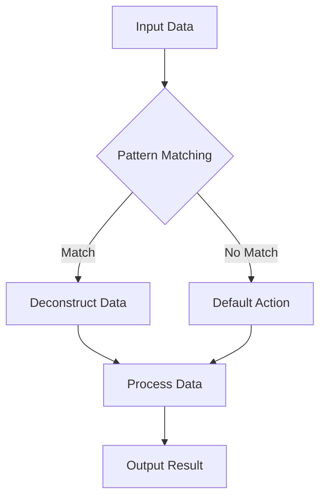

## 10.8 Pattern Matching and Records

In the realm of modern C# development, pattern matching and records have emerged as powerful tools that simplify code and enhance readability. These features, introduced in recent versions of C#, allow developers to write more expressive and concise code, particularly when dealing with complex data structures and conditional logic. In this section, we will delve into the intricacies of pattern matching and records, exploring their implementation, use cases, and the benefits they bring to software development.

### Simplifying Code Using Pattern Matching

Pattern matching is a feature that enables developers to check a value against a pattern and, if the pattern matches, deconstruct the value into its constituent parts. This capability is particularly useful for simplifying conditional logic and working with complex data types. Let's explore how pattern matching can be implemented in C#.

#### Implementing Pattern Matching

Pattern matching in C# can be implemented using various constructs, including `switch` expressions, relational patterns, and positional patterns. Each of these constructs offers unique capabilities for handling different scenarios.

##### Using `switch` Expressions and Relational Patterns

The `switch` expression is a powerful tool for implementing pattern matching in C#. It allows developers to evaluate a value against multiple patterns and execute corresponding actions based on the matched pattern. Here's an example of how to use `switch` expressions with relational patterns:

```csharp
public string GetGradeDescription(int score)
{
    return score switch
    {
        >= 90 => "Excellent",
        >= 80 => "Very Good",
        >= 70 => "Good",
        >= 60 => "Satisfactory",
        < 60 => "Needs Improvement",
        _ => "Invalid Score"
    };
}
```

In this example, the `switch` expression evaluates the `score` against several relational patterns (`>= 90`, `>= 80`, etc.) and returns a corresponding grade description. The use of relational patterns simplifies the conditional logic, making the code more readable and maintainable.

##### Deconstructing Data with Positional Patterns

Positional patterns allow developers to deconstruct data types into their constituent parts, making it easier to work with complex data structures. This is particularly useful when dealing with tuples or custom data types. Here's an example of how to use positional patterns to deconstruct a tuple:

```csharp
public string GetPointDescription((int X, int Y) point)
{
    return point switch
    {
        (0, 0) => "Origin",
        (var x, 0) => $"On the X-axis at {x}",
        (0, var y) => $"On the Y-axis at {y}",
        (var x, var y) => $"Point at ({x}, {y})"
    };
}
```

In this example, the `switch` expression uses positional patterns to deconstruct the `point` tuple into its `X` and `Y` components. The code then evaluates these components against various patterns to determine the point's location.

### Use Cases and Examples

Pattern matching is a versatile feature that can be applied in numerous scenarios to simplify code and enhance readability. Let's explore some practical use cases and examples.

#### Deconstructing Data Types

Pattern matching is particularly useful for deconstructing complex data types, such as tuples, records, and custom classes. By deconstructing these types, developers can access their individual components more easily, reducing the need for verbose and error-prone code.

Consider the following example, which demonstrates how to deconstruct a custom class using pattern matching:

```csharp
public class Person
{
    public string FirstName { get; }
    public string LastName { get; }
    public int Age { get; }

    public Person(string firstName, string lastName, int age)
    {
        FirstName = firstName;
        LastName = lastName;
        Age = age;
    }

    public void Deconstruct(out string firstName, out string lastName, out int age)
    {
        firstName = FirstName;
        lastName = LastName;
        age = Age;
    }
}

public string GetPersonDescription(Person person)
{
    return person switch
    {
        { Age: >= 18 } => $"{person.FirstName} {person.LastName} is an adult.",
        { Age: < 18 } => $"{person.FirstName} {person.LastName} is a minor.",
        _ => "Unknown age"
    };
}
```

In this example, the `Person` class is deconstructed using pattern matching, allowing the code to access its `FirstName`, `LastName`, and `Age` properties directly. This approach simplifies the logic for determining whether a person is an adult or a minor.

#### Simplifying Conditional Logic

Pattern matching can also be used to simplify complex conditional logic, reducing the need for nested `if` statements and enhancing code readability. Here's an example that demonstrates how pattern matching can be used to simplify conditional logic:

```csharp
public string GetWeatherDescription(string weatherCondition)
{
    return weatherCondition switch
    {
        "Sunny" => "It's a bright and sunny day!",
        "Rainy" => "Don't forget your umbrella.",
        "Cloudy" => "It's a bit overcast today.",
        "Snowy" => "Time to build a snowman!",
        _ => "Unknown weather condition"
    };
}
```

In this example, the `switch` expression evaluates the `weatherCondition` against several patterns, each representing a different weather condition. This approach eliminates the need for multiple `if` statements, resulting in cleaner and more maintainable code.

### Records in C#

Records are a new feature introduced in C# 9.0 that provide a concise way to define immutable data types. They are particularly useful for representing data structures that are primarily used for storing data, rather than behavior. Let's explore how records can be used in C#.

#### Defining Records

Records are defined using the `record` keyword, which allows developers to create immutable data types with minimal boilerplate code. Here's an example of how to define a record in C#:

```csharp
public record Point(int X, int Y);
```

In this example, the `Point` record is defined with two properties, `X` and `Y`. Records automatically generate several useful methods, such as `Equals`, `GetHashCode`, and `ToString`, making them ideal for data-centric applications.

#### Using Records with Pattern Matching

Records can be seamlessly integrated with pattern matching, allowing developers to deconstruct records into their constituent parts. Here's an example that demonstrates how to use records with pattern matching:

```csharp
public record Person(string FirstName, string LastName, int Age);

public string GetPersonDescription(Person person)
{
    return person switch
    {
        { Age: >= 18 } => $"{person.FirstName} {person.LastName} is an adult.",
        { Age: < 18 } => $"{person.FirstName} {person.LastName} is a minor.",
        _ => "Unknown age"
    };
}
```

In this example, the `Person` record is deconstructed using pattern matching, allowing the code to access its `FirstName`, `LastName`, and `Age` properties directly. This approach simplifies the logic for determining whether a person is an adult or a minor.

### Design Considerations

When using pattern matching and records in C#, it's important to consider the following design considerations:

- **Immutability**: Records are immutable by default, which can help prevent unintended side effects and improve code reliability. However, this immutability may not be suitable for all scenarios, so it's important to evaluate whether records are the right choice for your specific use case.
- **Performance**: Pattern matching can simplify code and improve readability, but it may introduce additional overhead compared to traditional conditional logic. It's important to evaluate the performance implications of pattern matching in your specific application.
- **Readability**: Pattern matching and records can significantly improve code readability, making it easier to understand and maintain. However, it's important to ensure that the use of these features does not introduce unnecessary complexity or confusion.

### Differences and Similarities

Pattern matching and records are often compared to other features in C#, such as tuples and classes. Here are some key differences and similarities:

- **Tuples vs. Records**: Tuples are lightweight data structures that can be used to group multiple values together. Records, on the other hand, provide a more structured and expressive way to define data types, with additional features such as immutability and pattern matching support.
- **Classes vs. Records**: Classes are more versatile than records, as they can define both data and behavior. Records, however, are optimized for data-centric applications and provide a more concise way to define immutable data types.

### Try It Yourself

To fully grasp the power of pattern matching and records, try experimenting with the code examples provided in this section. Modify the patterns and data types to see how they affect the behavior of the code. For example, try adding new patterns to the `switch` expressions or defining additional properties in the records. By experimenting with these features, you'll gain a deeper understanding of how they can be used to simplify code and enhance readability.

### Visualizing Pattern Matching and Records

To better understand the concepts of pattern matching and records, let's visualize how these features work together in a C# application.



In this diagram, we see how input data is evaluated using pattern matching. If a pattern matches, the data is deconstructed and processed. If no pattern matches, a default action is taken. The processed data is then output as the result.

### Knowledge Check

Before we conclude this section, let's review some key takeaways:

- Pattern matching allows developers to evaluate a value against multiple patterns and execute corresponding actions based on the matched pattern.
- Records provide a concise way to define immutable data types, making them ideal for data-centric applications.
- Pattern matching and records can significantly improve code readability and maintainability, but it's important to consider their performance implications and suitability for your specific use case.

### Embrace the Journey

As you continue to explore the world of C# development, remember that pattern matching and records are just two of the many powerful features available to you. By mastering these features, you'll be well-equipped to write more expressive and concise code, enhancing the readability and maintainability of your applications. Keep experimenting, stay curious, and enjoy the journey!

## Quiz Time!



### What is the primary benefit of using pattern matching in C#?

- [x] Simplifies conditional logic and enhances code readability.
- [ ] Increases the performance of the application.
- [ ] Allows for dynamic typing of variables.
- [ ] Provides a way to define mutable data types.

> **Explanation:** Pattern matching simplifies conditional logic and enhances code readability by allowing developers to evaluate a value against multiple patterns and execute corresponding actions based on the matched pattern.

### Which keyword is used to define a record in C#?

- [ ] class
- [x] record
- [ ] struct
- [ ] data

> **Explanation:** The `record` keyword is used to define a record in C#, which provides a concise way to define immutable data types.

### How does pattern matching improve code readability?

- [x] By reducing the need for nested `if` statements.
- [ ] By allowing for dynamic typing of variables.
- [ ] By increasing the performance of the application.
- [ ] By providing a way to define mutable data types.

> **Explanation:** Pattern matching improves code readability by reducing the need for nested `if` statements, allowing developers to write more expressive and concise code.

### What is a key feature of records in C#?

- [ ] They are mutable by default.
- [x] They are immutable by default.
- [ ] They allow for dynamic typing of variables.
- [ ] They increase the performance of the application.

> **Explanation:** Records in C# are immutable by default, which helps prevent unintended side effects and improve code reliability.

### Which of the following is a use case for pattern matching?

- [x] Deconstructing complex data types.
- [ ] Increasing the performance of the application.
- [ ] Allowing for dynamic typing of variables.
- [ ] Defining mutable data types.

> **Explanation:** Pattern matching is useful for deconstructing complex data types, such as tuples, records, and custom classes, allowing developers to access their individual components more easily.

### How can records be integrated with pattern matching?

- [x] By deconstructing records into their constituent parts.
- [ ] By allowing for dynamic typing of variables.
- [ ] By increasing the performance of the application.
- [ ] By providing a way to define mutable data types.

> **Explanation:** Records can be integrated with pattern matching by deconstructing them into their constituent parts, allowing developers to access their properties directly.

### What is a similarity between tuples and records?

- [x] Both can be used to group multiple values together.
- [ ] Both are mutable by default.
- [ ] Both increase the performance of the application.
- [ ] Both allow for dynamic typing of variables.

> **Explanation:** Both tuples and records can be used to group multiple values together, but records provide a more structured and expressive way to define data types.

### What is a difference between classes and records?

- [x] Classes can define both data and behavior, while records are optimized for data-centric applications.
- [ ] Classes are immutable by default, while records are mutable by default.
- [ ] Classes increase the performance of the application, while records decrease it.
- [ ] Classes allow for dynamic typing of variables, while records do not.

> **Explanation:** Classes can define both data and behavior, while records are optimized for data-centric applications and provide a more concise way to define immutable data types.

### What is the purpose of the `switch` expression in pattern matching?

- [x] To evaluate a value against multiple patterns and execute corresponding actions based on the matched pattern.
- [ ] To allow for dynamic typing of variables.
- [ ] To increase the performance of the application.
- [ ] To provide a way to define mutable data types.

> **Explanation:** The `switch` expression in pattern matching is used to evaluate a value against multiple patterns and execute corresponding actions based on the matched pattern.

### True or False: Pattern matching can introduce additional overhead compared to traditional conditional logic.

- [x] True
- [ ] False

> **Explanation:** Pattern matching can introduce additional overhead compared to traditional conditional logic, so it's important to evaluate the performance implications in your specific application.


