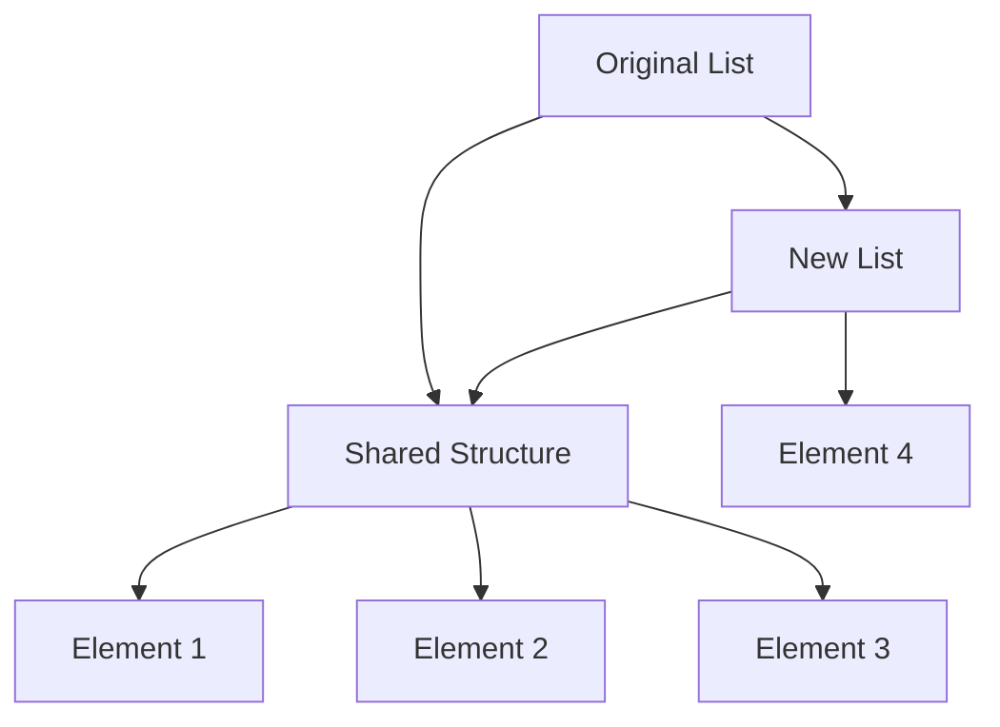

## 10.9 Functional Data Structures

In the realm of functional programming, data structures play a pivotal role in ensuring that applications are both efficient and maintainable. Functional data structures, particularly immutable and persistent collections, are essential for achieving these goals. In this section, we will delve into the intricacies of functional data structures in C#, focusing on the use of immutable collections and the concept of persistent data structures. We'll explore the `System.Collections.Immutable` namespace, discuss the benefits of immutability, and understand the efficiency brought about by structural sharing.

### Understanding Functional Data Structures

Functional data structures are designed to work seamlessly with functional programming paradigms, emphasizing immutability and persistence. These structures are crucial for building applications that are easy to reason about, test, and maintain.

#### Immutability in Functional Programming

Immutability refers to the concept where data structures, once created, cannot be altered. This characteristic is fundamental in functional programming, as it eliminates side effects and makes functions more predictable.

**Benefits of Immutability:**

- **Predictability:** Immutable data structures ensure that data remains consistent throughout the program's execution.
- **Thread Safety:** Since immutable objects cannot be modified, they are inherently thread-safe, making them ideal for concurrent programming.
- **Ease of Testing:** Functions that operate on immutable data are easier to test, as they do not depend on external state changes.

#### Persistence in Data Structures

Persistence in data structures refers to the ability to preserve previous versions of a data structure when it is modified. This is achieved through structural sharing, where new versions of the data structure share parts of the old structure, minimizing memory usage and enhancing performance.

### Using Immutable Collections in C#

C# provides a robust set of immutable collections through the `System.Collections.Immutable` namespace. These collections are designed to provide the benefits of immutability while maintaining performance.

#### The `System.Collections.Immutable` Namespace

The `System.Collections.Immutable` namespace offers a variety of immutable collections, including:

- **ImmutableList<T>**
- **ImmutableArray<T>**
- **ImmutableDictionary<TKey, TValue>**
- **ImmutableHashSet<T>**
- **ImmutableQueue<T>**
- **ImmutableStack<T>**

These collections are designed to be used in scenarios where data integrity and thread safety are paramount.

**Example: Using ImmutableList<T>**

```csharp
using System.Collections.Immutable;

class Program
{
    static void Main()
    {
        // Create an immutable list
        var immutableList = ImmutableList.Create<int>(1, 2, 3);

        // Add an element to the list
        var newList = immutableList.Add(4);

        // Display the original and new lists
        Console.WriteLine("Original List: " + string.Join(", ", immutableList));
        Console.WriteLine("New List: " + string.Join(", ", newList));
    }
}
```

In this example, adding an element to the `ImmutableList` does not modify the original list. Instead, it returns a new list with the added element, demonstrating immutability.

#### Benefits Over Mutable Counterparts

Immutable collections offer several advantages over their mutable counterparts:

- **No Side Effects:** Operations on immutable collections do not alter the original data, preventing unintended side effects.
- **Simplified Concurrency:** Immutable collections can be shared across threads without the need for synchronization mechanisms.
- **Enhanced Debugging:** Immutable collections make it easier to track changes and debug applications, as data remains consistent.

### Persistent Data Structures

Persistent data structures are a cornerstone of functional programming, enabling efficient data manipulation without compromising immutability.

#### Understanding Structural Sharing

Structural sharing is a technique used in persistent data structures to minimize memory usage and improve performance. When a data structure is modified, only the parts that change are copied, while the rest of the structure is shared with the new version.

**Example: Structural Sharing in ImmutableList<T>**

```csharp
using System.Collections.Immutable;

class Program
{
    static void Main()
    {
        // Create an immutable list
        var list1 = ImmutableList.Create<int>(1, 2, 3);

        // Add an element to the list
        var list2 = list1.Add(4);

        // Both lists share the same underlying structure for elements 1, 2, and 3
        Console.WriteLine("List1: " + string.Join(", ", list1));
        Console.WriteLine("List2: " + string.Join(", ", list2));
    }
}
```

In this example, `list1` and `list2` share the same underlying structure for elements 1, 2, and 3, demonstrating structural sharing.

#### Efficiency in Functional Data Structures

Functional data structures are designed to be efficient, leveraging structural sharing to minimize memory usage and improve performance. This efficiency is crucial in applications where data integrity and performance are critical.

### Visualizing Structural Sharing

To better understand structural sharing, let's visualize how it works using a diagram.



**Diagram Description:** This diagram illustrates how the original list and the new list share the same underlying structure for elements 1, 2, and 3, while the new list adds element 4.

### Try It Yourself

Experiment with the code examples provided by modifying them to add or remove elements from the immutable collections. Observe how the original collections remain unchanged and how new collections are created with the desired modifications.

### Knowledge Check

- **Question:** What are the primary benefits of using immutable collections in C#?
- **Question:** How does structural sharing contribute to the efficiency of persistent data structures?
- **Question:** What is the difference between immutability and persistence in data structures?

### Continuing the Journey

As we continue our exploration of functional programming patterns, remember that mastering functional data structures is a crucial step in building efficient and maintainable applications. Keep experimenting with different collections and patterns, and enjoy the journey of becoming a proficient C# developer.

## Quiz Time!



### What is the primary benefit of using immutable collections in C#?

- [x] They prevent unintended side effects.
- [ ] They allow direct modification of data.
- [ ] They require complex synchronization mechanisms.
- [ ] They are slower than mutable collections.

> **Explanation:** Immutable collections prevent unintended side effects by ensuring that data cannot be modified once created.

### How does structural sharing improve the efficiency of persistent data structures?

- [x] By minimizing memory usage through shared structures.
- [ ] By copying the entire data structure on modification.
- [ ] By allowing direct modification of data.
- [ ] By increasing the complexity of data structures.

> **Explanation:** Structural sharing improves efficiency by minimizing memory usage, as only the modified parts of the data structure are copied.

### What is the difference between immutability and persistence in data structures?

- [x] Immutability means data cannot be changed; persistence means previous versions are preserved.
- [ ] Immutability allows data modification; persistence prevents it.
- [ ] Immutability is about memory usage; persistence is about performance.
- [ ] Immutability and persistence are the same.

> **Explanation:** Immutability ensures data cannot be changed, while persistence ensures that previous versions of the data structure are preserved.

### Which namespace in C# provides immutable collections?

- [x] System.Collections.Immutable
- [ ] System.Collections.Generic
- [ ] System.Linq
- [ ] System.Threading.Tasks

> **Explanation:** The `System.Collections.Immutable` namespace provides a variety of immutable collections in C#.

### What is a key advantage of using immutable collections in concurrent programming?

- [x] They are inherently thread-safe.
- [ ] They require complex locking mechanisms.
- [ ] They allow direct modification of data.
- [ ] They are slower than mutable collections.

> **Explanation:** Immutable collections are inherently thread-safe, making them ideal for concurrent programming.

### How does the `ImmutableList<T>` differ from a regular `List<T>`?

- [x] `ImmutableList<T>` cannot be modified once created.
- [ ] `ImmutableList<T>` allows direct modification of elements.
- [ ] `ImmutableList<T>` is slower than `List<T>`.
- [ ] `ImmutableList<T>` requires complex synchronization.

> **Explanation:** `ImmutableList<T>` cannot be modified once created, ensuring data integrity and preventing side effects.

### What is the role of structural sharing in persistent data structures?

- [x] To minimize memory usage by sharing unchanged parts.
- [ ] To copy the entire data structure on modification.
- [ ] To allow direct modification of data.
- [ ] To increase the complexity of data structures.

> **Explanation:** Structural sharing minimizes memory usage by sharing unchanged parts of the data structure between versions.

### Why are immutable collections easier to test?

- [x] They do not depend on external state changes.
- [ ] They allow direct modification of data.
- [ ] They require complex synchronization mechanisms.
- [ ] They are slower than mutable collections.

> **Explanation:** Immutable collections are easier to test because they do not depend on external state changes, making functions more predictable.

### What is a common use case for immutable collections?

- [x] Concurrent programming
- [ ] Direct data modification
- [ ] Complex synchronization
- [ ] Slower performance

> **Explanation:** Immutable collections are commonly used in concurrent programming due to their inherent thread safety.

### True or False: Immutable collections in C# are slower than their mutable counterparts.

- [ ] True
- [x] False

> **Explanation:** Immutable collections are designed to be efficient and can often match or exceed the performance of mutable collections, especially in concurrent scenarios.


