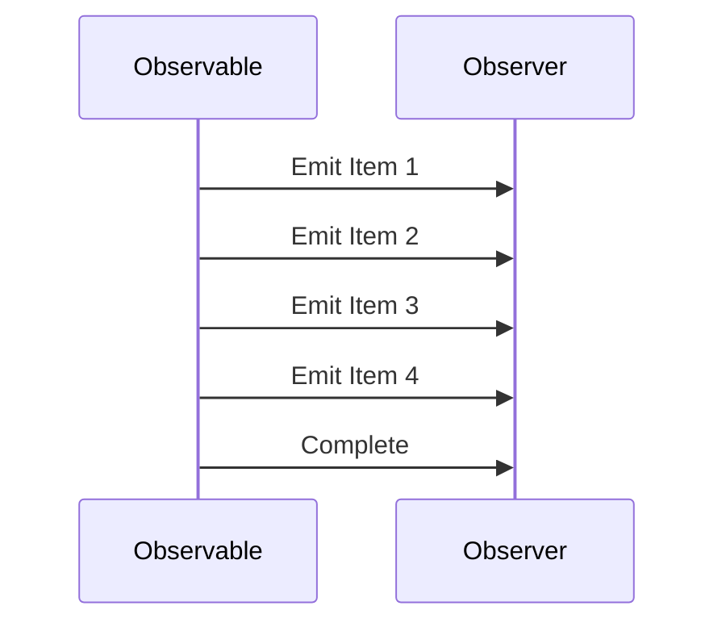

## 11.1 Introduction to Reactive Programming

Reactive programming is a paradigm that has gained significant traction in modern software development, especially with the rise of complex, distributed systems and the need for responsive user interfaces. In this section, we will delve into the principles of reactive systems, explore the differences between reactive and imperative programming, and provide insights into how you can leverage reactive programming in C# to build robust applications.

### Principles of Reactive Systems

Reactive systems are designed to be responsive, resilient, elastic, and message-driven. These principles are outlined in the [Reactive Manifesto](https://www.reactivemanifesto.org/), which serves as a guide for building systems that can handle the demands of modern applications.

#### 1. Responsive

A responsive system is one that provides rapid and consistent response times. This is crucial for maintaining a positive user experience and ensuring that the system can handle varying loads without degradation in performance. Responsiveness is achieved through asynchronous processing and non-blocking operations, allowing the system to remain available even under high demand.

#### 2. Resilient

Resilience in reactive systems refers to the ability to remain functional in the face of failures. This is achieved through techniques such as replication, isolation, and delegation. By isolating failures and managing them gracefully, reactive systems can recover quickly and continue to provide service.

#### 3. Elastic

Elasticity is the ability of a system to adapt to changes in workload by scaling up or down as needed. Reactive systems achieve elasticity through the use of distributed architectures and cloud-native technologies, which allow them to allocate resources dynamically based on demand.

#### 4. Message-Driven

Reactive systems rely on asynchronous message-passing to establish boundaries between components. This decouples the components and allows them to interact without blocking, leading to more scalable and maintainable systems. Message-driven architectures also enable location transparency and fault tolerance.

### Difference Between Reactive and Imperative Programming

To fully appreciate the benefits of reactive programming, it's essential to understand how it differs from the traditional imperative programming paradigm.

#### Imperative Programming

Imperative programming is a paradigm where developers explicitly define the steps that the computer must take to achieve a desired outcome. This approach is characterized by:

- **Sequential Execution**: Code is executed in a specific order, with each statement altering the program's state.
- **State Management**: Developers manage the state explicitly, often leading to complex and error-prone code.
- **Blocking Operations**: Operations that require waiting (e.g., I/O operations) block the execution flow, potentially leading to performance bottlenecks.

Imperative programming is well-suited for straightforward tasks but can become cumbersome when dealing with asynchronous or event-driven scenarios.

#### Reactive Programming

Reactive programming, on the other hand, is a declarative paradigm focused on data streams and the propagation of change. Key characteristics include:

- **Asynchronous Data Streams**: Reactive programming treats data as streams that can be observed and manipulated asynchronously.
- **Event-Driven**: Systems react to events or changes in data, allowing for more dynamic and responsive applications.
- **Non-Blocking**: Operations are non-blocking, enabling the system to handle multiple tasks concurrently without waiting for each to complete.

Reactive programming is particularly beneficial in environments where responsiveness and scalability are critical, such as user interfaces, real-time data processing, and distributed systems.

### Implementing Reactive Programming in C#

C# provides robust support for reactive programming through libraries such as [Reactive Extensions (Rx.NET)](https://reactivex.io/), which allows developers to compose asynchronous and event-based programs using observable sequences.

#### Getting Started with Rx.NET

To begin using Rx.NET in your C# projects, you need to install the `System.Reactive` package via NuGet. This package provides the core functionality for working with observables and observers.

```csharp
// Install the System.Reactive package via NuGet
// dotnet add package System.Reactive

using System;
using System.Reactive.Linq;

class Program
{
    static void Main()
    {
        // Create an observable sequence of integers
        var numbers = Observable.Range(1, 10);

        // Subscribe to the observable and print each number
        numbers.Subscribe(
            onNext: number => Console.WriteLine($"Received: {number}"),
            onError: error => Console.WriteLine($"Error: {error.Message}"),
            onCompleted: () => Console.WriteLine("Sequence completed.")
        );
    }
}
```

In this example, we create an observable sequence of integers from 1 to 10 using `Observable.Range`. We then subscribe to this sequence, specifying actions to take for each element received, any errors encountered, and when the sequence completes.

#### Key Concepts in Reactive Programming

To effectively implement reactive programming in C#, it's important to understand several key concepts:

##### Observables and Observers

- **Observable**: Represents a data stream or sequence of events. Observables can emit zero or more items and may complete with or without an error.
- **Observer**: Consumes the data emitted by an observable. Observers define actions for handling emitted items, errors, and completion notifications.

##### Operators

Operators are functions that enable you to transform, filter, and combine observables. Rx.NET provides a rich set of operators for various operations, such as:

- **Transforming**: `Select`, `SelectMany`
- **Filtering**: `Where`, `Take`, `Skip`
- **Combining**: `Merge`, `Zip`, `CombineLatest`

```csharp
using System;
using System.Reactive.Linq;

class Program
{
    static void Main()
    {
        var numbers = Observable.Range(1, 10);

        // Use the Select operator to transform each number
        var squaredNumbers = numbers.Select(number => number * number);

        squaredNumbers.Subscribe(
            onNext: number => Console.WriteLine($"Squared: {number}"),
            onCompleted: () => Console.WriteLine("Transformation completed.")
        );
    }
}
```

In this example, we use the `Select` operator to transform each number in the sequence by squaring it.

##### Schedulers

Schedulers control the execution context of observables and observers. They determine when and where the operations are executed, allowing you to manage concurrency and threading.

- **Immediate Scheduler**: Executes work immediately on the current thread.
- **NewThread Scheduler**: Executes work on a new thread.
- **ThreadPool Scheduler**: Executes work on a thread pool thread.
- **TaskPool Scheduler**: Executes work on a task pool thread.

```csharp
using System;
using System.Reactive.Concurrency;
using System.Reactive.Linq;

class Program
{
    static void Main()
    {
        var numbers = Observable.Range(1, 5);

        // Subscribe on a new thread
        numbers
            .SubscribeOn(NewThreadScheduler.Default)
            .Subscribe(
                onNext: number => Console.WriteLine($"Received on thread {Environment.CurrentManagedThreadId}: {number}"),
                onCompleted: () => Console.WriteLine("Sequence completed.")
            );

        Console.ReadLine();
    }
}
```

In this example, we use the `SubscribeOn` method to specify that the subscription should occur on a new thread, demonstrating how schedulers can be used to manage concurrency.

### Visualizing Reactive Programming

To better understand the flow of data in reactive programming, let's visualize a simple reactive system using a sequence diagram.



In this diagram, the `Observable` emits a series of items to the `Observer`, which processes each item as it is received. Once all items have been emitted, the observable sends a completion notification.

### Try It Yourself

To solidify your understanding of reactive programming, try modifying the code examples provided. Experiment with different operators, create custom observables, and explore the use of schedulers to manage concurrency. Consider implementing a simple reactive application, such as a real-time data dashboard or a responsive user interface.

### Knowledge Check

- Explain the principles of reactive systems and how they contribute to building robust applications.
- Describe the differences between reactive and imperative programming.
- Implement a simple observable sequence in C# using Rx.NET.
- Use operators to transform and filter data streams in reactive programming.
- Manage concurrency in reactive programming using schedulers.

### Embrace the Journey

Remember, mastering reactive programming is a journey. As you explore this paradigm, you'll discover new ways to build responsive, resilient, and scalable applications. Keep experimenting, stay curious, and enjoy the process of learning and growing as a developer.

### References and Links

- [Reactive Manifesto](https://www.reactivemanifesto.org/)
- [Reactive Extensions (Rx.NET)](https://reactivex.io/)
- [Microsoft Docs: Reactive Extensions](https://docs.microsoft.com/en-us/previous-versions/dotnet/reactive-extensions/hh242985(v=vs.103))

## Quiz Time!



### What is a key principle of reactive systems?

- [x] Responsiveness
- [ ] Sequential Execution
- [ ] Blocking Operations
- [ ] Synchronous Processing

> **Explanation:** Responsiveness is a key principle of reactive systems, ensuring rapid and consistent response times.

### What is the main difference between reactive and imperative programming?

- [x] Reactive programming is event-driven and non-blocking.
- [ ] Imperative programming is event-driven and non-blocking.
- [ ] Reactive programming is sequential and blocking.
- [ ] Imperative programming is asynchronous and non-blocking.

> **Explanation:** Reactive programming is characterized by being event-driven and non-blocking, unlike imperative programming which is typically sequential and blocking.

### Which Rx.NET operator is used to transform data in a sequence?

- [x] Select
- [ ] Merge
- [ ] Where
- [ ] Zip

> **Explanation:** The `Select` operator is used to transform data in a sequence in Rx.NET.

### What is the role of schedulers in reactive programming?

- [x] They control the execution context of observables and observers.
- [ ] They define the data structure of observables.
- [ ] They manage the state of observers.
- [ ] They determine the sequence of emitted items.

> **Explanation:** Schedulers control the execution context of observables and observers, managing concurrency and threading.

### Which of the following is NOT a principle of reactive systems?

- [ ] Resilience
- [x] Blocking Operations
- [ ] Elasticity
- [ ] Message-Driven

> **Explanation:** Blocking operations are not a principle of reactive systems; they are non-blocking by design.

### How can you create an observable sequence in C# using Rx.NET?

- [x] Use `Observable.Range` to create a sequence of integers.
- [ ] Use `List<int>` to create a sequence of integers.
- [ ] Use `Array<int>` to create a sequence of integers.
- [ ] Use `Dictionary<int, int>` to create a sequence of integers.

> **Explanation:** `Observable.Range` is used in Rx.NET to create an observable sequence of integers.

### What is the purpose of the `Subscribe` method in Rx.NET?

- [x] It allows an observer to consume data from an observable.
- [ ] It creates a new observable sequence.
- [ ] It transforms data in a sequence.
- [ ] It filters data in a sequence.

> **Explanation:** The `Subscribe` method allows an observer to consume data from an observable in Rx.NET.

### Which operator would you use to filter data in a sequence?

- [ ] Select
- [ ] Merge
- [x] Where
- [ ] Zip

> **Explanation:** The `Where` operator is used to filter data in a sequence in Rx.NET.

### What does the `Complete` notification signify in a reactive system?

- [x] The observable has finished emitting items.
- [ ] The observable has encountered an error.
- [ ] The observer has unsubscribed.
- [ ] The observable is paused.

> **Explanation:** The `Complete` notification signifies that the observable has finished emitting items.

### True or False: Reactive programming is well-suited for environments where responsiveness and scalability are critical.

- [x] True
- [ ] False

> **Explanation:** Reactive programming is indeed well-suited for environments where responsiveness and scalability are critical.


