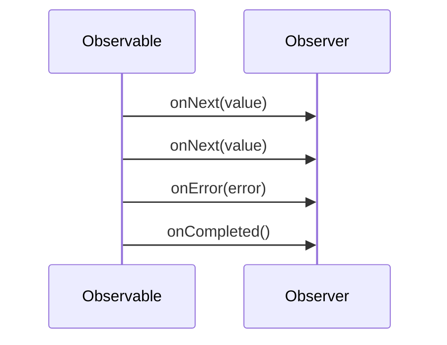

## 11.2 Observable Pattern with Rx.NET

In the realm of modern software development, building applications that are responsive, resilient, and scalable is paramount. The Observable Pattern, particularly when implemented using Rx.NET, offers a robust framework for handling asynchronous and event-based programming in C#. This section will guide you through the intricacies of the Observable Pattern with Rx.NET, providing you with the knowledge to harness its full potential.

### Introduction to Rx.NET

Reactive Extensions (Rx) is a library for composing asynchronous and event-based programs using observable sequences and LINQ-style query operators. Rx.NET is the .NET implementation of this library, providing a powerful toolset for developers to handle asynchronous data streams with ease.

#### Setting Up and Installing Rx.NET

Before diving into the Observable Pattern, let's set up Rx.NET in your C# environment.

1. **Install Rx.NET via NuGet**: Open your project in Visual Studio and navigate to the NuGet Package Manager. Search for `System.Reactive` and install it.

   ```shell
   Install-Package System.Reactive
   ```

2. **Add Using Directives**: Ensure you include the necessary namespaces in your C# files.

   ```csharp
   using System;
   using System.Reactive.Linq;
   using System.Reactive.Subjects;
   ```

### Basics of Observables and Observers

At the heart of Rx.NET are two core concepts: **Observables** and **Observers**.

- **Observables**: These are data sources that emit a sequence of values over time. They can be thought of as "data producers."
- **Observers**: These are consumers of the data emitted by observables. They react to each value, error, or completion notification.

#### Creating Observables

Observables can be created from various data sources, including events, collections, and asynchronous operations.

**Example: Creating an Observable from a Collection**

```csharp
var numbers = new[] { 1, 2, 3, 4, 5 };
var observable = numbers.ToObservable();

observable.Subscribe(
    onNext: number => Console.WriteLine($"Received: {number}"),
    onError: error => Console.WriteLine($"Error: {error}"),
    onCompleted: () => Console.WriteLine("Sequence Completed")
);
```

In this example, we convert an array of numbers into an observable sequence. The `Subscribe` method is used to define how the observer reacts to each emitted value, errors, and completion.

#### Creating Observers

Observers are defined by implementing the `IObserver<T>` interface or by using the `Subscribe` method with lambda expressions.

**Example: Defining an Observer**

```csharp
IObserver<int> observer = Observer.Create<int>(
    onNext: number => Console.WriteLine($"Number: {number}"),
    onError: error => Console.WriteLine($"Error: {error.Message}"),
    onCompleted: () => Console.WriteLine("Done")
);

observable.Subscribe(observer);
```

### Creating Observables and Operators

Rx.NET provides a rich set of operators that allow you to transform, filter, and combine observable sequences.

#### Generating Observables from Events and Data Sources

Observables can be generated from various sources, such as UI events, timers, and asynchronous operations.

**Example: Creating an Observable from a Timer**

```csharp
var timerObservable = Observable.Interval(TimeSpan.FromSeconds(1));

timerObservable.Subscribe(
    onNext: tick => Console.WriteLine($"Tick: {tick}"),
    onCompleted: () => Console.WriteLine("Timer completed")
);
```

This example creates an observable that emits a value every second, simulating a timer.

#### Applying Operators

Operators are methods that allow you to manipulate observable sequences. Some common operators include `Select`, `Where`, and `Merge`.

**Example: Using Select and Where Operators**

```csharp
var evenNumbers = observable
    .Where(number => number % 2 == 0)
    .Select(number => number * 2);

evenNumbers.Subscribe(
    onNext: number => Console.WriteLine($"Even Number: {number}")
);
```

In this example, we filter the observable sequence to only include even numbers and then transform each number by doubling it.

**Example: Merging Observables**

```csharp
var observable1 = Observable.Interval(TimeSpan.FromSeconds(1)).Take(5);
var observable2 = Observable.Interval(TimeSpan.FromSeconds(2)).Take(5);

var merged = observable1.Merge(observable2);

merged.Subscribe(
    onNext: value => Console.WriteLine($"Merged Value: {value}")
);
```

The `Merge` operator combines multiple observables into a single observable sequence.

### Use Cases and Examples

Rx.NET is particularly useful in scenarios involving real-time data processing and handling asynchronous event sequences.

#### Real-Time Data Processing

In applications such as stock trading platforms or live sports updates, real-time data processing is crucial. Rx.NET allows you to handle streams of data efficiently.

**Example: Processing Real-Time Stock Prices**

```csharp
var stockPrices = new Subject<decimal>();

stockPrices
    .Buffer(TimeSpan.FromSeconds(1))
    .Subscribe(prices =>
    {
        var averagePrice = prices.Average();
        Console.WriteLine($"Average Stock Price: {averagePrice}");
    });

// Simulate incoming stock prices
stockPrices.OnNext(100.5m);
stockPrices.OnNext(101.0m);
stockPrices.OnNext(102.3m);
```

In this example, we use the `Buffer` operator to collect stock prices over a one-second interval and calculate the average price.

#### Handling Asynchronous Event Sequences

Rx.NET excels at managing asynchronous event sequences, such as user interactions or network requests.

**Example: Debouncing User Input**

```csharp
var textInput = new Subject<string>();

textInput
    .Throttle(TimeSpan.FromMilliseconds(300))
    .DistinctUntilChanged()
    .Subscribe(input => Console.WriteLine($"User Input: {input}"));

// Simulate user typing
textInput.OnNext("H");
textInput.OnNext("He");
textInput.OnNext("Hel");
textInput.OnNext("Hell");
textInput.OnNext("Hello");
```

The `Throttle` operator is used to ignore rapid successive inputs, only emitting the latest value after a specified duration.

### Visualizing the Observable Pattern

To better understand the flow of data in the Observable Pattern, let's visualize it using a sequence diagram.



This diagram illustrates the interaction between an observable and an observer, highlighting the sequence of notifications.

### Design Considerations

When implementing the Observable Pattern with Rx.NET, consider the following:

- **Error Handling**: Ensure that your observers handle errors gracefully to prevent application crashes.
- **Resource Management**: Use disposables to manage subscriptions and prevent memory leaks.
- **Threading**: Be mindful of threading issues, especially when dealing with UI updates.

### Differences and Similarities

The Observable Pattern is often compared to the Publish/Subscribe Pattern. While both involve message distribution, the Observable Pattern is more flexible, allowing for complex transformations and filtering of data streams.

### Try It Yourself

Experiment with the code examples provided. Try modifying the observable sequences, applying different operators, and observing the changes in behavior. This hands-on approach will deepen your understanding of Rx.NET.

### Knowledge Check

- What is the primary purpose of the Observable Pattern?
- How do you create an observable from a collection?
- What is the role of an observer in Rx.NET?
- How can you combine multiple observables into one sequence?
- What operator would you use to filter an observable sequence?

### Embrace the Journey

Remember, mastering Rx.NET is a journey. As you continue to explore and experiment, you'll uncover new ways to build responsive and efficient applications. Stay curious and enjoy the process!

## Quiz Time!



### What is the primary purpose of the Observable Pattern?

- [x] To handle asynchronous and event-based programming
- [ ] To manage database connections
- [ ] To simplify UI design
- [ ] To optimize memory usage

> **Explanation:** The Observable Pattern is designed to handle asynchronous and event-based programming by allowing data to be emitted over time and consumed by observers.

### How do you create an observable from a collection in Rx.NET?

- [x] Use the `ToObservable` method
- [ ] Use the `CreateObservable` method
- [ ] Use the `FromCollection` method
- [ ] Use the `ObservableCollection` class

> **Explanation:** The `ToObservable` method is used to convert a collection into an observable sequence in Rx.NET.

### What is the role of an observer in Rx.NET?

- [x] To consume data emitted by observables
- [ ] To produce data for observables
- [ ] To manage database transactions
- [ ] To handle UI rendering

> **Explanation:** An observer in Rx.NET is responsible for consuming data emitted by observables and reacting to each value, error, or completion notification.

### Which operator would you use to filter an observable sequence?

- [x] `Where`
- [ ] `Select`
- [ ] `Merge`
- [ ] `Buffer`

> **Explanation:** The `Where` operator is used to filter an observable sequence based on a specified condition.

### How can you combine multiple observables into one sequence?

- [x] Use the `Merge` operator
- [ ] Use the `Combine` operator
- [ ] Use the `Join` operator
- [ ] Use the `Concat` operator

> **Explanation:** The `Merge` operator is used to combine multiple observables into a single observable sequence.

### What is the purpose of the `Throttle` operator in Rx.NET?

- [x] To ignore rapid successive inputs and emit the latest value after a specified duration
- [ ] To combine multiple observables
- [ ] To filter values based on a condition
- [ ] To transform values in an observable sequence

> **Explanation:** The `Throttle` operator is used to ignore rapid successive inputs, only emitting the latest value after a specified duration, which is useful for debouncing user input.

### Which operator would you use to transform values in an observable sequence?

- [x] `Select`
- [ ] `Where`
- [ ] `Merge`
- [ ] `Buffer`

> **Explanation:** The `Select` operator is used to transform each value in an observable sequence.

### What is the benefit of using the `DistinctUntilChanged` operator?

- [x] It prevents duplicate consecutive values from being emitted
- [ ] It combines multiple observables
- [ ] It filters values based on a condition
- [ ] It transforms values in an observable sequence

> **Explanation:** The `DistinctUntilChanged` operator prevents duplicate consecutive values from being emitted, ensuring that only unique changes are propagated.

### How do you handle errors in an observable sequence?

- [x] By providing an `onError` handler in the `Subscribe` method
- [ ] By using a `try-catch` block
- [ ] By ignoring errors
- [ ] By using the `Error` operator

> **Explanation:** Errors in an observable sequence are handled by providing an `onError` handler in the `Subscribe` method, allowing the observer to react to errors appropriately.

### True or False: The Observable Pattern is only useful for UI applications.

- [ ] True
- [x] False

> **Explanation:** False. The Observable Pattern is useful for a wide range of applications, including real-time data processing, network communication, and more, not just UI applications.


