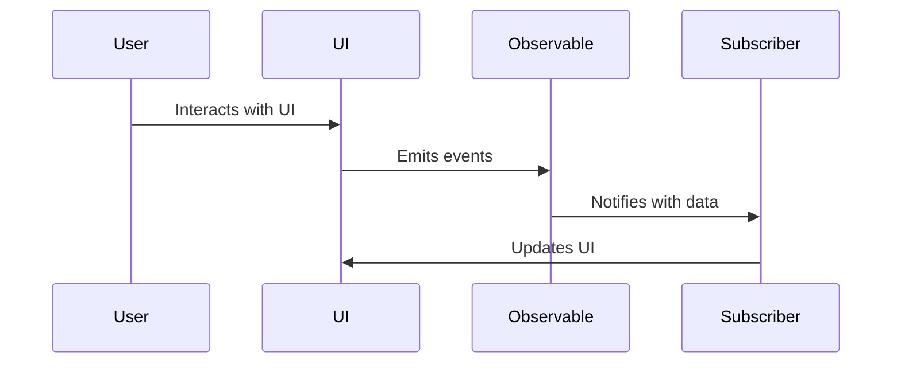

## 11.3 Functional Reactive Programming

Functional Reactive Programming (FRP) is a paradigm that combines the declarative nature of functional programming with the dynamic responsiveness of reactive programming. In this section, we will explore how these paradigms converge to create powerful, expressive, and maintainable systems in C#. We will delve into the core concepts of FRP, demonstrate how to implement FRP using Rx.NET, and explore practical use cases.

### Concepts of FRP

#### Combining Functional and Reactive Paradigms

Functional Reactive Programming is a programming paradigm that allows developers to work with time-varying values and asynchronous data streams in a declarative manner. It leverages the principles of functional programming, such as immutability and pure functions, and combines them with the reactive programming model, which focuses on data flows and the propagation of change.

**Key Concepts:**

- **Declarative Programming:** FRP allows you to express the logic of computation without describing its control flow. This leads to more readable and maintainable code.
- **Streams and Signals:** In FRP, data is represented as streams (sequences of events over time) and signals (time-varying values). These abstractions enable you to model dynamic behaviors in a clean and concise way.
- **Time-Varying Values:** FRP provides a way to work with values that change over time, allowing you to react to changes in the environment or user interactions seamlessly.

#### Understanding Streams and Signals

In FRP, streams and signals are fundamental concepts that represent the flow of data and changes over time.

- **Streams:** A stream is a sequence of events or data points that occur over time. Streams can be infinite or finite and can represent anything from user inputs to network requests. In C#, streams are often implemented using observables, which are part of the Reactive Extensions (Rx) library.

- **Signals:** A signal is a time-varying value that represents the current state of a system. Unlike streams, which are sequences of discrete events, signals provide a continuous representation of a value over time. Signals are useful for modeling stateful components in an application.

### Implementing FRP in C#

C# provides a robust ecosystem for implementing FRP through the use of the Reactive Extensions (Rx.NET) library. Rx.NET is a library for composing asynchronous and event-based programs using observable sequences and LINQ-style query operators.

#### Using Rx.NET for FRP Patterns

Rx.NET is a powerful tool for implementing FRP patterns in C#. It provides a rich set of operators for creating, transforming, and combining streams of data.

**Key Features of Rx.NET:**

- **Observables:** The core abstraction in Rx.NET is the observable, which represents a stream of data that can be observed over time. Observables can be created from various sources, such as events, tasks, or timers.

- **Operators:** Rx.NET provides a wide range of operators for transforming and combining observables. These operators allow you to filter, map, merge, and aggregate data streams in a declarative manner.

- **Schedulers:** Rx.NET includes support for scheduling the execution of observables on different threads, enabling you to manage concurrency and asynchronous operations effectively.

**Example: Creating an Observable in C#**

```csharp
using System;
using System.Reactive.Linq;

class Program
{
    static void Main()
    {
        // Create an observable sequence of integers
        var numbers = Observable.Range(1, 10);

        // Subscribe to the observable and print each number
        numbers.Subscribe(
            onNext: number => Console.WriteLine($"Received: {number}"),
            onCompleted: () => Console.WriteLine("Sequence completed.")
        );
    }
}
```

In this example, we create an observable sequence of integers using the `Observable.Range` method. We then subscribe to the observable and print each number as it is received.

#### Modeling Time-Varying Values

Modeling time-varying values is a core aspect of FRP. In C#, you can use observables to represent values that change over time and react to these changes.

**Example: Modeling Mouse Movements**

```csharp
using System;
using System.Reactive.Linq;
using System.Windows.Forms;

class Program
{
    static void Main()
    {
        // Create a form to capture mouse movements
        var form = new Form();
        form.Text = "Mouse Tracker";

        // Create an observable for mouse move events
        var mouseMoves = Observable.FromEventPattern<MouseEventArgs>(
            handler => form.MouseMove += handler,
            handler => form.MouseMove -= handler
        );

        // Subscribe to the observable and update the form title with mouse coordinates
        mouseMoves.Subscribe(eventPattern =>
        {
            var args = eventPattern.EventArgs;
            form.Text = $"Mouse Position: X={args.X}, Y={args.Y}";
        });

        // Run the form
        Application.Run(form);
    }
}
```

In this example, we create an observable from mouse move events on a Windows Form. We then subscribe to the observable and update the form's title with the current mouse coordinates.

### Use Cases and Examples

Functional Reactive Programming is particularly well-suited for applications that require dynamic and responsive user interfaces or need to process and react to streams of data in real-time.

#### Interactive Applications

FRP is ideal for building interactive applications where user inputs and system events need to be processed and responded to in real-time. By using observables to model user interactions, you can create applications that are both responsive and maintainable.

**Example: Building a Simple Reactive Calculator**

```csharp
using System;
using System.Reactive.Linq;
using System.Windows.Forms;

class ReactiveCalculator
{
    static void Main()
    {
        var form = new Form();
        var input1 = new TextBox { Left = 10, Top = 10, Width = 100 };
        var input2 = new TextBox { Left = 120, Top = 10, Width = 100 };
        var result = new Label { Left = 10, Top = 40, Width = 210 };

        form.Controls.Add(input1);
        form.Controls.Add(input2);
        form.Controls.Add(result);

        // Create observables for text changes in the input boxes
        var input1Changes = Observable.FromEventPattern<EventArgs>(input1, "TextChanged")
            .Select(_ => input1.Text)
            .Select(text => int.TryParse(text, out var value) ? value : 0);

        var input2Changes = Observable.FromEventPattern<EventArgs>(input2, "TextChanged")
            .Select(_ => input2.Text)
            .Select(text => int.TryParse(text, out var value) ? value : 0);

        // Combine the latest values from both inputs and update the result label
        input1Changes.CombineLatest(input2Changes, (x, y) => x + y)
            .Subscribe(sum => result.Text = $"Sum: {sum}");

        Application.Run(form);
    }
}
```

In this example, we create a simple reactive calculator that updates the sum of two input values in real-time as the user types. We use observables to track changes in the input text boxes and combine their latest values to compute the sum.

#### Financial Data Analysis

FRP is also well-suited for applications that need to process and analyze streams of financial data. By using observables to model data streams, you can build systems that react to changes in market data and perform real-time analysis.

**Example: Analyzing Stock Prices**

```csharp
using System;
using System.Reactive.Linq;

class StockAnalyzer
{
    static void Main()
    {
        // Simulate a stream of stock prices
        var stockPrices = Observable.Interval(TimeSpan.FromSeconds(1))
            .Select(_ => new Random().Next(100, 200));

        // Calculate the moving average of the stock prices
        stockPrices.Buffer(5, 1)
            .Select(prices => prices.Average())
            .Subscribe(average => Console.WriteLine($"Moving Average: {average:F2}"));
    }
}
```

In this example, we simulate a stream of stock prices using an observable that emits random values at regular intervals. We then calculate the moving average of the stock prices using the `Buffer` operator to collect a window of prices and the `Average` operator to compute the average.

### Visualizing FRP Concepts

To better understand the flow of data in FRP, let's visualize the process using a sequence diagram.



**Diagram Description:** This sequence diagram illustrates the flow of data in a functional reactive application. The user interacts with the UI, which emits events as observables. The observable notifies subscribers with data, and the subscribers update the UI in response.

### References and Links

For further reading on Functional Reactive Programming and Rx.NET, consider exploring the following resources:

- [Reactive Extensions (Rx) Documentation](https://reactivex.io/)
- [Rx.NET GitHub Repository](https://github.com/dotnet/reactive)
- [Functional Programming in C#](https://docs.microsoft.com/en-us/dotnet/csharp/functional-programming)

### Knowledge Check

To reinforce your understanding of Functional Reactive Programming, consider the following questions and exercises:

1. Explain the difference between streams and signals in FRP.
2. How can Rx.NET be used to model time-varying values in C#?
3. Implement a simple reactive application that tracks the position of the mouse and displays it in a console window.
4. What are some common use cases for Functional Reactive Programming in software development?
5. Modify the reactive calculator example to support subtraction, multiplication, and division operations.

### Embrace the Journey

Remember, mastering Functional Reactive Programming is a journey. As you explore these concepts and experiment with Rx.NET, you'll gain a deeper understanding of how to build responsive and maintainable applications. Keep experimenting, stay curious, and enjoy the journey!

## Quiz Time!



### What is the primary goal of Functional Reactive Programming (FRP)?

- [x] To combine functional programming with reactive programming for handling time-varying values.
- [ ] To replace object-oriented programming with a new paradigm.
- [ ] To simplify the syntax of C#.
- [ ] To eliminate the need for asynchronous programming.

> **Explanation:** FRP combines functional and reactive programming to handle time-varying values and asynchronous data streams declaratively.

### In FRP, what is a stream?

- [x] A sequence of events or data points that occur over time.
- [ ] A static value that never changes.
- [ ] A function that returns a single value.
- [ ] A type of database connection.

> **Explanation:** A stream in FRP represents a sequence of events or data points that occur over time, allowing for dynamic data processing.

### What library in C# is commonly used for implementing FRP patterns?

- [x] Rx.NET
- [ ] Entity Framework
- [ ] ASP.NET Core
- [ ] LINQ to SQL

> **Explanation:** Rx.NET is a library for composing asynchronous and event-based programs using observable sequences, making it ideal for FRP.

### How does Rx.NET represent a stream of data?

- [x] As an observable
- [ ] As a list
- [ ] As a dictionary
- [ ] As a static variable

> **Explanation:** In Rx.NET, a stream of data is represented as an observable, which can be subscribed to for receiving data updates.

### What operator in Rx.NET can be used to combine the latest values from multiple observables?

- [x] CombineLatest
- [ ] Merge
- [ ] Zip
- [ ] Concat

> **Explanation:** The `CombineLatest` operator in Rx.NET combines the latest values from multiple observables into a single observable.

### What is a signal in FRP?

- [x] A time-varying value representing the current state of a system.
- [ ] A static configuration setting.
- [ ] A method for logging errors.
- [ ] A type of network protocol.

> **Explanation:** A signal in FRP is a time-varying value that represents the current state of a system, providing a continuous representation.

### Which of the following is a use case for FRP?

- [x] Interactive applications
- [ ] Static website generation
- [ ] Database schema design
- [ ] File compression

> **Explanation:** FRP is well-suited for interactive applications where user inputs and system events need to be processed in real-time.

### What is the purpose of the `Buffer` operator in Rx.NET?

- [x] To collect a window of data points for processing.
- [ ] To pause the execution of an observable.
- [ ] To convert an observable to a list.
- [ ] To filter out duplicate values.

> **Explanation:** The `Buffer` operator in Rx.NET collects a window of data points, allowing for batch processing or aggregation.

### How can you model mouse movements using Rx.NET in a Windows Form application?

- [x] By creating an observable from mouse move events and subscribing to it.
- [ ] By using a static method to track mouse coordinates.
- [ ] By polling the mouse position in a loop.
- [ ] By storing mouse positions in a database.

> **Explanation:** You can model mouse movements in a Windows Form application by creating an observable from mouse move events and subscribing to it for updates.

### True or False: FRP can only be used for user interface applications.

- [x] False
- [ ] True

> **Explanation:** FRP is versatile and can be used in various domains, including user interfaces, data processing, and real-time analytics.


