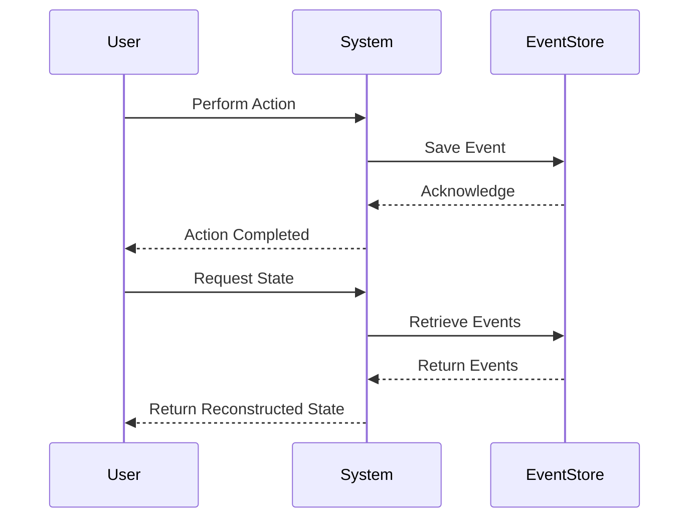

## 11.4 Event Sourcing

Event Sourcing is a powerful architectural pattern that records state changes as a sequence of events. This approach allows us to reconstruct the state of a system at any point in time by replaying these events. In this section, we will delve into the intricacies of Event Sourcing, explore its implementation in C#, and discuss its benefits, challenges, and use cases.

### Understanding Event Sourcing

Event Sourcing is an architectural pattern where every change to the state of an application is captured as an event. These events are immutable and stored in an append-only log. By replaying these events, we can reconstruct the state of the system at any given point in time.

#### Key Concepts

- **Event**: A record of a state change in the system. Events are immutable and represent facts that have occurred.
- **Event Store**: A storage mechanism for persisting events. It is typically append-only and optimized for writing.
- **Event Replay**: The process of rebuilding the current state of the system by replaying stored events.

### Implementing Event Sourcing in C#

Implementing Event Sourcing in C# involves recording all changes as events and storing them in an append-only log. Let's explore how to achieve this.

#### Recording All Changes as Events

To implement Event Sourcing, we need to define events that represent state changes in our system. Each event should capture the necessary information to describe the change.

```csharp
// Define an event interface
public interface IEvent
{
    DateTime Timestamp { get; }
}

// Implement a specific event
public class AccountCreatedEvent : IEvent
{
    public Guid AccountId { get; }
    public string AccountName { get; }
    public DateTime Timestamp { get; }

    public AccountCreatedEvent(Guid accountId, string accountName)
    {
        AccountId = accountId;
        AccountName = accountName;
        Timestamp = DateTime.UtcNow;
    }
}
```

#### Storing Events in Append-Only Logs

Events are stored in an append-only log, ensuring that they are immutable and can be replayed to reconstruct the system state.

```csharp
// Event store interface
public interface IEventStore
{
    void SaveEvent(IEvent event);
    IEnumerable<IEvent> GetEvents(Guid aggregateId);
}

// In-memory event store implementation
public class InMemoryEventStore : IEventStore
{
    private readonly List<IEvent> _events = new List<IEvent>();

    public void SaveEvent(IEvent event)
    {
        _events.Add(event);
    }

    public IEnumerable<IEvent> GetEvents(Guid aggregateId)
    {
        return _events.Where(e => ((dynamic)e).AccountId == aggregateId);
    }
}
```

### Benefits and Challenges of Event Sourcing

Event Sourcing offers several benefits but also presents challenges that need to be addressed.

#### Benefits

- **Complete Audit Trails**: Every state change is recorded, providing a comprehensive audit trail.
- **Rebuild System State**: The system state can be rebuilt at any point by replaying events.
- **Event-Driven Architecture**: Facilitates an event-driven architecture, promoting decoupling and scalability.

#### Challenges

- **Complexity in Event Versioning**: Managing changes to event schemas over time can be complex.
- **Storage Requirements**: Storing all events can lead to significant storage requirements.
- **Eventual Consistency**: Systems using Event Sourcing may exhibit eventual consistency, which can complicate real-time processing.

### Use Cases and Examples

Event Sourcing is particularly useful in scenarios where a complete history of state changes is required or where complex business logic needs to be captured.

#### Domain-Driven Design

In Domain-Driven Design (DDD), Event Sourcing can be used to capture domain events, providing a clear history of changes and enabling complex business logic to be modeled effectively.

```csharp
// Aggregate root with event sourcing
public class Account
{
    private readonly List<IEvent> _changes = new List<IEvent>();

    public Guid Id { get; private set; }
    public string Name { get; private set; }

    public Account(IEnumerable<IEvent> history)
    {
        foreach (var e in history) Apply(e);
    }

    public void CreateAccount(string name)
    {
        var @event = new AccountCreatedEvent(Guid.NewGuid(), name);
        Apply(@event);
        _changes.Add(@event);
    }

    private void Apply(IEvent @event)
    {
        switch (@event)
        {
            case AccountCreatedEvent e:
                Id = e.AccountId;
                Name = e.AccountName;
                break;
            // Handle other events
        }
    }

    public IEnumerable<IEvent> GetUncommittedChanges() => _changes;
}
```

#### Rebuilding System State from Events

By replaying events, we can rebuild the system state, which is particularly useful for recovering from failures or migrating data.

```csharp
// Rebuild account state from events
var eventStore = new InMemoryEventStore();
var events = eventStore.GetEvents(accountId);
var account = new Account(events);
```

### Visualizing Event Sourcing

To better understand Event Sourcing, let's visualize the process of recording and replaying events.



### Design Considerations

When implementing Event Sourcing, consider the following:

- **Event Granularity**: Determine the level of detail captured by events.
- **Event Schema Evolution**: Plan for changes to event schemas over time.
- **Performance**: Optimize event storage and retrieval for performance.

### Differences and Similarities with Other Patterns

Event Sourcing is often compared with other patterns such as Command Query Responsibility Segregation (CQRS) and Change Data Capture (CDC). While CQRS separates read and write models, Event Sourcing focuses on capturing state changes as events. CDC, on the other hand, captures changes at the database level.

### Try It Yourself

Experiment with the provided code examples by:

- Adding new event types and handling them in the aggregate root.
- Implementing a persistent event store using a database.
- Exploring the integration of Event Sourcing with CQRS.

### References and Links

For further reading on Event Sourcing, consider the following resources:

- [Martin Fowler's Event Sourcing](https://martinfowler.com/eaaDev/EventSourcing.html)
- [Event Store](https://eventstore.com/)
- [Domain-Driven Design](https://www.domainlanguage.com/ddd/)

### Knowledge Check

To reinforce your understanding of Event Sourcing, consider the following questions:

- What are the key benefits of using Event Sourcing?
- How does Event Sourcing differ from traditional state management?
- What challenges might you encounter when implementing Event Sourcing?

### Embrace the Journey

Remember, mastering Event Sourcing is just the beginning. As you progress, you'll build more complex and interactive systems. Keep experimenting, stay curious, and enjoy the journey!

## Quiz Time!



### What is the primary purpose of Event Sourcing?

- [x] To record state changes as a sequence of events
- [ ] To store data in a relational database
- [ ] To separate read and write models
- [ ] To capture changes at the database level

> **Explanation:** Event Sourcing focuses on recording state changes as a sequence of events, allowing the system state to be reconstructed by replaying these events.

### Which of the following is a benefit of Event Sourcing?

- [x] Complete audit trails
- [ ] Reduced storage requirements
- [ ] Simplified real-time processing
- [ ] Immediate consistency

> **Explanation:** Event Sourcing provides complete audit trails by recording every state change as an event.

### What is a challenge associated with Event Sourcing?

- [x] Complexity in event versioning
- [ ] Lack of audit trails
- [ ] Inability to rebuild system state
- [ ] Reduced scalability

> **Explanation:** Managing changes to event schemas over time can be complex, making event versioning a challenge in Event Sourcing.

### How does Event Sourcing differ from CQRS?

- [x] Event Sourcing focuses on capturing state changes as events
- [ ] Event Sourcing separates read and write models
- [ ] Event Sourcing captures changes at the database level
- [ ] Event Sourcing reduces storage requirements

> **Explanation:** Event Sourcing captures state changes as events, while CQRS separates read and write models.

### What is an event in the context of Event Sourcing?

- [x] A record of a state change in the system
- [ ] A command to update the system state
- [ ] A query to retrieve data
- [ ] A database transaction

> **Explanation:** An event in Event Sourcing is a record of a state change in the system.

### Which of the following is a key component of Event Sourcing?

- [x] Event Store
- [ ] Command Handler
- [ ] Query Processor
- [ ] Database Index

> **Explanation:** An Event Store is a key component of Event Sourcing, used to persist events.

### What is the purpose of event replay in Event Sourcing?

- [x] To rebuild the current state of the system
- [ ] To execute commands
- [ ] To optimize database queries
- [ ] To reduce storage requirements

> **Explanation:** Event replay is used to rebuild the current state of the system by replaying stored events.

### Which pattern is often used in conjunction with Event Sourcing?

- [x] CQRS
- [ ] Singleton
- [ ] Factory Method
- [ ] Observer

> **Explanation:** CQRS is often used in conjunction with Event Sourcing to separate read and write models.

### What is a potential drawback of Event Sourcing?

- [x] Eventual consistency
- [ ] Lack of scalability
- [ ] Inability to audit changes
- [ ] Reduced performance

> **Explanation:** Systems using Event Sourcing may exhibit eventual consistency, which can complicate real-time processing.

### True or False: Event Sourcing can be used to recover from system failures.

- [x] True
- [ ] False

> **Explanation:** By replaying events, Event Sourcing can be used to recover the system state after a failure.


