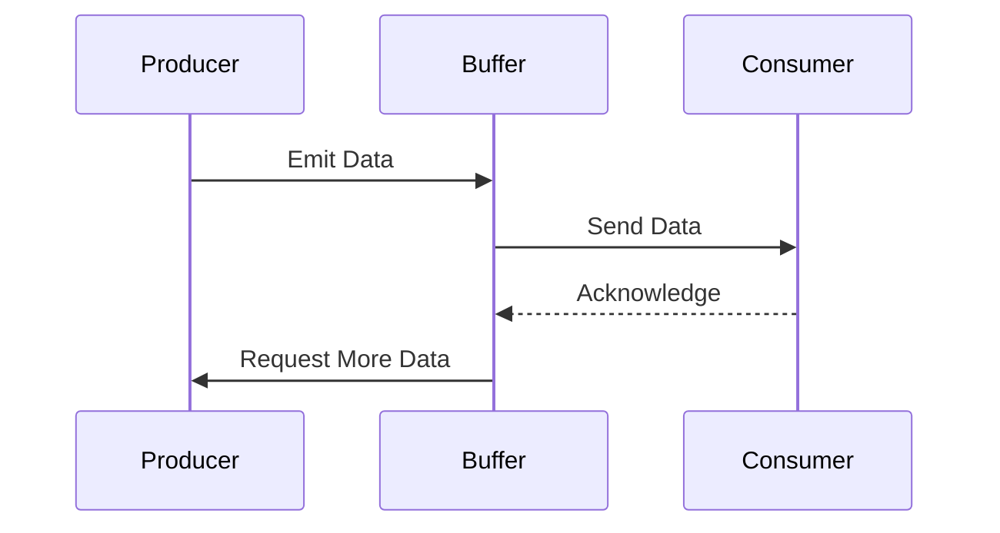

## 11.5 Backpressure Handling

In the realm of reactive programming, managing data flow efficiently is crucial, especially when dealing with high-throughput systems. Backpressure handling is a vital concept that ensures systems remain responsive and stable under varying load conditions. In this section, we will delve into the intricacies of backpressure handling in C#, focusing on Rx.NET, a powerful library for reactive programming. We will explore how to manage overwhelming data flows, implement strategies for overload management, and examine practical use cases.

### Understanding Backpressure

Backpressure is a mechanism for controlling the flow of data between producers and consumers in a system. It ensures that a consumer is not overwhelmed by data it cannot process in a timely manner. In reactive systems, where data is often pushed from producers to consumers, backpressure becomes essential to maintain system stability and performance.

#### Key Concepts

- **Producer**: The source of data, which can be anything from a sensor emitting data to a server sending messages.
- **Consumer**: The entity that processes the data produced by the producer.
- **Flow Control**: Techniques used to manage the rate at which data is produced and consumed.

### Implementing Backpressure in Rx.NET

Rx.NET, or Reactive Extensions for .NET, provides a robust framework for handling asynchronous data streams. It offers several operators to manage backpressure effectively.

#### Managing Overwhelming Data Flows

When data flows become overwhelming, it is crucial to have mechanisms in place to handle the excess data. Rx.NET provides several operators to manage these scenarios:

- **Buffer**: Collects items emitted by an observable into a buffer and emits them as a list.
- **Throttle**: Emits an item from the observable only if a particular timespan has passed without it emitting another item.
- **Sample**: Emits the most recent item emitted by an observable within periodic time intervals.

Let's explore these operators with code examples.

#### Using the `Buffer` Operator

The `Buffer` operator is useful when you want to collect items emitted by an observable and process them in batches.

```csharp
using System;
using System.Reactive.Linq;

class Program
{
    static void Main()
    {
        // Create an observable that emits integers from 1 to 10
        var observable = Observable.Range(1, 10);

        // Use the Buffer operator to collect items into batches of 3
        var buffered = observable.Buffer(3);

        // Subscribe to the buffered observable and print each batch
        buffered.Subscribe(batch =>
        {
            Console.WriteLine("Batch:");
            foreach (var item in batch)
            {
                Console.WriteLine(item);
            }
        });
    }
}
```

In this example, the `Buffer` operator collects items into batches of three and emits them as lists. This approach can help manage data flow by processing items in manageable chunks.

#### Using the `Throttle` Operator

The `Throttle` operator is useful when you want to limit the rate at which items are emitted.

```csharp
using System;
using System.Reactive.Linq;
using System.Threading;

class Program
{
    static void Main()
    {
        // Create an observable that emits integers every 100 milliseconds
        var observable = Observable.Interval(TimeSpan.FromMilliseconds(100));

        // Use the Throttle operator to emit items only if 500 milliseconds have passed without a new item
        var throttled = observable.Throttle(TimeSpan.FromMilliseconds(500));

        // Subscribe to the throttled observable and print each item
        throttled.Subscribe(item => Console.WriteLine($"Received: {item}"));

        // Keep the application running to observe the output
        Thread.Sleep(5000);
    }
}
```

In this example, the `Throttle` operator ensures that items are emitted only if 500 milliseconds have passed without a new item. This technique is useful for reducing the frequency of updates in high-frequency data streams.

#### Using the `Sample` Operator

The `Sample` operator emits the most recent item emitted by an observable within periodic time intervals.

```csharp
using System;
using System.Reactive.Linq;
using System.Threading;

class Program
{
    static void Main()
    {
        // Create an observable that emits integers every 100 milliseconds
        var observable = Observable.Interval(TimeSpan.FromMilliseconds(100));

        // Use the Sample operator to emit the most recent item every 500 milliseconds
        var sampled = observable.Sample(TimeSpan.FromMilliseconds(500));

        // Subscribe to the sampled observable and print each item
        sampled.Subscribe(item => Console.WriteLine($"Sampled: {item}"));

        // Keep the application running to observe the output
        Thread.Sleep(5000);
    }
}
```

In this example, the `Sample` operator emits the most recent item every 500 milliseconds, providing a way to reduce the volume of data processed while still capturing the latest information.

### Strategies for Managing Overload

When dealing with overwhelming data flows, there are several strategies to consider:

#### Dropping Data vs. Buffering

- **Dropping Data**: In some cases, it may be acceptable to drop data that cannot be processed in time. This approach can be useful when the data is not critical, or when the system can tolerate some data loss.
- **Buffering**: Buffering involves storing excess data temporarily until it can be processed. This approach is useful when data loss is not acceptable, but it requires careful management of buffer sizes to avoid memory issues.

#### Adjusting Data Production Rates

Another strategy is to adjust the rate at which data is produced. This can be achieved by implementing feedback mechanisms between consumers and producers, allowing consumers to signal when they are overwhelmed.

### Use Cases and Examples

Backpressure handling is applicable in various scenarios, including:

#### Streaming Services

In streaming services, data is often produced at a high rate, and consumers may not be able to keep up. Backpressure handling ensures that consumers receive data at a manageable rate, preventing buffer overflows and ensuring a smooth user experience.

#### Sensor Data Processing

In IoT systems, sensors may produce data at a high frequency. Backpressure handling allows systems to process sensor data efficiently, ensuring that critical data is not lost while maintaining system stability.

### Visualizing Backpressure Handling

To better understand the flow of data and the role of backpressure, let's visualize the process using a sequence diagram.



In this diagram, the producer emits data to a buffer, which then sends data to the consumer. The consumer acknowledges receipt, allowing the buffer to request more data from the producer. This flow illustrates how backpressure can be managed to ensure smooth data processing.

### Knowledge Check

- **Question**: What is the primary purpose of backpressure handling in reactive systems?
- **Answer**: To control the flow of data between producers and consumers, ensuring that consumers are not overwhelmed.

- **Question**: Which Rx.NET operator would you use to process items in batches?
- **Answer**: The `Buffer` operator.

### Try It Yourself

Experiment with the provided code examples by modifying the buffer size, throttle duration, and sample interval. Observe how these changes affect the flow of data and the system's responsiveness.

### Conclusion

Backpressure handling is a critical aspect of reactive programming, ensuring that systems remain responsive and stable under varying load conditions. By leveraging Rx.NET operators and implementing effective strategies, we can manage overwhelming data flows efficiently. Remember, mastering backpressure handling is an ongoing journey. Keep experimenting, stay curious, and enjoy the process!

## Quiz Time!



### What is the primary purpose of backpressure handling in reactive systems?

- [x] To control the flow of data between producers and consumers, ensuring that consumers are not overwhelmed.
- [ ] To increase the speed of data processing.
- [ ] To reduce the amount of data produced by the system.
- [ ] To eliminate the need for data buffering.

> **Explanation:** Backpressure handling is essential for controlling the flow of data to prevent consumers from being overwhelmed by data they cannot process in a timely manner.

### Which Rx.NET operator would you use to process items in batches?

- [x] Buffer
- [ ] Throttle
- [ ] Sample
- [ ] Merge

> **Explanation:** The `Buffer` operator collects items emitted by an observable into batches and emits them as lists, making it suitable for batch processing.

### How does the `Throttle` operator work in Rx.NET?

- [x] It emits an item from the observable only if a particular timespan has passed without it emitting another item.
- [ ] It collects items into batches and emits them as lists.
- [ ] It emits the most recent item emitted by an observable within periodic time intervals.
- [ ] It merges multiple observables into one.

> **Explanation:** The `Throttle` operator limits the rate at which items are emitted by ensuring a specified timespan passes without a new item before emitting.

### What is a potential downside of buffering data as a backpressure strategy?

- [x] It can lead to memory issues if buffer sizes are not managed carefully.
- [ ] It always results in data loss.
- [ ] It increases the speed of data processing.
- [ ] It eliminates the need for consumer acknowledgment.

> **Explanation:** Buffering can lead to memory issues if buffer sizes grow too large, especially in high-throughput systems.

### In which scenario might it be acceptable to drop data as a backpressure strategy?

- [x] When the data is not critical, or the system can tolerate some data loss.
- [ ] When data loss is never acceptable.
- [ ] When the system has unlimited memory resources.
- [ ] When the consumer is faster than the producer.

> **Explanation:** Dropping data can be acceptable when the data is not critical, or the system can tolerate some loss without significant impact.

### What does the `Sample` operator do in Rx.NET?

- [x] It emits the most recent item emitted by an observable within periodic time intervals.
- [ ] It collects items into batches and emits them as lists.
- [ ] It emits an item only if a particular timespan has passed without another item.
- [ ] It merges multiple observables into one.

> **Explanation:** The `Sample` operator emits the most recent item within specified intervals, reducing the volume of data processed while capturing the latest information.

### Which of the following is a strategy for managing overload in data flows?

- [x] Adjusting data production rates
- [ ] Increasing buffer sizes indefinitely
- [ ] Ignoring consumer feedback
- [ ] Eliminating data producers

> **Explanation:** Adjusting data production rates is a strategy that involves implementing feedback mechanisms to manage overload effectively.

### What role does the consumer play in backpressure handling?

- [x] It processes data and provides feedback to the buffer or producer.
- [ ] It only produces data.
- [ ] It merges data from multiple producers.
- [ ] It eliminates the need for data buffering.

> **Explanation:** The consumer processes data and provides feedback, allowing the system to adjust data flow based on its processing capacity.

### How can backpressure handling benefit streaming services?

- [x] By ensuring consumers receive data at a manageable rate, preventing buffer overflows.
- [ ] By increasing the amount of data produced by the service.
- [ ] By eliminating the need for data buffering.
- [ ] By reducing the quality of the stream.

> **Explanation:** Backpressure handling ensures that consumers receive data at a rate they can manage, preventing buffer overflows and ensuring a smooth user experience.

### True or False: Backpressure handling is only necessary in high-throughput systems.

- [ ] True
- [x] False

> **Explanation:** Backpressure handling is important in any system where there is a risk of consumers being overwhelmed by data, not just high-throughput systems.




