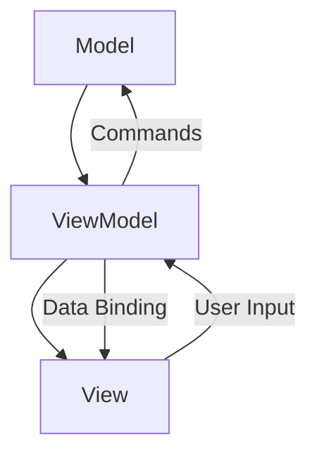

## 11.6 Reactive UI Development

In the ever-evolving landscape of software development, creating responsive and interactive user interfaces (UIs) is crucial. Reactive UI development, particularly using ReactiveUI in C#, offers a powerful approach to building applications that are not only responsive but also maintainable and scalable. This section delves into the principles of reactive UI development, focusing on implementing ReactiveUI in C# to build Model-View-ViewModel (MVVM) applications reactively. We will explore data binding with observables, synchronizing UI elements with data changes, and responding to user inputs efficiently.

### Introduction to Reactive UI Development

Reactive UI development is a paradigm that emphasizes the use of reactive programming principles to create user interfaces that respond to changes in data and user interactions seamlessly. At its core, reactive programming is about building systems that react to changes in a declarative manner, making it easier to manage complex state changes and asynchronous data flows.

#### Key Concepts

- **Reactivity**: The ability of a system to automatically update the UI in response to changes in the underlying data model.
- **Observables**: Data streams that emit values over time, allowing for asynchronous data handling.
- **Data Binding**: The process of connecting UI elements to data sources, enabling automatic updates when the data changes.

### Implementing ReactiveUI in C#

ReactiveUI is a popular framework for building reactive applications in C#. It leverages the power of reactive programming to simplify the development of complex UIs by providing a robust set of tools for managing state and data flow.

#### Building MVVM Applications Reactively

The Model-View-ViewModel (MVVM) pattern is a widely used architectural pattern in UI development. ReactiveUI enhances MVVM by introducing reactive extensions, making it easier to handle data binding and state management.

##### Key Participants

- **Model**: Represents the application's data and business logic.
- **View**: The UI layer that displays data and captures user interactions.
- **ViewModel**: Acts as an intermediary between the Model and the View, handling data binding and command logic.

##### Sample Code Snippet

Let's explore a simple example of a reactive MVVM application using ReactiveUI:

```csharp
using ReactiveUI;
using System.Reactive;
using System.Reactive.Linq;

public class MainViewModel : ReactiveObject
{
    private string _name;
    public string Name
    {
        get => _name;
        set => this.RaiseAndSetIfChanged(ref _name, value);
    }

    public ReactiveCommand<Unit, Unit> GreetCommand { get; }

    public MainViewModel()
    {
        GreetCommand = ReactiveCommand.Create(() => Console.WriteLine($"Hello, {Name}!"));
    }
}
```

In this example, we define a `MainViewModel` class that inherits from `ReactiveObject`, a base class provided by ReactiveUI for implementing reactive properties. The `Name` property is reactive, meaning any changes to it will automatically update the UI. The `GreetCommand` is a reactive command that prints a greeting message to the console.

#### Data Binding with Observables

Data binding is a crucial aspect of reactive UI development. It allows UI elements to automatically update in response to changes in the underlying data model.

##### Synchronizing UI Elements with Data Changes

ReactiveUI provides powerful data binding capabilities through the use of observables. Observables are data streams that emit values over time, allowing for seamless synchronization between the UI and the data model.

###### Sample Code Snippet

```csharp
using ReactiveUI;
using System.Reactive.Linq;

public class MainView : ReactiveUserControl<MainViewModel>
{
    public MainView()
    {
        this.WhenActivated(disposables =>
        {
            this.Bind(ViewModel, vm => vm.Name, v => v.NameTextBox.Text)
                .DisposeWith(disposables);

            this.BindCommand(ViewModel, vm => vm.GreetCommand, v => v.GreetButton)
                .DisposeWith(disposables);
        });
    }
}
```

In this example, we define a `MainView` class that inherits from `ReactiveUserControl`, a base class provided by ReactiveUI for creating reactive views. We use the `Bind` method to bind the `Name` property of the `ViewModel` to the `Text` property of a `TextBox` control. Similarly, we use the `BindCommand` method to bind the `GreetCommand` to a `Button` control.

### Responding to User Inputs Efficiently

ReactiveUI allows for efficient handling of user inputs by leveraging reactive extensions. This enables developers to create responsive UIs that react to user interactions in real-time.

#### Key Techniques

- **Reactive Commands**: Encapsulate command logic in a reactive manner, allowing for easy binding to UI controls.
- **Observable Sequences**: Use observable sequences to handle asynchronous data flows and user interactions.

##### Sample Code Snippet

```csharp
using ReactiveUI;
using System.Reactive.Linq;

public class UserInputViewModel : ReactiveObject
{
    private string _input;
    public string Input
    {
        get => _input;
        set => this.RaiseAndSetIfChanged(ref _input, value);
    }

    public ReactiveCommand<Unit, Unit> ProcessInputCommand { get; }

    public UserInputViewModel()
    {
        ProcessInputCommand = ReactiveCommand.CreateFromObservable(() =>
            Observable.Start(() => Console.WriteLine($"Processing input: {Input}")));
    }
}
```

In this example, we define a `UserInputViewModel` class with a reactive `Input` property. The `ProcessInputCommand` is a reactive command that processes the user input asynchronously using an observable sequence.

### Visualizing Reactive UI Development

To better understand the flow of data and interactions in a reactive UI application, let's visualize the architecture using a Mermaid.js diagram.



**Diagram Description**: This diagram illustrates the flow of data and interactions in a reactive MVVM application. The `Model` provides data to the `ViewModel`, which in turn binds data to the `View`. User inputs from the `View` are processed by the `ViewModel`, which updates the `Model` as needed.

### Design Considerations

When implementing reactive UI development using ReactiveUI, consider the following:

- **Performance**: Reactive programming can introduce overhead due to the creation and management of observables. Optimize performance by minimizing unnecessary subscriptions and using efficient data structures.
- **Complexity**: Reactive programming can increase the complexity of the codebase. Ensure that the use of reactive patterns is justified and adds value to the application.
- **Testing**: ReactiveUI applications can be challenging to test due to the asynchronous nature of observables. Use testing frameworks that support reactive programming to simplify the testing process.

### Differences and Similarities

ReactiveUI shares similarities with other reactive frameworks, such as RxJS for JavaScript. However, it is specifically designed for .NET applications and integrates seamlessly with C# features, making it a preferred choice for C# developers.

### Try It Yourself

To deepen your understanding of reactive UI development, try modifying the code examples provided in this section. Experiment with different data binding scenarios, create custom reactive commands, and explore the use of observables in handling complex data flows.

### Knowledge Check

- What are the key components of the MVVM pattern in ReactiveUI?
- How does data binding work in ReactiveUI?
- What are the benefits of using reactive commands in UI development?

### Embrace the Journey

Remember, mastering reactive UI development is a journey. As you progress, you'll build more complex and interactive applications. Keep experimenting, stay curious, and enjoy the journey!

## Quiz Time!



### What is the primary benefit of using ReactiveUI in C#?

- [x] Simplifies the development of complex UIs by managing state and data flow reactively.
- [ ] Increases the performance of the application by reducing memory usage.
- [ ] Provides a built-in database for data storage.
- [ ] Automatically generates UI components based on data models.

> **Explanation:** ReactiveUI simplifies UI development by leveraging reactive programming principles to manage state and data flow efficiently.

### Which pattern does ReactiveUI enhance in C# applications?

- [x] Model-View-ViewModel (MVVM)
- [ ] Model-View-Controller (MVC)
- [ ] Singleton
- [ ] Factory

> **Explanation:** ReactiveUI enhances the MVVM pattern by introducing reactive extensions for data binding and state management.

### What is the role of the ViewModel in the MVVM pattern?

- [x] Acts as an intermediary between the Model and the View, handling data binding and command logic.
- [ ] Directly interacts with the database to fetch data.
- [ ] Manages the application's routing and navigation.
- [ ] Provides styling and theming for the UI components.

> **Explanation:** The ViewModel acts as an intermediary between the Model and the View, facilitating data binding and command logic.

### How does ReactiveUI handle data binding?

- [x] Through the use of observables that emit values over time.
- [ ] By directly modifying the UI components.
- [ ] By using XML configuration files.
- [ ] Through a built-in SQL database.

> **Explanation:** ReactiveUI uses observables to handle data binding, allowing UI elements to react to changes in the data model.

### What is a reactive command in ReactiveUI?

- [x] A command that encapsulates logic in a reactive manner, allowing for easy binding to UI controls.
- [ ] A command that automatically updates the database.
- [ ] A command that generates UI components dynamically.
- [ ] A command that handles network requests.

> **Explanation:** A reactive command encapsulates logic in a reactive manner, making it easy to bind to UI controls and handle user interactions.

### What is the purpose of the `RaiseAndSetIfChanged` method in ReactiveUI?

- [x] To update the UI when a property value changes.
- [ ] To initialize a new instance of a ViewModel.
- [ ] To create a new observable sequence.
- [ ] To bind a command to a UI control.

> **Explanation:** The `RaiseAndSetIfChanged` method updates the UI when a property value changes, ensuring that the UI reflects the current state of the data model.

### How can you visualize the flow of data in a reactive MVVM application?

- [x] Using a Mermaid.js diagram to illustrate the interactions between Model, ViewModel, and View.
- [ ] By writing detailed comments in the code.
- [ ] By creating a flowchart in a word processor.
- [ ] By using a spreadsheet to list all data interactions.

> **Explanation:** A Mermaid.js diagram is an effective way to visualize the flow of data and interactions in a reactive MVVM application.

### What should be considered when implementing reactive UI development?

- [x] Performance, complexity, and testing.
- [ ] Only the performance of the application.
- [ ] The color scheme of the UI.
- [ ] The number of UI components.

> **Explanation:** When implementing reactive UI development, consider performance, complexity, and testing to ensure a maintainable and efficient application.

### What is the main challenge of testing ReactiveUI applications?

- [x] The asynchronous nature of observables.
- [ ] The lack of documentation.
- [ ] The complexity of the UI components.
- [ ] The need for a specific IDE.

> **Explanation:** The asynchronous nature of observables can make testing ReactiveUI applications challenging, requiring testing frameworks that support reactive programming.

### True or False: ReactiveUI is specifically designed for JavaScript applications.

- [ ] True
- [x] False

> **Explanation:** False. ReactiveUI is specifically designed for .NET applications, making it a preferred choice for C# developers.


