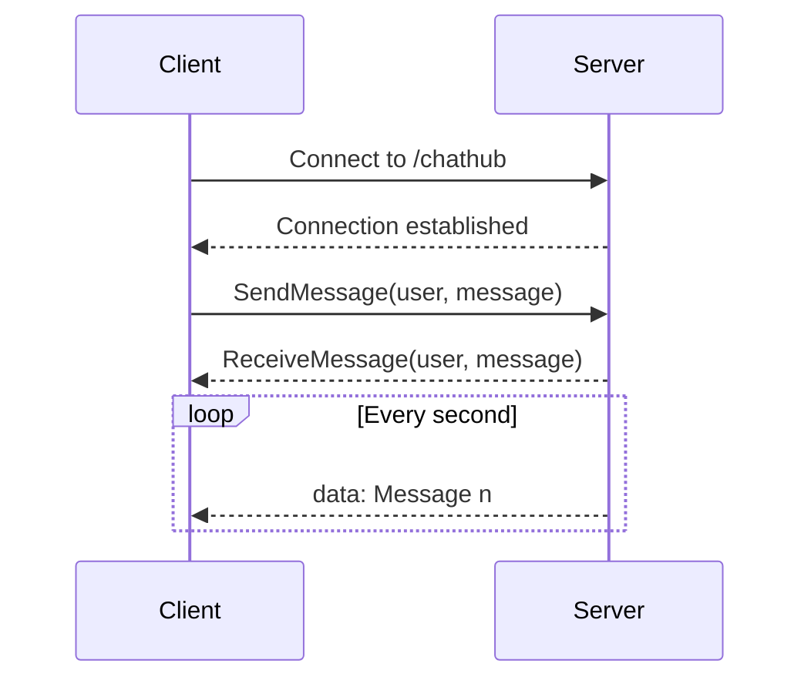

## 11.7 Integrating Reactive Patterns in ASP.NET Core

In the ever-evolving landscape of web development, the demand for responsive and real-time applications is at an all-time high. Integrating reactive patterns into ASP.NET Core applications can significantly enhance user experience by providing real-time communication and asynchronous data streams. In this section, we will delve into the intricacies of implementing reactive patterns using ASP.NET Core, focusing on SignalR, WebSockets, and server-sent events.

### Enhancing Web Applications with Reactive Capabilities

Reactive programming is a paradigm that focuses on asynchronous data streams and the propagation of change. By integrating reactive patterns into ASP.NET Core, developers can create applications that are more responsive, scalable, and maintainable. Let's explore how to achieve this.

#### Real-Time Communication with SignalR

SignalR is a library for ASP.NET Core that simplifies adding real-time web functionality to applications. It allows server-side code to push content to connected clients instantly, making it ideal for applications that require high-frequency updates, such as chat applications, live dashboards, and collaborative tools.

##### Using WebSockets for Push Notifications

WebSockets provide a full-duplex communication channel over a single TCP connection, enabling real-time data exchange between the server and clients. SignalR abstracts the complexities of WebSockets, allowing developers to focus on building real-time features without worrying about the underlying transport mechanisms.

###### Implementing Hubs and Clients

SignalR uses hubs to facilitate communication between the server and clients. A hub is a high-level pipeline that allows the server to call methods on connected clients and vice versa.

**Creating a SignalR Hub**

To create a SignalR hub, define a class that inherits from `Hub` and implement methods that clients can call.

```csharp
using Microsoft.AspNetCore.SignalR;

public class ChatHub : Hub
{
    public async Task SendMessage(string user, string message)
    {
        await Clients.All.SendAsync("ReceiveMessage", user, message);
    }
}
```

In this example, the `SendMessage` method broadcasts a message to all connected clients. The `Clients.All.SendAsync` method is used to invoke the `ReceiveMessage` method on all clients.

**Configuring SignalR in ASP.NET Core**

To configure SignalR in your ASP.NET Core application, add the necessary services and middleware in the `Startup.cs` file.

```csharp
public void ConfigureServices(IServiceCollection services)
{
    services.AddSignalR();
}

public void Configure(IApplicationBuilder app, IWebHostEnvironment env)
{
    app.UseRouting();

    app.UseEndpoints(endpoints =>
    {
        endpoints.MapHub<ChatHub>("/chathub");
    });
}
```

This configuration sets up SignalR and maps the `ChatHub` to the `/chathub` endpoint.

**Connecting Clients to the Hub**

Clients can connect to the SignalR hub using JavaScript. The following example demonstrates how to establish a connection and handle incoming messages.

```javascript
const connection = new signalR.HubConnectionBuilder()
    .withUrl("/chathub")
    .build();

connection.on("ReceiveMessage", (user, message) => {
    const msg = `${user}: ${message}`;
    console.log(msg);
});

connection.start().catch(err => console.error(err.toString()));
```

This code snippet creates a connection to the `/chathub` endpoint and listens for messages from the server.

**Try It Yourself**

Experiment with the SignalR setup by modifying the `SendMessage` method to send personalized messages to specific clients using `Clients.Client(connectionId).SendAsync(...)`. Observe how the changes affect the communication flow.

#### Asynchronous Data Streams in Web Applications

Asynchronous data streams allow applications to handle data that arrives over time, enabling more efficient resource utilization and improved user experience. ASP.NET Core supports streaming responses and server-sent events to facilitate asynchronous data handling.

##### Streaming Responses

Streaming responses enable the server to send data to the client incrementally, rather than waiting for the entire response to be ready. This is particularly useful for large datasets or long-running processes.

**Implementing Streaming Responses**

To implement streaming responses in ASP.NET Core, use the `HttpResponse.BodyWriter` to write data to the response stream.

```csharp
public async Task StreamData(HttpContext context)
{
    var writer = context.Response.BodyWriter;
    for (int i = 0; i < 10; i++)
    {
        var message = $"Data chunk {i}\n";
        var bytes = Encoding.UTF8.GetBytes(message);
        await writer.WriteAsync(new ReadOnlyMemory<byte>(bytes));
        await Task.Delay(1000); // Simulate data generation delay
    }
}
```

This example writes data chunks to the response stream every second, simulating a real-time data feed.

##### Server-Sent Events

Server-sent events (SSE) provide a simple way to push updates from the server to the client over HTTP. Unlike WebSockets, SSE is a one-way communication channel, making it ideal for scenarios where the server needs to send updates to the client without expecting a response.

**Implementing Server-Sent Events**

To implement SSE in ASP.NET Core, set the response content type to `text/event-stream` and write data to the response stream.

```csharp
public async Task SendServerSentEvents(HttpContext context)
{
    context.Response.ContentType = "text/event-stream";

    for (int i = 0; i < 10; i++)
    {
        await context.Response.WriteAsync($"data: Message {i}\n\n");
        await context.Response.Body.FlushAsync();
        await Task.Delay(1000); // Simulate delay
    }
}
```

This example sends a series of messages to the client, each prefixed with `data:` and followed by a double newline, which is the required format for SSE.

**Try It Yourself**

Modify the SSE implementation to send JSON-formatted data to the client. Observe how the client handles the incoming JSON data and updates the UI accordingly.

### Visualizing Reactive Patterns in ASP.NET Core

To better understand the flow of data and interactions in a reactive ASP.NET Core application, let's visualize the architecture using a sequence diagram.



**Diagram Description:** This sequence diagram illustrates the interaction between the client and server in a SignalR-based application. The client connects to the server, sends a message, and receives updates in real-time.

### Key Considerations for Integrating Reactive Patterns

When integrating reactive patterns into ASP.NET Core applications, consider the following:

- **Scalability:** Ensure your application can handle a large number of concurrent connections. SignalR supports scaling out using Redis, Azure SignalR Service, or other backplanes.
- **Security:** Implement authentication and authorization to secure your SignalR hubs and endpoints.
- **Performance:** Optimize data serialization and minimize the amount of data sent over the network to improve performance.
- **Compatibility:** Consider browser compatibility and fallback mechanisms for clients that do not support WebSockets or SSE.

### Differences and Similarities

SignalR and server-sent events both enable real-time communication, but they have distinct differences:

- **SignalR**: Supports full-duplex communication using WebSockets, long polling, or server-sent events as fallback. Ideal for chat applications and collaborative tools.
- **Server-Sent Events**: Provides one-way communication from server to client. Suitable for live updates and notifications.

### Conclusion

Integrating reactive patterns in ASP.NET Core can significantly enhance the responsiveness and interactivity of web applications. By leveraging SignalR, WebSockets, and server-sent events, developers can create applications that provide real-time updates and handle asynchronous data streams efficiently. As you continue to explore reactive programming, remember to experiment with different patterns and techniques to find the best fit for your application's needs.

### References and Links

- [ASP.NET Core SignalR Documentation](https://docs.microsoft.com/en-us/aspnet/core/signalr/introduction?view=aspnetcore-5.0)
- [WebSockets Overview](https://developer.mozilla.org/en-US/docs/Web/API/WebSockets_API)
- [Server-Sent Events on MDN](https://developer.mozilla.org/en-US/docs/Web/API/Server-sent_events)

### Knowledge Check

- How does SignalR simplify real-time communication in ASP.NET Core?
- What are the key differences between WebSockets and server-sent events?
- How can you scale out a SignalR application?

### Embrace the Journey

Remember, this is just the beginning. As you progress, you'll build more complex and interactive web applications. Keep experimenting, stay curious, and enjoy the journey!

## Quiz Time!



### What is the primary purpose of SignalR in ASP.NET Core?

- [x] To enable real-time web functionality by allowing server-side code to push content to connected clients.
- [ ] To manage database connections in ASP.NET Core applications.
- [ ] To handle authentication and authorization in web applications.
- [ ] To provide a framework for building RESTful APIs.

> **Explanation:** SignalR is used to add real-time web functionality to applications, allowing server-side code to push content to connected clients instantly.

### Which transport mechanism does SignalR primarily use for real-time communication?

- [x] WebSockets
- [ ] HTTP
- [ ] FTP
- [ ] SMTP

> **Explanation:** SignalR primarily uses WebSockets for real-time communication, but it can fall back to other transport mechanisms like long polling if WebSockets are not available.

### What is the main difference between WebSockets and server-sent events (SSE)?

- [x] WebSockets support full-duplex communication, while SSE is one-way from server to client.
- [ ] WebSockets are faster than SSE.
- [ ] SSE supports full-duplex communication, while WebSockets are one-way.
- [ ] SSE is more secure than WebSockets.

> **Explanation:** WebSockets allow full-duplex communication, meaning data can be sent and received simultaneously, while SSE is a one-way communication channel from server to client.

### How can you scale out a SignalR application?

- [x] By using Redis, Azure SignalR Service, or other backplanes.
- [ ] By increasing the server's RAM.
- [ ] By using a CDN.
- [ ] By optimizing the database queries.

> **Explanation:** SignalR can be scaled out using Redis, Azure SignalR Service, or other backplanes to handle a large number of concurrent connections.

### What content type should be set for server-sent events?

- [x] text/event-stream
- [ ] application/json
- [ ] text/html
- [ ] application/xml

> **Explanation:** The content type for server-sent events should be set to `text/event-stream` to ensure the client interprets the data correctly.

### Which method is used in SignalR to send a message to all connected clients?

- [x] Clients.All.SendAsync
- [ ] Clients.Group.SendAsync
- [ ] Clients.User.SendAsync
- [ ] Clients.Others.SendAsync

> **Explanation:** The `Clients.All.SendAsync` method is used to send a message to all connected clients in SignalR.

### What is a key advantage of using streaming responses in web applications?

- [x] They allow data to be sent incrementally, improving resource utilization and user experience.
- [ ] They provide better security for data transmission.
- [ ] They reduce the need for server-side caching.
- [ ] They simplify the implementation of authentication.

> **Explanation:** Streaming responses allow data to be sent incrementally, which can improve resource utilization and provide a better user experience, especially for large datasets or long-running processes.

### What is the role of a hub in SignalR?

- [x] It acts as a high-level pipeline that facilitates communication between the server and clients.
- [ ] It manages database connections for real-time applications.
- [ ] It handles authentication and authorization for SignalR connections.
- [ ] It provides a user interface for managing real-time connections.

> **Explanation:** A hub in SignalR acts as a high-level pipeline that facilitates communication between the server and clients, allowing methods to be called on connected clients.

### What should you consider when implementing reactive patterns in ASP.NET Core?

- [x] Scalability, security, performance, and compatibility.
- [ ] Only scalability and security.
- [ ] Only performance and compatibility.
- [ ] Only security and performance.

> **Explanation:** When implementing reactive patterns in ASP.NET Core, it's important to consider scalability, security, performance, and compatibility to ensure the application can handle real-time communication effectively.

### True or False: Server-sent events (SSE) provide a full-duplex communication channel.

- [ ] True
- [x] False

> **Explanation:** False. Server-sent events (SSE) provide a one-way communication channel from the server to the client, not full-duplex communication.


