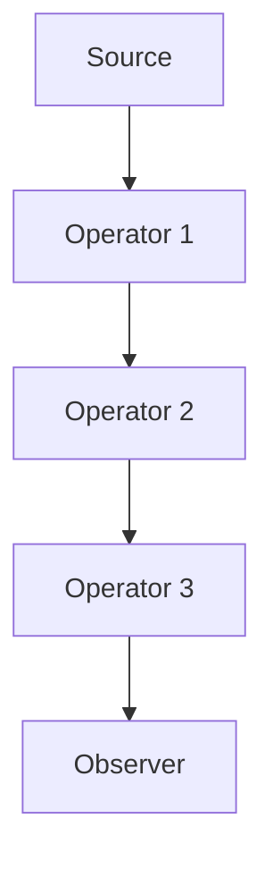

## 11.8 Reactive Programming Best Practices

Reactive programming is a paradigm that has gained significant traction in recent years, especially in the development of responsive and resilient applications. In this section, we will delve into best practices for implementing reactive programming in C#, focusing on strategies for building robust reactive systems. We will cover error handling in reactive streams, testing reactive applications, and more.

### Introduction to Reactive Programming

Reactive programming is a programming paradigm oriented around data flows and the propagation of change. This means that it becomes possible to express static or dynamic data flows with ease, and that the underlying execution model will automatically propagate changes through the data flow.

In C#, reactive programming is often implemented using the Reactive Extensions (Rx.NET) library, which provides a powerful set of tools for working with asynchronous data streams. Let's explore some of the best practices to ensure that your reactive systems are robust and maintainable.

### Error Handling in Reactive Streams

Error handling is a critical aspect of any reactive system. In reactive programming, errors can occur at any point in the data stream, and it's essential to handle them gracefully to ensure the system remains responsive and resilient.

#### Using `Catch` and `Retry` Operators

The `Catch` and `Retry` operators in Rx.NET are powerful tools for managing errors in reactive streams.

- **Catch Operator**: The `Catch` operator allows you to handle errors by providing an alternative sequence to continue the stream. This is useful for recovering from errors without disrupting the entire data flow.

```csharp
IObservable<int> numbers = Observable.Range(1, 5)
    .Select(n => {
        if (n == 3) throw new Exception("Error at 3");
        return n;
    })
    .Catch<int, Exception>(ex => {
        Console.WriteLine($"Caught exception: {ex.Message}");
        return Observable.Return(-1);
    });

numbers.Subscribe(
    n => Console.WriteLine($"Received: {n}"),
    ex => Console.WriteLine($"Error: {ex.Message}"),
    () => Console.WriteLine("Completed")
);
```

- **Retry Operator**: The `Retry` operator is used to retry the sequence in case of an error. You can specify the number of retry attempts or retry indefinitely.

```csharp
IObservable<int> numbersWithRetry = Observable.Range(1, 5)
    .Select(n => {
        if (n == 3) throw new Exception("Error at 3");
        return n;
    })
    .Retry(3);

numbersWithRetry.Subscribe(
    n => Console.WriteLine($"Received: {n}"),
    ex => Console.WriteLine($"Error: {ex.Message}"),
    () => Console.WriteLine("Completed")
);
```

#### Strategies for Fault Tolerance

In addition to using `Catch` and `Retry`, consider these strategies for enhancing fault tolerance in reactive systems:

1. **Graceful Degradation**: Design your system to degrade gracefully in the event of failures. This might involve providing default values or alternative paths when errors occur.

2. **Circuit Breaker Pattern**: Implement the circuit breaker pattern to prevent cascading failures. This pattern temporarily halts requests to a failing service, allowing it time to recover.

3. **Timeouts and Fallbacks**: Use timeouts to prevent long-running operations from blocking the system. Provide fallback mechanisms to handle cases where the primary operation fails.

4. **Logging and Monitoring**: Implement comprehensive logging and monitoring to detect and diagnose errors quickly. This will help you identify patterns and trends in failures.

### Testing Reactive Applications

Testing is a crucial part of developing reactive applications. Reactive systems can be complex, and it's essential to ensure that they behave as expected under various conditions.

#### Writing Unit Tests for Observables

Unit testing observables can be challenging due to their asynchronous nature. However, Rx.NET provides tools to make this easier.

- **TestScheduler**: Use the `TestScheduler` to simulate time and control the execution of observables. This allows you to test time-dependent logic without waiting for real time to pass.

```csharp
[Test]
public void TestObservableWithScheduler()
{
    var scheduler = new TestScheduler();
    var observable = Observable.Interval(TimeSpan.FromSeconds(1), scheduler)
        .Take(3);

    var observer = scheduler.CreateObserver<long>();

    observable.Subscribe(observer);
    scheduler.AdvanceBy(TimeSpan.FromSeconds(3).Ticks);

    observer.Messages.AssertEqual(
        OnNext(0, 0L),
        OnNext(1, 1L),
        OnNext(2, 2L),
        OnCompleted<long>(3)
    );
}
```

- **Marble Diagrams**: Use marble diagrams to visualize and test the behavior of observables. Marble diagrams represent the flow of data and events over time, making it easier to understand complex interactions.

#### Simulating Time with Virtual Schedulers

Virtual schedulers allow you to simulate the passage of time in your tests, making it possible to test time-based logic without waiting for real time to elapse.

- **VirtualTimeScheduler**: Use the `VirtualTimeScheduler` to control the flow of time in your tests. This is particularly useful for testing operations that involve delays or timeouts.

```csharp
[Test]
public void TestWithVirtualTimeScheduler()
{
    var scheduler = new TestScheduler();
    var observable = Observable.Timer(TimeSpan.FromSeconds(5), scheduler);

    var observer = scheduler.CreateObserver<long>();

    observable.Subscribe(observer);
    scheduler.AdvanceBy(TimeSpan.FromSeconds(5).Ticks);

    observer.Messages.AssertEqual(
        OnNext(0, 0L),
        OnCompleted<long>(0)
    );
}
```

### Best Practices for Reactive Programming

To build robust and maintainable reactive systems, consider the following best practices:

1. **Design for Asynchronicity**: Embrace the asynchronous nature of reactive programming. Design your system to handle asynchronous operations efficiently and avoid blocking calls.

2. **Use Backpressure Handling**: Implement backpressure handling to manage the flow of data and prevent overwhelming the system. Use operators like `Buffer`, `Window`, and `Throttle` to control the rate of data emission.

3. **Keep Streams Simple**: Avoid overly complex streams. Break down complex operations into smaller, more manageable components. This will make your code easier to understand and maintain.

4. **Leverage Functional Programming**: Take advantage of functional programming concepts, such as immutability and pure functions, to enhance the reliability and predictability of your reactive code.

5. **Document Your Streams**: Provide clear documentation for your reactive streams, including the expected inputs, outputs, and any side effects. This will help other developers understand and work with your code.

6. **Monitor and Optimize Performance**: Continuously monitor the performance of your reactive system and optimize it as needed. Use profiling tools to identify bottlenecks and areas for improvement.

### Visualizing Reactive Streams

To better understand the flow of data in reactive streams, let's visualize a simple reactive stream using a Mermaid.js diagram.



**Diagram Description**: This diagram represents a simple reactive stream with a source, three operators, and an observer. Data flows from the source through the operators and is eventually consumed by the observer.

### Try It Yourself

To deepen your understanding of reactive programming, try modifying the code examples provided in this section. Experiment with different operators, error handling strategies, and testing techniques. Consider creating your own reactive streams and testing them using the `TestScheduler`.

### Knowledge Check

Before moving on, take a moment to review the key concepts covered in this section. Consider the following questions:

- How can you handle errors in reactive streams using Rx.NET?
- What are some strategies for testing reactive applications?
- How can you simulate time in your tests using virtual schedulers?

### Conclusion

Reactive programming offers a powerful paradigm for building responsive and resilient applications. By following best practices for error handling, testing, and performance optimization, you can create robust reactive systems that are maintainable and scalable.

Remember, this is just the beginning. As you continue to explore reactive programming, you'll discover new techniques and strategies to enhance your applications. Keep experimenting, stay curious, and enjoy the journey!

## Quiz Time!



### What is the primary purpose of the `Catch` operator in Rx.NET?

- [x] To handle errors by providing an alternative sequence
- [ ] To retry the sequence in case of an error
- [ ] To log errors without affecting the sequence
- [ ] To terminate the sequence upon encountering an error

> **Explanation:** The `Catch` operator is used to handle errors by providing an alternative sequence to continue the stream.

### How does the `Retry` operator enhance fault tolerance in reactive streams?

- [x] By retrying the sequence in case of an error
- [ ] By logging errors and continuing the sequence
- [ ] By providing default values for errors
- [ ] By terminating the sequence upon encountering an error

> **Explanation:** The `Retry` operator retries the sequence in case of an error, which can enhance fault tolerance by allowing transient errors to be overcome.

### What is the role of the `TestScheduler` in testing reactive applications?

- [x] To simulate time and control the execution of observables
- [ ] To log errors during the execution of observables
- [ ] To provide default values for observables
- [ ] To terminate observables upon encountering an error

> **Explanation:** The `TestScheduler` is used to simulate time and control the execution of observables, making it easier to test time-dependent logic.

### Which of the following is a strategy for fault tolerance in reactive systems?

- [x] Circuit Breaker Pattern
- [ ] Logging only
- [ ] Immediate termination on error
- [ ] Ignoring errors

> **Explanation:** The Circuit Breaker Pattern is a strategy for fault tolerance that temporarily halts requests to a failing service, allowing it time to recover.

### What is the benefit of using virtual schedulers in testing?

- [x] To simulate the passage of time without waiting for real time
- [ ] To log errors during testing
- [ ] To provide default values for tests
- [ ] To terminate tests upon encountering an error

> **Explanation:** Virtual schedulers allow you to simulate the passage of time in your tests, making it possible to test time-based logic without waiting for real time to elapse.

### Which operator can be used to manage backpressure in reactive streams?

- [x] Buffer
- [ ] Catch
- [ ] Retry
- [ ] TestScheduler

> **Explanation:** The `Buffer` operator can be used to manage backpressure by controlling the rate of data emission.

### What is a key benefit of leveraging functional programming in reactive programming?

- [x] Enhanced reliability and predictability
- [ ] Increased complexity
- [ ] Reduced performance
- [ ] Increased side effects

> **Explanation:** Leveraging functional programming concepts, such as immutability and pure functions, enhances the reliability and predictability of reactive code.

### Why is it important to document reactive streams?

- [x] To help other developers understand and work with your code
- [ ] To increase the complexity of the code
- [ ] To reduce the performance of the code
- [ ] To introduce more errors

> **Explanation:** Documenting reactive streams provides clear information about expected inputs, outputs, and side effects, helping other developers understand and work with your code.

### What is the purpose of using marble diagrams in reactive programming?

- [x] To visualize and test the behavior of observables
- [ ] To log errors during execution
- [ ] To provide default values for observables
- [ ] To terminate observables upon encountering an error

> **Explanation:** Marble diagrams are used to visualize and test the behavior of observables, making it easier to understand complex interactions.

### True or False: Reactive programming is only useful for handling synchronous data flows.

- [ ] True
- [x] False

> **Explanation:** Reactive programming is particularly useful for handling asynchronous data flows, allowing for responsive and resilient applications.


