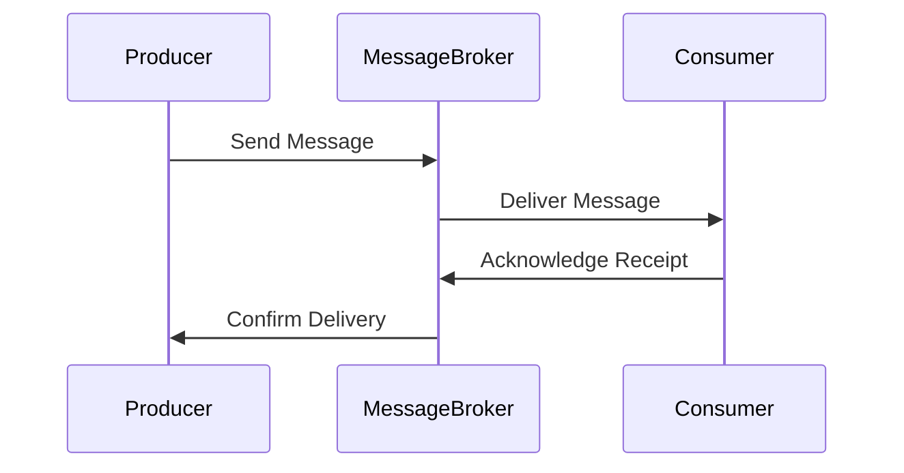

## 12.1 Message-Oriented Middleware

In the realm of distributed systems, where components are often spread across different networks and environments, ensuring seamless communication is paramount. This is where Message-Oriented Middleware (MOM) comes into play. MOM is a critical component in enterprise messaging systems, facilitating the exchange of information between disparate systems and applications. In this section, we will delve into the intricacies of MOM, exploring its role, benefits, and implementation in C#.

### Introduction to Enterprise Messaging Systems

Enterprise messaging systems are designed to enable communication between different software applications, often across diverse platforms and environments. These systems are essential for building scalable, reliable, and maintainable distributed architectures. At the heart of these systems lies Message-Oriented Middleware, which acts as an intermediary layer that handles the transmission of messages between applications.

#### Role of Messaging in Distributed Architectures

In distributed architectures, components are often decoupled and operate independently. Messaging plays a crucial role in such architectures by providing a mechanism for asynchronous communication. This allows components to send and receive messages without being directly connected, enhancing the flexibility and scalability of the system.

### Understanding Message-Oriented Middleware

Message-Oriented Middleware is a software infrastructure that supports sending and receiving messages between distributed systems. It abstracts the complexities of network communication, allowing developers to focus on business logic rather than the intricacies of data transmission.

#### Key Features of MOM

1. **Asynchronous Communication**: MOM enables asynchronous message exchange, allowing systems to communicate without waiting for a response. This decouples the sender and receiver, improving system responsiveness and scalability.

2. **Reliability**: MOM ensures reliable message delivery through mechanisms such as message persistence, acknowledgments, and retries. This is crucial in enterprise environments where data integrity is paramount.

3. **Scalability**: By decoupling components, MOM facilitates horizontal scaling, allowing systems to handle increased loads by adding more instances.

4. **Interoperability**: MOM supports communication between heterogeneous systems, enabling integration across different platforms and technologies.

5. **Security**: MOM provides security features such as encryption and authentication to protect sensitive data during transmission.

### Types of Message-Oriented Middleware

There are several types of MOM, each with its own characteristics and use cases. Understanding these types is essential for selecting the right solution for your architecture.

#### Point-to-Point Messaging

In point-to-point messaging, messages are sent from a producer to a consumer through a queue. Each message is consumed by a single receiver, ensuring that no message is processed more than once.

```csharp
// Example of Point-to-Point Messaging in C#
using System;
using System.Messaging;

public class PointToPointExample
{
    public static void SendMessage(string queuePath, string message)
    {
        if (!MessageQueue.Exists(queuePath))
        {
            MessageQueue.Create(queuePath);
        }

        using (MessageQueue queue = new MessageQueue(queuePath))
        {
            queue.Send(message);
            Console.WriteLine("Message sent: " + message);
        }
    }

    public static void ReceiveMessage(string queuePath)
    {
        using (MessageQueue queue = new MessageQueue(queuePath))
        {
            Message msg = queue.Receive();
            msg.Formatter = new XmlMessageFormatter(new String[] { "System.String,mscorlib" });
            Console.WriteLine("Message received: " + msg.Body.ToString());
        }
    }
}
```

#### Publish/Subscribe Messaging

In publish/subscribe messaging, messages are published to a topic and consumed by multiple subscribers. This model is ideal for broadcasting messages to multiple receivers.

```csharp
// Example of Publish/Subscribe Messaging in C#
using System;
using System.Collections.Generic;

public class PubSubExample
{
    private static Dictionary<string, List<Action<string>>> subscribers = new Dictionary<string, List<Action<string>>>();

    public static void Publish(string topic, string message)
    {
        if (subscribers.ContainsKey(topic))
        {
            foreach (var subscriber in subscribers[topic])
            {
                subscriber(message);
            }
        }
    }

    public static void Subscribe(string topic, Action<string> handler)
    {
        if (!subscribers.ContainsKey(topic))
        {
            subscribers[topic] = new List<Action<string>>();
        }
        subscribers[topic].Add(handler);
    }
}
```

#### Message Brokers

Message brokers are intermediaries that facilitate message exchange between producers and consumers. They provide features such as message routing, transformation, and persistence.

### Implementing MOM in C#

C# provides robust support for implementing MOM through various libraries and frameworks. Let's explore some of the popular options for building message-oriented systems in C#.

#### Using RabbitMQ

RabbitMQ is a widely-used open-source message broker that supports both point-to-point and publish/subscribe messaging. It provides a rich set of features for building scalable and reliable messaging systems.

```csharp
// Example of using RabbitMQ in C#
using System;
using RabbitMQ.Client;
using RabbitMQ.Client.Events;
using System.Text;

public class RabbitMQExample
{
    public static void SendMessage(string queueName, string message)
    {
        var factory = new ConnectionFactory() { HostName = "localhost" };
        using (var connection = factory.CreateConnection())
        using (var channel = connection.CreateModel())
        {
            channel.QueueDeclare(queue: queueName, durable: false, exclusive: false, autoDelete: false, arguments: null);
            var body = Encoding.UTF8.GetBytes(message);
            channel.BasicPublish(exchange: "", routingKey: queueName, basicProperties: null, body: body);
            Console.WriteLine(" [x] Sent {0}", message);
        }
    }

    public static void ReceiveMessage(string queueName)
    {
        var factory = new ConnectionFactory() { HostName = "localhost" };
        using (var connection = factory.CreateConnection())
        using (var channel = connection.CreateModel())
        {
            channel.QueueDeclare(queue: queueName, durable: false, exclusive: false, autoDelete: false, arguments: null);
            var consumer = new EventingBasicConsumer(channel);
            consumer.Received += (model, ea) =>
            {
                var body = ea.Body.ToArray();
                var message = Encoding.UTF8.GetString(body);
                Console.WriteLine(" [x] Received {0}", message);
            };
            channel.BasicConsume(queue: queueName, autoAck: true, consumer: consumer);
        }
    }
}
```

#### Using Azure Service Bus

Azure Service Bus is a fully-managed enterprise message broker that provides reliable and secure messaging services. It supports advanced features such as message sessions, dead-letter queues, and scheduled delivery.

```csharp
// Example of using Azure Service Bus in C#
using System;
using System.Threading.Tasks;
using Azure.Messaging.ServiceBus;

public class AzureServiceBusExample
{
    private static string connectionString = "<Your Service Bus Connection String>";
    private static string queueName = "<Your Queue Name>";

    public static async Task SendMessageAsync(string message)
    {
        await using (ServiceBusClient client = new ServiceBusClient(connectionString))
        {
            ServiceBusSender sender = client.CreateSender(queueName);
            ServiceBusMessage busMessage = new ServiceBusMessage(message);
            await sender.SendMessageAsync(busMessage);
            Console.WriteLine("Message sent: " + message);
        }
    }

    public static async Task ReceiveMessageAsync()
    {
        await using (ServiceBusClient client = new ServiceBusClient(connectionString))
        {
            ServiceBusReceiver receiver = client.CreateReceiver(queueName);
            ServiceBusReceivedMessage receivedMessage = await receiver.ReceiveMessageAsync();
            Console.WriteLine("Message received: " + receivedMessage.Body.ToString());
        }
    }
}
```

### Design Considerations for MOM

When implementing MOM, it's important to consider various design aspects to ensure optimal performance and reliability.

#### Message Durability

Decide whether messages should be persistent or transient. Persistent messages are stored on disk and survive broker restarts, while transient messages are stored in memory and are faster but less reliable.

#### Message Ordering

Ensure that messages are processed in the correct order, especially in scenarios where order matters. Some MOM solutions provide features for maintaining message order.

#### Scalability

Design your system to handle increased loads by leveraging features such as load balancing, sharding, and horizontal scaling.

#### Security

Implement security measures such as encryption, authentication, and authorization to protect sensitive data and prevent unauthorized access.

### Visualizing Message-Oriented Middleware

To better understand the flow of messages in a MOM system, let's visualize a typical message exchange scenario using a sequence diagram.



**Diagram Description**: This sequence diagram illustrates the flow of a message from a producer to a consumer through a message broker. The producer sends a message to the broker, which then delivers it to the consumer. The consumer acknowledges receipt, and the broker confirms delivery to the producer.

### Differences and Similarities with Other Patterns

MOM shares similarities with other communication patterns, such as Remote Procedure Call (RPC) and Event-Driven Architecture (EDA). However, it differs in its focus on asynchronous communication and decoupling of components.

- **RPC**: In RPC, the client invokes a procedure on a remote server, expecting a response. This is synchronous and tightly coupled compared to MOM's asynchronous nature.
- **EDA**: EDA is similar to MOM in its use of events for communication. However, EDA focuses on event propagation and handling, while MOM emphasizes message exchange and routing.

### Try It Yourself

To gain hands-on experience with MOM, try modifying the code examples provided above. Experiment with different message brokers, such as Apache Kafka or Amazon SQS, and explore their unique features. Consider implementing additional features like message filtering, priority queues, or dead-letter queues.

### Knowledge Check

To reinforce your understanding of MOM, consider the following questions:

1. What are the key benefits of using Message-Oriented Middleware in distributed systems?
2. How does MOM differ from Remote Procedure Call (RPC) in terms of communication style?
3. What are some common design considerations when implementing MOM in an enterprise environment?

### Embrace the Journey

As you explore the world of Message-Oriented Middleware, remember that this is just the beginning. MOM is a powerful tool for building scalable and reliable distributed systems. Keep experimenting, stay curious, and enjoy the journey!

## Quiz Time!



### What is the primary role of Message-Oriented Middleware (MOM) in distributed systems?

- [x] Facilitate asynchronous communication between components
- [ ] Provide synchronous communication between components
- [ ] Store data for distributed systems
- [ ] Manage user authentication

> **Explanation:** MOM is designed to facilitate asynchronous communication, allowing components to send and receive messages without being directly connected.

### Which messaging model is ideal for broadcasting messages to multiple receivers?

- [ ] Point-to-Point Messaging
- [x] Publish/Subscribe Messaging
- [ ] Message Queue
- [ ] Direct Messaging

> **Explanation:** Publish/Subscribe Messaging allows messages to be published to a topic and consumed by multiple subscribers, making it ideal for broadcasting.

### What is a key feature of Message-Oriented Middleware that enhances system scalability?

- [ ] Synchronous Communication
- [x] Decoupling of Components
- [ ] Direct Connections
- [ ] Data Storage

> **Explanation:** By decoupling components, MOM facilitates horizontal scaling, allowing systems to handle increased loads by adding more instances.

### In the context of MOM, what does message durability refer to?

- [ ] The speed of message delivery
- [ ] The order of message processing
- [x] The persistence of messages on disk
- [ ] The encryption of messages

> **Explanation:** Message durability refers to whether messages are stored on disk and survive broker restarts, ensuring reliability.

### Which of the following is a popular open-source message broker?

- [ ] Microsoft SQL Server
- [ ] Oracle Database
- [x] RabbitMQ
- [ ] MongoDB

> **Explanation:** RabbitMQ is a widely-used open-source message broker that supports both point-to-point and publish/subscribe messaging.

### What is the primary difference between MOM and RPC?

- [ ] MOM is synchronous, RPC is asynchronous
- [x] MOM is asynchronous, RPC is synchronous
- [ ] MOM is for data storage, RPC is for communication
- [ ] MOM is for user authentication, RPC is for data storage

> **Explanation:** MOM is asynchronous, allowing components to communicate without waiting for a response, while RPC is synchronous and tightly coupled.

### Which feature of MOM helps ensure that messages are processed in the correct order?

- [ ] Message Durability
- [ ] Message Encryption
- [x] Message Ordering
- [ ] Message Filtering

> **Explanation:** Message ordering ensures that messages are processed in the correct order, which is crucial in scenarios where order matters.

### What is a common security measure implemented in MOM?

- [ ] Data Compression
- [ ] Load Balancing
- [x] Encryption
- [ ] Data Sharding

> **Explanation:** Encryption is a common security measure in MOM to protect sensitive data during transmission.

### Which C# library is commonly used for implementing MOM with Azure Service Bus?

- [ ] System.Data.SqlClient
- [ ] Newtonsoft.Json
- [x] Azure.Messaging.ServiceBus
- [ ] System.Net.Http

> **Explanation:** Azure.Messaging.ServiceBus is the library used for implementing MOM with Azure Service Bus in C#.

### True or False: Message-Oriented Middleware is only suitable for small-scale applications.

- [ ] True
- [x] False

> **Explanation:** False. MOM is suitable for both small-scale and large-scale applications, providing scalability and reliability in distributed systems.


