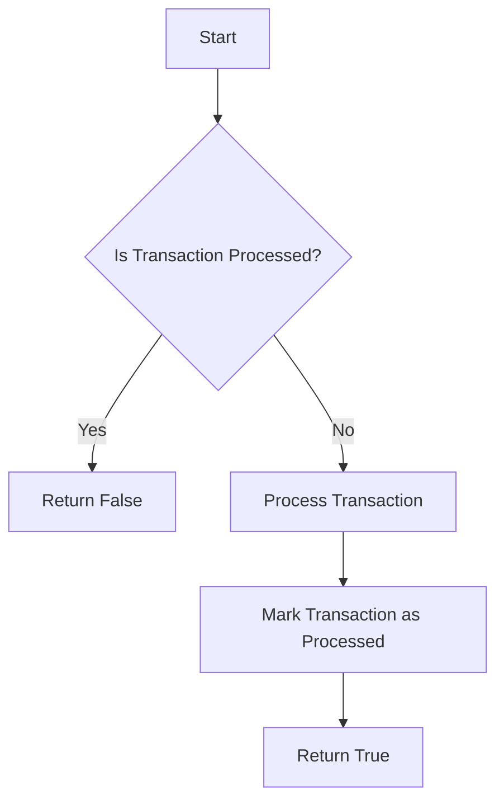
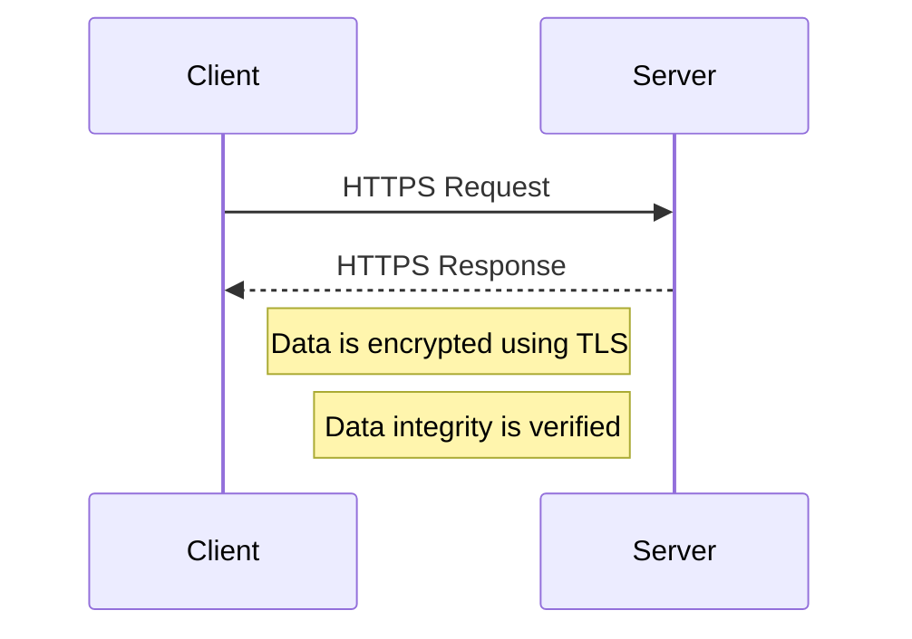

## 12.10 Integration Best Practices

In the realm of enterprise software development, integration is a critical component that ensures various systems and applications work together seamlessly. As expert software engineers and enterprise architects, understanding and implementing integration best practices is essential for building robust, scalable, and secure systems. This section delves into the best practices for integration, focusing on ensuring data consistency and addressing security considerations.

### Ensuring Data Consistency

Data consistency is paramount in integrated systems, as inconsistencies can lead to data corruption, loss, and unreliable system behavior. Let's explore some key strategies to ensure data consistency across integrated systems.

#### Idempotent Operations

Idempotency is a crucial concept in integration, especially in distributed systems where operations might be repeated due to network failures or retries. An idempotent operation is one that can be applied multiple times without changing the result beyond the initial application.

**Example:**

Consider a payment processing system where a transaction might be retried due to a timeout. If the operation is idempotent, the transaction will only be processed once, even if the request is sent multiple times.

```csharp
public class PaymentProcessor
{
    private readonly HashSet<Guid> processedTransactions = new HashSet<Guid>();

    public bool ProcessPayment(Guid transactionId, decimal amount)
    {
        // Check if the transaction has already been processed
        if (processedTransactions.Contains(transactionId))
        {
            return false; // Transaction already processed
        }

        // Process the payment
        // ...

        // Mark the transaction as processed
        processedTransactions.Add(transactionId);
        return true;
    }
}
```

In this example, the `ProcessPayment` method checks if a transaction has already been processed using a unique transaction ID, ensuring idempotency.

#### Conflict Resolution Strategies

In distributed systems, conflicts can arise when multiple systems attempt to update the same data simultaneously. Implementing effective conflict resolution strategies is essential to maintain data consistency.

**Common Strategies:**

1. **Last Write Wins (LWW):** The most recent update overwrites previous ones. This is simple but might lead to data loss if not carefully managed.

2. **Merge Logic:** Implement custom logic to merge conflicting changes. This can be domain-specific and might involve combining data from different updates.

3. **Versioning:** Use version numbers or timestamps to track changes and resolve conflicts based on the version history.

4. **User Intervention:** In some cases, manual resolution might be necessary, where users are prompted to resolve conflicts.

**Example:**

Let's consider a simple versioning strategy using timestamps:

```csharp
public class Document
{
    public string Content { get; set; }
    public DateTime LastModified { get; set; }
}

public class DocumentService
{
    public Document ResolveConflict(Document local, Document remote)
    {
        // Choose the document with the latest modification time
        return local.LastModified > remote.LastModified ? local : remote;
    }
}
```

In this example, the `ResolveConflict` method selects the document with the most recent modification time, implementing a simple versioning strategy.

### Security Considerations in Integration

Security is a critical aspect of integration, as data is often exchanged between systems over potentially insecure networks. Let's explore some best practices for securing integrations.

#### Securing Data in Transit

Data in transit is vulnerable to interception and tampering. Ensuring secure data transmission is essential to protect sensitive information.

**Best Practices:**

1. **Use HTTPS:** Always use HTTPS for data transmission to encrypt data and protect it from eavesdropping.

2. **Implement TLS:** Use Transport Layer Security (TLS) to secure data in transit. Ensure that the latest version of TLS is used to mitigate vulnerabilities.

3. **Data Encryption:** Encrypt sensitive data before transmission, using strong encryption algorithms.

4. **Integrity Checks:** Use checksums or hashes to verify data integrity during transmission.

**Example:**

Here's an example of using HTTPS and TLS in a C# application:

```csharp
using System.Net.Http;
using System.Security.Cryptography.X509Certificates;

public class SecureHttpClient
{
    private readonly HttpClient httpClient;

    public SecureHttpClient()
    {
        var handler = new HttpClientHandler
        {
            ServerCertificateCustomValidationCallback = (message, cert, chain, errors) => true
        };

        httpClient = new HttpClient(handler)
        {
            BaseAddress = new Uri("https://secureapi.example.com")
        };
    }

    public async Task<string> GetDataAsync(string endpoint)
    {
        var response = await httpClient.GetAsync(endpoint);
        response.EnsureSuccessStatusCode();
        return await response.Content.ReadAsStringAsync();
    }
}
```

In this example, we configure an `HttpClient` to use HTTPS for secure data transmission.

#### Authentication and Authorization Between Systems

Authentication and authorization are critical for ensuring that only authorized systems and users can access sensitive data and services.

**Best Practices:**

1. **OAuth 2.0:** Use OAuth 2.0 for secure authorization between systems. It provides a robust framework for access delegation.

2. **JWT Tokens:** Use JSON Web Tokens (JWT) for secure and stateless authentication. JWTs can be used to pass user identity and claims between systems.

3. **API Keys:** Use API keys for authenticating requests. Ensure that keys are kept secure and rotated regularly.

4. **Mutual TLS:** Implement mutual TLS for mutual authentication between client and server, ensuring both parties are verified.

**Example:**

Here's an example of using JWT for authentication in a C# application:

```csharp
using System.IdentityModel.Tokens.Jwt;
using System.Security.Claims;
using Microsoft.IdentityModel.Tokens;

public class JwtService
{
    private readonly string secretKey = "your_secret_key_here";

    public string GenerateToken(string username)
    {
        var claims = new[]
        {
            new Claim(ClaimTypes.Name, username)
        };

        var key = new SymmetricSecurityKey(System.Text.Encoding.UTF8.GetBytes(secretKey));
        var creds = new SigningCredentials(key, SecurityAlgorithms.HmacSha256);

        var token = new JwtSecurityToken(
            issuer: "yourdomain.com",
            audience: "yourdomain.com",
            claims: claims,
            expires: DateTime.Now.AddMinutes(30),
            signingCredentials: creds);

        return new JwtSecurityTokenHandler().WriteToken(token);
    }
}
```

In this example, the `JwtService` class generates a JWT token for a given username, which can be used for authentication.

### Visualizing Integration Best Practices

To better understand the integration best practices discussed, let's visualize some of these concepts using diagrams.

#### Idempotent Operations Flowchart



**Caption:** This flowchart illustrates the process of ensuring idempotency in transaction processing.

#### Secure Data Transmission Sequence Diagram



**Caption:** This sequence diagram shows the secure data transmission process using HTTPS and TLS.

### Knowledge Check

Let's reinforce our understanding of integration best practices with some questions and exercises.

#### Questions

1. What is idempotency, and why is it important in integration?
2. Describe a conflict resolution strategy that can be used in distributed systems.
3. What are some best practices for securing data in transit?
4. How can JWT tokens be used in system integration?

#### Exercises

1. Implement an idempotent operation in a C# application.
2. Create a simple conflict resolution strategy using versioning.
3. Set up a secure HTTPS connection in a C# application.

### Embrace the Journey

Integration is a complex but rewarding aspect of software development. By implementing these best practices, we can build systems that are not only robust and scalable but also secure and reliable. Remember, this is just the beginning. As you progress, you'll encounter new challenges and opportunities to refine your integration strategies. Keep experimenting, stay curious, and enjoy the journey!

### References and Links

- [OAuth 2.0](https://oauth.net/2/)
- [JSON Web Tokens (JWT)](https://jwt.io/)
- [Transport Layer Security (TLS)](https://en.wikipedia.org/wiki/Transport_Layer_Security)

## Quiz Time!



### What is idempotency in the context of integration?

- [x] An operation that can be applied multiple times without changing the result beyond the initial application.
- [ ] An operation that always produces a different result.
- [ ] An operation that is only executed once.
- [ ] An operation that requires user intervention.

> **Explanation:** Idempotency ensures that an operation can be repeated without altering the outcome beyond the first execution, which is crucial in distributed systems.

### Which strategy involves using timestamps to resolve conflicts?

- [x] Versioning
- [ ] Last Write Wins
- [ ] Merge Logic
- [ ] User Intervention

> **Explanation:** Versioning uses timestamps or version numbers to track changes and resolve conflicts based on the version history.

### What is the primary purpose of using HTTPS in data transmission?

- [x] To encrypt data and protect it from eavesdropping.
- [ ] To speed up data transmission.
- [ ] To compress data.
- [ ] To ensure data is always available.

> **Explanation:** HTTPS encrypts data to protect it from being intercepted during transmission.

### Which of the following is a secure method for authentication between systems?

- [x] OAuth 2.0
- [ ] Plain text passwords
- [ ] Unsecured API keys
- [ ] Basic HTTP authentication

> **Explanation:** OAuth 2.0 provides a robust framework for secure authorization between systems.

### What is a common use case for JWT tokens?

- [x] Stateless authentication
- [ ] Data compression
- [ ] File encryption
- [ ] Network routing

> **Explanation:** JWT tokens are used for stateless authentication, allowing user identity and claims to be passed between systems.

### What is a key benefit of using mutual TLS?

- [x] Mutual authentication between client and server.
- [ ] Faster data transmission.
- [ ] Reduced server load.
- [ ] Simplified network configuration.

> **Explanation:** Mutual TLS ensures both client and server are authenticated, enhancing security.

### Which of the following is NOT a conflict resolution strategy?

- [ ] Last Write Wins
- [ ] Merge Logic
- [ ] User Intervention
- [x] Data Duplication

> **Explanation:** Data duplication is not a conflict resolution strategy; it can lead to inconsistencies.

### What is the role of a checksum in data transmission?

- [x] To verify data integrity.
- [ ] To encrypt data.
- [ ] To compress data.
- [ ] To route data.

> **Explanation:** Checksums are used to verify the integrity of data during transmission.

### Which protocol is recommended for securing data in transit?

- [x] TLS
- [ ] FTP
- [ ] HTTP
- [ ] SMTP

> **Explanation:** TLS is recommended for securing data in transit, providing encryption and integrity.

### True or False: Idempotent operations are only necessary in synchronous systems.

- [ ] True
- [x] False

> **Explanation:** Idempotent operations are crucial in both synchronous and asynchronous systems to ensure consistent results despite retries or failures.


