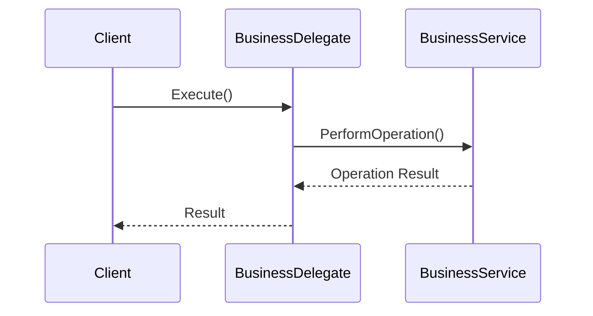

## 12.11 Business Delegate Pattern

In the realm of enterprise software development, the Business Delegate Pattern plays a crucial role in separating business logic from the presentation tier. This pattern introduces a delegate that acts as an intermediary, managing communication with business services. By doing so, it simplifies the interaction between the presentation layer and the business logic, promoting a cleaner and more maintainable architecture.

### Design Pattern Name

**Business Delegate Pattern**

### Category

Enterprise Integration Patterns

### Intent

The primary intent of the Business Delegate Pattern is to decouple the presentation layer from the business logic layer by introducing a delegate that handles all communication with business services. This separation allows for a more modular and maintainable architecture, where changes in the business logic do not directly impact the presentation layer.

### Key Participants

- **Business Delegate**: Acts as an intermediary between the presentation layer and the business services. It abstracts the complexity of service interactions.
- **Business Service**: Represents the actual business logic or service that performs operations.
- **Client**: The presentation layer or any component that requires access to business services.

### Applicability

The Business Delegate Pattern is applicable in scenarios where:

- There is a need to separate concerns between the presentation and business logic layers.
- The application architecture is layered, and communication between layers needs to be streamlined.
- There is a need to reduce coupling between the presentation layer and business services.
- You want to centralize error handling and service lookup logic.

### Implementing Business Delegate in C#

Let's delve into how we can implement the Business Delegate Pattern in C#. We'll create delegate classes to manage service interactions, providing a clear separation between the presentation and business logic layers.

#### Step 1: Define the Business Service Interface

First, define an interface for the business service. This interface will declare the operations that the business service provides.

```csharp
public interface IBusinessService
{
    void PerformOperation();
}
```

#### Step 2: Implement the Business Service

Next, implement the business service interface. This class contains the actual business logic.

```csharp
public class BusinessService : IBusinessService
{
    public void PerformOperation()
    {
        // Business logic implementation
        Console.WriteLine("Performing business operation...");
    }
}
```

#### Step 3: Create the Business Delegate

The business delegate acts as an intermediary between the client and the business service. It handles service lookup and delegates calls to the business service.

```csharp
public class BusinessDelegate
{
    private IBusinessService _businessService;

    public BusinessDelegate()
    {
        // Service lookup or initialization
        _businessService = new BusinessService();
    }

    public void Execute()
    {
        // Delegate the call to the business service
        _businessService.PerformOperation();
    }
}
```

#### Step 4: Implement the Client

The client interacts with the business delegate instead of directly communicating with the business service.

```csharp
public class Client
{
    private BusinessDelegate _businessDelegate;

    public Client(BusinessDelegate businessDelegate)
    {
        _businessDelegate = businessDelegate;
    }

    public void DoTask()
    {
        // Use the business delegate to perform the operation
        _businessDelegate.Execute();
    }
}
```

#### Step 5: Test the Implementation

Finally, test the implementation to ensure that the client can perform operations through the business delegate.

```csharp
class Program
{
    static void Main(string[] args)
    {
        BusinessDelegate businessDelegate = new BusinessDelegate();
        Client client = new Client(businessDelegate);

        client.DoTask();
    }
}
```

### Diagrams

To better understand the flow of the Business Delegate Pattern, let's visualize it using a sequence diagram.



**Diagram Description:** This sequence diagram illustrates the interaction between the client, business delegate, and business service. The client requests an operation through the business delegate, which then delegates the request to the business service. The result is returned back to the client through the business delegate.

### Use Cases and Examples

The Business Delegate Pattern is particularly useful in enterprise applications with layered architectures. Let's explore some use cases and examples where this pattern can be effectively applied.

#### Use Case 1: Simplifying Communication in Layered Architectures

In a typical enterprise application, the presentation layer often needs to interact with multiple business services. Direct communication between these layers can lead to tight coupling and increased complexity. By introducing a business delegate, we can centralize service interactions, making the architecture more modular and easier to maintain.

#### Example: E-commerce Application

Consider an e-commerce application where the presentation layer needs to interact with various business services, such as order processing, inventory management, and payment processing. By using the Business Delegate Pattern, we can create a delegate for each service, simplifying communication and reducing dependencies.

```csharp
public class OrderBusinessDelegate
{
    private IOrderService _orderService;

    public OrderBusinessDelegate()
    {
        _orderService = new OrderService();
    }

    public void PlaceOrder(Order order)
    {
        _orderService.ProcessOrder(order);
    }
}

public interface IOrderService
{
    void ProcessOrder(Order order);
}

public class OrderService : IOrderService
{
    public void ProcessOrder(Order order)
    {
        // Order processing logic
        Console.WriteLine("Order processed.");
    }
}

public class Order
{
    // Order properties
}
```

In this example, the `OrderBusinessDelegate` acts as an intermediary between the presentation layer and the `OrderService`. The presentation layer interacts with the `OrderBusinessDelegate` to place orders, while the delegate handles communication with the `OrderService`.

### Design Considerations

When implementing the Business Delegate Pattern, consider the following:

- **Service Lookup**: The business delegate is responsible for service lookup and initialization. Ensure that this process is efficient and does not introduce unnecessary overhead.
- **Error Handling**: Centralize error handling within the business delegate to provide a consistent error management strategy across the application.
- **Performance**: While the business delegate simplifies communication, it may introduce additional layers of abstraction. Ensure that this does not negatively impact performance.
- **Scalability**: The pattern should support scalability by allowing easy addition of new business services without affecting the presentation layer.

### Differences and Similarities

The Business Delegate Pattern is often compared to other patterns, such as the **Facade Pattern** and **Service Locator Pattern**. Let's explore the differences and similarities:

- **Facade Pattern**: Both patterns provide a simplified interface to a complex subsystem. However, the Business Delegate Pattern specifically focuses on decoupling the presentation layer from business services, while the Facade Pattern is more general-purpose.
- **Service Locator Pattern**: The Service Locator Pattern is used for service lookup and retrieval, similar to the business delegate's role. However, the Business Delegate Pattern also includes delegation of service calls, providing a higher level of abstraction.

### Try It Yourself

To deepen your understanding of the Business Delegate Pattern, try modifying the code examples provided. Here are some suggestions:

- **Add New Services**: Implement additional business services and create corresponding delegates. Test how the presentation layer interacts with these new services through the delegates.
- **Enhance Error Handling**: Introduce error handling logic within the business delegate to manage exceptions thrown by business services.
- **Optimize Service Lookup**: Experiment with different service lookup strategies, such as caching or lazy initialization, to improve performance.

### Knowledge Check

Before we wrap up, let's reinforce what we've learned with a few questions:

- What is the primary intent of the Business Delegate Pattern?
- How does the Business Delegate Pattern promote separation of concerns?
- What are the key participants in the Business Delegate Pattern?
- How does the Business Delegate Pattern differ from the Facade Pattern?

### Embrace the Journey

Remember, mastering design patterns is a journey. The Business Delegate Pattern is just one of many tools in your software engineering toolkit. As you continue to explore and apply design patterns, you'll gain a deeper understanding of how to build scalable, maintainable, and efficient applications. Keep experimenting, stay curious, and enjoy the journey!

## Quiz Time!



### What is the primary intent of the Business Delegate Pattern?

- [x] To decouple the presentation layer from the business logic layer
- [ ] To couple the presentation layer with the business logic layer
- [ ] To simplify database interactions
- [ ] To enhance user interface design

> **Explanation:** The Business Delegate Pattern aims to decouple the presentation layer from the business logic layer by introducing a delegate that handles communication with business services.

### Which of the following is a key participant in the Business Delegate Pattern?

- [x] Business Delegate
- [ ] Data Access Object
- [ ] User Interface
- [ ] Database

> **Explanation:** The Business Delegate is a key participant that acts as an intermediary between the client and business services.

### How does the Business Delegate Pattern promote separation of concerns?

- [x] By introducing a delegate that handles communication with business services
- [ ] By combining the presentation and business logic layers
- [ ] By directly accessing the database from the presentation layer
- [ ] By eliminating the need for business services

> **Explanation:** The pattern promotes separation of concerns by introducing a delegate that abstracts the complexity of service interactions, allowing the presentation layer to focus on user interface logic.

### What is a similarity between the Business Delegate Pattern and the Facade Pattern?

- [x] Both provide a simplified interface to a complex subsystem
- [ ] Both are used for database interactions
- [ ] Both eliminate the need for business services
- [ ] Both are used for user interface design

> **Explanation:** Both patterns provide a simplified interface to a complex subsystem, making it easier for clients to interact with the system.

### What is a difference between the Business Delegate Pattern and the Service Locator Pattern?

- [x] The Business Delegate Pattern includes delegation of service calls
- [ ] The Service Locator Pattern eliminates the need for business services
- [ ] The Business Delegate Pattern is used for database interactions
- [ ] The Service Locator Pattern is used for user interface design

> **Explanation:** The Business Delegate Pattern includes delegation of service calls, providing a higher level of abstraction compared to the Service Locator Pattern, which focuses on service lookup and retrieval.

### Which pattern is often compared to the Business Delegate Pattern?

- [x] Facade Pattern
- [ ] Singleton Pattern
- [ ] Observer Pattern
- [ ] Strategy Pattern

> **Explanation:** The Facade Pattern is often compared to the Business Delegate Pattern because both provide a simplified interface to a complex subsystem.

### What is a potential drawback of the Business Delegate Pattern?

- [x] It may introduce additional layers of abstraction
- [ ] It eliminates the need for business services
- [ ] It complicates user interface design
- [ ] It directly accesses the database

> **Explanation:** While the pattern simplifies communication, it may introduce additional layers of abstraction, which could impact performance if not managed properly.

### How can the Business Delegate Pattern support scalability?

- [x] By allowing easy addition of new business services
- [ ] By eliminating the need for business services
- [ ] By directly accessing the database
- [ ] By complicating user interface design

> **Explanation:** The pattern supports scalability by allowing easy addition of new business services without affecting the presentation layer.

### What role does the Business Delegate play in error handling?

- [x] It centralizes error handling within the application
- [ ] It eliminates the need for error handling
- [ ] It complicates error handling
- [ ] It directly accesses the database for error handling

> **Explanation:** The Business Delegate centralizes error handling, providing a consistent error management strategy across the application.

### True or False: The Business Delegate Pattern is used to enhance user interface design.

- [ ] True
- [x] False

> **Explanation:** The Business Delegate Pattern is not specifically used to enhance user interface design; its primary purpose is to decouple the presentation layer from the business logic layer.


