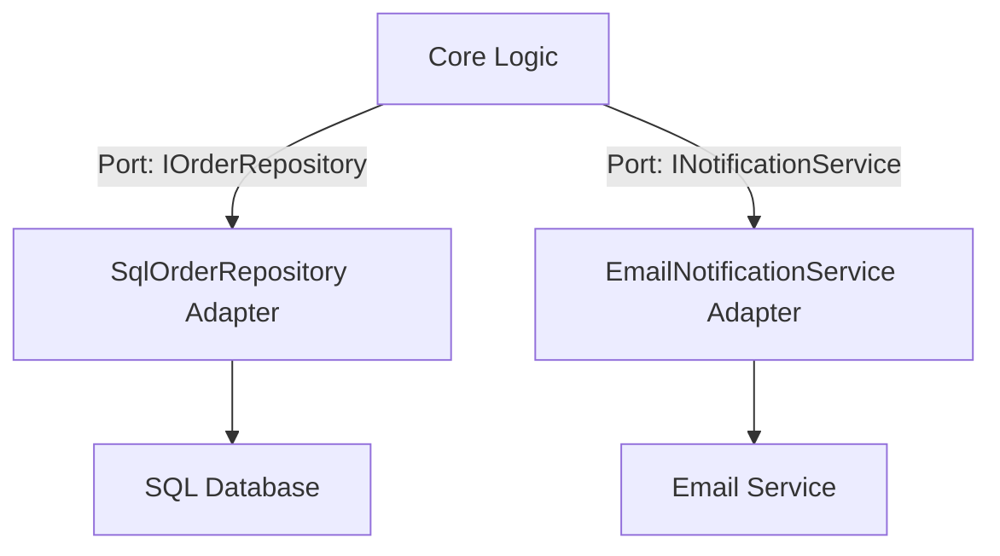

## 12.12 Hexagonal Architecture Pattern

The Hexagonal Architecture Pattern, also known as the Ports and Adapters pattern, is a powerful architectural style that aims to decouple the core logic of an application from its external dependencies. This separation enhances the modularity, testability, and maintainability of software systems. In this section, we will explore the Hexagonal Architecture Pattern in the context of C#, providing a comprehensive guide for expert software engineers and enterprise architects.

### Introduction to Hexagonal Architecture

The Hexagonal Architecture was introduced by Alistair Cockburn in 2005 as a way to create applications that are independent of external systems, such as databases, user interfaces, and third-party services. The core idea is to define a central application logic that interacts with the outside world through well-defined interfaces, known as ports. Adapters are then used to connect these ports to the external systems.

#### Key Concepts

- **Core Logic**: The central part of the application that contains the business rules and logic. It is isolated from external systems.
- **Ports**: Interfaces that define how the core logic interacts with the outside world. Ports can be input ports (for receiving data) or output ports (for sending data).
- **Adapters**: Implementations of the ports that connect the core logic to external systems. Adapters can be primary (driving) or secondary (driven).

### Benefits of Hexagonal Architecture

- **Decoupling**: By separating the core logic from external systems, changes in one part do not affect the other.
- **Testability**: The core logic can be tested independently of external systems, making unit testing easier and more reliable.
- **Flexibility**: New external systems can be integrated by adding new adapters without modifying the core logic.
- **Maintainability**: The clear separation of concerns makes the application easier to understand and maintain.

### Implementing Hexagonal Architecture in C#

To implement Hexagonal Architecture in C#, we need to define ports and create adapters for external systems. Let's break down the process step-by-step.

#### Step 1: Define the Core Logic

The core logic should be independent of any external systems. It should focus solely on the business rules and logic.

```csharp
public class OrderService
{
    private readonly IOrderRepository _orderRepository;
    private readonly INotificationService _notificationService;

    public OrderService(IOrderRepository orderRepository, INotificationService notificationService)
    {
        _orderRepository = orderRepository;
        _notificationService = notificationService;
    }

    public void PlaceOrder(Order order)
    {
        _orderRepository.Save(order);
        _notificationService.Notify(order);
    }
}
```

In this example, `OrderService` is the core logic that depends on two ports: `IOrderRepository` and `INotificationService`.

#### Step 2: Define Ports

Ports are interfaces that define how the core logic interacts with external systems.

```csharp
public interface IOrderRepository
{
    void Save(Order order);
}

public interface INotificationService
{
    void Notify(Order order);
}
```

These interfaces act as contracts between the core logic and the external systems.

#### Step 3: Create Adapters

Adapters implement the ports and connect the core logic to external systems.

```csharp
public class SqlOrderRepository : IOrderRepository
{
    public void Save(Order order)
    {
        // Implementation for saving order to SQL database
    }
}

public class EmailNotificationService : INotificationService
{
    public void Notify(Order order)
    {
        // Implementation for sending email notification
    }
}
```

In this example, `SqlOrderRepository` and `EmailNotificationService` are adapters that connect the core logic to a SQL database and an email service, respectively.

### Visualizing Hexagonal Architecture

To better understand the Hexagonal Architecture, let's visualize it using a diagram.



**Diagram Description**: This diagram illustrates the Hexagonal Architecture pattern, showing the core logic interacting with external systems through ports and adapters.

### Use Cases and Examples

Hexagonal Architecture is particularly useful in scenarios where modularity, testability, and maintainability are critical. Here are some common use cases:

#### Modular Applications

In large applications, modularity is essential for managing complexity. Hexagonal Architecture allows different modules to interact with each other through well-defined interfaces, making it easier to develop and maintain.

#### Facilitating Easier Testing

By decoupling the core logic from external systems, Hexagonal Architecture makes it easier to write unit tests. The core logic can be tested independently, and mock implementations of the ports can be used to simulate external systems.

#### Example: E-commerce Platform

Consider an e-commerce platform where the core logic handles order processing, and external systems include a payment gateway and a shipping service. Using Hexagonal Architecture, the core logic can interact with these systems through ports, and adapters can be created for different payment gateways and shipping services.

### Design Considerations

When implementing Hexagonal Architecture, consider the following:

- **Interface Design**: Carefully design the ports to ensure they provide the necessary functionality without exposing unnecessary details.
- **Adapter Implementation**: Adapters should be responsible for translating between the core logic and the external systems. They should not contain business logic.
- **Dependency Injection**: Use dependency injection to manage the dependencies between the core logic and the adapters.

### Differences and Similarities with Other Patterns

Hexagonal Architecture shares similarities with other architectural patterns, such as:

- **Layered Architecture**: Both patterns aim to separate concerns, but Hexagonal Architecture focuses more on decoupling from external systems.
- **Microservices Architecture**: Hexagonal Architecture can be used within microservices to ensure each service is independent and modular.

### Try It Yourself

To gain a deeper understanding of Hexagonal Architecture, try implementing it in a simple C# application. Start by defining the core logic and ports, then create adapters for different external systems. Experiment with adding new adapters to see how easily the application can be extended.

### Knowledge Check

- Explain the key concepts of Hexagonal Architecture.
- Describe the benefits of using Hexagonal Architecture in software development.
- Implement a simple C# application using Hexagonal Architecture.

### Embrace the Journey

Remember, mastering Hexagonal Architecture is a journey. As you progress, you'll build more modular and maintainable applications. Keep experimenting, stay curious, and enjoy the journey!

### References and Links

- [Alistair Cockburn's Hexagonal Architecture](https://alistair.cockburn.us/hexagonal-architecture/)
- [Microsoft Docs: Dependency Injection in .NET](https://docs.microsoft.com/en-us/dotnet/core/extensions/dependency-injection)

## Quiz Time!



### What is the primary goal of Hexagonal Architecture?

- [x] To decouple the core logic from external systems
- [ ] To improve the performance of the application
- [ ] To enhance the user interface design
- [ ] To reduce the cost of development

> **Explanation:** The primary goal of Hexagonal Architecture is to decouple the core logic from external systems, enhancing modularity and testability.

### What are ports in Hexagonal Architecture?

- [x] Interfaces that define how the core logic interacts with external systems
- [ ] Classes that implement the business logic
- [ ] External systems that the application interacts with
- [ ] Adapters that connect the core logic to external systems

> **Explanation:** Ports are interfaces that define how the core logic interacts with external systems, acting as contracts between the core logic and adapters.

### What role do adapters play in Hexagonal Architecture?

- [x] They implement ports and connect the core logic to external systems
- [ ] They contain the core business logic
- [ ] They define the interfaces for external systems
- [ ] They are responsible for user interface design

> **Explanation:** Adapters implement ports and connect the core logic to external systems, translating between the two.

### Which of the following is a benefit of Hexagonal Architecture?

- [x] Enhanced testability
- [ ] Increased application size
- [ ] More complex codebase
- [ ] Reduced modularity

> **Explanation:** Hexagonal Architecture enhances testability by decoupling the core logic from external systems, allowing for independent testing.

### How does Hexagonal Architecture facilitate easier testing?

- [x] By decoupling the core logic from external systems
- [ ] By integrating all external systems into the core logic
- [ ] By using complex algorithms
- [ ] By reducing the number of tests required

> **Explanation:** Hexagonal Architecture facilitates easier testing by decoupling the core logic from external systems, allowing for independent unit tests.

### What is the relationship between ports and adapters in Hexagonal Architecture?

- [x] Adapters implement ports to connect the core logic to external systems
- [ ] Ports implement adapters to connect external systems to the core logic
- [ ] Ports and adapters are unrelated
- [ ] Adapters define the interfaces for ports

> **Explanation:** In Hexagonal Architecture, adapters implement ports to connect the core logic to external systems.

### Which of the following is NOT a characteristic of Hexagonal Architecture?

- [ ] Decoupling core logic from external systems
- [ ] Enhanced modularity
- [x] Direct integration with external systems
- [ ] Improved maintainability

> **Explanation:** Hexagonal Architecture is characterized by decoupling core logic from external systems, not direct integration.

### What is the role of dependency injection in Hexagonal Architecture?

- [x] To manage dependencies between the core logic and adapters
- [ ] To implement business logic
- [ ] To design user interfaces
- [ ] To reduce application size

> **Explanation:** Dependency injection is used to manage dependencies between the core logic and adapters in Hexagonal Architecture.

### How can Hexagonal Architecture be used in microservices?

- [x] By ensuring each service is independent and modular
- [ ] By integrating all services into a single application
- [ ] By reducing the number of services
- [ ] By increasing the complexity of services

> **Explanation:** Hexagonal Architecture can be used in microservices to ensure each service is independent and modular.

### True or False: Hexagonal Architecture is also known as the Ports and Adapters pattern.

- [x] True
- [ ] False

> **Explanation:** Hexagonal Architecture is indeed also known as the Ports and Adapters pattern.


