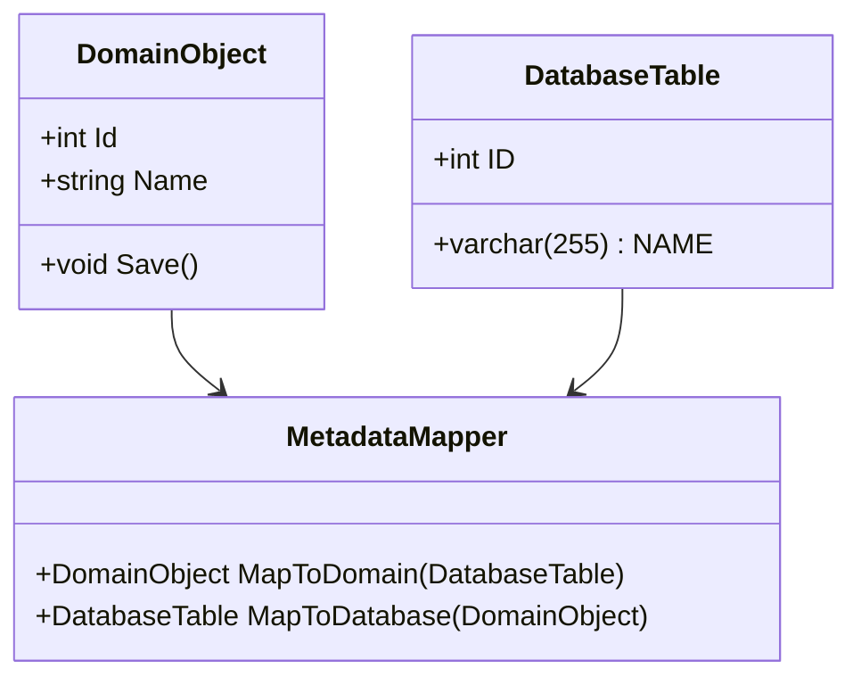
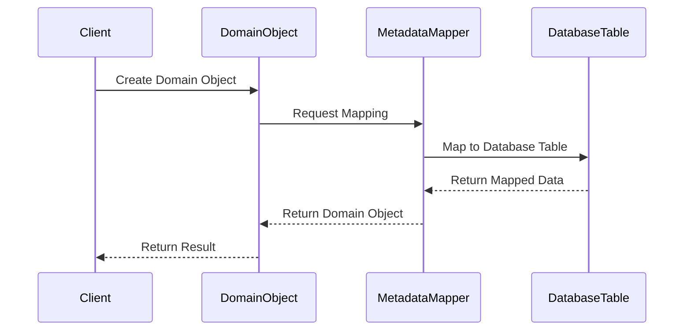

## 12.13 Metadata Mapping Pattern

In the realm of enterprise software development, the Metadata Mapping Pattern plays a crucial role in bridging the gap between in-memory objects and database structures. This pattern is essential for developers and architects who aim to create scalable, maintainable, and efficient applications. By leveraging metadata mapping, we can achieve seamless integration between our application's domain model and the underlying data storage mechanisms.

### Design Pattern Name

**Metadata Mapping Pattern**

### Category

Enterprise Integration Patterns

### Intent

The primary intent of the Metadata Mapping Pattern is to decouple the in-memory representation of data from its database structure. This separation allows developers to work with domain objects without worrying about the intricacies of database schemas. It facilitates easier data manipulation, transformation, and integration, especially when dealing with complex or legacy databases.

### Diagrams

To better understand the Metadata Mapping Pattern, let's visualize the relationship between in-memory objects and database tables using a class diagram.



**Diagram Description:** This diagram illustrates the Metadata Mapping Pattern, where the `MetadataMapper` class is responsible for converting between `DomainObject` and `DatabaseTable`. This separation ensures that changes in the database schema do not directly impact the domain model.

### Key Participants

1. **Domain Object**: Represents the in-memory data structure used within the application.
2. **Database Table**: Represents the structure of data as stored in the database.
3. **Metadata Mapper**: A component responsible for translating between domain objects and database tables.

### Applicability

The Metadata Mapping Pattern is applicable in scenarios where:

- There is a need to separate business logic from data access logic.
- The application must support complex data transformations.
- Integration with legacy databases is required.
- The database schema is subject to frequent changes, and the application should remain unaffected.

### Implementing Metadata Mapping in C#

In C#, implementing the Metadata Mapping Pattern is often facilitated by Object-Relational Mapping (ORM) tools such as Entity Framework Core. These tools provide a robust framework for mapping domain objects to database tables, allowing developers to focus on business logic rather than data access details.

#### Using ORM Tools like Entity Framework Core

Entity Framework Core (EF Core) is a popular ORM tool in the .NET ecosystem that simplifies data access by providing a high-level abstraction over database operations. Let's explore how EF Core can be used to implement metadata mapping.

**Step 1: Define the Domain Model**

First, define the domain model that represents the in-memory data structure.

```csharp
public class Product
{
    public int Id { get; set; }
    public string Name { get; set; }
    public decimal Price { get; set; }
}
```

**Step 2: Configure the Database Context**

Next, configure the database context to map the domain model to the database schema.

```csharp
public class ApplicationDbContext : DbContext
{
    public DbSet<Product> Products { get; set; }

    protected override void OnConfiguring(DbContextOptionsBuilder optionsBuilder)
    {
        optionsBuilder.UseSqlServer("YourConnectionStringHere");
    }

    protected override void OnModelCreating(ModelBuilder modelBuilder)
    {
        modelBuilder.Entity<Product>(entity =>
        {
            entity.ToTable("Products");
            entity.HasKey(e => e.Id);
            entity.Property(e => e.Name).HasColumnName("ProductName");
            entity.Property(e => e.Price).HasColumnName("ProductPrice");
        });
    }
}
```

**Step 3: Perform CRUD Operations**

With the domain model and database context configured, you can perform CRUD operations seamlessly.

```csharp
using (var context = new ApplicationDbContext())
{
    // Create
    var product = new Product { Name = "Laptop", Price = 999.99m };
    context.Products.Add(product);
    context.SaveChanges();

    // Read
    var products = context.Products.ToList();

    // Update
    var existingProduct = context.Products.First();
    existingProduct.Price = 899.99m;
    context.SaveChanges();

    // Delete
    context.Products.Remove(existingProduct);
    context.SaveChanges();
}
```

### Use Cases and Examples

The Metadata Mapping Pattern is particularly useful in scenarios involving complex data transformations and legacy database integration.

#### Complex Data Transformations

In enterprise applications, data often needs to be transformed before it can be used. For instance, data from multiple sources might need to be aggregated, normalized, or converted into a specific format. The Metadata Mapping Pattern allows developers to define these transformations in a centralized manner, ensuring consistency and maintainability.

**Example: Transforming Data for Reporting**

Consider a scenario where data from multiple tables needs to be aggregated for reporting purposes. By using metadata mapping, you can define the transformation logic in a single place, making it easier to update and maintain.

```csharp
public class ReportData
{
    public string ProductName { get; set; }
    public decimal TotalSales { get; set; }
}

public class ReportMapper
{
    public ReportData MapToReport(Product product, SalesData salesData)
    {
        return new ReportData
        {
            ProductName = product.Name,
            TotalSales = salesData.Amount
        };
    }
}
```

#### Legacy Database Integration

Integrating with legacy databases can be challenging due to differences in data structures and formats. The Metadata Mapping Pattern provides a way to abstract these differences, allowing the application to interact with the database in a consistent manner.

**Example: Integrating with a Legacy Database**

Suppose you need to integrate with a legacy database that uses different naming conventions and data types. By using metadata mapping, you can define the necessary transformations to ensure compatibility.

```csharp
public class LegacyProduct
{
    public int ProductID { get; set; }
    public string ProductDesc { get; set; }
    public double ProductCost { get; set; }
}

public class LegacyMapper
{
    public Product MapToDomain(LegacyProduct legacyProduct)
    {
        return new Product
        {
            Id = legacyProduct.ProductID,
            Name = legacyProduct.ProductDesc,
            Price = (decimal)legacyProduct.ProductCost
        };
    }
}
```

### Design Considerations

When implementing the Metadata Mapping Pattern, consider the following:

- **Performance**: Mapping operations can introduce overhead, especially with large datasets. Optimize mappings to minimize performance impact.
- **Complexity**: While metadata mapping simplifies data access, it can introduce complexity in the mapping layer. Ensure mappings are well-documented and maintainable.
- **Consistency**: Ensure that mappings are consistent across the application to avoid data inconsistencies.

### Differences and Similarities

The Metadata Mapping Pattern is often compared to other data access patterns, such as the Data Mapper and Repository patterns. While all these patterns aim to abstract data access, they differ in their approach:

- **Metadata Mapping vs. Data Mapper**: The Data Mapper pattern focuses on mapping domain objects to database records, while Metadata Mapping emphasizes the separation of in-memory objects from database structures using metadata.
- **Metadata Mapping vs. Repository**: The Repository pattern provides a collection-like interface for accessing domain objects, whereas Metadata Mapping deals with the translation between domain objects and database structures.

### Try It Yourself

To deepen your understanding of the Metadata Mapping Pattern, try modifying the code examples provided:

- Experiment with different database schemas and see how the mappings can be adjusted.
- Implement additional transformations in the `ReportMapper` class to handle more complex reporting scenarios.
- Integrate with a mock legacy database and practice defining mappings to ensure compatibility.

### Visualizing Metadata Mapping in Action

Let's visualize the process of mapping a domain object to a database table using a sequence diagram.



**Diagram Description:** This sequence diagram illustrates the process of mapping a domain object to a database table using the Metadata Mapping Pattern. The `Client` creates a `DomainObject`, which is then mapped to a `DatabaseTable` by the `MetadataMapper`.

### References and Links

For further reading on the Metadata Mapping Pattern and related topics, consider the following resources:

- [Entity Framework Core Documentation](https://docs.microsoft.com/en-us/ef/core/)
- [Martin Fowler's Patterns of Enterprise Application Architecture](https://martinfowler.com/books/eaa.html)
- [Microsoft's Guide to Data Access in .NET](https://docs.microsoft.com/en-us/dotnet/standard/data/)

### Knowledge Check

To reinforce your understanding of the Metadata Mapping Pattern, consider the following questions:

- How does the Metadata Mapping Pattern differ from the Data Mapper pattern?
- What are the key benefits of using metadata mapping in enterprise applications?
- How can ORM tools like Entity Framework Core facilitate metadata mapping?

### Embrace the Journey

Remember, mastering the Metadata Mapping Pattern is just one step in your journey as a software engineer. As you continue to explore design patterns and best practices, you'll gain the skills needed to build robust, scalable, and maintainable applications. Keep experimenting, stay curious, and enjoy the journey!

## Quiz Time!



### What is the primary intent of the Metadata Mapping Pattern?

- [x] To decouple in-memory objects from database structures.
- [ ] To enhance the performance of database queries.
- [ ] To simplify the user interface design.
- [ ] To manage user authentication and authorization.

> **Explanation:** The Metadata Mapping Pattern aims to separate in-memory objects from database structures, allowing developers to work with domain objects without worrying about database schemas.

### Which tool is commonly used in C# to implement metadata mapping?

- [x] Entity Framework Core
- [ ] ASP.NET Core
- [ ] Xamarin
- [ ] Unity

> **Explanation:** Entity Framework Core is a popular ORM tool in C# that facilitates metadata mapping by providing a high-level abstraction over database operations.

### What is a key benefit of using metadata mapping in enterprise applications?

- [x] It allows for complex data transformations.
- [ ] It reduces the need for user input validation.
- [ ] It simplifies the deployment process.
- [ ] It enhances the graphical user interface.

> **Explanation:** Metadata mapping allows for complex data transformations by providing a centralized way to define transformation logic, ensuring consistency and maintainability.

### How does the Metadata Mapping Pattern differ from the Repository pattern?

- [x] Metadata Mapping deals with translation between domain objects and database structures, while Repository provides a collection-like interface for accessing domain objects.
- [ ] Metadata Mapping focuses on user interface design, while Repository handles data access.
- [ ] Metadata Mapping is used for authentication, while Repository manages authorization.
- [ ] Metadata Mapping is a subset of the Repository pattern.

> **Explanation:** The Metadata Mapping Pattern focuses on translating between domain objects and database structures, whereas the Repository pattern provides a collection-like interface for accessing domain objects.

### What is a potential drawback of using metadata mapping?

- [x] It can introduce overhead, especially with large datasets.
- [ ] It simplifies data access too much.
- [ ] It makes the application less maintainable.
- [ ] It reduces the flexibility of the database schema.

> **Explanation:** Mapping operations can introduce overhead, particularly with large datasets, which can impact performance.

### In the provided code example, what is the purpose of the `OnModelCreating` method?

- [x] To configure the mapping between domain models and database tables.
- [ ] To initialize the database connection.
- [ ] To handle user authentication.
- [ ] To manage application settings.

> **Explanation:** The `OnModelCreating` method is used to configure the mapping between domain models and database tables in Entity Framework Core.

### What is a common use case for the Metadata Mapping Pattern?

- [x] Integrating with legacy databases.
- [ ] Designing user interfaces.
- [ ] Managing user sessions.
- [ ] Implementing caching strategies.

> **Explanation:** The Metadata Mapping Pattern is commonly used for integrating with legacy databases, where differences in data structures and formats need to be abstracted.

### What does the `DbSet<Product>` represent in the code example?

- [x] A collection of `Product` entities that can be queried from the database.
- [ ] A configuration setting for the application.
- [ ] A user interface component.
- [ ] A logging mechanism.

> **Explanation:** `DbSet<Product>` represents a collection of `Product` entities that can be queried from the database using Entity Framework Core.

### How can metadata mapping improve maintainability in an application?

- [x] By centralizing transformation logic, making it easier to update and maintain.
- [ ] By reducing the number of database queries.
- [ ] By simplifying the user interface design.
- [ ] By enhancing the graphical performance.

> **Explanation:** Metadata mapping centralizes transformation logic, making it easier to update and maintain, which improves the overall maintainability of the application.

### True or False: Metadata Mapping Pattern is only applicable to relational databases.

- [ ] True
- [x] False

> **Explanation:** While commonly used with relational databases, the Metadata Mapping Pattern can be applied to other types of databases and data storage systems as well.


