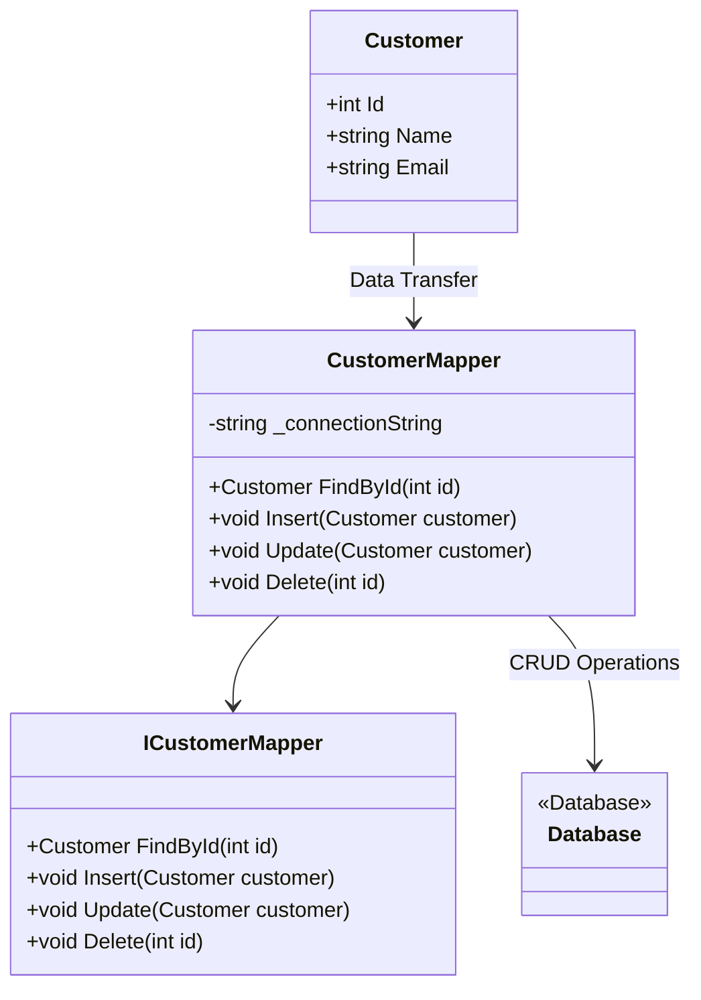

## 12.14 Data Mapper Pattern

In the realm of enterprise software development, managing the interaction between in-memory objects and database records is a critical task. The Data Mapper Pattern is a design pattern that facilitates this interaction by transferring data between objects and a database while keeping them independent. This pattern is particularly useful in decoupling the persistence layer from the domain logic, allowing for greater flexibility and maintainability.

### Intent

The primary intent of the Data Mapper Pattern is to separate the in-memory representation of data from the database schema. This separation allows developers to focus on the business logic without worrying about the underlying database structure. By using a Data Mapper, you can achieve a clean separation of concerns, making your codebase more modular and easier to maintain.

### Key Participants

1. **Domain Objects**: These are the objects that represent the business logic and data in your application. They are independent of the database schema.

2. **Data Mapper**: This component is responsible for transferring data between the domain objects and the database. It encapsulates the logic for converting between the two representations.

3. **Database**: The storage system where the data is persisted. The Data Mapper interacts with the database to perform CRUD (Create, Read, Update, Delete) operations.

### Applicability

The Data Mapper Pattern is applicable in scenarios where:

- You need to decouple the domain logic from the persistence logic.
- The database schema is complex and subject to change.
- You want to support multiple data sources or databases.
- You need to implement a persistence layer that is independent of the domain model.

### Implementing Data Mapper in C#

To implement the Data Mapper Pattern in C#, you need to create mapper classes that handle the conversion between domain objects and database records. Let's walk through the steps involved in implementing a Data Mapper.

#### Step 1: Define Domain Objects

Start by defining the domain objects that represent the business logic in your application. These objects should be independent of the database schema.

```csharp
public class Customer
{
    public int Id { get; set; }
    public string Name { get; set; }
    public string Email { get; set; }
}
```

#### Step 2: Create the Data Mapper Interface

Define an interface for the Data Mapper that specifies the operations for transferring data between the domain objects and the database.

```csharp
public interface ICustomerMapper
{
    Customer FindById(int id);
    void Insert(Customer customer);
    void Update(Customer customer);
    void Delete(int id);
}
```

#### Step 3: Implement the Data Mapper

Implement the Data Mapper interface to handle the conversion between domain objects and database records. This implementation will interact with the database to perform CRUD operations.

```csharp
public class CustomerMapper : ICustomerMapper
{
    private readonly string _connectionString;

    public CustomerMapper(string connectionString)
    {
        _connectionString = connectionString;
    }

    public Customer FindById(int id)
    {
        // Database interaction logic to find a customer by ID
        // For demonstration, let's assume we're using ADO.NET
        using (var connection = new SqlConnection(_connectionString))
        {
            connection.Open();
            var command = new SqlCommand("SELECT * FROM Customers WHERE Id = @Id", connection);
            command.Parameters.AddWithValue("@Id", id);

            using (var reader = command.ExecuteReader())
            {
                if (reader.Read())
                {
                    return new Customer
                    {
                        Id = (int)reader["Id"],
                        Name = (string)reader["Name"],
                        Email = (string)reader["Email"]
                    };
                }
            }
        }
        return null;
    }

    public void Insert(Customer customer)
    {
        // Database interaction logic to insert a new customer
        using (var connection = new SqlConnection(_connectionString))
        {
            connection.Open();
            var command = new SqlCommand("INSERT INTO Customers (Name, Email) VALUES (@Name, @Email)", connection);
            command.Parameters.AddWithValue("@Name", customer.Name);
            command.Parameters.AddWithValue("@Email", customer.Email);
            command.ExecuteNonQuery();
        }
    }

    public void Update(Customer customer)
    {
        // Database interaction logic to update an existing customer
        using (var connection = new SqlConnection(_connectionString))
        {
            connection.Open();
            var command = new SqlCommand("UPDATE Customers SET Name = @Name, Email = @Email WHERE Id = @Id", connection);
            command.Parameters.AddWithValue("@Name", customer.Name);
            command.Parameters.AddWithValue("@Email", customer.Email);
            command.Parameters.AddWithValue("@Id", customer.Id);
            command.ExecuteNonQuery();
        }
    }

    public void Delete(int id)
    {
        // Database interaction logic to delete a customer
        using (var connection = new SqlConnection(_connectionString))
        {
            connection.Open();
            var command = new SqlCommand("DELETE FROM Customers WHERE Id = @Id", connection);
            command.Parameters.AddWithValue("@Id", id);
            command.ExecuteNonQuery();
        }
    }
}
```

### Diagrams

To better understand the Data Mapper Pattern, let's visualize the interaction between the domain objects, the Data Mapper, and the database.



**Diagram Description**: This class diagram illustrates the relationship between the `Customer` domain object, the `ICustomerMapper` interface, the `CustomerMapper` implementation, and the `Database`. The `CustomerMapper` interacts with the `Database` to perform CRUD operations, while the `Customer` object is transferred to and from the `CustomerMapper`.

### Use Cases and Examples

The Data Mapper Pattern is particularly useful in scenarios where you need to decouple the persistence layer from the domain logic. Here are some common use cases:

#### Decoupled Persistence Layers

In large enterprise applications, the persistence layer can become tightly coupled with the domain logic, making it difficult to maintain and extend. By using the Data Mapper Pattern, you can decouple these layers, allowing for greater flexibility and easier maintenance.

#### Handling Multiple Data Sources

In some applications, you may need to interact with multiple data sources, such as different databases or external APIs. The Data Mapper Pattern allows you to abstract the data access logic, making it easier to switch between different data sources without affecting the domain logic.

#### Example: Implementing a Product Data Mapper

Let's consider an example where we implement a Data Mapper for a `Product` domain object.

```csharp
public class Product
{
    public int Id { get; set; }
    public string Name { get; set; }
    public decimal Price { get; set; }
}

public interface IProductMapper
{
    Product FindById(int id);
    void Insert(Product product);
    void Update(Product product);
    void Delete(int id);
}

public class ProductMapper : IProductMapper
{
    private readonly string _connectionString;

    public ProductMapper(string connectionString)
    {
        _connectionString = connectionString;
    }

    public Product FindById(int id)
    {
        using (var connection = new SqlConnection(_connectionString))
        {
            connection.Open();
            var command = new SqlCommand("SELECT * FROM Products WHERE Id = @Id", connection);
            command.Parameters.AddWithValue("@Id", id);

            using (var reader = command.ExecuteReader())
            {
                if (reader.Read())
                {
                    return new Product
                    {
                        Id = (int)reader["Id"],
                        Name = (string)reader["Name"],
                        Price = (decimal)reader["Price"]
                    };
                }
            }
        }
        return null;
    }

    public void Insert(Product product)
    {
        using (var connection = new SqlConnection(_connectionString))
        {
            connection.Open();
            var command = new SqlCommand("INSERT INTO Products (Name, Price) VALUES (@Name, @Price)", connection);
            command.Parameters.AddWithValue("@Name", product.Name);
            command.Parameters.AddWithValue("@Price", product.Price);
            command.ExecuteNonQuery();
        }
    }

    public void Update(Product product)
    {
        using (var connection = new SqlConnection(_connectionString))
        {
            connection.Open();
            var command = new SqlCommand("UPDATE Products SET Name = @Name, Price = @Price WHERE Id = @Id", connection);
            command.Parameters.AddWithValue("@Name", product.Name);
            command.Parameters.AddWithValue("@Price", product.Price);
            command.Parameters.AddWithValue("@Id", product.Id);
            command.ExecuteNonQuery();
        }
    }

    public void Delete(int id)
    {
        using (var connection = new SqlConnection(_connectionString))
        {
            connection.Open();
            var command = new SqlCommand("DELETE FROM Products WHERE Id = @Id", connection);
            command.Parameters.AddWithValue("@Id", id);
            command.ExecuteNonQuery();
        }
    }
}
```

### Design Considerations

When implementing the Data Mapper Pattern, consider the following:

- **Performance**: The Data Mapper Pattern can introduce additional complexity and overhead, especially in large applications. Ensure that your implementation is optimized for performance.

- **Complexity**: While the Data Mapper Pattern provides a clean separation of concerns, it can also increase the complexity of your codebase. Ensure that your team is familiar with the pattern and its implementation.

- **Testing**: The Data Mapper Pattern can make testing more challenging, as it involves interactions with the database. Consider using mocking frameworks to test your Data Mapper implementations.

### Differences and Similarities

The Data Mapper Pattern is often compared to the Active Record Pattern. Here are some key differences:

- **Data Mapper**: Separates the domain logic from the persistence logic, allowing for greater flexibility and maintainability. The domain objects are independent of the database schema.

- **Active Record**: Combines the domain logic and persistence logic in a single object. This pattern is simpler to implement but can lead to tighter coupling between the domain and persistence layers.

### Try It Yourself

To get hands-on experience with the Data Mapper Pattern, try modifying the code examples provided. Here are some suggestions:

- Add additional fields to the `Customer` and `Product` domain objects and update the Data Mapper implementations accordingly.
- Implement a Data Mapper for a different domain object, such as `Order` or `Invoice`.
- Experiment with different database technologies, such as Entity Framework or Dapper, to see how they can be integrated with the Data Mapper Pattern.

### Knowledge Check

Before we wrap up, let's reinforce what we've learned with some questions:

- What is the primary intent of the Data Mapper Pattern?
- How does the Data Mapper Pattern differ from the Active Record Pattern?
- What are some common use cases for the Data Mapper Pattern?

### Embrace the Journey

Remember, mastering design patterns like the Data Mapper Pattern is a journey. As you continue to explore and implement these patterns, you'll gain a deeper understanding of how to build scalable and maintainable software. Keep experimenting, stay curious, and enjoy the journey!

## Quiz Time!



### What is the primary intent of the Data Mapper Pattern?

- [x] To separate the in-memory representation of data from the database schema.
- [ ] To combine domain logic and persistence logic in a single object.
- [ ] To directly map database tables to domain objects.
- [ ] To simplify database interactions by using a single class.

> **Explanation:** The Data Mapper Pattern aims to separate the in-memory representation of data from the database schema, allowing for a clean separation of concerns.

### Which of the following is a key participant in the Data Mapper Pattern?

- [x] Domain Objects
- [x] Data Mapper
- [ ] Service Layer
- [ ] User Interface

> **Explanation:** The key participants in the Data Mapper Pattern are Domain Objects and the Data Mapper itself, which handles the data transfer between objects and the database.

### How does the Data Mapper Pattern differ from the Active Record Pattern?

- [x] The Data Mapper separates domain logic from persistence logic.
- [ ] The Data Mapper combines domain logic and persistence logic.
- [ ] The Active Record separates domain logic from persistence logic.
- [ ] The Active Record is more complex than the Data Mapper.

> **Explanation:** The Data Mapper Pattern separates domain logic from persistence logic, while the Active Record Pattern combines them in a single object.

### What is a common use case for the Data Mapper Pattern?

- [x] Decoupling the persistence layer from the domain logic.
- [ ] Simplifying user interface design.
- [ ] Enhancing network communication.
- [ ] Improving data visualization.

> **Explanation:** A common use case for the Data Mapper Pattern is decoupling the persistence layer from the domain logic, allowing for greater flexibility and maintainability.

### Which of the following is a design consideration for the Data Mapper Pattern?

- [x] Performance optimization
- [x] Complexity management
- [ ] User interface design
- [ ] Network latency

> **Explanation:** When implementing the Data Mapper Pattern, consider performance optimization and complexity management to ensure a maintainable and efficient codebase.

### What is the role of the Data Mapper in the pattern?

- [x] To transfer data between domain objects and the database.
- [ ] To manage user interactions with the application.
- [ ] To handle network communication.
- [ ] To render the user interface.

> **Explanation:** The Data Mapper is responsible for transferring data between domain objects and the database, encapsulating the conversion logic.

### What is a potential challenge when using the Data Mapper Pattern?

- [x] Increased complexity
- [ ] Simplified testing
- [ ] Reduced flexibility
- [ ] Tight coupling

> **Explanation:** The Data Mapper Pattern can increase the complexity of the codebase, requiring careful management and understanding.

### How can you test a Data Mapper implementation?

- [x] Use mocking frameworks to simulate database interactions.
- [ ] Directly test database queries.
- [ ] Ignore testing for Data Mappers.
- [ ] Test only the domain objects.

> **Explanation:** Use mocking frameworks to simulate database interactions, allowing you to test the Data Mapper implementation without relying on a live database.

### What is a benefit of using the Data Mapper Pattern?

- [x] Decoupled persistence and domain logic
- [ ] Simplified user interface design
- [ ] Enhanced network communication
- [ ] Improved data visualization

> **Explanation:** A benefit of using the Data Mapper Pattern is the decoupling of persistence and domain logic, leading to a more modular and maintainable codebase.

### True or False: The Data Mapper Pattern is suitable for applications with a simple database schema.

- [ ] True
- [x] False

> **Explanation:** The Data Mapper Pattern is more suitable for applications with a complex database schema, where decoupling the persistence layer from the domain logic is beneficial.


