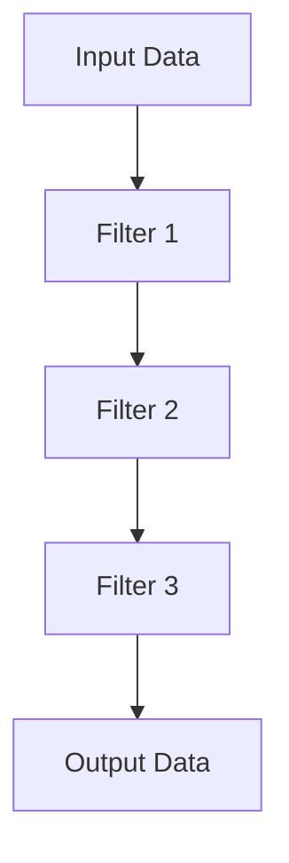
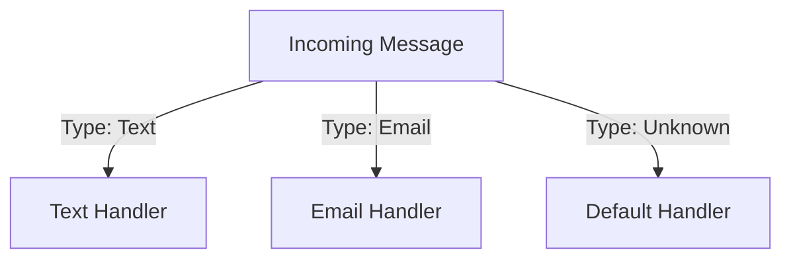
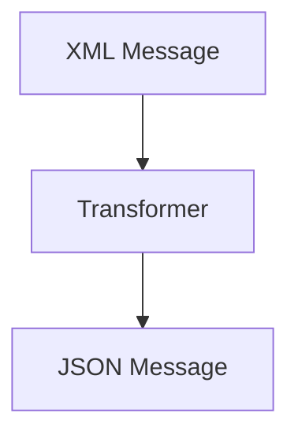
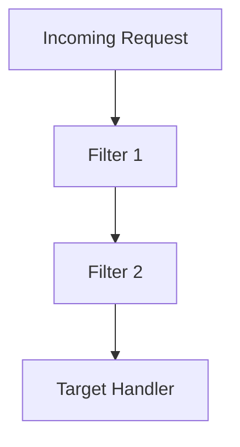

## 12.2 Messaging Patterns

In the realm of enterprise integration, messaging patterns play a crucial role in enabling seamless communication between disparate systems. These patterns provide a structured approach to handling data exchange, ensuring that messages are processed efficiently and effectively. In this section, we will delve into four key messaging patterns: Pipes and Filters, Message Router, Message Transformation, and Intercepting Filter. Each pattern offers unique advantages and can be applied to solve specific integration challenges.

### Pipes and Filters Pattern

#### Intent
The Pipes and Filters pattern is designed to process data through a series of independent processing steps, known as filters, connected by channels, known as pipes. This pattern promotes modularity and reusability by allowing each filter to perform a specific function.

#### Key Participants
- **Filter**: A processing component that performs a specific operation on the data.
- **Pipe**: A conduit that transfers data from one filter to another.

#### Applicability
Use the Pipes and Filters pattern when you need to:
- Process data in a series of independent steps.
- Build modular and reusable components.
- Easily add, remove, or reorder processing steps.

#### Sample Code Snippet

```csharp
// Define a simple filter interface
public interface IFilter
{
    string Process(string input);
}

// Implement a concrete filter
public class UpperCaseFilter : IFilter
{
    public string Process(string input)
    {
        return input.ToUpper();
    }
}

// Implement another concrete filter
public class ReverseStringFilter : IFilter
{
    public string Process(string input)
    {
        char[] charArray = input.ToCharArray();
        Array.Reverse(charArray);
        return new string(charArray);
    }
}

// Pipe class to connect filters
public class Pipe
{
    private readonly List<IFilter> _filters = new List<IFilter>();

    public void AddFilter(IFilter filter)
    {
        _filters.Add(filter);
    }

    public string Process(string input)
    {
        string result = input;
        foreach (var filter in _filters)
        {
            result = filter.Process(result);
        }
        return result;
    }
}

// Usage
var pipe = new Pipe();
pipe.AddFilter(new UpperCaseFilter());
pipe.AddFilter(new ReverseStringFilter());

string input = "Hello World";
string output = pipe.Process(input);
Console.WriteLine(output); // Output: "DLROW OLLEH"
```

#### Design Considerations
- **Scalability**: Easily scale by adding more filters.
- **Flexibility**: Reorder or replace filters without affecting the overall system.
- **Performance**: Consider the overhead of passing data through multiple filters.

#### Visualizing the Pipes and Filters Pattern



### Message Router Patterns

#### Intent
Message Router patterns are used to direct messages to different destinations based on their content or other attributes. This pattern is essential for dynamic routing in complex systems.

#### Key Participants
- **Message**: The data being routed.
- **Router**: The component responsible for determining the message's destination.

#### Applicability
Use the Message Router pattern when you need to:
- Route messages dynamically based on content.
- Implement content-based routing.
- Decouple message producers from consumers.

#### Sample Code Snippet

```csharp
// Define a simple message class
public class Message
{
    public string Content { get; set; }
    public string Type { get; set; }
}

// Define a router interface
public interface IMessageRouter
{
    void RouteMessage(Message message);
}

// Implement a content-based router
public class ContentBasedRouter : IMessageRouter
{
    private readonly Dictionary<string, Action<Message>> _routes = new Dictionary<string, Action<Message>>();

    public void AddRoute(string messageType, Action<Message> action)
    {
        _routes[messageType] = action;
    }

    public void RouteMessage(Message message)
    {
        if (_routes.ContainsKey(message.Type))
        {
            _routes[message.Type](message);
        }
        else
        {
            Console.WriteLine("No route found for message type: " + message.Type);
        }
    }
}

// Usage
var router = new ContentBasedRouter();
router.AddRoute("Text", msg => Console.WriteLine("Text message: " + msg.Content));
router.AddRoute("Email", msg => Console.WriteLine("Email message: " + msg.Content));

var textMessage = new Message { Content = "Hello", Type = "Text" };
var emailMessage = new Message { Content = "Hello via Email", Type = "Email" };

router.RouteMessage(textMessage); // Output: "Text message: Hello"
router.RouteMessage(emailMessage); // Output: "Email message: Hello via Email"
```

#### Design Considerations
- **Flexibility**: Easily add new routes without modifying existing code.
- **Decoupling**: Producers and consumers are decoupled, promoting loose coupling.
- **Complexity**: Ensure routing logic remains manageable as the number of routes increases.

#### Visualizing the Message Router Pattern



### Message Transformation Patterns

#### Intent
Message Transformation patterns are used to convert messages from one format to another, ensuring compatibility between different systems or components.

#### Key Participants
- **Message**: The data being transformed.
- **Transformer**: The component responsible for converting the message.

#### Applicability
Use the Message Transformation pattern when you need to:
- Translate messages between different formats.
- Ensure compatibility between disparate systems.
- Use adapters and transformers to facilitate communication.

#### Sample Code Snippet

```csharp
// Define a simple message class
public class XmlMessage
{
    public string XmlContent { get; set; }
}

// Define a transformer interface
public interface IMessageTransformer
{
    string Transform(XmlMessage message);
}

// Implement a JSON transformer
public class JsonTransformer : IMessageTransformer
{
    public string Transform(XmlMessage message)
    {
        // Simulate XML to JSON transformation
        return "{ \"content\": \"" + message.XmlContent + "\" }";
    }
}

// Usage
var xmlMessage = new XmlMessage { XmlContent = "<content>Hello</content>" };
var transformer = new JsonTransformer();

string jsonMessage = transformer.Transform(xmlMessage);
Console.WriteLine(jsonMessage); // Output: { "content": "<content>Hello</content>" }
```

#### Design Considerations
- **Compatibility**: Ensure transformed messages are compatible with target systems.
- **Performance**: Consider the overhead of transformation processes.
- **Maintainability**: Keep transformation logic simple and maintainable.

#### Visualizing the Message Transformation Pattern



### Intercepting Filter Pattern

#### Intent
The Intercepting Filter pattern is used to preprocess requests before they reach the target handler. This pattern is useful for building filter pipelines with middleware.

#### Key Participants
- **Filter**: A component that processes requests.
- **Target**: The final handler of the request.

#### Applicability
Use the Intercepting Filter pattern when you need to:
- Preprocess requests before handling.
- Build filter pipelines with middleware.
- Apply cross-cutting concerns like logging or authentication.

#### Sample Code Snippet

```csharp
// Define a filter interface
public interface IRequestFilter
{
    void Execute(HttpRequest request);
}

// Implement a logging filter
public class LoggingFilter : IRequestFilter
{
    public void Execute(HttpRequest request)
    {
        Console.WriteLine("Logging request: " + request.Url);
    }
}

// Implement an authentication filter
public class AuthenticationFilter : IRequestFilter
{
    public void Execute(HttpRequest request)
    {
        Console.WriteLine("Authenticating request: " + request.Url);
    }
}

// Define a target handler
public class TargetHandler
{
    public void Handle(HttpRequest request)
    {
        Console.WriteLine("Handling request: " + request.Url);
    }
}

// Define a filter chain
public class FilterChain
{
    private readonly List<IRequestFilter> _filters = new List<IRequestFilter>();
    private readonly TargetHandler _targetHandler;

    public FilterChain(TargetHandler targetHandler)
    {
        _targetHandler = targetHandler;
    }

    public void AddFilter(IRequestFilter filter)
    {
        _filters.Add(filter);
    }

    public void Execute(HttpRequest request)
    {
        foreach (var filter in _filters)
        {
            filter.Execute(request);
        }
        _targetHandler.Handle(request);
    }
}

// Usage
var targetHandler = new TargetHandler();
var filterChain = new FilterChain(targetHandler);
filterChain.AddFilter(new LoggingFilter());
filterChain.AddFilter(new AuthenticationFilter());

var request = new HttpRequest { Url = "http://example.com" };
filterChain.Execute(request);
// Output:
// Logging request: http://example.com
// Authenticating request: http://example.com
// Handling request: http://example.com
```

#### Design Considerations
- **Modularity**: Easily add or remove filters without affecting the target handler.
- **Reusability**: Reuse filters across different requests or applications.
- **Performance**: Consider the overhead of executing multiple filters.

#### Visualizing the Intercepting Filter Pattern



### Try It Yourself

Experiment with the provided code examples by modifying the filters, routes, or transformations. Try adding new filters or routes, or changing the transformation logic to see how the system behaves. This hands-on approach will deepen your understanding of messaging patterns and their applications in enterprise systems.

### Knowledge Check

- Explain the purpose of the Pipes and Filters pattern.
- Describe how the Message Router pattern decouples producers and consumers.
- Discuss the role of transformers in the Message Transformation pattern.
- Identify the benefits of using the Intercepting Filter pattern.

### Embrace the Journey

Remember, mastering messaging patterns is a journey. As you continue to explore and experiment with these patterns, you'll gain a deeper understanding of how to build robust and scalable enterprise systems. Keep learning, stay curious, and enjoy the process!

## Quiz Time!



### What is the primary purpose of the Pipes and Filters pattern?

- [x] To process data through a series of independent steps
- [ ] To route messages based on content
- [ ] To transform messages between formats
- [ ] To preprocess requests before handling

> **Explanation:** The Pipes and Filters pattern is designed to process data through a series of independent processing steps, known as filters, connected by channels, known as pipes.

### In the Message Router pattern, what is the role of the router?

- [x] To determine the message's destination
- [ ] To transform the message content
- [ ] To log the message details
- [ ] To authenticate the message sender

> **Explanation:** The router is responsible for determining the message's destination based on its content or other attributes.

### Which pattern is used to convert messages from one format to another?

- [x] Message Transformation Pattern
- [ ] Pipes and Filters Pattern
- [ ] Message Router Pattern
- [ ] Intercepting Filter Pattern

> **Explanation:** The Message Transformation pattern is used to convert messages from one format to another, ensuring compatibility between different systems or components.

### What is a key benefit of the Intercepting Filter pattern?

- [x] It allows preprocessing of requests before handling
- [ ] It routes messages based on content
- [ ] It processes data through independent steps
- [ ] It transforms messages between formats

> **Explanation:** The Intercepting Filter pattern allows preprocessing of requests before they reach the target handler, which is useful for building filter pipelines with middleware.

### How does the Message Router pattern promote loose coupling?

- [x] By decoupling message producers from consumers
- [ ] By transforming messages between formats
- [ ] By preprocessing requests before handling
- [ ] By processing data through independent steps

> **Explanation:** The Message Router pattern promotes loose coupling by decoupling message producers from consumers, allowing for dynamic routing based on message content.

### What is a common use case for the Pipes and Filters pattern?

- [x] Building modular and reusable components
- [ ] Routing messages based on content
- [ ] Translating messages between formats
- [ ] Preprocessing requests before handling

> **Explanation:** The Pipes and Filters pattern is commonly used to build modular and reusable components by processing data in a series of independent steps.

### Which pattern is essential for dynamic routing in complex systems?

- [x] Message Router Pattern
- [ ] Pipes and Filters Pattern
- [ ] Message Transformation Pattern
- [ ] Intercepting Filter Pattern

> **Explanation:** The Message Router pattern is essential for dynamic routing in complex systems, as it directs messages to different destinations based on their content or other attributes.

### What is the role of a transformer in the Message Transformation pattern?

- [x] To convert the message from one format to another
- [ ] To route the message based on content
- [ ] To log the message details
- [ ] To authenticate the message sender

> **Explanation:** In the Message Transformation pattern, the transformer is responsible for converting the message from one format to another, ensuring compatibility between different systems.

### What is a key advantage of using the Intercepting Filter pattern?

- [x] It allows for the application of cross-cutting concerns like logging or authentication
- [ ] It routes messages based on content
- [ ] It processes data through independent steps
- [ ] It transforms messages between formats

> **Explanation:** A key advantage of the Intercepting Filter pattern is that it allows for the application of cross-cutting concerns like logging or authentication by preprocessing requests before they reach the target handler.

### True or False: The Pipes and Filters pattern is used to route messages based on their content.

- [ ] True
- [x] False

> **Explanation:** False. The Pipes and Filters pattern is used to process data through a series of independent steps, not to route messages based on their content.


