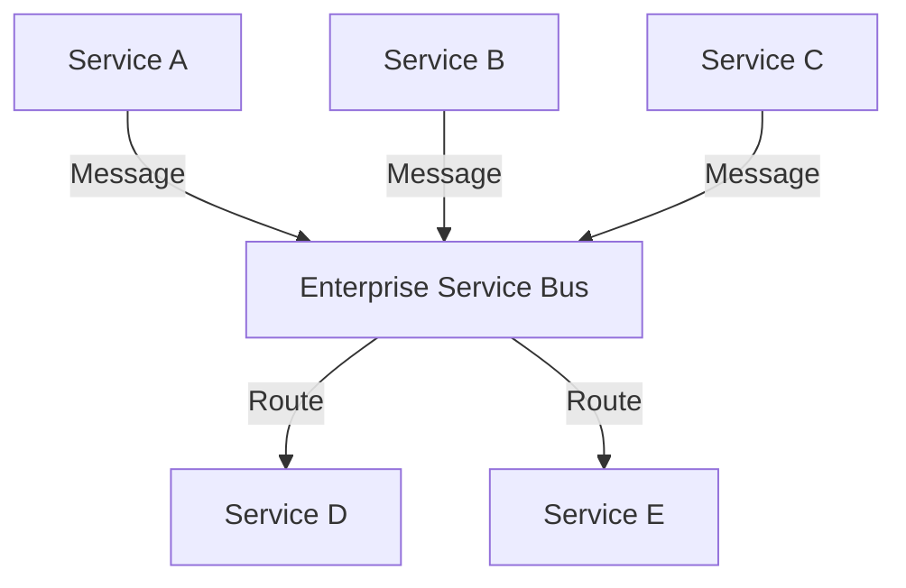

## 12.3 Enterprise Service Bus (ESB)

In the realm of enterprise software architecture, the Enterprise Service Bus (ESB) pattern plays a pivotal role in centralizing communication between disparate services. As systems grow in complexity, the need for a robust, scalable, and maintainable integration solution becomes paramount. The ESB pattern addresses these needs by providing a centralized platform for service communication, orchestration, and integration.

### Introduction to Enterprise Service Bus (ESB)

An Enterprise Service Bus (ESB) is a software architecture model used for designing and implementing the interaction and communication between mutually interacting software applications in a service-oriented architecture (SOA). It serves as a middleware layer that facilitates the integration of various services, ensuring seamless communication and data exchange.

#### Key Concepts of ESB

- **Centralized Communication**: ESB acts as a central hub for communication between services, reducing the complexity of point-to-point integrations.
- **Decoupling**: By decoupling services, ESB allows for independent development, deployment, and scaling of services.
- **Message Routing**: ESB provides intelligent routing capabilities, directing messages to the appropriate services based on predefined rules.
- **Protocol Transformation**: It supports protocol transformation, enabling services to communicate using different protocols.
- **Service Orchestration**: ESB can orchestrate complex service interactions, coordinating multiple services to achieve a business process.

### Implementing ESB in C#

Implementing an ESB in C# involves leveraging existing platforms and frameworks that provide the necessary infrastructure for service integration. Two popular platforms for implementing ESB in C# are NServiceBus and MassTransit.

#### Utilizing NServiceBus

NServiceBus is a powerful service bus for .NET that simplifies the development of distributed systems. It provides a robust framework for building message-driven systems with features like message routing, retries, and sagas.

##### Key Features of NServiceBus

- **Reliable Messaging**: Ensures message delivery with retries and error handling.
- **Sagas**: Manages long-running business processes and stateful workflows.
- **Publish/Subscribe**: Supports event-driven architectures with publish/subscribe capabilities.
- **Integration with Popular Queues**: Works seamlessly with MSMQ, RabbitMQ, Azure Service Bus, and more.

##### Sample Code: Implementing a Simple NServiceBus Endpoint

```csharp
using NServiceBus;
using System.Threading.Tasks;

public class Program
{
    public static async Task Main()
    {
        var endpointConfiguration = new EndpointConfiguration("SampleEndpoint");
        endpointConfiguration.UseTransport<LearningTransport>();

        var endpointInstance = await Endpoint.Start(endpointConfiguration)
            .ConfigureAwait(false);

        await endpointInstance.Stop()
            .ConfigureAwait(false);
    }
}
```

> **Explanation**: This code snippet demonstrates setting up a basic NServiceBus endpoint using the LearningTransport for development purposes. The `EndpointConfiguration` class is used to configure the endpoint, and `Endpoint.Start` initializes it.

#### Utilizing MassTransit

MassTransit is another popular open-source service bus for .NET, providing a lightweight and flexible framework for building distributed applications.

##### Key Features of MassTransit

- **Ease of Use**: Simple API for defining and consuming messages.
- **Integration with Multiple Transports**: Supports RabbitMQ, Azure Service Bus, Amazon SQS, and more.
- **Saga Support**: Provides support for managing complex workflows and stateful processes.
- **Middleware Architecture**: Allows for custom middleware to be added to the message pipeline.

##### Sample Code: Implementing a Simple MassTransit Consumer

```csharp
using MassTransit;
using System;
using System.Threading.Tasks;

public class Program
{
    public static async Task Main()
    {
        var busControl = Bus.Factory.CreateUsingRabbitMq(cfg =>
        {
            cfg.Host(new Uri("rabbitmq://localhost"), h =>
            {
                h.Username("guest");
                h.Password("guest");
            });

            cfg.ReceiveEndpoint("order_queue", e =>
            {
                e.Consumer<OrderConsumer>();
            });
        });

        await busControl.StartAsync();
        Console.WriteLine("Press any key to exit");
        Console.ReadKey();
        await busControl.StopAsync();
    }
}

public class OrderConsumer : IConsumer<Order>
{
    public Task Consume(ConsumeContext<Order> context)
    {
        Console.WriteLine($"Order received: {context.Message.Id}");
        return Task.CompletedTask;
    }
}

public class Order
{
    public Guid Id { get; set; }
}
```

> **Explanation**: This example sets up a MassTransit bus using RabbitMQ as the transport. An `OrderConsumer` class is defined to handle messages of type `Order`. The `ReceiveEndpoint` method configures the queue and associates it with the consumer.

### Visualizing ESB Architecture

To better understand the ESB architecture, let's visualize how services interact through an ESB.



> **Diagram Description**: This diagram illustrates how multiple services (A, B, C) send messages to the ESB, which then routes these messages to the appropriate destination services (D, E).

### Key Participants in ESB

- **Service Providers**: Applications or services that provide functionality and send messages to the ESB.
- **Service Consumers**: Applications or services that consume messages from the ESB.
- **ESB**: The central hub that manages message routing, transformation, and orchestration.

### Applicability of ESB

- **Complex Systems**: Ideal for systems with numerous services that require centralized communication and orchestration.
- **Scalability**: Suitable for applications that need to scale independently.
- **Protocol Diversity**: Useful when integrating services using different communication protocols.

### Design Considerations

When implementing an ESB, consider the following:

- **Performance**: Ensure the ESB can handle the required message throughput.
- **Reliability**: Implement error handling and retries to ensure message delivery.
- **Security**: Secure communication channels and authenticate services.
- **Scalability**: Design the ESB to scale with the growth of the system.

### Differences and Similarities with Other Patterns

- **Similar to Message Broker**: Both ESB and message brokers facilitate communication between services, but ESB provides additional features like orchestration and transformation.
- **Different from Point-to-Point Integration**: ESB centralizes communication, reducing the complexity of managing multiple point-to-point connections.

### Try It Yourself

Experiment with the provided code examples by:

- **Modifying the Message Types**: Create new message types and consumers to handle them.
- **Changing the Transport**: Switch between different transport options like RabbitMQ and Azure Service Bus.
- **Implementing Sagas**: Try implementing a saga to manage a long-running business process.

### Knowledge Check

- **Question**: What are the key benefits of using an ESB in a service-oriented architecture?
- **Exercise**: Implement a simple ESB using NServiceBus or MassTransit and demonstrate message routing between services.

### Embrace the Journey

Remember, mastering the ESB pattern is just one step in building robust enterprise systems. As you explore and implement ESB, you'll gain valuable insights into service integration and architecture. Keep experimenting, stay curious, and enjoy the journey!

## Quiz Time!



### What is the primary role of an Enterprise Service Bus (ESB)?

- [x] Centralizing communication between services
- [ ] Storing data for services
- [ ] Providing user interfaces for services
- [ ] Compiling code for services

> **Explanation:** The primary role of an ESB is to centralize communication between services, facilitating integration and orchestration.

### Which of the following is a key feature of NServiceBus?

- [x] Sagas for managing workflows
- [ ] User authentication
- [ ] Data storage
- [ ] UI rendering

> **Explanation:** NServiceBus provides sagas for managing long-running business processes and workflows.

### What transport does MassTransit support?

- [x] RabbitMQ
- [x] Azure Service Bus
- [ ] HTTP
- [ ] FTP

> **Explanation:** MassTransit supports multiple transports, including RabbitMQ and Azure Service Bus.

### In the ESB architecture, what is the role of service providers?

- [x] Sending messages to the ESB
- [ ] Consuming messages from the ESB
- [ ] Storing messages in the ESB
- [ ] Compiling messages for the ESB

> **Explanation:** Service providers are responsible for sending messages to the ESB.

### What is a key consideration when implementing an ESB?

- [x] Performance
- [x] Reliability
- [ ] User interface design
- [ ] Code compilation

> **Explanation:** Performance and reliability are crucial considerations when implementing an ESB to ensure efficient and reliable communication.

### Which pattern is similar to ESB in facilitating communication between services?

- [x] Message Broker
- [ ] Singleton
- [ ] Factory
- [ ] Observer

> **Explanation:** Both ESB and message brokers facilitate communication between services, although ESB offers additional features.

### What is a benefit of decoupling services using an ESB?

- [x] Independent development and scaling
- [ ] Faster code compilation
- [ ] Improved user interface
- [ ] Simplified data storage

> **Explanation:** Decoupling services with an ESB allows for independent development and scaling, enhancing flexibility.

### Which of the following is a platform for implementing ESB in C#?

- [x] NServiceBus
- [x] MassTransit
- [ ] ASP.NET
- [ ] Entity Framework

> **Explanation:** NServiceBus and MassTransit are platforms for implementing ESB in C#.

### What does ESB stand for?

- [x] Enterprise Service Bus
- [ ] Enterprise Software Base
- [ ] Electronic Service Board
- [ ] Enhanced Service Bridge

> **Explanation:** ESB stands for Enterprise Service Bus, a pattern for centralizing service communication.

### True or False: ESB is suitable for systems with numerous services requiring centralized communication.

- [x] True
- [ ] False

> **Explanation:** ESB is ideal for systems with numerous services that require centralized communication and orchestration.


