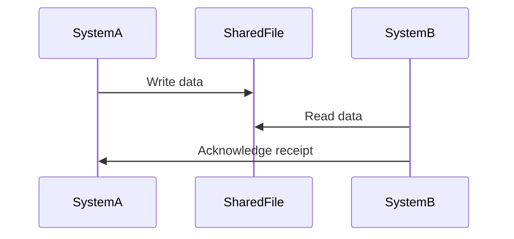
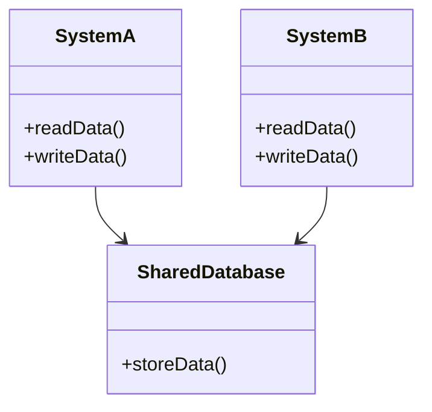
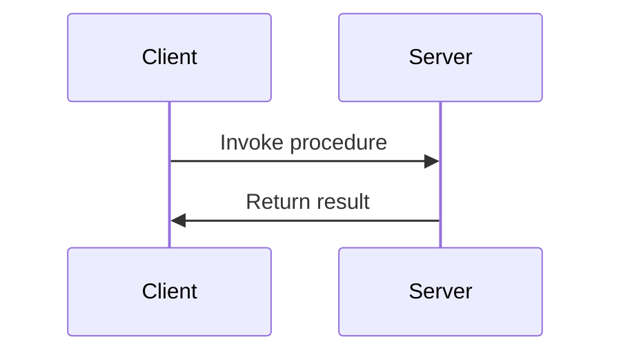

## 12.4 Integration Styles

In the realm of enterprise software development, integrating disparate systems is a common challenge. As systems grow and evolve, the need to ensure seamless communication and data exchange becomes paramount. This section delves into the various integration styles that can be employed to achieve this goal, focusing on file transfer, shared databases, and remote procedure invocation. Each method has its own set of advantages, challenges, and use cases, which we will explore in detail.

### Introduction to Integration Styles

Integration styles are architectural patterns that define how different systems communicate and share data. These styles are crucial for building scalable, maintainable, and efficient enterprise applications. By understanding and applying these styles, developers can ensure that systems work together harmoniously, even if they were not originally designed to do so.

### File Transfer

File transfer is one of the oldest and simplest methods of system integration. It involves exchanging data between systems by writing to and reading from shared files. This method is particularly useful for batch processing and scenarios where real-time communication is not necessary.

#### Key Concepts

- **Batch Processing**: File transfer is often used in batch processing, where data is collected, processed, and transferred at scheduled intervals.
- **Data Format**: Common data formats include CSV, XML, and JSON, which ensure that data is structured and can be easily parsed by receiving systems.
- **File Location**: Files are typically stored in a shared directory accessible to both the sending and receiving systems.

#### Advantages

- **Simplicity**: File transfer is straightforward to implement and does not require complex infrastructure.
- **Decoupling**: Systems remain loosely coupled, as they do not need to be aware of each other's internal workings.
- **Asynchronous Processing**: Systems can process data at their own pace, reducing the need for immediate response.

#### Challenges

- **Data Consistency**: Ensuring data consistency can be challenging, especially if multiple systems are writing to the same file.
- **Error Handling**: Detecting and handling errors in file transfer can be complex, particularly in large-scale systems.
- **Security**: Files must be secured to prevent unauthorized access and data breaches.

#### Implementation in C#

Let's explore a simple implementation of file transfer in C#:

```csharp
using System;
using System.IO;

class FileTransferExample
{
    static void Main()
    {
        string sourceFilePath = "sourceData.csv";
        string destinationFilePath = "destinationData.csv";

        try
        {
            // Read data from the source file
            string data = File.ReadAllText(sourceFilePath);
            Console.WriteLine("Data read from source file:");

            // Display the data
            Console.WriteLine(data);

            // Write data to the destination file
            File.WriteAllText(destinationFilePath, data);
            Console.WriteLine("Data written to destination file.");
        }
        catch (Exception ex)
        {
            Console.WriteLine($"An error occurred: {ex.Message}");
        }
    }
}
```

In this example, we read data from a source file and write it to a destination file. This simple approach can be expanded to include error handling, logging, and data validation.

#### Try It Yourself

- Modify the code to handle different file formats, such as XML or JSON.
- Implement error handling to manage scenarios where the source file does not exist.
- Experiment with encrypting the file content before writing it to the destination.

### Shared Databases

Shared databases are another common integration style where multiple systems access a common database to read and write data. This method is effective for ensuring data consistency and real-time data access.

#### Key Concepts

- **Data Consistency**: A shared database ensures that all systems have access to the same data, reducing the risk of discrepancies.
- **Concurrency Control**: Mechanisms such as locks and transactions are used to manage concurrent access to the database.
- **Schema Design**: The database schema must be carefully designed to accommodate the needs of all systems accessing it.

#### Advantages

- **Real-Time Access**: Systems can access and update data in real-time, ensuring that all systems have the latest information.
- **Centralized Data Management**: A shared database provides a single source of truth for data management.
- **Scalability**: Modern databases can handle large volumes of data and concurrent access, making them suitable for enterprise applications.

#### Challenges

- **Tight Coupling**: Systems become tightly coupled to the database schema, making changes difficult.
- **Performance**: High concurrency can lead to performance bottlenecks if not managed properly.
- **Security**: Access control and data protection are critical to prevent unauthorized access.

#### Implementation in C#

Here's an example of using a shared database in C# with Entity Framework:

```csharp
using System;
using System.Linq;
using Microsoft.EntityFrameworkCore;

public class Product
{
    public int Id { get; set; }
    public string Name { get; set; }
    public decimal Price { get; set; }
}

public class ProductContext : DbContext
{
    public DbSet<Product> Products { get; set; }

    protected override void OnConfiguring(DbContextOptionsBuilder optionsBuilder)
    {
        optionsBuilder.UseSqlServer("YourConnectionStringHere");
    }
}

class SharedDatabaseExample
{
    static void Main()
    {
        using (var context = new ProductContext())
        {
            // Add a new product
            var product = new Product { Name = "Laptop", Price = 999.99m };
            context.Products.Add(product);
            context.SaveChanges();

            // Retrieve and display products
            var products = context.Products.ToList();
            Console.WriteLine("Products in database:");
            foreach (var p in products)
            {
                Console.WriteLine($"Id: {p.Id}, Name: {p.Name}, Price: {p.Price}");
            }
        }
    }
}
```

This example demonstrates how to use Entity Framework to interact with a shared database. We define a `Product` entity and a `ProductContext` for database operations.

#### Try It Yourself

- Extend the example to include update and delete operations.
- Implement concurrency control using transactions.
- Experiment with different database providers, such as MySQL or PostgreSQL.

### Remote Procedure Invocation

Remote Procedure Invocation (RPI) is a method of integration where systems communicate by invoking procedures or methods on remote systems. This style is commonly used for synchronous communication and is the foundation for many modern APIs.

#### Key Concepts

- **Synchronous Communication**: RPI involves real-time communication, where the calling system waits for a response from the remote system.
- **APIs and RPC**: Application Programming Interfaces (APIs) and Remote Procedure Calls (RPC) are common implementations of RPI.
- **Service Contracts**: Define the methods and data structures that can be invoked remotely.

#### Advantages

- **Real-Time Interaction**: Systems can interact in real-time, providing immediate feedback and responses.
- **Encapsulation**: Systems can expose only the necessary functionality, hiding internal details.
- **Interoperability**: RPI can be implemented across different platforms and technologies.

#### Challenges

- **Network Latency**: Communication over a network can introduce latency and affect performance.
- **Error Handling**: Handling errors in remote calls can be complex, especially in distributed systems.
- **Security**: Ensuring secure communication and authentication is critical.

#### Implementation in C#

Let's look at an example of implementing a simple API using ASP.NET Core:

```csharp
using Microsoft.AspNetCore.Builder;
using Microsoft.AspNetCore.Hosting;
using Microsoft.AspNetCore.Http;
using Microsoft.Extensions.DependencyInjection;

public class Startup
{
    public void ConfigureServices(IServiceCollection services)
    {
        services.AddControllers();
    }

    public void Configure(IApplicationBuilder app, IWebHostEnvironment env)
    {
        if (env.IsDevelopment())
        {
            app.UseDeveloperExceptionPage();
        }

        app.UseRouting();

        app.UseEndpoints(endpoints =>
        {
            endpoints.MapControllers();
        });
    }
}

public class ProductController : ControllerBase
{
    [HttpGet("api/products/{id}")]
    public IActionResult GetProduct(int id)
    {
        // Simulate retrieving a product
        var product = new { Id = id, Name = "Laptop", Price = 999.99m };
        return Ok(product);
    }
}
```

This example sets up a simple ASP.NET Core API with a single endpoint to retrieve a product by ID. The `ProductController` defines the API logic.

#### Try It Yourself

- Add additional endpoints for creating, updating, and deleting products.
- Implement authentication and authorization for the API.
- Experiment with different serialization formats, such as XML or Protobuf.

### Visualizing Integration Styles

To better understand the relationships and workflows involved in these integration styles, let's visualize them using Mermaid.js diagrams.

#### File Transfer Workflow



This sequence diagram illustrates the file transfer process, where `SystemA` writes data to a shared file, and `SystemB` reads it.

#### Shared Database Architecture



In this class diagram, both `SystemA` and `SystemB` interact with a `SharedDatabase`, highlighting the centralized data management approach.

#### Remote Procedure Invocation Flow



This sequence diagram shows the RPI process, where a `Client` invokes a procedure on a `Server` and receives a result.

### Conclusion

Integration styles are fundamental to building robust and scalable enterprise systems. By understanding and applying file transfer, shared databases, and remote procedure invocation, developers can ensure seamless communication and data exchange between systems. Each style has its own strengths and challenges, and the choice of style depends on the specific requirements and constraints of the project.

### Further Reading

For more information on integration styles and patterns, consider exploring the following resources:

- [Enterprise Integration Patterns](https://www.enterpriseintegrationpatterns.com/)
- [Microsoft Documentation on ASP.NET Core](https://docs.microsoft.com/en-us/aspnet/core/)
- [Entity Framework Core Documentation](https://docs.microsoft.com/en-us/ef/core/)

## Quiz Time!



### What is a key advantage of using file transfer for system integration?

- [x] Simplicity and ease of implementation
- [ ] Real-time data access
- [ ] Tight coupling of systems
- [ ] High security

> **Explanation:** File transfer is simple to implement and does not require complex infrastructure, making it an easy choice for many integration scenarios.

### Which integration style involves multiple systems accessing a common database?

- [x] Shared Databases
- [ ] File Transfer
- [ ] Remote Procedure Invocation
- [ ] Message Queues

> **Explanation:** Shared databases allow multiple systems to access and update data in a centralized manner.

### What is a common challenge associated with remote procedure invocation?

- [x] Network latency
- [ ] Lack of real-time interaction
- [ ] Difficulty in data format standardization
- [ ] Limited scalability

> **Explanation:** Network latency can affect performance in remote procedure invocation, as it involves communication over a network.

### In the context of shared databases, what is a critical aspect to manage?

- [x] Concurrency control
- [ ] File format compatibility
- [ ] Asynchronous processing
- [ ] Network bandwidth

> **Explanation:** Concurrency control is essential to manage concurrent access and ensure data consistency in shared databases.

### Which of the following is a benefit of using remote procedure invocation?

- [x] Real-time interaction
- [ ] Asynchronous processing
- [ ] Decoupling of systems
- [ ] Simplified error handling

> **Explanation:** Remote procedure invocation allows systems to interact in real-time, providing immediate feedback and responses.

### What is a common data format used in file transfer?

- [x] CSV
- [ ] SQL
- [ ] HTML
- [ ] YAML

> **Explanation:** CSV is a common data format used in file transfer due to its simplicity and ease of parsing.

### Which integration style is best suited for batch processing?

- [x] File Transfer
- [ ] Shared Databases
- [ ] Remote Procedure Invocation
- [ ] Event-Driven Architecture

> **Explanation:** File transfer is ideal for batch processing, where data is collected and processed at scheduled intervals.

### What is a key consideration when using shared databases?

- [x] Schema design
- [ ] Network latency
- [ ] File encryption
- [ ] Asynchronous communication

> **Explanation:** Schema design is crucial to accommodate the needs of all systems accessing a shared database.

### How does remote procedure invocation enhance system interoperability?

- [x] By allowing systems to invoke methods across different platforms
- [ ] By using a common database schema
- [ ] By exchanging data files
- [ ] By implementing batch processing

> **Explanation:** Remote procedure invocation enables systems to communicate and invoke methods across different platforms and technologies.

### True or False: File transfer is a synchronous communication method.

- [ ] True
- [x] False

> **Explanation:** File transfer is typically an asynchronous communication method, as systems can process data at their own pace.



Remember, mastering integration styles is a journey. As you explore these concepts, you'll gain the skills needed to build complex, integrated systems. Keep experimenting, stay curious, and enjoy the process!
