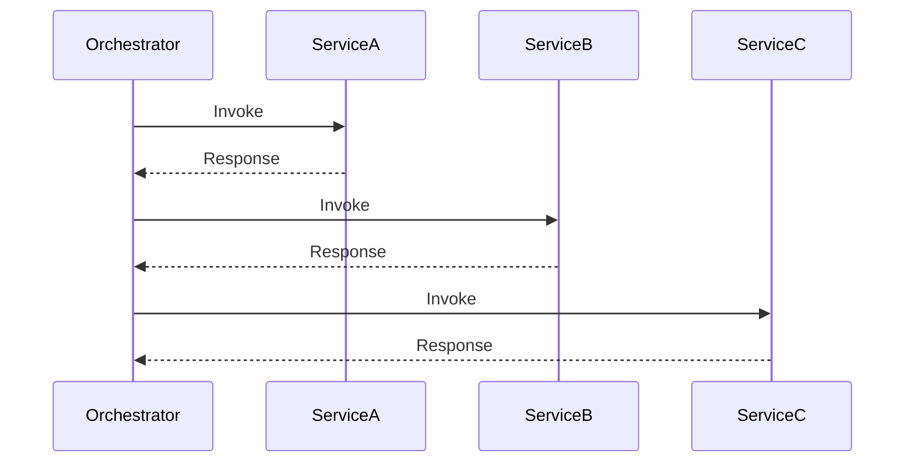
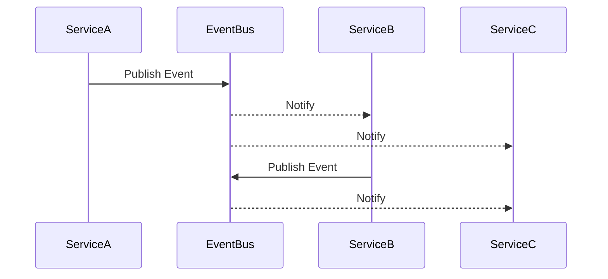

## 12.5 Orchestration and Choreography

In the realm of enterprise software architecture, orchestrating and choreographing interactions between services is crucial for building scalable, maintainable, and efficient systems. This section delves into the concepts of orchestration and choreography, focusing on how they can be implemented using C# and related technologies. We will explore workflow orchestration with centralized control mechanisms and event-driven choreography for decentralized coordination, providing insights, code examples, and best practices for expert software engineers and enterprise architects.

### Introduction to Orchestration and Choreography

Orchestration and choreography are two paradigms for managing interactions between distributed services in a system. Both aim to achieve seamless communication and coordination, but they differ in their approach and implementation.

- **Orchestration** involves a central controller, known as the orchestrator, which manages and coordinates the interactions between services. It dictates the sequence and logic of service invocations, ensuring that the workflow is executed as planned.

- **Choreography**, on the other hand, is a decentralized approach where each service is responsible for knowing when to act and whom to interact with, based on events. This leads to a more loosely coupled system where services communicate through events without a central point of control.

### Workflow Orchestration

Workflow orchestration is a method of managing and executing a series of tasks or services in a predefined order. It is akin to a conductor leading an orchestra, where the orchestrator ensures that each service performs its role at the right time.

#### Centralized Control with Orchestrators

In orchestration, a central orchestrator is responsible for controlling the flow of the process. This centralization allows for easier management and monitoring of workflows, as the orchestrator has a complete view of the process.

##### Key Components of Orchestration

1. **Orchestrator**: The central entity that manages the workflow. It is responsible for invoking services, handling exceptions, and ensuring the process completes successfully.

2. **Services**: Independent units of functionality that the orchestrator invokes as part of the workflow.

3. **Workflow Definition**: A blueprint that outlines the sequence of service invocations and the logic governing the workflow.

4. **Execution Engine**: The runtime environment where the orchestrator executes the workflow.

#### Tools for Workflow Orchestration

One of the popular tools for implementing orchestration in C# is the **Windows Workflow Foundation (WF)**. WF provides a framework for building workflow-enabled applications, allowing developers to define, execute, and manage workflows.

##### Example: Implementing Orchestration with Windows Workflow Foundation

Let's consider a simple order processing workflow where an order is validated, processed, and then shipped. We'll use WF to orchestrate these steps.

```csharp
using System;
using System.Activities;

namespace OrderProcessing
{
    class Program
    {
        static void Main(string[] args)
        {
            // Define the workflow
            Activity workflow = new OrderProcessingWorkflow();

            // Execute the workflow
            WorkflowInvoker.Invoke(workflow);
        }
    }

    public class OrderProcessingWorkflow : Activity
    {
        public OrderProcessingWorkflow()
        {
            Implementation = () => new Sequence
            {
                Activities =
                {
                    new WriteLine { Text = "Validating Order..." },
                    new WriteLine { Text = "Processing Order..." },
                    new WriteLine { Text = "Shipping Order..." }
                }
            };
        }
    }
}
```

In this example, the `OrderProcessingWorkflow` class defines a sequence of activities that the orchestrator executes. The `WorkflowInvoker.Invoke` method runs the workflow, ensuring each step is completed in order.

#### Design Considerations for Orchestration

- **Centralized Control**: While orchestration provides centralized control, it can become a bottleneck if not designed properly. Ensure the orchestrator is scalable and can handle high loads.

- **Error Handling**: Implement robust error handling to manage failures gracefully. The orchestrator should be able to retry failed operations or compensate for errors.

- **Monitoring and Logging**: Centralized orchestration allows for easier monitoring and logging. Implement comprehensive logging to track the progress and status of workflows.

- **Scalability**: Design the orchestrator to scale horizontally to handle increased workloads. Consider using cloud-based orchestration services for scalability.

### Event-Driven Choreography

Event-driven choreography is a decentralized approach to managing service interactions. Unlike orchestration, there is no central controller; instead, services communicate through events, reacting to changes in the system.

#### Decentralized Coordination via Events

In choreography, each service is autonomous and listens for events that it is interested in. When an event occurs, the service reacts accordingly, triggering further events if necessary. This leads to a loosely coupled system where services are independent and can evolve separately.

##### Key Components of Choreography

1. **Services**: Autonomous units that perform specific tasks. Each service listens for events and acts based on the event data.

2. **Events**: Notifications that indicate a change in the system. Events are the primary means of communication between services.

3. **Event Bus**: A messaging infrastructure that facilitates the transmission of events between services.

#### Implementing Event-Driven Choreography in C#

Let's implement a simple event-driven system where an order service publishes an event when an order is placed, and a shipping service listens for this event to initiate shipping.

```csharp
using System;
using System.Collections.Generic;

namespace EventDrivenChoreography
{
    public class EventBus
    {
        private readonly Dictionary<string, List<Action<string>>> _subscribers = new();

        public void Subscribe(string eventType, Action<string> handler)
        {
            if (!_subscribers.ContainsKey(eventType))
            {
                _subscribers[eventType] = new List<Action<string>>();
            }
            _subscribers[eventType].Add(handler);
        }

        public void Publish(string eventType, string eventData)
        {
            if (_subscribers.ContainsKey(eventType))
            {
                foreach (var handler in _subscribers[eventType])
                {
                    handler(eventData);
                }
            }
        }
    }

    public class OrderService
    {
        private readonly EventBus _eventBus;

        public OrderService(EventBus eventBus)
        {
            _eventBus = eventBus;
        }

        public void PlaceOrder(string orderId)
        {
            Console.WriteLine($"Order {orderId} placed.");
            _eventBus.Publish("OrderPlaced", orderId);
        }
    }

    public class ShippingService
    {
        public ShippingService(EventBus eventBus)
        {
            eventBus.Subscribe("OrderPlaced", OnOrderPlaced);
        }

        private void OnOrderPlaced(string orderId)
        {
            Console.WriteLine($"Shipping initiated for order {orderId}.");
        }
    }

    class Program
    {
        static void Main(string[] args)
        {
            var eventBus = new EventBus();
            var orderService = new OrderService(eventBus);
            var shippingService = new ShippingService(eventBus);

            orderService.PlaceOrder("12345");
        }
    }
}
```

In this example, the `EventBus` class acts as the messaging infrastructure, allowing services to publish and subscribe to events. The `OrderService` publishes an "OrderPlaced" event, and the `ShippingService` listens for this event to initiate shipping.

#### Design Considerations for Choreography

- **Loose Coupling**: Choreography promotes loose coupling, allowing services to evolve independently. Ensure that services are designed to handle changes in event structures gracefully.

- **Eventual Consistency**: In a choreographed system, consistency is achieved eventually. Design services to handle eventual consistency and implement mechanisms to detect and resolve inconsistencies.

- **Scalability**: Choreography naturally scales well as services are independent. Ensure the event bus can handle high volumes of events and scale accordingly.

- **Monitoring and Debugging**: Decentralized systems can be challenging to monitor and debug. Implement comprehensive logging and tracing to track events and service interactions.

### Differences and Similarities

While orchestration and choreography serve similar purposes, they differ in their approach and implementation:

- **Control**: Orchestration uses a central controller, while choreography relies on decentralized coordination through events.

- **Coupling**: Orchestration can lead to tighter coupling due to the central controller, whereas choreography promotes loose coupling.

- **Scalability**: Choreography naturally scales better due to its decentralized nature, but orchestration can be scaled with proper design.

- **Complexity**: Orchestration can simplify complex workflows with a central view, while choreography can lead to complex interactions due to its decentralized nature.

### Visualizing Orchestration and Choreography

To better understand the differences between orchestration and choreography, let's visualize these concepts using Mermaid.js diagrams.

#### Orchestration Diagram



**Caption**: This diagram illustrates a typical orchestration workflow where the orchestrator controls the sequence of service invocations.

#### Choreography Diagram



**Caption**: This diagram shows a choreography setup where services communicate through an event bus, reacting to events independently.

### Try It Yourself

Experiment with the provided code examples by modifying the workflow or events. For orchestration, try adding more steps to the workflow or implementing error handling. For choreography, experiment with different event types and service interactions.

### Knowledge Check

- **What are the key differences between orchestration and choreography?**
- **How does Windows Workflow Foundation facilitate orchestration in C#?**
- **What are the benefits and challenges of using event-driven choreography?**

### Conclusion

Orchestration and choreography are powerful paradigms for managing service interactions in distributed systems. By understanding their differences and applications, you can design systems that are scalable, maintainable, and efficient. Remember, this is just the beginning. As you progress, you'll build more complex systems using these patterns. Keep experimenting, stay curious, and enjoy the journey!

## Quiz Time!



### What is the primary role of an orchestrator in workflow orchestration?

- [x] To manage and coordinate the sequence of service invocations
- [ ] To publish events for services to react to
- [ ] To act as a messaging infrastructure for services
- [ ] To handle error logging and monitoring

> **Explanation:** The orchestrator is responsible for managing and coordinating the sequence of service invocations in a workflow.

### In event-driven choreography, how do services communicate?

- [ ] Through a central orchestrator
- [x] By publishing and subscribing to events
- [ ] By direct method calls
- [ ] Through shared databases

> **Explanation:** In choreography, services communicate by publishing and subscribing to events, allowing for decentralized coordination.

### Which of the following is a key benefit of using choreography over orchestration?

- [ ] Centralized control
- [x] Loose coupling
- [ ] Simplified error handling
- [ ] Easier monitoring

> **Explanation:** Choreography promotes loose coupling, allowing services to evolve independently.

### What tool is commonly used for implementing orchestration in C#?

- [ ] RabbitMQ
- [ ] Apache Kafka
- [x] Windows Workflow Foundation
- [ ] Akka.NET

> **Explanation:** Windows Workflow Foundation is a framework for implementing orchestration in C#.

### Which pattern naturally scales better due to its decentralized nature?

- [ ] Orchestration
- [x] Choreography
- [ ] Both scale equally
- [ ] Neither scales well

> **Explanation:** Choreography naturally scales better due to its decentralized nature, as services are independent.

### What is a potential challenge of using choreography?

- [ ] Tight coupling
- [ ] Centralized control
- [x] Complex interactions
- [ ] Simplified workflows

> **Explanation:** Choreography can lead to complex interactions due to its decentralized nature.

### How does the event bus function in a choreographed system?

- [x] As a messaging infrastructure for transmitting events
- [ ] As a central controller for workflows
- [ ] As a database for storing service data
- [ ] As a logging tool for monitoring events

> **Explanation:** The event bus functions as a messaging infrastructure for transmitting events between services.

### What is a key design consideration for orchestration?

- [ ] Ensuring services are tightly coupled
- [x] Implementing robust error handling
- [ ] Avoiding centralized control
- [ ] Minimizing the number of services

> **Explanation:** Implementing robust error handling is a key design consideration for orchestration to manage failures gracefully.

### Which of the following best describes eventual consistency in a choreographed system?

- [ ] Immediate consistency across all services
- [x] Consistency is achieved eventually
- [ ] Consistency is not a concern
- [ ] Consistency is managed by a central orchestrator

> **Explanation:** In a choreographed system, consistency is achieved eventually as services react to events.

### True or False: Orchestration and choreography can be used together in a hybrid approach.

- [x] True
- [ ] False

> **Explanation:** True. Orchestration and choreography can be combined in a hybrid approach to leverage the benefits of both paradigms.


